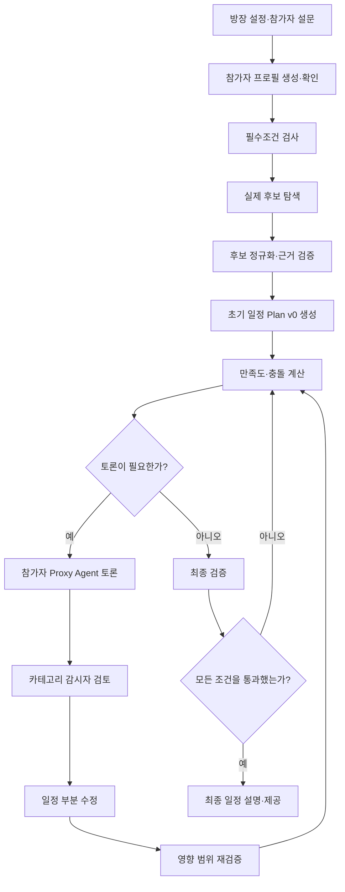
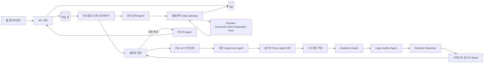

# MOA

> 여러 사람의 여행 취향과 제약을 AI 대리인이 조정해, 검증 가능한 그룹 여행 일정을 만드는 서비스

2026 강원대학교 × 고려대학교 Summer Agentic AI 심화 몰입 캠프 5팀 프로젝트입니다.

---

## 1. 프로젝트 요약

그룹 여행은 장소를 찾는 것보다 **서로 다른 요구를 조정하는 일**이 더 어렵습니다.

MOA는 참가자별 설문을 바탕으로 먼저 초기 일정안을 만든 다음, 만족도·예산·목적이 충돌하는 부분만 AI 대리인들이 토론하도록 합니다. 토론 결과는 코드로 다시 검증한 뒤 최종 일정에 반영합니다.

```text
설문
→ 후보 탐색
→ 초기 일정 Plan v0
→ 충돌 탐지
→ 필요한 부분만 Agent 토론
→ 일정 부분 수정
→ 전체 재검증
→ 최종 일정
```

### 핵심 원칙

1. 안전·알레르기·예산 상한 같은 필수조건은 토론하지 않습니다.
2. 분야 우선순위가 낮아도 목적급 콘텐츠는 먼저 보호합니다.
3. Agent는 의견과 수정안을 제안하고, 코드는 계산과 최종 판정을 담당합니다.
4. 전체 일정을 반복 생성하지 않고 충돌한 부분과 영향받는 부분만 수정합니다.
5. 근거를 확인할 수 없는 후보는 최종 일정에 사용할 수 없습니다.

---

## 2. 용어

문서와 코드에서는 아래 용어를 같은 의미로 사용합니다.

| 한국어 | 코드 용어 | 의미 |
| --- | --- | --- |
| 필수조건 | `HardConstraint` | 알레르기, 접근성, 날짜, 예산 상한처럼 위반할 수 없는 조건 |
| 목적급 콘텐츠 | `ProtectedObjective` | 이번 여행에서 꼭 경험하고 싶은 장소·음식·숙소·활동 |
| 분야 우선순위 | `CategoryPriority` | 음식·숙소·액티비티에 배정한 상대 점수 5·3·1 |
| 세부 취향 | `DetailPreference` | 스시, 오션뷰, 미술관 등 구체적인 취향 |
| 참가자 프로필 | `ParticipantProfile` | 한 참가자의 제약·목적·우선순위·취향을 정규화한 데이터 |
| 후보 | `Candidate` | 외부 API·RAG·Pack에서 가져온 실제 장소나 상품 |
| 초기 일정 | `Plan v0` | 토론을 시작하기 위해 만든 첫 번째 일정안 |
| 토론 의제 | `DebateIssue` | Agent 간 조정이 필요한 구체적인 충돌 |
| 검증 결과 | `ValidationResult` | 조건·예산·시간·근거 검사 결과 |
| 주장 | `Argument` | Agent가 전제와 결론을 연결해 제출한 구조화된 의견 |
| 사실 | `FactRecord` | 근거에서 추출해 논리식 형태로 정규화한 사실 |
| 근거 | `EvidenceRecord` | 설문·공식 API·검증기 등 사실의 출처와 유효기간 |
| 추론 규칙 | `LogicRule` | 어떤 전제에서 어떤 결론을 허용하는지 정의한 규칙 |
| 추론 기록 | `ProofTrace` | 근거부터 최종 결론까지의 전체 도출 경로 |

`필수조건`과 `목적급 콘텐츠`는 다릅니다.

- 필수조건 위반 후보는 즉시 제거합니다.
- 목적급 콘텐츠를 반영할 수 없으면 이유와 대안을 제시하고 토론합니다.

---

## 3. 사용자 흐름

### 3.1 방장 설정

방장이 여행의 기본 범위를 설정합니다.

- 여행지
- 교통수단
- 날짜 범위
- 전체 예산
- 희망 여행 페이스

### 3.2 참가자 설문

각 참가자는 다른 사람의 답을 보지 않고 자신의 조건과 취향을 입력합니다.

```text
1. 필수조건
2. 목적급 콘텐츠
3. 분야 우선순위
4. 분야별 세부 취향
5. 여행 스타일
6. 생성된 대리인 프로필 확인
```

대리인 프로필 확인은 건너뛸 수 없는 단계입니다. 사용자가 확인한 프로필만 토론에 사용합니다.

### 3.3 일정 생성과 토론



---

## 4. 설문 점수

### 4.1 분야 우선순위

참가자는 음식·숙소·액티비티의 순서를 정하고 시스템은 5·3·1점을 자동 배정합니다.

```text
음식 > 숙소 > 액티비티
 5점    3점      1점
```

| 순위 | 점수 | 의미 |
| --- | ---: | --- |
| 1순위 | 5 | 여행의 핵심 분야 |
| 2순위 | 3 | 중요하지만 조정 가능한 분야 |
| 3순위 | 1 | 상대적으로 우선순위가 낮은 분야 |

이 점수는 목적급 콘텐츠를 배치한 뒤 일반 취향을 비교하는 컨셉 중요도입니다.

예를 들어 음식이 5점이고 액티비티가 1점이어도, 사용자가 에펠탑을 목적급 콘텐츠로 선택했다면 에펠탑을 먼저 일정에 배치합니다.

### 4.2 세부 취향

| 응답 | 의미 | 처리 방식 |
| --- | --- | --- |
| 5점 | 꼭 포함하고 싶음 | 우선 배치하고 누락 시 토론 의제로 등록 |
| 3점 | 선호하지만 조정 가능 | 비용·동선을 위해 교환 가능 |
| 1점 | 포함돼도 괜찮음 | 다른 참가자에게 우선 양보 가능 |
| 미선택 | 판단 정보 없음 | 점수 계산에서 제외 |
| 제외 | 포함 불가 | 후보에서 제거 |

#### 목적급 콘텐츠 상한

MVP에서는 참가자당 목적급 콘텐츠를 `0~2개` 선택할 수 있습니다. 입력은 선택사항이지만 2개를 입력하면 `PRIMARY(1순위)`와 `SECONDARY(2순위)` 내부 순위를 반드시 지정합니다.

- 두 목적 모두 별도 목적 게이트로 보호합니다.
- 2순위도 Agent가 일반 취향으로 자동 강등하거나 포기할 수 없습니다.
- 순위는 검색·배치·대체안 제시 순서에만 사용합니다.
- 여러 참가자의 목적이 핵심 속성까지 같으면 일정 슬롯 하나로 병합하고 모두 충족 처리합니다.
- 모두 배치할 수 없으면 Plan v0에 `OBJECTIVE_CAPACITY_CONFLICT`로 남기고 관련 사용자의 승인 전에는 최종 확정하지 않습니다.
- 상한 `2`는 버전 있는 정책값 `maxPerParticipant`로 관리해 후속 버전에서 늘릴 수 있습니다.

### 4.3 실효 중요도와 만족도

```text
effectiveImportance
= 분야 우선순위 × 세부 취향 점수
```

일반 취향은 실효 중요도 `25 → 15 → 9 → 5 → 3 → 1` 순서로 비교합니다. 같은 값이면 컨셉 중요도가 높은 분야를 먼저 보고, 같은 분야라면 사용자가 지정한 내부 순위를 적용합니다. 목적급 콘텐츠는 이 계산에 포함하지 않고 항상 별도 최상위 게이트로 처리합니다.

만족도는 반영도를 이용해 참가자별 `0~100`으로 별도 정규화합니다. 실효 중요도는 후보의 비교 순서이고, 만족도는 하한 판정과 결과 설명에 사용하는 값입니다.

목적급은 허용 오차 없이 `완전 충족 > 사용자 승인 대체 > 미충족`으로 비교합니다. 일반 취향은 각 실효 중요도 계층에서 참가자별 반영률을 계산하며, 후보 간 최소 반영률과 평균 반영률의 차이가 각각 `5%p` 이내이면 동급으로 보고 다음 계층으로 이동합니다. 계산에는 화면 반올림값이 아닌 `0~10000` basis point 정수를 사용합니다.

### 4.4 여행 스타일 슬라이더

분야·세부 `5·3·1`은 **무엇을 우선 반영할지**, 1~7 여행 스타일은 **같은 콘텐츠를 어떤 방식으로 배치할지** 결정합니다. 두 값을 곱하거나 스타일을 기본 만족도에 더하지 않습니다.

| 스타일 축 | 사용처 |
| --- | --- |
| 페이스·계획성 | 주요 콘텐츠 수, 자유시간, 일정 고정 정도 |
| 관심사·문화·식사 | 같은 중요도 후보의 스타일 적합도 비교 |
| 사교·생활 리듬·야간 | 단체·자유시간과 시작·종료 시간 구성 |
| 이동·사진·리스크 | 이동수단과 포토스폿·액티비티 동점 비교 |

음식과 숙소 중 어디에 돈을 쓸지 묻던 소비 성향 축은 분야 우선순위와 중복되므로 MVP에서 제거합니다. 안전·건강·접근성 하드 제약은 스타일보다 항상 먼저 적용합니다.

```text
StyleFitBp(i, candidate, axis)
= round(10000 × (1 - abs(userValue - candidateStyle) / 6))
```

후보·Plan의 1~7 스타일 태그는 Destination Pack 또는 검증 코드가 제공하며 LLM이 임의 생성하지 않습니다. 미응답 축은 0으로 바꾸지 않고 `NOT_APPLICABLE`로 제외합니다. 모든 세부 취향 비교까지 동급인 후보에만 참가자별 최소 `StyleFitBp`를 먼저, 평균을 다음으로 비교합니다.

---

## 5. 일정 선택 순서

일정은 단순 총점 순서로 선택하지 않습니다.

```text
1. 필수조건 위반 후보 제거
2. 목적급 콘텐츠 반영 여부 검사
3. 참가자별 최소 만족도 검사
4. 실효 중요도 25 → 15 → 9 → 5 → 3 → 1 계층별 비교
5. 같은 계층에서 참가자별 최소 반영 수준과 전체 반영 수준 비교
6. 모든 세부 취향 비교가 동급이면 스타일 적합도 비교
7. 선호 손실도 비교
8. 비용·이동시간 Pareto 지배 후보 제거
9. 최대 개인 예산 사용률 비교: 5%p 이내면 동급
10. 최대 하루 이동시간의 후보 간 차이 비교: 30분 이내면 동급
11. 총비용 → 총이동시간 → 예약·검증 신뢰도 비교
```

MVP에서는 각 참가자의 목적급 콘텐츠 또는 5점 취향을 여행 전체에서 최소 하나 이상 반영하는 것을 최소 만족도 조건으로 사용합니다.

### 5.1 예약·검증 신뢰도 비교

비용과 이동시간까지 동급인 후보는 신뢰도를 가중합하지 않고 아래 키를 앞에서부터 사전식으로 비교합니다. 앞 항목에서 차이가 나면 뒤 항목으로 상쇄할 수 없습니다.

```text
1. 필수 필드 완전성
2. 실행 준비 상태
3. 핵심 근거의 최소 출처 등급
4. 핵심 근거의 최소 남은 유효기간
5. degraded·fallback 미사용 여부
6. 선택 필드 검증 범위
7. canonicalCandidateId 오름차순
```

예약이 필요한 후보는 `BOOKABLE`, 예약이 필요 없는 후보는 운영 여부와 영업시간이 확인된 `VERIFIED` 이상이어야 최종 후보가 될 수 있습니다. `PARTIAL`에서 필요한 fail-closed 필드가 빠졌거나 `BLOCKED/FAILED`인 후보는 비교 전에 제거합니다. `BOOKED`는 사용자 예약 결과이며 Agent가 만들 수 없습니다.

출처 등급은 Data Gateway의 `queryClass` 정책이 부여합니다.

| 등급 | 출처 예시 |
| ---: | --- |
| 3 | 공식 API·공식 예약 시스템·실시간 판매 API |
| 2 | 공식 홈페이지·계약된 OTA 또는 예약 플랫폼 |
| 1 | 검증된 지도 사업자·최신 Destination Pack |
| 0 | 일반 웹 문서·리뷰·검색 결과 요약 |

가격·재고·예약 가능성은 최소 2등급 근거가 필요합니다. 위치·카테고리 같은 정적 정보는 TTL 안에서 1등급도 허용합니다. 핵심 근거가 여러 개면 평균이 아니라 가장 낮은 출처 등급과 가장 낮은 신선도를 사용합니다.

```text
FreshnessRemainingBp
= clamp(0, 10000,
    10000 × (expiresAt - comparisonAt) / (expiresAt - retrievedAt))
```

모든 후보는 같은 `comparisonAt`으로 계산합니다. LLM 토큰 확률, 근거 개수, 리뷰 수는 신뢰도 판정에 사용하지 않습니다. 마지막 ID 비교는 품질 판단이 아니라 완전 동률 결과의 재현성을 위한 장치입니다.

---

## 6. 시스템 아키텍처

### 6.1 전체 구조



### 6.2 제어 원칙

`워크플로 오케스트레이터`는 LLM Agent가 아니라 상태 머신 기반 코드입니다.

```text
워크플로 오케스트레이터
├─ 현재 단계 관리
├─ Agent 호출 순서 관리
├─ 토론 라운드 관리
├─ plan_version 관리
├─ 재시도·타임아웃 처리
└─ DB 상태 갱신
```

LLM이 담당하는 토론 판단은 `DebateSupervisorAgent`로 분리합니다.

---

## 7. Agent 역할

| Agent | 담당 | 하지 않는 일 |
| --- | --- | --- |
| `ParticipantProxyAgent` | 참가자의 목적·취향 대변, 반박·양보·대안 제시 | 검색, 원본 설문 수정, 필수조건 완화 |
| `DebateSupervisorAgent` | 의제·발언 순서·충돌 요약·타협안 제안 | DB 변경, 일정 직접 수정, 수치 계산 |
| `CategoryWatcherAgent` | 분야별 후보·발언·수정안 검토 | 직접 후보 검색, 참가자 취향 대변 |
| `CandidateSearchAgent` | 필요한 후보와 검색 Query 제안 | 외부 데이터를 임의로 확정하거나 저장 |
| `LogicAuditorAgent` | 자연어 주장을 전제·규칙·결론으로 구조화하고 논리 오류 설명 | 논리 타당성 최종 판정, 근거 없는 규칙 생성 |
| `ResultFinalizerAgent` | 검증된 최종 결과를 사용자용 문장으로 정리 | 새로운 장소·가격·결정 생성 |

### 7.1 카테고리 감시자

하나의 Agent 계약을 분야별 모드로 실행합니다.

```text
Flight
Transport
Accommodation
Activity
Dining
Schedule
Budget
```

공통 출력 상태:

```text
PASS    문제없음
REVISE  후보 또는 일정 수정 필요
BLOCK   안전·필수조건·근거 위반
```

---

## 8. 결정론 엔진

다음 기능은 LLM이 아닌 코드가 담당합니다.

| 구성요소 | 책임 |
| --- | --- |
| `ConstraintValidator` | 날짜·알레르기·접근성·절대 제외 검사 |
| `CandidateNormalizer` | 외부 후보 정규화·중복 제거 |
| `SatisfactionScorer` | 개인·그룹 만족도 계산 |
| `ProtectedObjectiveGate` | 목적급 콘텐츠 반영 여부 검사 |
| `ScheduleOptimizer` | 시간·동선·예산을 만족하는 일정 조합 |
| `ConflictDetector` | 토론이 필요한 문제 추출 |
| `ImpactAnalyzer` | 일정 변경의 영향 범위 계산 |
| `PlanValidator` | 예산·시간·페이스·예약 가능성 검사 |
| `EvidenceGuard` | 근거 ID·데이터 유효시간·발언 사실성 검사 |
| `SymbolicReasoner` | 전제·규칙·결론의 논리적 함의와 모순 검사 |
| `RuntimeGovernor` | 토큰·LLM 비용·호출 수·실행시간 감시 |

후보 탐색 결과는 외부 상황에 따라 달라질 수 있지만, 같은 정규화 데이터에 대한 필터링·계산·검증은 동일한 결과가 나와야 합니다.

### 8.1 Agent 주장 검증 순서

Agent의 자연어 설명만으로 결론을 채택하지 않습니다.

```text
Agent 주장
→ EvidenceGuard: 사용한 근거가 실제로 존재하고 유효한가?
→ LogicAuditorAgent: 주장을 전제·규칙·결론으로 올바르게 구조화했는가?
→ SymbolicReasoner: 전제와 규칙으로 결론이 실제로 도출되는가?
→ CategoryWatcherAgent: 해당 여행 분야의 현실과 전문 규칙에 맞는가?
→ PlanValidator: 결론을 일정에 적용해도 실행 가능한가?
→ 검증된 결론 후보
```

각 구성요소가 확인하는 질문은 다음과 같습니다.

| 구성요소 | 확인 질문 |
| --- | --- |
| `EvidenceGuard` | 근거가 사실인가? 출처와 유효기간이 있는가? |
| `LogicAuditorAgent` | 전제와 결론이 정확히 구조화됐는가? 빠진 전제는 없는가? |
| `SymbolicReasoner` | 등록된 규칙으로 결론이 논리적으로 도출되는가? |
| `CategoryWatcherAgent` | 음식·숙소·교통 등 해당 분야에서 해석이 타당한가? |
| `PlanValidator` | 결론을 적용한 일정이 예산·시간·동선을 만족하는가? |

### 8.2 근거에서 결론까지 추적하기

모든 채택 후보는 다음 연결을 DB에 보존합니다.

```text
Decision
→ acceptedArgumentIds
→ inferenceId
→ ruleId
→ premiseFactIds
→ evidenceIds
```

이 연결을 통해 다음 질문에 답할 수 있어야 합니다.

> 어떤 Agent가, 어떤 근거를 전제로, 어떤 규칙에 어떤 값을 대입해서, 어떤 결론을 냈으며, 그 추론이 어떤 검증을 통과했는가?

#### `EvidenceRecord`

사실의 출처와 유효성을 저장합니다.

```ts
type EvidenceRecord = {
  evidenceId: string;
  sourceType:
    | "SURVEY"
    | "OFFICIAL_API"
    | "DESTINATION_PACK"
    | "WEB"
    | "VALIDATOR"
    | "USER_CONFIRMATION";
  sourceUri?: string;
  provider?: string;
  retrievedAt: string;
  validUntil?: string;
  verificationStatus:
    | "VERIFIED"
    | "UNVERIFIED"
    | "STALE"
    | "CONTRADICTED";
  normalizedValue: unknown;
};
```

#### `FactRecord`

근거에서 추출한 사실을 논리식 형태로 저장합니다.

```ts
type FactRecord = {
  factId: string;
  predicate: string;
  arguments: string[];
  polarity: "POSITIVE" | "NEGATIVE";
  evidenceIds: string[];
  status:
    | "VERIFIED"
    | "UNVERIFIED"
    | "STALE"
    | "CONTRADICTED";
};
```

예를 들어 다음 사실은 `restaurant-Y`를 21시에 예약할 수 있으며, 그 근거가 `evidence-21`이라는 뜻입니다.

```json
{
  "factId": "fact-reservation-21",
  "predicate": "ReservationAvailable",
  "arguments": ["restaurant-Y", "21:00"],
  "polarity": "POSITIVE",
  "evidenceIds": ["evidence-21"],
  "status": "VERIFIED"
}
```

#### `LogicRule`

어떤 전제에서 어떤 결론을 허용하는지 버전이 있는 규칙으로 관리합니다.

```ts
type LogicRule = {
  ruleId: string;
  version: number;
  description: string;
  ruleType: "HARD" | "SOFT" | "DEFEASIBLE";
  premises: LogicExpression[];
  conclusion: LogicExpression;
  enabled: boolean;
};
```

예시 규칙:

```text
ProtectedObjective(?participant, ?content)
AND Feasible(?content)
→ PrioritizeSchedule(?content)
```

#### `ProofTrace`

실제 추론에서 사용한 근거·전제·규칙·변수 대입·검증 결과를 한 번에 연결합니다.

```ts
type ProofTrace = {
  inferenceId: string;
  argumentId: string;
  agentId: string;
  planVersion: number;

  conclusion: LogicExpression;
  ruleId: string;
  bindings: Record<string, string>;

  premiseFactIds: string[];
  evidenceIds: string[];

  validation: {
    premisesVerified: boolean;
    ruleMatched: boolean;
    entailment: boolean;
    satisfiable: boolean;
    status: InferenceStatus;
    missingPremises: string[];
    contradictedFactIds: string[];
    constraintViolations: string[];
  };
};
```

핵심 필드의 의미는 다음과 같습니다.

| 필드 | 확인할 수 있는 내용 |
| --- | --- |
| `conclusion` | 최종적으로 무엇을 주장했는가 |
| `ruleId` | 어떤 추론 규칙을 적용했는가 |
| `bindings` | 규칙의 추상 변수에 어떤 실제 값을 넣었는가 |
| `premiseFactIds` | 어떤 사실을 전제로 사용했는가 |
| `evidenceIds` | 그 사실은 어디에서 확인했는가 |
| `premisesVerified` | 모든 전제가 검증됐는가 |
| `entailment` | 전제와 규칙으로 결론이 도출되는가 |
| `satisfiable` | 결론이 현재 일정과 함께 모순 없이 성립하는가 |
| `missingPremises` | 결론에 필요한 전제 중 빠진 것이 있는가 |
| `contradictedFactIds` | 어떤 검증된 사실과 충돌하는가 |

추론 상태는 다음 값 중 하나를 사용합니다.

```text
VALID                 전제와 규칙으로 결론이 도출됨
MISSING_PREMISE       필요한 전제가 누락됨
INVALID_INFERENCE     전제로부터 결론이 도출되지 않음
UNVERIFIED_PREMISE    전제의 사실 여부가 확인되지 않음
CONTRADICTED          다른 검증된 사실과 모순됨
UNSATISFIABLE         현재 제약들과 동시에 성립할 수 없음
RULE_NOT_ALLOWED      등록되지 않았거나 비활성화된 규칙을 사용함
```

### 8.3 논리 타당성과 신뢰도 분리

다음 값은 서로 다른 의미이므로 하나의 `confidence` 점수로 합치지 않습니다.

```text
논리 타당성
→ entailment: true | false

근거 상태
→ VERIFIED | UNVERIFIED | STALE | CONTRADICTED

선호 강도
→ 5 | 3 | 1

실행 가능성
→ satisfiable: true | false
```

LLM이 생성한 문장의 토큰 확률은 사실의 확률이나 결론의 신뢰도로 사용하지 않습니다. 자연어 설명은 `ProofTrace`를 읽어 생성하며, 설명문 자체는 판정 근거가 아닙니다.

---

## 9. Plan v0와 부분 토론

### 9.1 초기 일정 생성

```text
1. 필수조건 위반 후보 제거
2. 항공·체크인 등 고정 일정 배치
3. 참가자별 목적급 콘텐츠 배치 시도
4. 날짜·시간 고정 예약 배치
5. 후보를 날짜·지역별로 묶기
6. 페이스와 이동시간을 반영한 Beam Search
7. 상위 일정안 3개 생성
8. 확정된 계층식 공정성 순서로 비교
9. PlanValidator 검증 후 Plan v0 저장
```

실제 시간표 생성은 LLM이 아니라 결정론적 `ScheduleOptimizer`가 담당합니다. `CategoryWatcherAgent`의 Scheduler 모드는 지역 묶음·일정 테마 같은 `ScheduleHints`만 제안할 수 있고 분 단위 시간, 이동시간, 예산 또는 최종 순위를 만들 수 없습니다.

```ts
const SCHEDULE_OPTIMIZATION_POLICY_V1 = {
  algorithm: "CONSTRAINT_FIRST_BEAM_SEARCH",
  timeSlotMinutes: 15,
  beamWidth: 30,
  outputPlanCount: 3,
  candidateLimitPerCategoryPerDay: 10,
  transitBufferMinimumMinutes: 10,
  transitBufferRatioBp: 2000,
  mainContentLimitByPace: { REST: 1, BALANCED: 2, ACTIVE: 3 },
} as const;
```

식사·숙소 체크인·체크아웃·단순 이동은 하루 주요 콘텐츠 개수에서 제외합니다. 이동 버퍼는 대중교통·도보 예상시간에 `max(10분, 예상시간의 20%)`를 더합니다. 항공·도시간 교통의 도착 여유시간은 분야별 하드 규칙으로 별도 적용합니다.

### 9.2 Agent가 토론할 문제

- 목적급 콘텐츠 누락
- 참가자 최소 만족도 미달
- 핵심 콘텐츠 간 시간 충돌
- 핵심 콘텐츠를 모두 반영할 때 예산 초과
- 참가자 간 만족도 격차가 `25%p`를 초과한 경우
- 점수가 비슷한 복수 후보
- 사용자가 제기한 이의

만족도 격차는 다음과 같이 코드로 계산합니다.

```text
SatisfactionGapBp
= 최고 참가자 만족도 - 최저 참가자 만족도
```

`NOT_APPLICABLE`은 제외하며 계산 가능한 참가자가 2명 미만이면 검사를 생략합니다. 격차가 `2500bp(25%p)`를 **초과**하면 최저 만족도 참가자의 미반영 분야만 1회 재토론합니다. 경계값인 `25%p`는 통과합니다. 재토론 후에도 격차가 남으면 검증된 최선안을 유지하고 양보 내역을 결과에 표시합니다. 목적급 미충족이나 개인 최소 만족도 미달은 이 규칙으로 허용하지 않고 각 전용 게이트에서 별도로 처리합니다.

### 9.3 코드가 자동 처리할 문제

- 알레르기 위반
- 영업시간 불일치
- 예약 불가
- 시간 중복
- 이동시간 부족
- 예산 계산 오류
- 근거 없는 후보

### 9.4 부분 수정

```text
Plan v0
→ 둘째 날 저녁 충돌 탐지
→ 해당 슬롯만 잠금 해제
→ 대체 후보 탐색·토론
→ Plan v1
→ 영향받은 비용·동선·만족도 재계산
```

숙소처럼 여러 일정에 영향을 주는 항목이 바뀌면 관련 노드를 `STALE` 처리하고 다시 검증합니다.

### 9.4.1 변경 권한 경계

Agent는 변경의 이유와 대안을 제안하고, 실제 실행 권한은 오케스트레이터 코드가 공통 정책으로 분류합니다.

| 결정 | 언제 사용하는가 | 처리 |
| --- | --- | --- |
| `AUTO_REPLAN` | 미예약 동급 후보 교체, 순서 조정, 개인 상한 내 가격 변경, 1점 조정 | 영향받은 부분만 자동 재계획·검증 |
| `PROXY_DELEGATED` | 3점 조건부 양보, 5점 일부 조정 | 설문 위임 범위에서 Proxy가 처리하고 결과 알림 |
| `USER_CONFIRMATION_REQUIRED` | 목적급 훼손, 5점 전체 미반영, 최소 만족도 미달, 비용 분담·최종안·BOOKED·핵심 시간·검증 상태 변경 | 영향받는 사용자에게 비용·이동·만족도·예약 영향 diff를 보여준 뒤 대기 |
| `NEW_SURVEY_SNAPSHOT` | 예산 상한, 날짜·기간, 여행지, 참가자, 하드 제약, 목적급 변경 | 기존 설문을 보존하고 새 스냅샷에서 재계획 |

자동 변경은 하드 제약, 개인 예산 상한, 목적급 핵심 속성, 최소 만족도, 검증 수준을 모두 유지해야 합니다. MVP는 예약·결제를 수행하지 않으므로 개인 상한 안의 가격 변경은 자동 재계산하되 이전 가격과 최신 가격을 함께 보여줍니다. 사용자 확인도 하드 제약 위반이나 필수 검증 누락을 통과시키지는 못합니다.

### 9.5 Proxy 투표와 토론 종료

Proxy Agent의 투표는 사용자 투표가 아니라 설문으로 위임받은 범위 안에서 협상안을 평가하는 구조화된 신호입니다.

| 투표 | 의미 |
| --- | --- |
| `SUPPORT` | 가장 선호하는 안 |
| `ACCEPTABLE` | 최선은 아니지만 위임 범위 안에서 수용 가능 |
| `OPPOSE` | 중요한 요구나 최소 만족도가 훼손됨 |
| `USER_CONFIRMATION_REQUIRED` | Proxy의 양보 권한을 넘어 사용자 확인 필요 |

모든 활성 참가자의 투표가 `SUPPORT` 또는 `ACCEPTABLE`이고 하드 제약·목적급·최소 만족도·예산·동선 검증을 통과하면 전원 합의로 종료합니다. 다수결은 사용하지 않습니다.

```text
최초 협상안·투표
→ 반대 시 수정안 1·투표
→ 다시 반대 시 수정안 2·투표
→ 그래도 실패하면 반대 사유별 분기
```

최초 안을 포함해 최대 3회 투표하며 수정은 최대 2회입니다. 이후에도 일반적인 3점·1점 취향이나 단순 대안 선호만 충돌하면 기존 계층식 공정성 순위로 최선안을 선택하고 반대 의견·미반영 취향을 결과에 남겨 부분 재논의가 가능하게 합니다. 하드 제약 위반안은 폐기하고, 목적급·5점 전체 미반영·최소 만족도 미달은 Agent가 결정하지 않고 사용자 확인 상태로 전환합니다.

동일 쟁점의 사용자 요청 재개는 최대 2회입니다. 세 번째부터는 Agent 토론을 다시 실행하지 않고 검증된 대안을 사용자가 직접 선택합니다.

---

## 10. 계획 상태

| 상태 | 의미 |
| --- | --- |
| `DRAFT` | 초기 일정이 생성됨 |
| `PROVISIONAL` | Agent 토론과 수정이 진행 중 |
| `VERIFIED` | 필수조건·예산·시간·동선 검증 완료 |
| `BOOKABLE` | 가격·재고·예약 슬롯 확인 완료 |
| `BOOKED` | 사용자가 예약을 확정함 |

최종 일정은 다음 조건을 모두 만족해야 합니다.

```text
필수조건 위반 0건
참가자별 최소 만족도 충족
참가자별 목적급 또는 5점 취향 최소 하나 반영
미해결 토론 의제 0건
예산·페이스·시간·동선 통과
후보 근거 검증 통과
```

---

## 11. 설계 불변조건

아래 규칙은 구현 과정에서 변경하면 안 됩니다. 변경이 필요하면 설계 문서와 테스트를 먼저 수정해야 합니다.

| ID | 규칙 |
| --- | --- |
| `INV-01` | 필수조건은 점수나 Agent 합의로 완화할 수 없다. |
| `INV-02` | Proxy Agent는 검색 도구를 사용할 수 없다. |
| `INV-03` | Supervisor와 감시자는 후보·점수·예산 수치를 생성하지 않는다. |
| `INV-04` | Agent 출력은 제안이며, 코드 검증을 통과해야 상태에 반영된다. |
| `INV-05` | 근거가 없거나 만료된 안전·실행 가능성 정보는 fail-closed 처리한다. |
| `INV-06` | 마무리 Agent는 검증된 결과만 설명한다. |
| `INV-07` | 일정 변경 시 영향받는 노드를 재검증한다. |
| `INV-08` | 모든 결정은 주장·근거·점수 변화·대안·일정 변경 기록을 남긴다. |
| `INV-09` | 검증된 전제와 허용된 규칙으로 도출되지 않은 Agent 결론은 채택할 수 없다. |
| `INV-10` | 논리 타당성, 근거 상태, 선호 점수, 실행 가능성을 하나의 신뢰도 값으로 합치지 않는다. |

### 11.1 후보 데이터 TTL과 최종 재검증

탐색 단계에서는 비용 절감을 위해 더 긴 캐시를 사용할 수 있지만, `verification`과 `booking_readiness` 단계에서는 아래 TTL을 넘긴 정보를 최종 근거로 사용할 수 없습니다.

| 데이터 | 확정용 TTL | 최종 일정 직전 재검증 |
| --- | ---: | --- |
| 항공권 가격·좌석 | 10분 | 필수 |
| 숙소 가격·객실 | 15분 | 필수 |
| 식당·액티비티 예약 가능 여부 | 30분 | 필수 |
| 영업시간·휴무일 | 24시간 | 필수 |
| 대중교통 시간표 | 24시간 | 필수 |
| 예상 이동시간 | 6시간 | 필수 |
| 위치·주소·카테고리 | 7일 | 변경 감지 시 |
| 사진·평점·리뷰 요약 | 7일 | 불필요 |

최종 검증은 `Plan v0 생성 → 토론·부분 수정 → 변동 데이터 일괄 재조회 → 점수·예산·동선 재계산` 순서로 실행합니다. 재검증은 후보별 최대 2회입니다.

- `SUCCESS`: 최신 값으로 재계산하고 확정합니다.
- `PARTIAL`: `missingFields`를 검사합니다. 가격, 예약·판매 가능 여부, 영업 여부, 날짜·운영시간, 위치, 알레르기 안전, 접근성이 누락되면 후보를 차단합니다. 사진·평점·리뷰 누락은 차단하지 않습니다.
- `FAILED`: 만료 캐시로 확정하지 않고 검증 가능한 대체 후보를 탐색합니다.

가격 변동이 `500bp(5%)` 이내이면 최신 가격으로 예산을 다시 계산하고 개인 상한을 넘지 않을 때 기존 후보를 유지합니다. `500bp`를 넘으면 대체 후보와 다시 비교합니다. 변동 폭과 관계없이 개인 예산 상한을 넘으면 `BUDGET_BLOCKED`이며 해당 일정 부분만 재생성합니다. Agent는 재검증 실패나 `PARTIAL`을 임의로 `SUCCESS`로 승격할 수 없습니다.

---

## 12. 저장소 구조

### 현재 체크아웃

```text
apps/web/            React 기반 웹 클라이언트
packages/contracts/  공용 타입과 설문 계약
docs/                기획·아키텍처·구현 설계 문서
```

### 목표 구조

```text
apps/api/             방·설문·일정·재논의 API
apps/worker/          작업 큐와 워크플로 오케스트레이터
packages/core/        검증·점수·최적화·상태 머신
packages/agents/      Proxy·Supervisor·Watcher·Search·Finalizer
packages/data-gateway/ Provider Connector·RAG·캐시·정규화·근거 저장
packages/db/          마이그레이션과 리포지토리
```

---

## 13. 로컬 실행

### 요구사항

- Node.js 20.10 이상
- npm 10 이상
- Docker Desktop

### 실행 명령

```bash
npm install
npm run local:up
npm run dev
npm run typecheck
```

프론트엔드 개발 서버는 기본적으로 `http://localhost:5173`에서 실행됩니다.

`VITE_API_BASE_URL`을 비워두면 설문 제출을 `sessionStorage`에 저장하므로 백엔드 없이도 화면 흐름을 확인할 수 있습니다.

---

## 14. 상세 문서

README는 프로젝트의 전체 구조와 책임 경계를 설명합니다. 세부 알고리즘과 구현 계약은 아래 문서를 기준으로 합니다.

| 문서 | 내용 |
| --- | --- |
| [개발 문서 시작점](docs/README.md) | 팀원별 읽기 순서, 문서 권위, 현재 상태, 충돌 처리 규칙 |
| [MVP 구현 가이드](docs/mvp-implementation-guide.md) | 작업 패키지, API·이벤트 경계, 의존성, 완료 조건, 통합 데모 |
| [Agent 구현 가이드](docs/agents-implementation.md) | 6개 Agent 파일 지도, 호출 순서, 로컬 실행, Codex Gateway 연결 경계 |
| [그룹 여행 설문·Agent 백엔드 설계](docs/group-trip-survey-agent-backend.md) | 설문, 점수, 최소 만족도, Agent 토론과 백엔드 흐름 |
| [종합 기획서](docs/travel-mediation-plan.md) | 문제 정의, 합의 알고리즘, 시스템 구성, 로드맵 |
| [Agent 아키텍처](docs/agent-architecture.md) | Agent 제어 계약과 Planning Graph |
| [개발·배포 계획](docs/development-and-deployment.md) | 개발 환경, 저장소 구조, API와 배포 |
| [항공 감시자 설계](docs/flight-referee-implementation.md) | 항공 후보와 시간대 제약 |
| [교통 감시자 설계](docs/transport-referee-implementation.md) | 대중교통과 교통패스 검증 |
| [숙소 감시자 설계](docs/accommodation-referee-implementation.md) | 숙소 후보와 위치·가격 검증 |

---

## 15. AI 작업 시 읽을 규칙

AI가 이 저장소에서 코드를 작성하거나 설계를 변경할 때는 다음 순서로 판단합니다.

```text
1. README의 설계 불변조건 확인
2. docs/README.md에서 주제별 권위 문서 확인
3. docs/mvp-implementation-guide.md에서 작업 패키지와 완료 조건 확인
4. 관련 상세 문서와 현재 코드·계약 스키마 확인
5. 결정론 코드와 LLM Agent 책임 분리
6. 변경 영향이 있는 Planning Graph 노드 확인
7. 구현·테스트·문서를 함께 수정
```

문서와 코드가 충돌하면 임의로 해석하지 말고 충돌 내용을 먼저 기록합니다. 특히 `HardConstraint`, `ProtectedObjective`, Agent 권한, 검증 상태의 의미를 변경해서는 안 됩니다.

Agent의 결론을 구현하거나 재현할 때는 자연어 회의록이 아니라 `ProofTrace → FactRecord → EvidenceRecord` 경로를 기준으로 합니다. 추론 규칙을 변경하면 `ruleId`의 버전을 올리고 해당 규칙을 사용하는 결정론 테스트와 재현 테스트를 함께 수정합니다.

---

> **MOA의 목표:** 모두의 목적과 제약이 반영된 현실적인 초안을 만들고, 충돌하는 부분만 대신 논의해 납득 가능한 최종 일정으로 완성한다.
