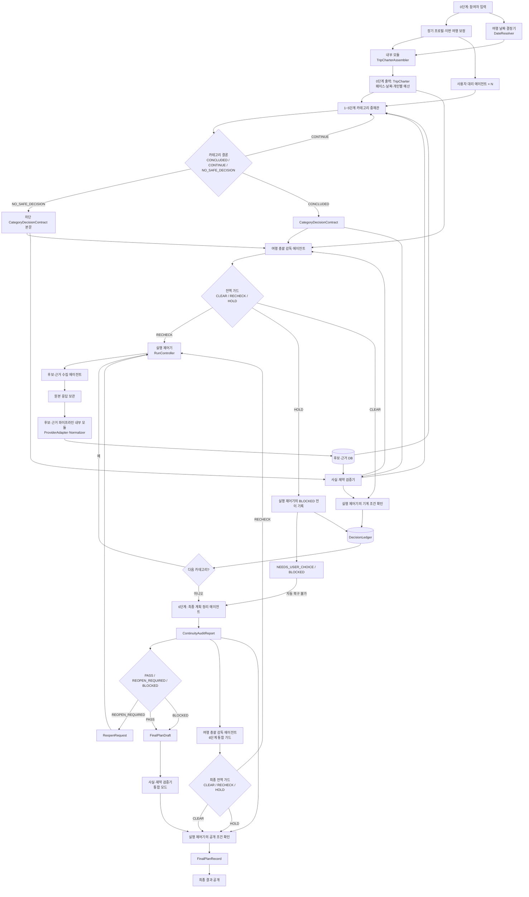
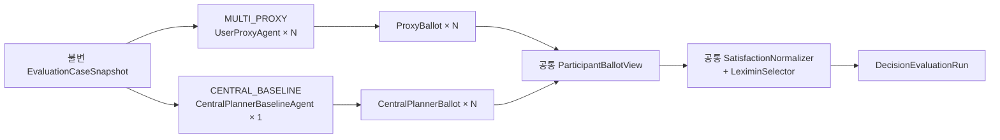

# MOA 에이전트 명칭·계층·권한 결정

- 문서 유형: Architecture Decision Record
- 상태: 채택
- 버전: v0.5
- 최초 결정일: 2026-08-13
- 최종 수정일: 2026-08-14
- 범위: 에이전트 명칭, 책임, 호출 관계, 결정 권한, 핵심 입출력 계약

## 1. 결정 요약

MOA의 **제품 공식 역할**로는 다음 다섯 개의 에이전트 명칭만 사용한다.

1. **사용자 대리 에이전트** (`UserProxyAgent`)
2. **후보·근거 수집 에이전트** (`CandidateEvidenceAgent`)
3. **카테고리 중재관** (`CategoryArbiterAgent`)
4. **여행 총괄 감독 에이전트** (`TripOrchestratorAgent`)
5. **최종 계획 정리 에이전트** (`PlanFinalizerAgent`)

에이전트가 아닌 세 개의 **최상위 결정론적 제어 구성요소**를 별도로 둔다.

1. **여행 날짜 결정기** (`DateResolver`)
2. **사실·제약 검증기** (`FactConstraintValidator`)
3. **실행 제어기** (`RunController`)

`ProviderAdapter`, `Normalizer`, 만족도 정규화기, leximin 선택기 같은 코드는 별도 제품 역할이나 에이전트가 아니다. 각각 후보·근거 파이프라인과 카테고리 선택 정책 안에 포함되는 **내부 결정론적 모듈**이다.

효과 비교를 위한 평가 문서와 테스트 런타임에서는 별도 대조군인 `CentralPlannerBaselineAgent`를 사용할 수 있다. 이는 제품의 공식 역할·원장 작성 권한·사용자 노출 에이전트 수에 포함하지 않는다.

`Supervisor`, `Chief Referee`, `Category Referee`, `Policy Gate`, 실행기를 뜻하는 `Orchestrator`는 제품 문서의 공식 명칭으로 더 이상 사용하지 않는다. 기존 저장소의 코드·문서에서만 마이그레이션 전 옛 이름으로 취급한다.

## 2. 명칭을 이렇게 정한 이유

기존 명칭은 다음 책임을 혼동하게 만들었다.

- 누가 사용자 취향을 대변하는가
- 누가 카테고리 갈등을 중재하고 결론을 내는가
- 누가 전체 여행 원칙을 감시하는가
- 누가 실제 API 사실과 숫자를 검증하는가
- 누가 상태 전이와 재시도를 실행하는가
- 누가 최종 결과를 사용자 문서로 만드는가

새 명칭은 역할을 행동으로 설명한다. 사용자가 보는 명칭과 코드 식별자를 함께 고정하되, 하나의 에이전트에게 판단·API 사실 생성·상태 변경을 모두 허용하지 않는다.

## 3. 전체 계층



이 구조의 단계 의미는 다음과 같이 고정한다.

| 구간 | 성격 | 주요 실행 주체 | 권위 출력 |
| --- | --- | --- | --- |
| 0단계 | 입력·여행 헌장 생성 | 입력 검증, `DateResolver`, `TripCharterAssembler` | 프로필 스냅샷, `DateDecision`, `TripCharter` |
| 1~5단계 | 사용자 대리인 토론·카테고리 결정 | 사용자 대리 에이전트, 후보·근거 수집 에이전트, 카테고리 중재관, 검증기, 총괄 감독 | 단계별 `CategoryDecisionContract`; 정상 `ACCEPTED`, 종결 차단 `BLOCKED` |
| 6단계 | 최종 정리·통합 검증 | 최종 계획 정리 에이전트, 검증기, 총괄 감독, 실행 제어기 | `ContinuityAuditReport`와 `FinalPlanRecord` 또는 `ReopenRequest` |

따라서 0단계와 6단계는 카테고리 토론이 아니며 `CategoryDecisionContract`를 만들지 않는다. 카테고리 중재관은 1~5단계에만 존재한다.

### 3.1 평가용 이중 결정 생성 경로

제품의 기본 경로는 참여자별 `UserProxyAgent`를 사용하는 `MULTI_PROXY`다. 다만 이 구조의 효과를 검증하고 단순한 대안을 함께 제작할 수 있도록 `CENTRAL_BASELINE`을 같은 인터페이스의 평가 경로로 구현한다.



`CentralPlannerBaselineAgent`는 제품의 공식 여섯 번째 에이전트가 아니다. 평가 전용 런타임으로서 세 사용자의 최소 구조화 `EvaluationProfileView`를 함께 읽고 사용자별 투표 초안을 만든다. 실명, 원문 건강·종교 설명, 불필요한 자유서술은 보지 않는다. 입력 스냅샷이 고정된 뒤 두 경로 모두 후보 탐색·외부 도구 호출을 하지 않는다.

두 경로는 같은 모델·버전·샘플링 설정, `TripCharter`, `proposalSetVersion`, 후보·근거·검증 영수증, 출력 필드를 사용한다. 중앙 기준선의 결과는 `DecisionLedger`나 제품 계약 상태를 변경할 수 없고 `DecisionEvaluationRun`에만 저장한다. Multi-Proxy 평가 결과도 비교 실행 중에는 제품 원장과 분리한다. 실제 제품 실행만 정상 계약·가드·원장 경로를 사용한다.

## 4. 역할별 계약

### 4.1 사용자 대리 에이전트

**목적:** 한 명의 사용자를 대변한다.

**인스턴스:** 참여자당 하나. 모든 인스턴스는 같은 기본 모판을 쓰고 개인 상태만 격리한다.

**읽는 것:**

- `CanonicalProfile`
- `AgentBelief`
- `TripEffectiveProfile`
- `ConstraintProfile`
- `TripCharter`
- 이전의 승인된 `CategoryDecisionContract`
- 현재 카테고리의 검증된 원자 후보와 같은 버전의 `CategoryProposal` 카드

**출력:**

- `support / oppose / conditional`
- 현재 검증 계획안 집합에 대한 구조화된 `ProxyBallot`
- 근거가 된 프로필 항목 ID
- 양보 가능 범위
- 반대 이유
- 대체안 조건

**할 수 없는 것:**

- 사용자가 말하지 않은 취향·신념·제약 생성
- 원본 프로필 변경
- 검증되지 않은 후보 제시
- 가격·주소·운영시간·재고를 사실처럼 발명
- 위임 범위를 넘는 양보 확정
- 다른 사용자의 프로필 읽기 또는 수정

### 4.2 후보·근거 수집 에이전트

**목적:** 현재 카테고리에 필요한 실제 후보와 근거를 찾는다.

**인스턴스:** 하나의 공통 실행 모판을 사용하되 카테고리별 도구·쿼리 정책을 주입한다. 숙소·교통·항공·활동·식사별로 별도 프로세스를 반드시 둘 필요는 없다.

**하는 일:**

- 필요한 사실과 쿼리 계획 결정
- 허용된 여행 API·공식 페이지·검색 제공자 호출
- 제공자 폴백 선택
- 중복 후보 병합 제안
- 후보의 의미 태그와 목적지 특화 속성 추론
- `CandidateRecord`와 `EvidenceSnapshot` 저장 요청

**중요한 경계:** 에이전트가 원본 API 값을 임의로 고쳐 DB에 넣지 않는다.

```text
API 원본 응답
→ 변경 불가능한 원본 참조·해시 저장
→ 결정론적 Provider Adapter
→ 단위·통화·날짜·주소 정규화
→ CandidateRecord 저장
→ 사실·제약 검증
```

에이전트가 만든 태그는 `derived_by_agent`로 표시하고, 제공자가 직접 준 사실과 구분한다.

**할 수 없는 것:**

- 후보를 최종 선택
- 하드 제약 통과 선언
- 검색 결과만으로 예약 가능 선언
- 원본 가격·주소·시간 수정
- 근거 없는 `VERIFIED` 승격

### 4.3 카테고리 중재관

**목적:** 1~5단계의 현재 카테고리 안에서 대리인들의 충돌을 중재하고 가장 타당한 결론을 계약으로 만든다.

**인스턴스:** 한 시점에 현재 카테고리용 하나. 같은 런타임을 카테고리별 프롬프트와 도구 정책으로 재사용할 수 있다.

**카테고리 구성:**

- `long_distance`: 오는 길·가는 길
- `stay`: 거점·숙소
- `activity`: 갈 곳·할 일
- `dining`: 식사
- `schedule`: 날짜별 일정·현지 이동

위 값은 하나의 `CategoryArbiterAgent`에 전달하는 카테고리 context다. 별도 `AgentRole`이나 독립 중재관 종류를 추가하지 않는다.

예산은 독립 취향 토론 하나로 마지막에 처리하지 않는다. 모든 중재관이 개인별 예산 한도와 남은 금액을 사용하고, 마지막에는 통합 정산만 한다.

0단계에는 카테고리 중재관을 호출하지 않는다. 입력 검증, `DateResolver`, 프로필 스냅샷, `TripCharterAssembler`가 `TripCharter`를 만든다. 6단계에도 카테고리 중재관을 호출하지 않으며 최종 계획 정리 에이전트가 통합을 담당한다.

**하는 일:**

- 대리인별 최초 입장 수집
- 충돌과 공통점 정리
- 사실 쟁점을 검증기에 요청
- 타협안·대체안·제한적 분리안 제시
- 검증된 원자 후보만 조합한 소수의 `CategoryProposal` 작성과 검증 요청
- 토론 마지막에 모든 대리인의 구조화 투표 수집
- 제약을 통과한 계획안에 대해 투표에서 계산한 만족도와 leximin 규칙으로 결론 선택
- 현재 라운드를 `CONCLUDED / CONTINUE / NO_SAFE_DECISION` 중 하나로 판정
- 선택·제외·양보·미해결 내용을 구조화
- `CONCLUDED`이면 다음 카테고리가 읽을 정상 `CategoryDecisionContract` 본문 작성
- `NO_SAFE_DECISION`이면 선택 계획안 없이 `blockReason`을 가진 차단 `CategoryDecisionContract` 본문 작성

대리인 투표는 해당 카테고리 결론의 직접 입력이다. 다만 단순 과반수로 최종안을 정하지 않는다. 하드 제약·개인 예산·실행 가능성을 먼저 통과시키고, 투표가 만든 사용자별 만족도 벡터에 leximin을 적용한다. 중재관은 이 계산과 계약 근거를 설명할 수 있지만 투표에 없던 선호를 새로 만들어 덮어쓸 수 없다.

**할 수 없는 것:**

- `TripCharter` 변경
- 검증되지 않은 사실 확정
- 개인 예산 상한 완화
- 카테고리 밖 결정을 조용히 변경
- 상태를 직접 `ACCEPTED`로 변경

### 4.4 여행 총괄 감독 에이전트

**목적:** 카테고리 토론 전체가 처음 정한 여행 기준과 검증된 현실에서 벗어나지 않도록 지속적으로 감독한다.

이 역할이 사용자가 말한 “오케스트레이션 에이전트”의 공식 명칭이다. 코드 식별자는 `TripOrchestratorAgent`다.

**계속 지키는 세 가지 기준:**

1. 여행 페이스
2. 확정 날짜
3. 개인별 목표예산·절대상한과 그룹 예산 정책

**하는 일:**

- 카테고리 시작 전 입력 계약 확인
- 카테고리 진행 중 기준 이탈·범위 이탈 감지
- 사용자 대리인의 근거 없는 주장과 누락 감지
- 후보·근거 수집 에이전트에 재조회 요청
- 사실·제약 검증기에 숫자·주소·날짜·예약·동선 검사 요청
- 카테고리 계약에 전역 위반이 없는지 `CLEAR / RECHECK / HOLD`로 감사
- 상위 결정 변경 시 영향받는 하위 노드 재개방 요청
- 6단계에서 `ContinuityAuditReport`가 현재 `DecisionLedger`·계약 버전을 참조하는지와 `PASS`인지 확인
- 마지막 통합 결과의 `TripCharter`, 근거, 날짜·예산·페이스·하드 제약 이탈 감사

카테고리 토론이 끝났는지와 어떤 결론을 택할지는 카테고리 중재관의 권한이다. 계약 사이의 결정 누락·의미 변화·의무 승계 판정은 최종 계획 정리 에이전트의 권한이다. 총괄 감독 에이전트의 `CLEAR`는 이 판단들을 다시 수행하는 별도 찬성표가 아니다. 1~5단계에서는 날짜·예산·페이스·근거·하드 제약 위반이 없다는 뜻이고, 6단계에서는 이에 더해 현재 원장 버전의 `ContinuityAuditReport`가 `PASS`라는 뜻이다.

**할루시네이션에 대한 책임:** 총괄 감독 에이전트가 할루시네이션 검사의 책임자지만, LLM의 눈대중으로 숫자와 예약 가능성을 판정하지 않는다.

- 출처가 실제 요청과 일치하는지 확인한다.
- 검증기가 만든 `VerificationReceipt`를 읽는다.
- 근거가 없거나 오래됐으면 `UNVERIFIED / STALE / CONTRADICTED`로 처리한다.
- 근거가 불충분하면 계약을 직접 고치지 않고 `RECHECK`와 수정 대상을 반환한다.

**할 수 없는 것:**

- 사용자 취향 변경
- 새 후보 발명
- API 원본값 수정
- 검증기의 실패를 LLM 판단으로 덮어쓰기
- 상태 전이를 직접 DB에 적용
- 카테고리 중재를 대신해 새로운 결론 작성
- 카테고리 토론의 종료 여부를 다시 투표하거나 승인
- 계약 간 의미 연속성을 다시 판정하거나 `ContinuityAuditReport`의 판정을 덮어쓰기

### 4.5 최종 계획 정리 에이전트

**목적:** 정상 경로의 모든 승인 카테고리 원장을 하나의 여행 계획으로 편집하고, 자동 복구 불가 경로에서는 승인된 범위와 종결 차단을 구분한 부분 결과를 만든다.

**읽는 것:**

- `TripCharter`
- `DecisionLedger.latestAcceptedContractByCategory`
- 위 색인이 참조하는 모든 승인된 `CategoryDecisionContract`
- 자동 복구가 불가능한 현재 `BLOCKED CategoryDecisionContract`와 `blockReason`
- 계획 노드와 버전
- 검증 영수증과 근거 만료 상태
- 사용자별 반영·미반영 취향
- 양보와 미해결 쟁점

**하는 일:**

1. 최초 기준서와 `DecisionLedger`가 참조하는 모든 승인 계약을 시간순으로 비교한다.
2. 앞에서 확정한 결정이 뒤에서 사라지거나 의미가 바뀌었는지 확인한다.
3. 카테고리별 최신 승인 계약이 앞선 계약의 의무 ID를 `obligationFulfillments`로 이어받았는지 확인한다.
4. 구조적 참조 검사와 의미 연속성 판단을 `ContinuityAuditReport`로 만든다.
5. 보고서가 `REOPEN_REQUIRED`이면 최종안을 임의 수정하지 않고 영향 카테고리를 지정한 `ReopenRequest`를 만든다.
6. 보고서가 `PASS`이면 일정·예산·예약 준비·Plan B·결정 이유를 `FinalPlanDraft`로 구성한다.
7. 보고서가 `BLOCKED`이면 승인된 앞 단계와 차단된 결정·미작성 하위 범위를 구분한 부분 `FinalPlanDraft`를 만든다. 존재하지 않는 하위 결론은 추정하지 않는다.

**할 수 없는 것:**

- 카테고리 결론 변경
- 새 후보·사실·양보 생성
- 검증되지 않은 값을 확정형 문장으로 표현
- `BOOKABLE` 상태 직접 부여
- `ReopenRequest`를 직접 DB 상태 전이로 적용

## 5. 최상위 결정론적 제어 구성요소

### 5.1 여행 날짜 결정기

**제품 표시명:** 여행 날짜 결정기
**코드 식별자:** `DateResolver`

사용자 입장에서는 날짜를 정해주는 논리 역할이지만, 핵심 계산은 Python 또는 동일한 결정론적 코드로 구현한다. LLM은 대안 설명만 할 수 있다. 방장이 날짜나 대략 기간창을 대신 확정하지 않으며, 응답·확인된 모든 참여자의 가용 정보를 입력으로 사용한다.

- 참여자별 가능·불가 날짜 교집합
- 희망 박수와 유연성
- 목적지의 시간대·휴관·계절·날씨 위험
- 출발지별 이동 가능 시간
- 개인별 목표예산·절대상한
- 가격·재고의 조회 시점

출력은 `DateDecision`이며 선택 날짜, 대안, 참석자 범위, 점수 분해, 근거, 재조회 조건을 포함한다.

날짜 결정은 두 번에 나뉜다. 0단계에서는 참여자 가용성과 박수·시간대·하드 제약으로 가능한 날짜 집합을 먼저 만들고, Destination Pack의 계절·휴관 정보와 확보된 사전 가격 범위는 순위 보조로만 쓴다. 아직 없는 실시간 교통 재고를 `PASS`처럼 가정하지 않는다. 1단계에서 정확한 운행·좌석·가격을 검증해 선택 날짜가 모두 실격되면 `TripCharter.changeRules`의 유연성 안에서 저장된 날짜 대안을 다시 계산한다.

### 5.2 사실·제약 검증기

**제품 표시명:** 사실·제약 검증기
**코드 식별자:** `FactConstraintValidator`

총괄 감독 에이전트가 호출하는 Python 중심의 결정론적 검증 도구다.

| 검증 대상 | 최소 검사 |
| --- | --- |
| 가격 | 통화, 세금·수수료 포함 여부, 인당·객실당 단위, 조회 시각, 여행 날짜 |
| 주소·위치 | 제공자 place ID, 정규화 주소, 위도·경도, 목적지 행정구역, 중복 장소 |
| 예약 가능성 | 정확한 체크인·체크아웃, 인원, 객실 조합, 시간 슬롯, `observedAt` |
| 인원·정원 | 참여자 전원 배정, 객실·침대·테이블·회차·좌석·차량별 최대 정원, 연령 구성, 함께 이용 조건, 분리 권한 |
| 날짜 | 시간대, 요일, 휴관일, 날짜 역전, 여행 기간 포함 여부 |
| 이동 | 출발지·도착지 일치, 경로 존재, 이동시간, 막차, 환승·버퍼 |
| 페이스 | 하루 핵심 앵커 수, 총 예정 시간, 이동시간, 버퍼, 개인 보행·체력 상한 |
| 예산 | 사용자별 부담액, 개인 목표·절대상한, 카테고리 사용액, 비상금, 환율 시점 |
| 근거 | 출처, 요청 인자, 원본 해시, 만료, 상충하는 제공자 응답 |

검증 결과는 `PASS / FAIL / UNKNOWN / STALE / CONTRADICTED` 중 하나인 `VerificationReceipt`로 반환한다. `UNKNOWN`은 `PASS`가 아니다.

인원·정원 규칙은 다음처럼 결정론적으로 처리한다.

| 규칙 | 결과 |
| --- | --- |
| `confirmedCapacity < requestedPartySize` | `FAIL: CAPACITY_EXCEEDED` |
| 참여자 한 명 이상 미배정 또는 중복 배정 | `FAIL: PARTICIPANT_ASSIGNMENT_INVALID` |
| 정원·회차·객실 응답이 없거나 요청 날짜·시간·인원과 불일치 | `UNKNOWN: CAPACITY_UNVERIFIED` |
| `PartyRequirement`가 금지한 객실·테이블·동선 분리 | `FAIL: UNAUTHORIZED_SPLIT` |
| 전체 참여자 배정, 단위별 정원, 함께 이용 정책, 근거 신선도가 모두 충족 | 해당 정원 규칙 `PASS` |

### 5.3 실행 제어기

**제품 노출:** 없음
**코드 식별자:** `RunController`

에이전트가 아니라 상태머신·Worker다.

- 에이전트 호출 순서
- 작업 큐·체크포인트·재시도
- 턴·시간·비용 상한
- 계약 버전과 잠금
- 승인된 상태 전이의 DB 적용
- 6단계 입력 원장·계약 버전의 스냅샷 잠금
- `ReopenRequest`의 원장 버전·영향 범위·`TripCharter.changeRules`·위임 권한을 확인한 뒤 재개방 상태 적용
- 정상 경로에서는 연속성 `PASS` + 통합 검사 `PASS` + 최종 가드 `CLEAR`를 확인한 뒤 사용자용 상태를 계산하고 `FinalPlanRecord` 저장·공개
- 자동 복구 불가 경로에서는 연속성 `BLOCKED` 또는 최종 가드 `HOLD`, 구조화된 `blockReason`, 기존 사실의 검증·불확실성 표시를 확인한 뒤 `NEEDS_USER_CHOICE / BLOCKED` 부분 결과만 공개
- 실패·중단·재개 기록
- 평가 실행에서는 `CENTRAL_BASELINE / MULTI_PROXY`가 같은 `EvaluationCaseSnapshot`을 읽도록 고정하고 결과를 제품 원장과 분리

카테고리 중재관이 `CONCLUDED`를 반환해도 검증 영수증이 통과하지 않았거나 총괄 감독 결과가 `CLEAR`가 아니면 `ACCEPTED`로 적용하지 않는다.

### 5.4 내부 결정론적 모듈

다음은 최상위 실행 주체가 아니라 특정 하위 시스템 안에서만 호출되는 순수·결정론적 모듈이다.

| 소속 | 내부 모듈 | 책임 |
| --- | --- | --- |
| 후보·근거 파이프라인 | `ProviderAdapter` | 제공자별 원본 응답을 공통 필드로 매핑 |
| 후보·근거 파이프라인 | `Normalizer` | 통화·단위·날짜·주소를 정규화 |
| 여행 헌장 생성 | `TripCharterAssembler` | 검증된 입력·`DateDecision`을 고정 스키마의 `TripCharter`로 조립 |
| 카테고리 선택 정책 | `SatisfactionNormalizer` | 사용자별 활성 신호를 비교 가능한 범위로 변환 |
| 카테고리 선택 정책 | `LeximinSelector` | 제약을 통과한 `CategoryProposal`의 leximin 및 타이브레이크 계산 |
| 최종 통합 검사 | `ObligationLinkChecker` | 승인 계약 사이의 의무 ID·참조·승계 여부를 기계적으로 검사 |

이 모듈은 에이전트 판단을 대신하지 않고 같은 입력에 같은 결과를 반환한다. 따라서 공식 “다섯 에이전트 + 세 최상위 제어 구성요소” 수에는 포함하지 않는다.

## 6. 여행 기준서

총괄 감독 에이전트가 감시하는 권위 문서는 `TripCharter`다.

```text
TripCharter
├─ version
├─ participantSet
├─ destinationDecision
│  ├─ destinationPackId
│  └─ authority: host
├─ pacePolicy
│  ├─ coreAnchorsPerDay: 1 | 2 | 3
│  ├─ authority: host
│  ├─ earliestStart / latestEnd
│  ├─ minimumBuffer
│  ├─ freeTimePolicy
│  └─ perUserMobilityLimits
├─ dateDecision
│  ├─ startDate / endDate / nights / timezone
│  ├─ participatingUsers
│  └─ alternatives / evidenceRefs
├─ partyRequirement
│  ├─ totalParticipants / participatingUserIds[]
│  ├─ partyComposition: adults / children / infants
│  ├─ togethernessByUserAndCategory: userId / category -> SAME_RESOURCE_REQUIRED | MULTIPLE_UNITS_SAME_PROVIDER_ALLOWED | SUBGROUP_ALLOWED_WITH_CONSENT
│  ├─ splitAuthorityByUserAndCategory: userId / category -> FORBIDDEN | ALLOWED_WITH_CONSENT | PRE_APPROVED
│  └─ effectiveTogethernessByCategory
├─ budgetPolicy
│  ├─ targetByUser / maxByUser
│  ├─ categoryEnvelope
│  ├─ reserveByUser
│  ├─ costSharingPolicy / unequalShareDelegationByUser
│  └─ fxEvidenceRef
├─ valueAndFairnessPolicy
│  ├─ subgroupPolicy
│  └─ subgroupDelegationByUser
└─ lockedAt / changeRules
```

`coreAnchorsPerDay`는 페이스를 이해하기 쉬운 대표값이다.

- 1개: 휴식형
- 2개: 균형형
- 3개: 활동형

그러나 이 숫자만으로 페이스를 판정하지 않는다. 하루 종일 걸리는 테마파크 하나와 30분짜리 장소 하나는 같지 않기 때문이다. 총 예정 시간, 이동시간, 버퍼, 보행·체력 상한도 함께 검사한다. 음식점·숙소 체크인·단순 환승은 핵심 앵커 수에 포함하지 않는다.

개인 목표예산과 카테고리 배분은 조정 가능한 목표이고 `maxByUser`는 하드 상한이다. 불균등 분담은 `costSharingPolicy`와 사용자별 사전 위임 범위 안에서만 자동 적용하며, 이를 넘는 부담 이전은 `NEEDS_USER_CHOICE`다.

`TripCharterAssembler`는 사용자별 인원·함께 이용 요구를 삭제하지 않고 `effectiveTogethernessByCategory`를 계산한다. MVP의 보수적 합성에서는 `SAME_RESOURCE_REQUIRED`와 `FORBIDDEN`이 더 느슨한 입력보다 우선한다. 이를 완화하려면 영향을 받는 사용자의 새 확인과 새 `TripCharter.version`이 필요하다. 정원 때문에 실제 동선을 분리하려면 `splitAuthorityByUserAndCategory`뿐 아니라 `valueAndFairnessPolicy.subgroupDelegationByUser`의 인원·시간·비용·안전 범위도 통과해야 한다.

방장이 확정하는 것은 지원 범위 안의 **여행 목적지와 목표 페이스**다. 정확한 날짜, 장거리·현지 교통수단, 숙소·활동·식사 후보, 개인별 예산은 방장이 대신 결정하지 않는다. 목표 페이스도 참여자의 하드한 이동·건강 제약을 무효화하지 않으며, 충돌하면 실행 가능한 안을 찾거나 `BLOCKED`로 남긴다.

`TripCharter`의 잠금은 영원한 변경 금지가 아니라 **제자리 수정 금지**다. `changeRules`와 권한 범위 안의 날짜 대안처럼 허용된 변경도 새 `TripCharter.version`을 만들고 원장에 변경 사건을 기록한다. 이전 `charterVersion`을 참조하는 현재·하위 계약과 계획 노드는 재개방 또는 `isStale=true` 처리한 뒤 새 버전으로 다시 검증한다.

### 6.1 보이는 5·3·1과 내부 취향 표현

사용자에게는 각 취향 카드 또는 후보를 다음 세 단계로 보여준다.

- `5`: 강하게 선호하며 가능하면 보호하고 싶음
- `3`: 선호하지만 다른 가치와 교환 가능
- `1`: 포함돼도 괜찮지만 우선순위는 낮음

`1`은 싫음이 아니고, `미선택/모름`도 아니다. 피하고 싶은 항목과 하드한 제외 조건은 별도 신호로 받는다. 화면의 5·3·1을 그대로 장기 벡터 숫자로 저장하거나 `분야 점수 × 세부 점수`로 곱하지 않고 다음 계약으로 변환한다.

카테고리 중요도에 5·3·1을 쓰는 경우에도 각 카테고리를 독립 평가하고 중복 점수를 허용한다. 음식·숙소·액티비티에 5·3·1을 하나씩 강제 배정하지 않으며 예산 배분은 별도 `W` 항목으로 받는다.

```text
PreferenceSignal
├─ visibleRating: 5 | 3 | 1 | null
├─ axisSignals[]: axisId / direction / ordinalIntensity
├─ tagSignals[]: tagId / polarity / ordinalIntensity
├─ stance: prefer | acceptable | avoid | unknown
├─ context: country / city / trip / candidate
├─ sourceItemId / sourceCandidateIds[]
├─ provenance: direct_survey | observed_choice | agent_inference
└─ confidence
```

**취향 유형**은 사용자가 이해하는 카드·예시이고, **분류축**은 여러 여행지에서 재사용하는 내부 판단 차원이며, **태그**는 라멘 선호·쌀국수 비선호처럼 축만으로 보존하기 어려운 구체 예외다. 하나의 취향 유형은 여러 축·태그로, 하나의 축은 여러 취향 유형으로 연결되는 다대다 관계다. 상충 신호는 평균으로 지우지 않고 맥락·출처와 함께 보존한다.

## 7. 데이터 계약

### 7.1 CandidateRecord

```text
CandidateRecord
├─ candidateId / category / providerId
├─ displayName
├─ providerPlaceId
├─ normalizedAddress / lat / lng
├─ attributes
├─ priceSnapshotRefs[]
├─ availabilitySnapshotRefs[]
├─ evidenceRefs[]
├─ derivedTags[]
└─ status
```

### 7.2 CategoryProposal

```text
CategoryProposal
├─ proposalId / category / version
├─ candidateRefs[]
├─ participantAssignments[]
├─ timePlan / routeEdges[]
├─ costByUser / totalCost
├─ capacityPlan
│  ├─ requestedPartySize / confirmedCapacity
│  ├─ allocationUnits[]
│  │  └─ resourceUnitId / confirmedUnitCapacity / assignedUserIds[]
│  ├─ unassignedUserIds[]
│  ├─ togethernessStatus / splitAuthorityRef?
│  └─ evidenceRefs[]
├─ assumptions[] / splitPlan?
├─ evidenceRefs[] / verificationReceiptRefs[]
├─ feasibilityStatus: PASS | FAIL | UNKNOWN | STALE | CONTRADICTED
└─ generatedBy / createdAt
```

`CandidateRecord`는 호텔 한 곳·식당 한 곳·교통편 한 개 같은 원자 후보다. 투표 단위는 원자 후보 하나가 아니라 해당 카테고리에서 함께 실행할 수 있는 계획안인 `CategoryProposal`이다. 예를 들어 활동 단계는 여러 장소 묶음, 식사 단계는 여러 식사 슬롯, 일정 단계는 방문 순서와 모든 이동 간선을 포함한다. 계획안 버전도 불변이며 계약은 정확한 `proposalId / version`을 참조한다. `feasibilityStatus`는 참조된 최신 검증 영수증에서 계산한 읽기 모델이며 원본 계획안을 덮어쓰지 않는다. 카테고리 중재관이 검증된 원자 후보로 소수의 계획안을 제안할 수 있지만, 시간·동선·비용·인원 정원·하드 제약의 `PASS`는 사실·제약 검증기만 부여한다.

`CapacityPlan`으로 표현하는 `capacityPlan`은 단순 `partySize` 숫자가 아니다. 모든 참여자가 어떤 객실·테이블·회차·좌석·차량에 배정됐는지와 해당 자원의 확인 정원을 기록한다. 일부 인원만 배정됐거나 제공자의 전체 좌석 수만 있고 요청 시간의 그룹 슬롯이 확인되지 않았다면 `UNKNOWN`이다. 같은 공급자의 여러 객실처럼 사전 허용된 자원 배치는 `capacityPlan`으로, 서로 다른 장소·시간·동선으로 나뉘는 경우는 동의가 필요한 `splitPlan`으로 기록한다.

### 7.3 EvidenceSnapshot

```text
EvidenceSnapshot
├─ evidenceId / candidateId / factType
├─ provider / endpointOrUrl
├─ normalizedRequest
│  ├─ dates / timezone
│  ├─ partySize / partyComposition
│  ├─ roomComposition / tableOrSlotRequest / vehicleRequest
│  └─ locale / currency
├─ rawPayloadRef / rawPayloadHash
├─ normalizedValue / unit / currency
├─ observedAt / validUntil
├─ confidence
└─ termsRef
```

예약 가능성은 영구적인 boolean이 아니다. 예를 들어 숙소는 `2026-10-15~18, 6명, 객실 2개`라는 정확한 요청에서 `AVAILABLE_AT`였다는 사실만 저장한다. 식당의 총 좌석 수나 호텔의 전체 객실 수는 해당 시간의 그룹 예약 정원이 아니며, 요청 인원·단위 배치와 응답이 일치할 때만 정원 근거가 된다.

### 7.4 VerificationReceipt

```text
VerificationReceipt
├─ receiptId / ruleId
├─ claimId / candidateId
├─ expected / observed
├─ evidenceRefs[]
├─ status: PASS | FAIL | UNKNOWN | STALE | CONTRADICTED
├─ checkedAt
└─ explanation
```

### 7.5 ProxyBallot

```text
ProxyBallot
├─ ballotId / userId / category
├─ proposalSetVersion / candidateSetVersion
├─ rankedProposalIds[]
├─ proposalStances[]: proposalId / support | conditional | oppose
├─ profileItemRefs[] / evidenceRefs[]
├─ conditionalTerms[]
├─ concessionLimitRefs[]
├─ delegationScopeRef
└─ submittedAt
```

투표 대상은 같은 버전의 검증 `CategoryProposal` 집합으로 고정한다. 자연어 발언 자체를 표로 추측하지 않고 각 대리인이 구조화 투표를 명시적으로 반환한다. 결정론적 선택 정책이 모든 `ProxyBallot`과 활성 프로필 신호로 만족도 벡터·leximin 순서·타이브레이크를 계산해 `SelectionRuleTrace`를 만든다.

### 7.5.1 평가용 중앙 기준선과 공통 결과 계약

```text
EvaluationCaseSnapshot
├─ evaluationCaseId / category / fixtureVersion
├─ charterVersion / participantSetVersion
├─ evaluationProfileViewRefs[] / participantConsentRefs[]
├─ proposalSetVersion / candidateRefs[]
├─ evidenceSnapshotRefs[] / verificationReceiptRefs[]
├─ modelId / modelVersion / samplingConfig
├─ postSnapshotToolBudget: 0
└─ createdAt

CentralPlannerBallot
├─ ballotId / representedUserId / category
├─ proposalSetVersion
├─ rankedProposalIds[] / proposalStances[]
├─ profileItemRefs[] / conditionalTerms[]
└─ generatedBy: CENTRAL_BASELINE

ParticipantBallotView
├─ representedUserId / proposalSetVersion
├─ rankedProposalIds[] / proposalStances[]
├─ profileItemRefs[] / conditionalTerms[]
└─ sourceMode: CENTRAL_BASELINE | MULTI_PROXY

DecisionEvaluationRun
├─ evaluationRunId / evaluationCaseId / mode
├─ inputSnapshotRef / modelConfigRef
├─ participantBallotViews[]
├─ selectedProposalRef / selectionRuleTrace
├─ hardConstraintViolationCount / capacityViolationCount
├─ evidenceMismatchCount / noSafeDecisionExpected / noSafeDecisionObserved
├─ preferenceAgreementByUser[] / minimumSatisfaction
├─ rerunRequested
├─ latencyMs / promptTokens / completionTokens / estimatedCost
└─ createdAt
```

중앙 플래너는 한 사용자의 입장을 그룹 평균으로 뭉개지 않고 `representedUserId`별 투표를 각각 반환해야 한다. `ParticipantBallotView`는 비교·선택을 위한 공통 읽기 모델일 뿐 원래 `ProxyBallot`이나 `CentralPlannerBallot`을 덮어쓰지 않는다. 실행 모드마다 출력 누락·스키마 실패·시간 초과를 별도 실패로 기록하며 상대 모드의 결과로 대체하지 않는다.

### 7.6 CategoryDecisionContract

```text
CategoryDecisionContract
├─ contractId / category / version / createdAt
├─ charterVersion
├─ selectedProposalRef? / rejectedProposalRefs[]
├─ candidateDisposition[]: candidateRef / included | excluded / reason
├─ proxyStances[] / proxyBallotRefs[]
├─ satisfactionVector
├─ selectionRuleTrace
├─ concessions[]
├─ splitPlans[]
├─ paceImpact / dateImpact / budgetImpactByUser
├─ evidenceRefs[] / proposalVerificationReceiptRefs[]
├─ unresolvedIssues[]
├─ blockReason?
│  ├─ reasonType: USER_AUTHORITY_REQUIRED | NO_FEASIBLE_OPTION | EVIDENCE_UNAVAILABLE | PROVIDER_UNAVAILABLE | POLICY_CONFLICT
│  ├─ retryable
│  ├─ affectedObjectRefs[]
│  └─ requiredAction
├─ obligationsForNextCategory[]
│  ├─ obligationId / targetCategory
│  ├─ requirementType / requiredCondition
│  └─ sourceDecisionRef / objectRefs[]
├─ obligationFulfillments[]
│  ├─ obligationRef
│  ├─ status: SATISFIED | CARRIED_FORWARD | CONFLICTED | UNRESOLVED
│  └─ fulfillmentRefs[]
├─ reopenConditions[]
└─ arbiterOutcome: CONCLUDED | NO_SAFE_DECISION
```

`CategoryDecisionContract`는 **한 카테고리·한 버전의 불변 결정 스냅샷이자 결정 내용의 단일 원본**이다. 수정이 필요하면 기존 계약을 덮어쓰지 않고 새 버전을 만든다. 계약이 작성된 뒤 생기는 검증·가드·상태 전이는 계약 본문에 추가하지 않고 아래 `CategoryContractView`로 투영한다.

`CONTINUE`는 아직 카테고리 결정이 아니므로 계약을 만들지 않고 라운드 체크포인트만 저장한다. `CONCLUDED`와 `NO_SAFE_DECISION`만 계약 본문을 만들며, 후자는 `selectedProposalRef=null`과 완전한 `blockReason`을 가져야 한다.

`obligationsForNextCategory`의 “next”는 반드시 바로 다음 번호가 아니라 해당 의무를 처음 소비할 하위 카테고리를 뜻한다. 하위 계약은 받은 의무 ID를 `obligationFulfillments`에서 충족·계속 승계·충돌·미해결 중 하나로 명시해야 한다. 이 ID 연결이 있어야 `ObligationLinkChecker`가 LLM의 자연어 추측 없이 누락을 검사할 수 있다.

`splitPlans`는 일부 사용자만 다른 식당·활동을 택하는 것이 실제로 분리 가능한 카테고리일 때만 사용한다. 참여자, 분리 시간, 각 동선, 재합류 장소·시각, 추가 비용, 안전·연락 조건, 당사자 동의를 모두 기록한다. 자동 채택은 0단계의 `subgroupDelegationByUser`가 허용한 인원·시간·비용·안전 범위 안에서만 가능하다. 구체 분리안이 위임 범위를 넘으면 대리인이 동의를 만들어내지 않고 `NO_SAFE_DECISION / HOLD`로 6단계 부분 결과에 넘긴다. 점수만 높이려고 원치 않는 사용자를 혼자 떼어 놓지 않는다.

### 7.7 CategoryContractView

```text
CategoryContractView
├─ contractRef
├─ lifecycleStatus: DRAFT | VALIDATING | ACCEPTED | REOPEN_REQUIRED | BLOCKED
├─ verificationReceiptRefs[]
├─ guardStatus: CLEAR | RECHECK | HOLD | NOT_RUN
├─ guardFindingRefs[]
└─ lastLedgerEventRef / projectedAt
```

`CategoryContractView`는 새 권위 원본이 아니라 `DecisionLedger` 사건과 외부 검증·가드 객체에서 계산한 읽기 모델이다. 문서의 “`status=ACCEPTED` 계약”은 이 뷰의 최신 유효 상태가 `ACCEPTED`인 계약 버전을 뜻한다.

### 7.8 DecisionLedger

```text
DecisionLedger
├─ tripId
├─ entries[]
│  ├─ sequence / eventId / occurredAt
│  ├─ actorType / actorId
│  ├─ eventType
│  ├─ objectType / objectId / objectVersion
│  ├─ previousStatus / nextStatus
│  └─ reasonRefs[] / evidenceRefs[]
└─ latestAcceptedContractByCategory
   └─ category -> contractId / version
```

`DecisionLedger`는 선택 후보·양보·만족도 같은 계약 본문을 복제하지 않는다. 계약 생성, 검증, 승인, 재개방, 교체 사건과 그 객체 참조만 append한다. “승인된 카테고리 원장”은 별도 데이터 객체가 아니라 `DecisionLedger`에 기록된 `ACCEPTED CategoryDecisionContract`를 뜻한다.

`latestAcceptedContractByCategory`는 별도의 결정 원본이 아니라 원장 사건에서 만든 파생 색인이다. 재개방 사건이 생기면 해당 카테고리의 활성 색인을 비우고, 대체 계약 버전이 `ACCEPTED`된 뒤에만 새 참조를 넣는다. 과거 승인 계약은 이력으로 보존하지만 6단계 입력이나 다음 카테고리의 권위 계약으로 사용하지 않는다.

### 7.9 ContinuityAuditReport

```text
ContinuityAuditReport
├─ reportId / tripId / sourceLedgerId
├─ acceptedContractRefs[]
├─ terminalBlockedContractRefs[]
├─ latestAcceptedContractByCategory
├─ structuralChecks[]
│  ├─ obligationRef / sourceContractRef / targetContractRef
│  └─ status: PRESERVED | MISSING | UNRESOLVED
├─ semanticChecks[]
│  ├─ sourceContractRef / targetContractRef / findingRefs[]
│  └─ status: PRESERVED | SEMANTIC_DRIFT | UNRESOLVED
├─ affectedCategoryRefs[]
├─ status: PASS | REOPEN_REQUIRED | BLOCKED
├─ blockReason?
├─ modelAndPromptVersion
├─ generatedAt
└─ explanation
```

`ObligationLinkChecker`가 계약 ID·버전·의무·이행 참조의 구조적 누락을 검사하고, 최종 계획 정리 에이전트가 계약 본문 사이의 의미 보존 여부를 판정한다. `PASS`는 1~5단계 다섯 활성 승인 계약이 존재하고 두 검사 모두 통과하며 `UNRESOLVED`가 없을 때만 가능하다. 자동 복구할 수 있는 누락·드리프트는 `REOPEN_REQUIRED`, 사용자 권한이나 외부 상태 없이는 해결할 수 없는 종결 차단은 `BLOCKED`다. 총괄 감독 에이전트는 이 보고서가 현재 원장과 계약 버전을 참조하는지만 확인하며 의미 판정을 다시 수행하지 않는다.

### 7.10 ReopenRequest

```text
ReopenRequest
├─ requestId / tripId
├─ trigger: SYSTEM_AUDIT | USER_REDISCUSSION
├─ requestedBy / authorityRef?
├─ sourceLedgerId / sourceLedgerVersion
├─ sourceContinuityReportRef? / sourceFinalPlanRef?
├─ affectedStageRefs[] / affectedCategoryRefs[]
├─ affectedCharterFieldRefs[]
├─ invalidatedContractRefs[] / affectedPlanNodeRefs[]
├─ reasonType / findingRefs[] / userInputRefs[]
├─ requiredAction / retryable / authorityRequired
└─ createdAt
```

최종 계획 정리 에이전트와 사용자 재논의 흐름은 요청만 만든다. 실행 제어기가 `sourceLedgerVersion`이 현재 버전과 같은지, 영향 범위가 의존성 그래프에 맞는지, 변경이 `TripCharter.changeRules`와 기존 위임 범위 안인지 확인한 뒤 계약 활성 색인을 비우고 영향 계획 노드에 `isStale=true`와 `staleReason`을 기록한다. 예를 들어 1단계에서 선택 날짜의 교통편이 모두 실격되면 사전 승인된 날짜 유연성 안에서 `DateResolver` 대안을 자동 재검토할 수 있다. 목적지·목표 페이스·개인 절대예산처럼 권한자 확인이 필요한 기준은 자동 변경하지 않고 `NEEDS_USER_CHOICE`로 보낸다.

### 7.11 FinalPlanDraft와 FinalPlanRecord

```text
FinalPlanDraft
├─ draftId / tripId
├─ sourceLedgerId / sourceLedgerVersion
├─ acceptedContractRefs[] / terminalBlockedContractRefs[]
├─ continuityAuditReportRef
├─ tripSummary / selectedDates
├─ categorySummaryViews[]: sourceContractRef / displaySummary
├─ dailyItinerary[] / budgetByUser / sharedBudget
├─ bookingReadiness[] / preferenceCoverage[] / concessions[]
├─ evidenceFreshness[] / unresolvedIssues[] / planB[] / reopenOptions[]
└─ generatedAt / generatedBy
```

최종 계획 정리 에이전트가 만드는 것은 `FinalPlanDraft`다. 이 초안에는 사용자용 최종 상태나 최종 가드 통과를 스스로 확정하는 필드가 없다.

```text
FinalPlanRecord
├─ recordId / tripId / version
├─ sourceDraftRef
├─ sourceLedgerId / sourceLedgerVersion
├─ acceptedContractRefs[] / terminalBlockedContractRefs[]
├─ continuityAuditReportRef
├─ status: VERIFIED_DRAFT | BOOKABLE | NEEDS_USER_CHOICE | BLOCKED
├─ statusValidUntil? / recheckAt?
├─ blockReason?
├─ tripSummary / selectedDates
├─ categorySummaryViews[]: sourceContractRef / displaySummary
├─ dailyItinerary[] / budgetByUser / sharedBudget
├─ bookingReadiness[] / preferenceCoverage[] / concessions[]
├─ evidenceFreshness[] / unresolvedIssues[] / planB[] / reopenOptions[]
├─ validationReceiptRefs[] / guardFindingRefs[]
└─ generatedAt
```

실행 제어기가 같은 스냅샷의 연속성 보고서·통합 검증·전역 가드를 확인해 `FinalPlanDraft`에서 사용자용 `status`를 계산한 뒤 불변 `FinalPlanRecord`를 저장한다.

`BOOKABLE`의 `statusValidUntil`은 예약에 필요한 근거 중 가장 이른 `validUntil`을 넘을 수 없다. 만료되면 이전 레코드를 덮어쓰지 않고 화면에서 `BOOKABLE` 표시를 중단하며, 재검증 후 새 `FinalPlanRecord` 버전을 만든다.

### 7.12 상태 계층과 변환 규칙

상태는 서로 다른 네 층을 섞지 않는다.

| 층 | 상태 | 의미 |
| --- | --- | --- |
| 중재 결과 | `CONCLUDED / CONTINUE / NO_SAFE_DECISION` | 카테고리 중재관의 판단 결과 |
| 감독 결과 | `CLEAR / RECHECK / HOLD` | 여행 총괄 감독의 전역 가드 결과 |
| 계약 생명주기 | `DRAFT / VALIDATING / ACCEPTED / REOPEN_REQUIRED / BLOCKED` | 원장 사건에서 투영한 `CategoryContractView.lifecycleStatus` |
| 사용자용 최종 상태 | `VERIFIED_DRAFT / BOOKABLE / NEEDS_USER_CHOICE / BLOCKED` | `FinalPlanRecord`에 표시할 상태 |

| 조건 | 계약 상태 또는 다음 행동 | 사용자용 상태 |
| --- | --- | --- |
| 중재 `CONTINUE` | 계약 없음, 라운드 체크포인트 저장 후 토론 계속 | 아직 공개하지 않음 |
| 중재 `CONCLUDED`, 검사 대기 | `VALIDATING` | 아직 공개하지 않음 |
| `CONCLUDED` + 필수 검증 `PASS` + 가드 `CLEAR` | `ACCEPTED` | 최종 통합 전에는 공개하지 않음 |
| 검증 `FAIL / STALE / CONTRADICTED` 또는 가드 `RECHECK`이며 자동 복구 가능 | `REOPEN_REQUIRED`, 재조달·재토론 | 아직 공개하지 않음 |
| 중재 `NO_SAFE_DECISION` 또는 가드 `HOLD`, 자동 복구 불가 | 계약 `BLOCKED`, 6단계에서 부분 결과 구성 | 사용자 권한이 필요하면 `NEEDS_USER_CHOICE`, 외부 장애·실행 불가면 `BLOCKED` |
| 1~5단계 다섯 계약 `ACCEPTED`, 연속성·통합 검증 완료 | `FinalPlanRecord` 생성 | 재고·근거 신선도까지 예약 기준을 통과하면 `BOOKABLE`, 아니면 `VERIFIED_DRAFT` |

`UNKNOWN`인 검증 결과는 `PASS`가 아니다. 자동 재조회 가능하면 `REOPEN_REQUIRED`, 사용자 결정이나 외부 상태 변화 없이는 진행할 수 없으면 `BLOCKED`로 변환한다.

## 8. 한 카테고리 실행 순서

```text
1. RunController가 TripCharter와 이전 ACCEPTED 계약을 고정한다.
2. 후보·근거 수집 에이전트가 원자 후보와 근거를 조달한다.
3. 카테고리 중재관이 검증된 원자 후보로 소수의 CategoryProposal을 만들고 사실·제약 검증기가 실행 가능성을 검사한다.
4. 사용자 대리 에이전트들이 입장을 제출하고 토론한다.
5. 대리인들이 같은 버전의 검증 계획안 집합에 대한 구조화 투표를 제출한다.
6. 카테고리 중재관이 충돌을 중재하고 `CONCLUDED / CONTINUE / NO_SAFE_DECISION`을 판정한다.
7. `CONCLUDED`이면 중재관이 선택 규칙 추적과 정상 계약 본문을, `NO_SAFE_DECISION`이면 선택안 없는 차단 계약 본문과 `blockReason`을 쓴다. `CONTINUE`는 체크포인트만 남긴다.
8. 사실·제약 검증기가 정상 계약의 숫자·날짜·주소·예약·예산 또는 차단 사유의 근거 완전성을 검사한다.
9. 여행 총괄 감독 에이전트가 기준 이탈·대리 충실도·근거 완전성을 `CLEAR / RECHECK / HOLD`로 감사한다.
10. RunController가 정상 경로의 `CONCLUDED + 기계 검사 통과 + CLEAR`에는 `ACCEPTED`, 자동 복구 불가 `NO_SAFE_DECISION / HOLD`에는 `BLOCKED` 전이 사건을 기록한다.
11. 다음 카테고리의 대리인들이 `ACCEPTED` 계약을 읽는다.
```

## 9. 최종 마무리 순서

```text
TripCharter
+ DecisionLedger.latestAcceptedContractByCategory
+ 색인이 참조하는 모든 ACCEPTED CategoryDecisionContract
+ 자동 복구 불가인 현재 BLOCKED CategoryDecisionContract와 blockReason
+ 현재 EvidenceSnapshot·VerificationReceipt
→ 최종 계획 정리 에이전트의 전체 이력 대조
→ ObligationLinkChecker의 구조적 참조 검사
→ 최종 계획 정리 에이전트의 의미 연속성 판정과 ContinuityAuditReport 생성
→ REOPEN_REQUIRED이면 ReopenRequest를 만들고 RunController가 영향 카테고리를 재개방
→ PASS이면 FinalPlanDraft
→ BLOCKED이면 승인된 범위·차단 사유·미작성 하위 범위를 담은 부분 FinalPlanDraft
→ 사실·제약 검증기의 통합 검사
→ 여행 총괄 감독 에이전트의 TripCharter·근거·전역 제약 감사와 보고서 버전 확인
→ 정상 경로는 RunController가 연속성 PASS + 통합 검사 PASS + 전역 가드 CLEAR일 때 결과 공개
→ 차단 경로는 blockReason과 기존 사실 표시가 완전할 때 NEEDS_USER_CHOICE / BLOCKED 부분 결과만 공개
```

## 10. 권한 행렬

| 역할 | 후보 제안 | 취향 해석 | 카테고리 결론 | 사실 PASS 판정 | 전역 제약 감사 | 계약 의미 연속성 | DB 상태 적용 | 사용자 문서 생성 |
| --- | --- | --- | --- | --- | --- | --- | --- | --- |
| 사용자 대리 에이전트 | 검증 계획안 안에서 대체 조건만 | 본인만 | 입장만 | 아니오 | 아니오 | 아니오 | 아니오 | 아니오 |
| 후보·근거 수집 에이전트 | 예 | 아니오 | 아니오 | 아니오 | 아니오 | 아니오 | 저장 요청만 | 아니오 |
| 카테고리 중재관 | 대체안 요청 | 현재 카테고리 | 종료 판정·결론·계약 작성 | 아니오 | 카테고리 범위 | 아니오 | 아니오 | 계약 설명 |
| 여행 총괄 감독 에이전트 | 재조달 요청 | 충실도 감사 | 변경 불가·전역 가드만 | 아니오 | 예 | 보고서 버전·PASS 확인만 | 아니오 | 감사 설명 |
| 최종 계획 정리 에이전트 | 아니오 | 아니오 | 변경 불가 | 아니오 | 아니오 | 예 | 아니오 | 예 |
| 사실·제약 검증기 | 아니오 | 아니오 | 아니오 | 예 | 기계 검사 | 아니오 | 아니오 | 아니오 |
| 실행 제어기 | 아니오 | 아니오 | 아니오 | 규칙 확인 | 아니오 | 결과 조건 확인만 | 예 | 공개 실행만 |

`ObligationLinkChecker`는 최종 통합 파이프라인의 내부 결정론적 모듈이므로 위 에이전트·최상위 구성요소 권한 행렬의 별도 행으로 세지 않는다. 실행 제어기가 입력 스냅샷을 고정해 호출하고 최종 계획 정리 에이전트가 그 구조 검사 결과를 읽는다.

## 11. 완료 신호와 실패 처리

각 에이전트는 자연어로 “끝났다”고 말하는 대신 구조화된 완료 결과를 반환한다.

- 사용자 대리 에이전트: `STANCE_SUBMITTED`
- 후보·근거 수집 에이전트: `SOURCING_COMPLETE / SOURCING_PARTIAL / SOURCING_BLOCKED`
- 카테고리 중재관: `CATEGORY_CONCLUDED / CONTINUE_DEBATE / NO_SAFE_DECISION`
- 여행 총괄 감독 에이전트: `GUARD_CLEAR / GUARD_RECHECK_REQUIRED / GUARD_HOLD`
- 최종 계획 정리 에이전트: `FINAL_DRAFTED / FINAL_REOPEN_REQUIRED / FINAL_BLOCKED_DRAFTED`

컨텍스트가 길어지면 대화 전문을 넘기지 않는다. `TripCharter`, 승인된 계약, 현재 충돌, 근거 ID, 미해결 쟁점만 다음 턴에 주입한다.

## 12. 기존 명칭 마이그레이션

| 기존 명칭 | 새 공식 명칭 | 비고 |
| --- | --- | --- |
| Persona Agent / Proxy Agent | 사용자 대리 에이전트 | 유지·한국어 통일 |
| Data Agent / Candidate Search Agent | 후보·근거 수집 에이전트 | API 조달과 근거 저장 책임 명시 |
| Category Referee / Category Supervisor | 카테고리 중재관 | 중재·종료 판정·결론·계약 본문 책임 통합 |
| Chief Referee / global Supervisor | 여행 총괄 감독 에이전트 | 기준서·근거·전역 제약 감독 |
| Orchestrator 상태머신 | 실행 제어기 | 에이전트와 코드의 이름 충돌 제거 |
| Policy Gate / Mechanical Check / Validation | 사실·제약 검증기 | 결정론적 Python 검사로 통합 |
| Document Agent | 최종 계획 정리 에이전트 | 원장 이력·의미 연속성 대조 책임 추가 |
| DateResolver Agent | 여행 날짜 결정기 | 논리 역할은 유지, 핵심 계산은 코드 |

## 13. 후속 결정

- 카테고리 중재관을 카테고리별 별도 모델로 배포할지, 같은 런타임의 설정으로 재사용할지
- 사실·제약 검증기를 하나의 Python 패키지로 둘지 도메인 모듈로 나눌지
- 각 완료 결과의 실제 JSON Schema
- 후보·근거 DB의 원본 보존 기간과 개인정보 분리
- 모델별 비용·턴·시간 상한
- UI에서 내부 검증 상태를 어느 정도 노출할지
- 원장 이벤트 멱등성·낙관적 잠금·동시 재논의 충돌 처리
- 외부 근거 프롬프트 인젝션 격리와 역할별 필드·도구 접근 통제
- 계획안 후보 수 상한과 의미 연속성 판정 회귀 평가 기준
