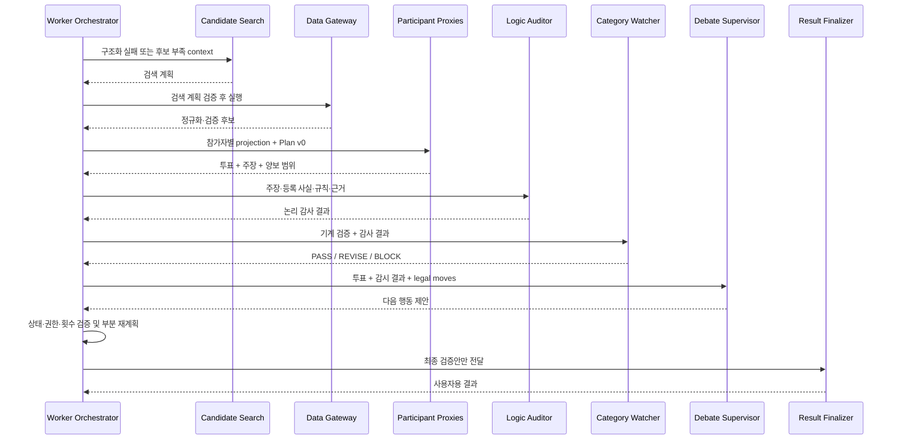

# Agent 구현 가이드

> 상태: 6개 역할·실제 Codex Gateway·Worker 상태머신 구현 완료
> 범위: `packages/agents`, `apps/codex-runtime-gateway`, `apps/worker`
> 제외: 실제 Provider API, SQS/RDS adapter, ECS 인프라 프로비저닝

## 1. 구현된 Agent

| 역할 | 입력 | 출력 | 하지 않는 일 |
| --- | --- | --- | --- |
| Participant Proxy | 본인 프로필, 정규화 일정안, 근거 | 구조화 투표, 양보 범위, 검증용 주장 | 타인 원본 조회, 점수 계산, 최종 결정 |
| Candidate Search | 비정형 요구, 정규 제약, 허용 완화 | Data Gateway용 검색 계획 | 외부 API 호출, 후보 확정 |
| Logic Auditor | 전제 사실, 규칙, 결론, 근거 | 주장별 VALID/INVALID/NEEDS_EVIDENCE | 새 사실·규칙 생성, 승자 선택 |
| Category Watcher | 기계 검증, 논리 감사, 분야 일정안 | PASS/REVISE/BLOCK | 후보 조달, 일정안 선택 |
| Debate Supervisor | 투표, 감시 결과, legal moves | 다음 토론 행동 | 점수 계산, 최종 일정 확정 |
| Result Finalizer | 검증 완료 일정, 개인별 결과, 근거 | 사용자용 일정·양보·경고·출처 | 새 후보·가격 생성, 검증 승격 |

`Orchestrator`는 Agent가 아니라 Worker의 결정론적 코드다. `apps/worker`가 호출 순서, 반복 상한, legal move, 사용자 확인 대기·재개, 멱등 저장과 최종 반영 권한을 담당한다. 점수·예산·시간 계산은 Agent 입력 전의 기계 검증 결과로 주입한다.

## 2. 파일 지도

```text
packages/agents/
├─ moa_agents/
│  ├─ models.py              공통 모델과 6개 strict Pydantic 입출력 계약
│  ├─ specs.py               AgentSpec 6개와 최소권한·모델 프로필
│  ├─ prompts.py             실행용 prompt registry
│  ├─ handlers.py            LLM 없이 재현 가능한 역할별 동작
│  ├─ registry.py            spec·prompt·schema·handler registry
│  ├─ privacy.py             금지 context key 검사
│  ├─ projections.py         Participant Proxy 최소 context 투영
│  ├─ runtime.py             Fixture/Codex Runtime과 Gateway port
│  ├─ fixtures.py            종단 예시 데이터
│  └─ simulator.py           6개 Agent 전달 순서 시뮬레이션
├─ prompts/<role>/v1.md       개발자 검토용 버전 프롬프트
├─ tests/test_agents.py       계약·권한·개인정보·repair·종단 테스트
└─ pyproject.toml             Python 3.12·Pydantic·pytest 설정

apps/codex-runtime-gateway/
├─ moa_codex_gateway/backend.py  공식 openai-codex SDK adapter
├─ service.py                    Auth·모델·schema·evidence 정책
├─ store.py                      run 멱등성과 thread 격리 저장소
└─ app.py                        localhost AgentRun HTTP API

apps/worker/
├─ moa_worker/orchestrator.py    6개 Agent 결정론적 상태 머신
├─ store.py                      Job·사용자 대기 상태 저장소
└─ app.py                        제출·조회·resume HTTP API
```

프롬프트의 실행 기준은 `moa_agents/prompts.py`, 사람의 리뷰 기준은 `prompts/*/v1.md`다. 프롬프트를 변경할 때는 둘을 같은 변경에서 수정하고 버전을 올린다. 운영 단계에서는 단일 prompt registry 저장소로 합쳐 중복을 제거한다.

## 3. 작동 순서



`run_demo_debate()`는 빠른 fixture 검증용이다. 실제 실행은 Worker가 Gateway를 통해 같은 순서를 수행하고, `REQUEST_REBUTTAL`·`PROPOSE_COMPROMISE`·`CALL_VOTE`는 최대 3회 안에서 다음 iteration으로 넘긴다. 운영 순서의 권위 문서는 [Agent 아키텍처](agent-architecture.md)다.

## 4. 로컬 실행

```powershell
python -m venv .venv
.\.venv\Scripts\Activate.ps1
python -m pip install --upgrade pip
python -m pip install -e "packages/agents[dev]"
python -m pip install -e "apps/codex-runtime-gateway[dev]"
python -m pip install -e "apps/worker[dev]"
python -m pip check
python -m pytest -q
# 또는 루트에서 전체 테스트
npm test
```

코드에서 Fixture Runtime을 호출하는 최소 예시는 다음과 같다.

```python
from moa_agents.runtime import AgentRunRequest, FixtureAgentRuntime, require_agent_output

runtime = FixtureAgentRuntime()
output = await require_agent_output(
    runtime,
    AgentRunRequest(role="PARTICIPANT_PROXY", input=participant_projection),
)
```

입력은 역할별 Pydantic `extra="forbid"` 계약을 통과해야 한다. 알 수 없는 필드, 금지된 인증·Provider 원본·민감 원문 key, 잘못된 출력은 fail-closed 처리된다.
Python 내부 필드명은 `snake_case`, TypeScript·HTTP JSON 경계는 alias를 적용한 `camelCase`다. 따라서 공통 계약과 통신할 때 별도 수동 key 변환을 하지 않는다.

## 5. ECS Codex 연결 경계

`CodexAgentRuntime`은 모델이나 Auth 파일을 직접 읽지 않는다. `HttpCodexGatewayClient`를 통해 Gateway만 호출한다.

```text
apps/worker
  → CodexAgentRuntime
    → HttpCodexGatewayClient
      → apps/codex-runtime-gateway
        → 공식 openai-codex SDK와 Gateway 전용 Codex Auth
          → 계정에 허용된 실제 모델
```

Gateway 요청에는 `AgentSpec`의 모델 프로필·reasoning effort·토큰/시간 상한·thread 정책과 버전 프롬프트가 포함된다. Gateway는 `model/list`를 기준으로 실제 모델을 해석해야 하며, 미지원이면 조용히 다른 모델을 쓰지 않고 오류를 반환한다. 이 저장소에는 아직 HTTP client와 Auth/model resolver가 없다.

출력 schema가 틀리면 같은 Gateway에 schema 오류를 붙여 한 번만 repair 요청한다. 두 번째도 실패하면 `OUTPUT_SCHEMA_ERROR`로 종료한다.

## 6. Worker가 지켜야 할 통합 계약

1. 설문 완료·날짜 교집합·필수조건 검사 전에는 Agent를 호출하지 않는다.
2. 계산 코드가 만든 후보 ID·점수·예산·이동시간만 projection에 넣는다.
3. Agent 출력의 ID는 Registry/Planning Graph에 실제 존재하는지 다시 검사한다.
4. `Logic Auditor` 결과를 기호 추론기와 PlanValidator 앞의 입력으로 사용한다.
5. `Supervisor.nextAction`은 제안이다. Worker가 legal move, 반복 횟수, 변경 권한을 다시 검증한다.
6. `USER_CONFIRMATION_REQUIRED`면 polling하지 말고 상태를 저장한 뒤 사용자 이벤트로 resume한다.
7. Finalizer에는 최종 검증을 통과한 일정만 전달한다.
8. Agent run에는 spec/prompt/schema version, 입력 hash, 출력, 모델, token usage를 감사 기록으로 남긴다. 시크릿과 민감 원문은 저장하지 않는다.

## 7. 현재 테스트가 보장하는 것

- 6개 AgentSpec의 역할 중복 없음과 schema 유효성
- 전 Agent `READ_ONLY + PROPOSE_ONLY + NEVER + 빈 tool allowlist`
- 6개 Agent가 참여하는 Fixture 토론 성공
- 타 참가자 원본·Auth·Provider 원본 projection 제외
- 민감·인증 key의 fail-closed 거부
- 필수·안전 조건 완화 검색 거부
- 보호 목적 누락 시 본인 확인 요청
- Codex 출력 schema repair 최대 1회
- Finalizer가 입력에 없는 후보 ID를 만들지 않음
- Pydantic의 알 수 없는 필드 거부와 중첩 privacy key 탐지

## 8. 남은 구현

Agent 자체 계약과 로컬 동작은 준비됐지만 제품 토론이 완료된 것은 아니다. 다음 순서로 연결한다.

1. `packages/core`: 만족도·목적급·예산·동선·필수조건 계산
2. `packages/data-gateway`: 검색 계획 실행, 정규화, 근거 저장
3. `apps/worker`: Orchestrator 상태머신과 부분 재계획
4. `apps/codex-runtime-gateway`: Codex Auth, model resolver, thread 저장
5. HTTP client를 구현한 `CodexGatewayClient`
6. 실제 모델 eval과 ECS 배포

실제 API·DB·Codex 없이도 현재 Fixture 테스트는 반복 재현 가능하다. 실제 모델을 연결해도 이 계약과 테스트를 우회해서는 안 된다.
