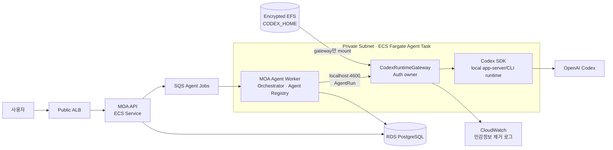
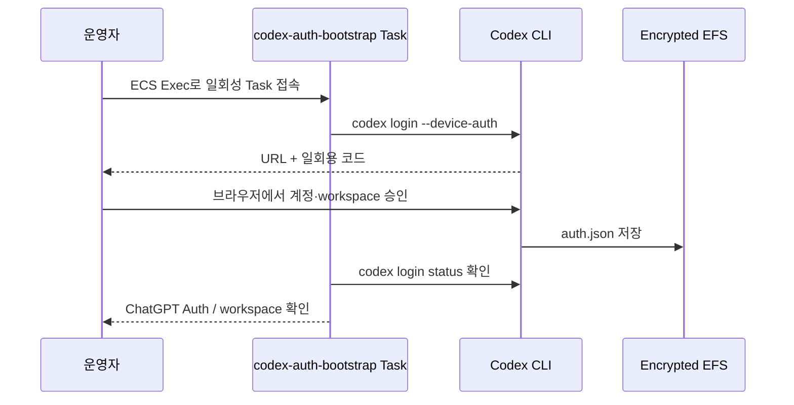
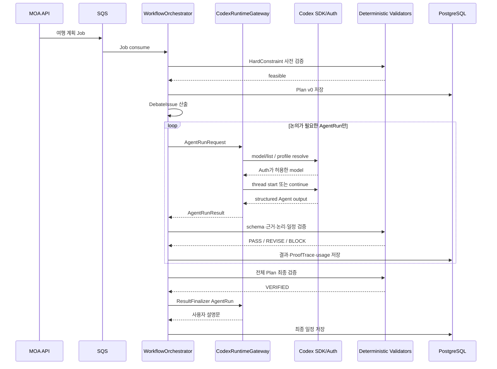

# ECS 기반 Codex Auth 에이전트 런타임 설계

- **문서 버전**: v1.0 / 2026-08-14
- **연계 문서**: [에이전트 아키텍처](agent-architecture.md) · [개발 및 배포 계획](development-and-deployment.md)
- **적용 범위**: MOA의 LLM 에이전트를 AWS ECS에서 실행하고, ECS에 로그인된 Codex Auth가 허용하는 모델을 사용하는 방법
- **핵심 결정**: 각 Agent가 인증 정보를 소유하지 않고, 인증 전용 `CodexRuntimeGateway`를 통해서만 Codex를 호출한다.

> 이 문서는 기존 EC2 배포안의 후속 ECS 배포안이다. ECS 전환이 확정되면 인증·LLM 런타임에 대해서는 이 문서를 우선 적용한다. 설문 점수, 하드 제약, Planning Graph, Agent 권한은 기존 상위 문서의 계약을 그대로 따른다.

---

## 1. 결론

MOA의 Agent는 모두 **논리적 역할**로 구현하고, 실제 모델 실행은 ECS Task 안의 단일 `CodexRuntimeGateway`가 담당한다.

```text
ParticipantProxyAgent ─┐
DebateSupervisorAgent ─┤
CategoryWatcherAgent  ─┤
CandidateSearchAgent  ─┼─ AgentRun 요청 ─▶ CodexRuntimeGateway ─▶ Codex SDK
LogicAuditorAgent     ─┤                                      └▶ Codex Auth
ResultFinalizerAgent ──┘
```

반드시 지켜야 할 경계는 다음과 같다.

1. `auth.json` 또는 Codex access token은 `CodexRuntimeGateway` 컨테이너만 접근한다.
2. Agent, API, Worker, 프롬프트, 로그에는 인증 토큰을 전달하지 않는다.
3. Agent마다 Codex thread를 분리한다. 참가자 Proxy끼리 thread를 공유하지 않는다.
4. 사용 모델은 하드코딩하지 않고, 로그인된 Auth 기준 `model/list` 결과에서 선택한다.
5. Auth 또는 요청 모델을 사용할 수 없으면 fail-closed 한다. 다른 계정이나 모델로 조용히 폴백하지 않는다.
6. 일정 계산, 점수, 하드 제약, 논리 검증은 기존대로 결정론적 코드가 최종 판정한다.

---

## 2. 왜 이 구조를 사용하는가

Codex는 ChatGPT 로그인과 API 키 로그인을 지원한다. ChatGPT 로그인으로 실행한 Codex는 해당 ChatGPT identity와 workspace에 허용된 Codex 모델 및 정책을 따른다. 따라서 이 설계에서 말하는 “Auth의 모델”은 **ChatGPT 웹 모델 선택기의 모델 전체**가 아니라, **현재 Codex 클라이언트와 로그인된 identity에 실제로 허용된 모델**이다.

공식 문서는 자동화의 기본값으로 API 키를 권장한다. 다만 trusted runner에서 ChatGPT-managed Codex 접근이 반드시 필요한 경우, 저장된 Codex 인증이나 Enterprise용 Codex access token을 사용할 수 있다. 이 프로젝트 요구사항은 후자에 해당하므로 다음 조건을 전제로 한다.

- 내부 MVP 또는 신뢰된 비공개 서비스에서만 사용한다.
- 인증 계정을 불특정 사용자가 직접 조작할 수 있는 범용 Codex 프록시로 노출하지 않는다.
- ChatGPT workspace 정책과 계정 사용 조건을 운영 전에 확인한다.
- Enterprise workspace라면 브라우저 세션 복제보다 Codex access token을 우선한다.

### 2.1 사용하지 않는 방식

| 방식 | 사용하지 않는 이유 |
| --- | --- |
| Agent마다 `auth.json` 복사 | 토큰 유출 면적, 갱신 충돌, 계정 추적 불가가 커진다. |
| Agent마다 Codex CLI 프로세스와 인증 볼륨 보유 | 동일 계정의 동시성·rate limit·thread 관리가 분산된다. |
| 프론트엔드에서 Codex 직접 호출 | 인증 토큰이 사용자 환경으로 노출되고 권한 통제가 불가능하다. |
| OpenAI Agents SDK가 Codex Auth를 자동 상속한다고 가정 | Agents SDK의 인증과 로컬 Codex Auth는 별도 경계다. |
| 원격 `codex app-server` WebSocket을 외부 서비스로 직접 노출 | 공식 문서상 WebSocket transport는 experimental이며 production 지원 대상이 아니다. |

---

## 3. 권장 ECS 토폴로지

MVP에서는 `moa-agent-worker`와 `codex-runtime-gateway`를 **같은 ECS Fargate Task의 sidecar 구조**로 둔다. 두 컨테이너는 `localhost`로만 통신하며, 서비스의 `desiredCount`는 1로 시작한다.



### 3.1 ECS Service 구성

| Service / Task | 컨테이너 | 역할 | Auth 접근 |
| --- | --- | --- | --- |
| `moa-api-service` | `moa-api` | 사용자 인증, 방·설문·결과 API | 없음 |
| `moa-agent-service` | `moa-agent-worker` | 결정론 Orchestrator, Agent 순서·상태·검증 | 없음 |
| `moa-agent-service` | `codex-runtime-gateway` | Codex SDK 실행, 모델 조회, thread 관리 | **있음** |
| 관리용 one-off Task | `codex-auth-bootstrap` | 최초 로그인 또는 access token 등록 | 일시적 |

### 3.2 MVP에서 같은 Task로 묶는 이유

- Gateway endpoint를 VPC 전체에 열지 않고 `localhost`로 제한할 수 있다.
- Auth 볼륨을 sidecar 하나에만 mount할 수 있다.
- Worker와 Gateway의 배포 버전이 항상 일치한다.
- 캠프 규모에서는 단일 계정 동시성 제어가 수평 확장보다 중요하다.

### 3.3 확장 시 분리 조건

다음 조건 중 하나가 발생하면 `CodexRuntimeGateway`를 별도 private ECS Service로 분리한다.

- 동시에 실행해야 하는 여행 방이 3개 이상이다.
- 계정 또는 workspace를 여러 개 운영해야 한다.
- 한 Task 장애가 전체 AgentRun을 중단시키는 문제가 반복된다.
- Auth별 rate limit과 공정한 큐잉을 독립적으로 관리해야 한다.

분리 후에도 `Auth 1개 = Runtime Pool 1개` 경계는 유지한다. 하나의 `auth.json`을 여러 writable Task가 동시에 갱신하지 않는다.

---

## 4. 런타임 컴포넌트

### 4.1 `WorkflowOrchestrator` — 비LLM 코드

기존 설계와 동일하게 상태 머신과 최종 실행 권한을 가진다.

```text
LegalMove 계산
→ 실행할 Agent 결정
→ AgentRun 생성
→ Gateway 호출
→ 출력 스키마 검증
→ EvidenceGuard / SymbolicReasoner / PlanValidator
→ 상태 반영 또는 재시도
```

오케스트레이터는 모델 응답을 사실로 간주하지 않는다. Agent가 만든 결과는 제안이며, 코드 검증을 통과한 값만 Planning Graph에 반영한다.

### 4.2 `AgentRegistry` — Agent 역할 계약

각 Agent를 별도 서버로 배포하지 않고 [`AgentSpec` 공통 명세](agent-spec.md)를 만족하는 역할로 등록한다. 아래 코드는 구조를 요약한 것이며, 필드·검증 규칙·정식 Zod 스키마는 공통 명세를 따른다.

```ts
type AgentSpec = {
  role:
    | "PARTICIPANT_PROXY"
    | "DEBATE_SUPERVISOR"
    | "CATEGORY_WATCHER"
    | "CANDIDATE_SEARCH"
    | "LOGIC_AUDITOR"
    | "RESULT_FINALIZER";
  promptVersion: string;
  outputSchemaVersion: string;
  modelProfile: "FAST" | "BALANCED" | "DEEP_REASONING";
  preferredReasoningEffort: string;
  maxTurns: number;
  maxOutputTokens: number;
  timeoutMs: number;
  privacyScope: "PARTICIPANT" | "CATEGORY" | "TRIP";
  allowedTools: string[];
  sandbox: "READ_ONLY";
};
```

`AgentSpec`은 모델 이름 대신 `modelProfile`을 가진다. 실제 모델은 Gateway의 `ModelResolver`가 현재 Auth의 카탈로그를 기준으로 결정한다.

### 4.3 `CodexRuntimeGateway` — 유일한 Auth 소유자

Gateway의 책임은 다음으로 제한한다.

- Codex SDK와 로컬 Codex runtime 시작·종료
- 현재 인증 방식과 workspace 상태 확인
- `model/list` 조회 및 `ModelProfile` 해석
- Agent별 thread 생성·재개·폐기
- 요청 동시성, timeout, token usage 기록
- 출력 JSON parsing과 기본 schema validation
- 인증 오류와 모델 권한 오류의 명시적 분류

Gateway가 하면 안 되는 일:

- 설문 점수 계산
- 후보 일정 선택
- 하드 제약 완화
- 참가자 취향 변경
- 검증되지 않은 Agent 결과의 DB 반영
- 임의 모델 폴백

### 4.4 Codex SDK 선택

애플리케이션 통합에는 Node 18+에서 동작하는 `@openai/codex-sdk`를 사용한다. SDK가 로컬 Codex runtime을 제어하도록 하고, SDK나 app-server의 stdio 연결은 Gateway 컨테이너 내부에만 둔다.

```text
Worker ─ HTTP localhost ─▶ Gateway ─ Codex SDK ─ stdio ─▶ local Codex runtime
```

`codex app-server --listen ws://0.0.0.0:...` 형태로 VPC에 직접 노출하지 않는다.

---

## 5. 인증 설계

### 5.1 인증 모드 우선순위

| 우선순위 | 모드 | 적용 대상 | 운영 판단 |
| ---: | --- | --- | --- |
| 1 | Codex access token | ChatGPT Enterprise trusted automation | 가장 권장 |
| 2 | ChatGPT device login + `auth.json` | 개인/팀 내부 MVP | advanced 방식, 제한적 사용 |
| 3 | 로컬 로그인 후 `auth.json` secure seed | device login 불가 시 | 임시 fallback |
| 제외 | Platform API key | “Codex Auth 계정 사용” 요구와 다름 | 별도 전환안에서만 사용 |

Enterprise의 Codex access token은 trusted, non-interactive local workflow를 위해 제공된다. 해당 권한을 사용할 수 없다면 headless 환경에서 `codex login --device-auth`를 사용한다.

### 5.2 `CODEX_HOME` 저장

```text
/var/lib/moa-codex/
├─ auth.json       # 토큰 포함, 0600
├─ config.toml     # 로그인 방식 및 runtime 설정
└─ sessions/       # 필요한 경우에만 유지
```

ECS 설정:

- EFS encryption at rest 활성화
- 전용 EFS Access Point 사용
- Gateway의 non-root UID만 접근
- 디렉터리 `0700`, `auth.json` `0600`
- `CODEX_HOME=/var/lib/moa-codex`
- `cli_auth_credentials_store = "file"`
- `forced_login_method = "chatgpt"`
- managed workspace라면 `forced_chatgpt_workspace_id`도 고정
- Worker 컨테이너에는 해당 volume을 mount하지 않음

ChatGPT 로그인 토큰은 사용 중 자동 갱신되므로 `auth.json`을 read-only Secret으로만 주입하면 안 된다. Codex가 같은 파일을 갱신하고 다음 Task도 갱신된 파일을 읽을 수 있도록 **writable encrypted EFS**에 유지한다.

### 5.3 최초 로그인



Enterprise access token을 쓰는 경우에는 ECS 시작 시 Secrets Manager에서 값을 가져와 Gateway 프로세스에 장기 환경변수로 노출하지 않는다. bootstrap 프로세스가 `codex login --with-access-token`에 stdin으로 전달해 Codex credential store에 등록한 후 메모리에서 폐기한다.

### 5.4 재인증과 장애 상태

| 상태 | 의미 | 처리 |
| --- | --- | --- |
| `AUTH_READY` | 인증과 모델 조회 성공 | AgentRun 수락 |
| `AUTH_REFRESHING` | 토큰 갱신 중 | 신규 run 잠시 대기 |
| `AUTH_REQUIRED` | 만료·회수·workspace 불일치 | 신규 run 차단, 운영자 알림 |
| `AUTH_FORBIDDEN` | 계정은 유효하나 Codex/모델 권한 없음 | 요청 실패, 설정 확인 |
| `AUTH_MISCONFIGURED` | 파일 권한·workspace 강제 설정 오류 | Task unhealthy 처리 |

인증 실패 시 API key나 다른 계정으로 자동 폴백하지 않는다. 예약·비용이 걸린 일정 서비스에서는 어느 identity로 결론을 만들었는지가 감사 기록의 일부다.

---

## 6. Auth 기반 모델 선택

### 6.1 모델 카탈로그 동기화

Gateway 시작 시 Codex app-server의 `model/list`를 호출한다.

```json
{
  "method": "model/list",
  "id": 6,
  "params": {
    "limit": 100,
    "includeHidden": false
  }
}
```

다음 값만 저장한다.

```ts
type AuthModelCapability = {
  model: string;
  displayName: string;
  isDefault: boolean;
  supportedReasoningEfforts: string[];
  defaultReasoningEffort: string;
  inputModalities: string[];
  catalogFetchedAt: string;
  authFingerprint: string; // 원본 token이 아닌 비가역 식별값
};
```

카탈로그는 다음 시점에 갱신한다.

- Gateway 시작
- 인증 갱신 성공 후
- `MODEL_NOT_AVAILABLE` 발생 후
- 운영 TTL 경과 후

### 6.2 `ModelProfile` 해석

운영 설정에는 Agent 목적을 기록하고 특정 모델 이름은 별도 allowlist에서 관리한다.

```yaml
modelProfiles:
  FAST:
    allowedModels: ["<운영 승인 fast model>"]
    preferredEffort: low
  BALANCED:
    allowedModels: ["<운영 승인 balanced model>"]
    preferredEffort: medium
  DEEP_REASONING:
    allowedModels: ["<운영 승인 reasoning model>"]
    preferredEffort: high
```

선택 알고리즘:

```text
1. model/list 결과에서 picker-visible 모델만 취합
2. AgentSpec.modelProfile의 운영 allowlist와 교집합 계산
3. 요청 reasoning effort가 해당 모델에서 지원되는지 확인
4. 우선순위가 가장 높은 모델 선택
5. 교집합이 없으면 MODEL_PROFILE_UNSATISFIED
6. 모델을 명시해 thread 시작
```

`model/list`의 `isDefault`는 초기 기본값을 정하는 참고값일 뿐, 보안·품질 정책을 우회하는 근거로 쓰지 않는다.

### 6.3 Agent별 기본 Profile

| Agent | 기본 Profile | 이유 |
| --- | --- | --- |
| `ParticipantProxyAgent` | `BALANCED` | 개인 선호를 보존하며 조건부 양보안을 만들어야 함 |
| `DebateSupervisorAgent` | `DEEP_REASONING` | 충돌축, 발언 순서, 절충안의 전체 일관성 필요 |
| `CategoryWatcherAgent` | `BALANCED` | 분야 규칙에 따른 누락·위반 검토 |
| `CandidateSearchAgent` | `FAST` | 자유 입력 미해결·검증 후보 부족 시에만 검색 계획을 제안 |
| `LogicAuditorAgent` | `DEEP_REASONING` | 전제·규칙·결론 구조화와 누락 전제 탐지 |
| `ResultFinalizerAgent` | `BALANCED` | 검증된 결과만 자연어로 설명 |

실제 모델 이름은 현재 Auth, Codex client, workspace 정책에 따라 달라질 수 있으므로 문서에 영구 고정하지 않는다.

---

## 7. Agent thread 격리

### 7.1 Thread key

```ts
type AgentThreadKey = {
  tripId: string;
  planVersion: number;
  role: AgentSpec["role"];
  participantId?: string;
  debateIssueId?: string;
  category?: string;
};
```

동일한 `AgentThreadKey`에 대해서만 기존 thread를 재개한다.

```text
Proxy A  = trip-1 / plan-v2 / PARTICIPANT_PROXY / participant-A / issue-hotel-location
Proxy B  = trip-1 / plan-v2 / PARTICIPANT_PROXY / participant-B / issue-hotel-location
숙소 감시자 = trip-1 / plan-v2 / CATEGORY_WATCHER / accommodation
```

Proxy A와 Proxy B는 같은 여행을 다루더라도 thread를 공유하지 않는다. 같은 Proxy도 서로 다른 `debateIssueId`에서는 thread를 공유하지 않는다. Supervisor는 개인 원본 설문이 아니라 오케스트레이터가 만든 최소 공개 `DebateStatement`만 받는다. 다른 쟁점에서 확정된 선호 미반영은 thread 대화가 아니라 코드의 `PreferenceLossLedger`에서 현재 쟁점에 필요한 항목만 주입한다.

### 7.2 Plan version 변경

- 영향을 받지 않는 사실만 새 thread context에 다시 투영한다.
- 오래된 thread는 `STALE`로 표시하고 재사용하지 않는다.
- 예약·가격·영업시간처럼 TTL이 있는 근거는 thread 기억을 신뢰하지 않고 결정론적 Data Gateway에서 다시 조회한다.
- thread는 대화 편의를 위한 상태이지 진실의 저장소가 아니다. 진실의 저장소는 DB의 검증된 record다.

---

## 8. AgentRun 내부 API

Worker와 Gateway는 같은 Task의 localhost에서 다음 계약으로 통신한다.

### 8.1 요청

```http
POST /internal/v1/agent-runs
Content-Type: application/json
```

```ts
type AgentRunRequest = {
  runId: string;
  tripId: string;
  planVersion: number;
  agent: {
    role: AgentSpec["role"];
    instanceId: string;
    participantId?: string;
    debateIssueId?: string;
    category?: string;
    promptVersion: string;
    outputSchemaVersion: string;
  };
  thread: {
    mode: "NEW" | "CONTINUE";
    threadId?: string;
  };
  modelProfile: "FAST" | "BALANCED" | "DEEP_REASONING";
  input: {
    instruction: string;
    context: unknown;
    evidenceIds: string[];
  };
  limits: {
    timeoutMs: number;
    maxOutputTokens: number;
  };
};
```

### 8.2 응답

```ts
type AgentRunResult = {
  runId: string;
  status:
    | "SUCCEEDED"
    | "AUTH_REQUIRED"
    | "MODEL_NOT_AVAILABLE"
    | "RATE_LIMITED"
    | "TIMED_OUT"
    | "INVALID_OUTPUT"
    | "FAILED";
  authContext: {
    loginMethod: "CHATGPT" | "CODEX_ACCESS_TOKEN";
    workspaceIdHash?: string;
    authFingerprint: string;
  };
  modelContext?: {
    model: string;
    reasoningEffort: string;
    catalogFetchedAt: string;
  };
  threadId?: string;
  output?: unknown;
  usage?: {
    inputTokens?: number;
    cachedInputTokens?: number;
    outputTokens?: number;
  };
  error?: {
    code: string;
    retryable: boolean;
    safeMessage: string;
  };
};
```

`authFingerprint`와 `workspaceIdHash`는 같은 인증 경계에서 실행되었는지 감사하기 위한 값이다. 원본 account ID, email, token은 저장하지 않는다.

### 8.3 출력 검증

```text
Codex 응답
→ JSON parse
→ Agent별 JSON Schema
→ 허용된 evidenceId인지 확인
→ EvidenceGuard
→ ArgumentPrecheck
   ├─ READY: SymbolicReasoner로 바로 전달
   ├─ NEEDS_STRUCTURING: LogicAuditorAgent 호출 후 SymbolicReasoner로 전달
   └─ REJECTED: 결과 폐기 또는 근거 재요청
→ CategoryWatcherAgent가 분야 규칙 검사
→ PlanValidator가 일정 실행 가능성 검사
→ 통과한 값만 상태 반영
```

파싱 또는 schema validation 실패 시 같은 thread에 오류와 요구 schema를 전달해 1회 repair한다. 두 번째 실패는 `INVALID_OUTPUT`으로 종료한다.

`LogicAuditorAgent`는 `MISSING_PREMISE`, `MULTIPLE_RULE_MATCHES`, `INCOMPLETE_BINDING`, `UNRESOLVED_ENTITY`에만 호출한다. 잘못된 ID, 만료 근거, 권한 위반, 하드 제약 위반처럼 코드가 확정할 수 있는 오류에는 호출하지 않는다.

---

## 9. 전체 실행 순서



---

## 10. 보안 통제

### 10.1 컨테이너

- Gateway는 non-root 사용자로 실행한다.
- root filesystem은 read-only로 설정한다.
- writable 경로는 `/tmp`와 전용 EFS Access Point만 허용한다.
- 여행 애플리케이션 저장소를 Gateway에 mount하지 않는다.
- Agent thread는 기본 `READ_ONLY` sandbox로 실행한다.
- shell, 파일 수정, 임의 네트워크 도구는 허용하지 않는다.
- CandidateSearch는 Codex의 임의 인터넷 접근이 아니라 MOA Data Gateway가 노출한 typed tool만 사용한다. 실제 API 키와 HTTP 호출은 ECS의 Provider Connector가 담당한다.
- Provider API 키는 Secrets Manager에서 Connector Task에만 주입한다. Codex Auth credential과 외부 Provider credential은 서로 다른 secret·IAM 권한·로그 마스킹 정책으로 격리하며, 모델 컨텍스트에는 어느 쪽의 비밀값도 전달하지 않는다.

### 10.2 네트워크

- Agent Task는 private subnet에 둔다.
- public IP를 부여하지 않는다.
- NAT 또는 egress proxy를 통해 필요한 OpenAI endpoint만 호출한다.
- Gateway 포트 `4600`은 container localhost에서만 수신한다.
- RDS, SQS, EFS 접근은 Task Role과 Security Group으로 최소화한다.

### 10.3 로그

다음 값은 로그에 남기지 않는다.

```text
auth.json 내용
Authorization header
access token / refresh token
사용자 email·account 원본 식별자
전체 개인 설문
알레르기·건강정보 원문이 포함된 프롬프트
```

다음 값만 운영 로그에 남긴다.

```text
runId, tripId, role, promptVersion, outputSchemaVersion
authFingerprint, model, reasoningEffort
startedAt, latencyMs, status, retryCount
token usage, errorCode, validationStatus
```

### 10.4 계정 악용 방지

- 외부 사용자가 자유 형식 Codex prompt를 Gateway에 전달할 수 없게 한다.
- 요청은 `AgentSpec`에 등록된 role과 version만 허용한다.
- `context` 크기와 필드를 서버가 projection한다.
- 방별, 사용자별, 분당 AgentRun 상한을 둔다.
- 전체 token budget과 wall-clock budget을 `RuntimeGovernor`가 집행한다.
- 프롬프트 인젝션으로 tool allowlist와 sandbox를 변경할 수 없게 런타임 설정을 코드에서 강제한다.

---

## 11. 동시성, 비용, rate limit

MVP의 기본값:

```yaml
ecsDesiredCount: 1
gatewayMaxConcurrentRuns: 2
perTripMaxConcurrentRuns: 1
perParticipantProxyConcurrency: 1
agentRunTimeoutSec: 120
roundRerunCap: 2
globalRecalcCap: 3
```

Proxy Agent N개를 모두 무제한 병렬 호출하지 않는다. 데이터 준비는 병렬화할 수 있지만, 하나의 Auth에 대한 모델 호출은 Gateway semaphore로 제한한다.

우선순위 큐:

```text
P0 인증·안전·하드 제약 검증
P1 현재 토론 라운드의 Proxy / Watcher / Auditor
P2 최종 검증·Finalizer
P3 후보 확장·설명 개선
```

ChatGPT-managed access는 Platform API의 달러 과금 모델과 동일하다고 가정하지 않는다. `usage`가 제공되면 token을 기록하고, 계정 rate limit 오류와 실행 횟수를 별도 지표로 관리한다.

---

## 12. 실패 처리

| 오류 | 재시도 | 상태 처리 |
| --- | ---: | --- |
| `AUTH_REQUIRED` | 0 | 전체 신규 AgentRun 차단, 운영자 재로그인 요청 |
| `AUTH_FORBIDDEN` | 0 | workspace/seat/RBAC 확인 |
| `MODEL_NOT_AVAILABLE` | 카탈로그 재조회 1회 | 계속 없으면 해당 profile 차단 |
| `RATE_LIMITED` | 지수 backoff + jitter, 최대 2회 | Job을 queue로 반환 |
| `TIMED_OUT` | 1회 | context 축약 후 재시도 |
| `INVALID_OUTPUT` | repair 1회 | 실패 시 Agent 결과 폐기 |
| Codex runtime crash | Task 내 1회 재시작 | 반복 시 ECS health check 실패 |
| EFS read/write 실패 | 0 | Auth 갱신 불가이므로 fail-closed |

사용자 결정 대기는 런타임 재시도로 처리하지 않는다. Orchestrator가 `PendingDecision(AWAITING_USER)`을 DB에 저장하고 AgentRun을 종료하며, 사용자 응답 이벤트가 들어올 때만 새 SQS Job을 생성한다. 복귀 시 전체 thread를 계속 이어 붙이지 않고 해당 `debateIssueId`의 새 plan version thread를 시작한다.

절대 자동으로 하지 않는 폴백:

- API key로 전환
- 다른 ChatGPT 계정으로 전환
- allowlist 밖의 모델 선택
- 낮은 품질 모델로 결과를 생성한 뒤 정상 결과처럼 표시
- 이전 thread의 미검증 답변 재사용

---

## 13. 저장 데이터

### 13.1 `agent_runs`

```sql
agent_runs (
  run_id,
  trip_id,
  plan_version,
  agent_role,
  agent_instance_id,
  participant_id,
  category,
  thread_id,
  prompt_version,
  output_schema_version,
  auth_fingerprint,
  workspace_id_hash,
  model,
  reasoning_effort,
  status,
  input_tokens,
  cached_input_tokens,
  output_tokens,
  latency_ms,
  retry_count,
  error_code,
  created_at,
  completed_at
)
```

### 13.2 저장하지 않는 데이터

- Auth token과 refresh token
- `auth.json` 원문
- Agent의 숨은 reasoning 원문
- 개인 설문 전체를 복제한 prompt dump
- 모델 응답을 검증 없이 canonical plan에 저장한 값

설명 가능성은 모델의 숨은 reasoning을 저장해서 확보하지 않는다. 기존 설계의 `EvidenceRecord → FactRecord → LogicRule → ProofTrace → Decision` 연결로 확보한다.

---

## 14. ECS 배포 설정 개요

```yaml
moa-agent-task:
  networkMode: awsvpc
  cpu: 2048
  memory: 4096
  desiredCount: 1
  containers:
    - name: moa-agent-worker
      essential: true
      authVolume: false
      environment:
        CODEX_GATEWAY_URL: http://127.0.0.1:4600
    - name: codex-runtime-gateway
      essential: true
      user: "10001"
      readonlyRootFilesystem: true
      authVolume: /var/lib/moa-codex
      environment:
        CODEX_HOME: /var/lib/moa-codex
        CODEX_GATEWAY_PORT: "4600"
        CODEX_MAX_CONCURRENCY: "2"
  volumes:
    - name: codex-auth
      type: efs
      encrypted: true
      accessPoint: moa-codex-auth
```

실제 ECS Task Definition에서는 다음도 추가한다.

- Gateway health check: process, local endpoint, Auth 상태를 구분
- `dependsOn`: Gateway `HEALTHY` 후 Worker 시작
- graceful shutdown: 신규 run 중단 → 진행 중 run 완료/timeout → thread metadata flush
- deployment circuit breaker 활성화
- CloudWatch log group 분리
- EFS mount target을 private subnet별로 생성
- Task Role과 Task Execution Role 분리

Rolling deployment 때 두 Gateway가 같은 Auth 파일을 동시에 갱신하지 않도록 한다. MVP에서는 새 Task가 뜨기 전에 기존 Task를 drain하는 단일 writer 배포를 사용한다.

---

## 15. 구현 순서

### Phase 0 — Auth·모델 PoC

- [ ] 로컬 Docker에서 `CODEX_HOME` 분리
- [ ] ChatGPT device login 또는 Codex access token 등록
- [ ] `codex login status` 확인
- [ ] app-server `model/list` 결과 확인
- [ ] 허용 모델로 thread 생성·재개
- [ ] 토큰 자동 갱신 후 `auth.json` 변경과 재사용 확인

### Phase 1 — Gateway

- [x] `apps/codex-runtime-gateway` 생성
- [x] Codex SDK wrapper 구현
- [x] `ModelCatalog` / `ModelResolver` 구현
- [x] `ThreadRegistry` 구현
- [x] `/internal/v1/agent-runs` 구현
- [x] JSON Schema validation과 error taxonomy 구현
- [x] 로그 redaction test 구현

### Phase 2 — Agent 연결

- [x] `packages/agents`의 `AgentSpec` 통합
- [x] Proxy별 thread 격리
- [x] Supervisor / Watcher / Auditor 순서 연결
- [x] Agent 출력 evidence allowlist 검증 연결
- [x] Finalizer가 `VERIFIED`·필수조건 통과 계획만 받는 경계 구현

### Phase 3 — ECS

- [ ] EFS + KMS + Access Point
- [ ] auth bootstrap one-off Task
- [ ] Worker + Gateway sidecar Task Definition
- [ ] private subnet / NAT 또는 egress proxy
- [ ] SQS retry / DLQ
- [ ] CloudWatch metric·alarm
- [ ] 단일 writer rolling deployment 검증

### Phase 4 — 운영 검증

- [ ] Auth revoke 시 모든 신규 run 차단
- [ ] 모델 제거 시 `MODEL_PROFILE_UNSATISFIED`
- [ ] Proxy A/B context 유출 없음
- [ ] rate limit backoff와 queue 복귀
- [ ] Gateway crash 후 진행 중 run 중복 반영 없음
- [ ] EFS 장애 시 fail-closed
- [ ] 인증·개인정보가 로그에 남지 않음

---

## 16. 필수 테스트

| ID | 시나리오 | 기대 결과 |
| --- | --- | --- |
| `AUTH-01` | Gateway 외 컨테이너에서 `/var/lib/moa-codex` 접근 | 접근 불가 |
| `AUTH-02` | ChatGPT 세션 revoke | `AUTH_REQUIRED`, 신규 AgentRun 0건 |
| `AUTH-03` | 강제 workspace와 Auth workspace 불일치 | Task unhealthy, 실행 차단 |
| `AUTH-04` | token refresh 이후 Task 재시작 | 갱신된 EFS 인증으로 재개 |
| `MODEL-01` | allowlist 모델이 `model/list`에 없음 | `MODEL_PROFILE_UNSATISFIED` |
| `MODEL-02` | 지원하지 않는 reasoning effort 요청 | 실행 전 거부 또는 승인된 effort로 명시적 재해석 |
| `MODEL-03` | 모델 카탈로그 변경 | TTL 또는 오류 후 다시 동기화 |
| `THREAD-01` | Proxy A와 B 동시 실행 | 서로 다른 thread ID |
| `THREAD-02` | plan version 증가 | 이전 thread `STALE`, 새 thread 생성 |
| `OUTPUT-01` | 잘못된 JSON 반환 | repair 1회 후 실패 시 결과 폐기 |
| `SEC-01` | prompt로 sandbox 변경 요청 | 무시, `READ_ONLY` 유지 |
| `SEC-02` | CloudWatch에서 token 패턴 검색 | 0건 |
| `OPS-01` | 같은 SQS job 중복 수신 | `runId` idempotency로 1회만 반영 |
| `OPS-02` | Gateway 실행 중 crash | 미완료 run 실패 처리, plan 미반영 |

---

## 17. 결정이 필요한 항목

| # | 항목 | 권장안 |
| ---: | --- | --- |
| 1 | Auth 종류 | Enterprise면 Codex access token, 아니면 device login 기반 MVP |
| 2 | ECS 런치 타입 | Fargate |
| 3 | 초기 동시성 | Gateway 2, 여행 방별 1 |
| 4 | 모델 profile별 allowlist | 배포 시 `model/list` 실측 후 확정 |
| 5 | session 보존 기간 | 여행 종료 후 7일 이내 삭제 |
| 6 | ECS 전환 시 기존 EC2 문서 처리 | 실제 배포 결정 후 ECS 기준으로 문서 통합 |

---

## 18. 공식 문서 근거

- [Codex Authentication](https://learn.chatgpt.com/docs/auth): ChatGPT/API key 로그인, credential 저장, 자동 token refresh, headless device login, Codex access token
- [Codex SDK](https://learn.chatgpt.com/docs/codex-sdk): 애플리케이션에서 local Codex thread 시작·재개·resume
- [Codex App Server](https://learn.chatgpt.com/docs/app-server): JSON-RPC, thread primitives, `model/list`, 모델 capability, WebSocket production 제한
- [Codex Non-interactive mode](https://learn.chatgpt.com/docs/non-interactive-mode): saved CLI auth 재사용, structured output, 자동화 보안 경계
- [Workspace model availability](https://learn.chatgpt.com/docs/enterprise/workspace-model-availability): 제품 surface와 인증 identity에 따른 모델 접근 경계

---

## 19. 최종 불변식

```text
[INV-AUTH-01] 인증 정보는 CodexRuntimeGateway만 소유한다.
[INV-AUTH-02] Agent는 Auth token을 입력·출력·로그로 받을 수 없다.
[INV-AUTH-03] 사용 모델은 현재 Auth의 model/list와 운영 allowlist의 교집합이다.
[INV-AUTH-04] Auth·workspace·모델 권한 오류는 fail-closed 한다.
[INV-AUTH-05] 참가자 Proxy thread는 참가자별로 격리한다.
[INV-AUTH-06] LLM 결과는 제안이며 결정론 검증 전에는 plan을 바꾸지 못한다.
[INV-AUTH-07] 인증 identity와 실행 모델의 비민감 fingerprint를 AgentRun마다 감사 기록한다.
[INV-AUTH-08] 같은 auth.json에는 writable Gateway를 동시에 하나만 둔다.
[INV-AUTH-09] Codex thread 기억은 근거 DB와 ProofTrace를 대체하지 않는다.
[INV-AUTH-10] 외부 사용자가 범용 Codex proxy처럼 Gateway를 호출할 수 없다.
```
