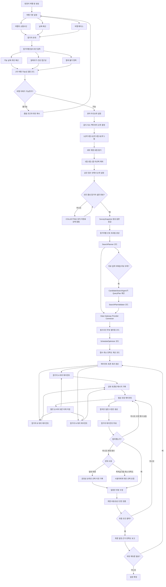
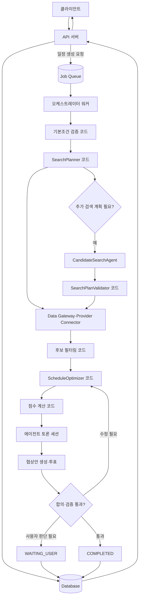

# 그룹 여행 설문·에이전트 토론 백엔드 설계

- 문서 버전: v0.1
- 작성일: 2026-08-13
- 목적: 참가자별 여행 취향을 수집하고, 대리 에이전트 간 토론을 통해 필수조건과 최소 만족도를 충족하는 그룹 여행 일정을 생성한다.

## 1. 서비스 목표

이 서비스는 다음 조건을 만족하는 그룹 여행 일정을 생성한다.

```text
필수조건 준수
+ 참가자별 최소 만족도 보장
+ 그룹 전체 만족도 극대화
+ 예산·동선·예약 가능성 충족
```

## 2. 전체 사용자·백엔드 플로우



## 3. 여행 기본 설정

방장은 다음 항목을 입력한다.

| 항목 | 내용 |
| --- | --- |
| 교통수단 | 비행기, 배, 기차 등 |
| 여행지 | 국가 선택 후 도시 선택 |
| 여행 페이스 | 휴식형, 평균형, 활동형 |
| 예산 | 총예산 및 예산 상한 |
| 날짜 | 가능한 여행 날짜 범위 |
| 여행 기간 | 방장이 제안하는 정확한 박수·일수 |

여행 페이스는 하루 기준 핵심 액티비티 수로 정의한다.

```text
휴식형: 하루 핵심 액티비티 1개
평균형: 하루 핵심 액티비티 2개
활동형: 하루 핵심 액티비티 3개
```

여행 기간은 방장이 제안하고 모든 활성 참가자가 확인하는 하드 설정이다.

```ts
type DurationAgreement = {
  version: number;
  nights: number;
  days: number;
  participantConfirmations: Record<string, boolean>;
  status: "PROPOSED" | "AGREED" | "REJECTED";
};
```

`days`는 항상 `nights + 1`이어야 하고, `AGREED`는 현재 활성 참가자 전원의 확인값이 `true`일 때만 가능하다. MVP에서는 참가자별 희망 박수나 `±1박 자동 유연성`을 수집하지 않는다.

### 3.1 설문 완료 게이트

후보 탐색, 일정 생성, 점수 계산, Proxy Agent 생성과 토론은 모든 활성 참가자가 설문을 제출하고 필수조건 검증을 통과한 뒤에만 시작한다.

```ts
type SurveyStatus = "DRAFT" | "INCOMPLETE" | "SUBMITTED" | "LOCKED";

const canStartPlanning = activeParticipants.every(
  (participant) =>
    participant.surveyStatus === "SUBMITTED" &&
    participant.constraintValidation === "VALID",
) && durationAgreement.status === "AGREED";
```

설문 제출에 필요한 항목:

- 가능 날짜와 개인 예산 상한
- 방장이 제안한 여행 기간 확인
- 안전·접근성 조건과 절대 불가 항목 확인
- `goalMode`; `CONTENT_DRIVEN`이면 하나 이상의 `purposeItems`
- 음식·숙소·액티비티 각각 `ANSWERED` 또는 `NO_PREFERENCE`

`canStartPlanning`이 거짓이면 시작 요청을 `409 SURVEY_INCOMPLETE`로 거부한다.

```json
{
  "code": "SURVEY_INCOMPLETE",
  "missingParticipants": [
    {
      "participantId": "B",
      "missingSections": ["AVAILABLE_DATES", "ACTIVITY_PREFERENCE"]
    }
  ]
}
```

방장에게는 참가자별 완료 여부와 미완료 섹션 이름만 제공하고 응답 내용은 공개하지 않는다. 미완료 참가자를 기본 페르소나로 대체하거나 자동 제외하지 않는다. 방장은 `작성 요청`, `마감 연장`, `이번 계획의 활성 참가자에서 명시적 제외` 중 하나를 선택한다. 제외 결정은 감사 로그에 남기고 해당 참가자의 제약과 취향을 전체 계산에서 제거한다.

모든 활성 참가자가 준비되면 원본 설문을 직접 참조하지 않고 불변 스냅샷을 만든다.

```ts
type SurveySnapshot = {
  snapshotId: string;
  tripId: string;
  version: number;
  activeParticipantIds: string[];
  requiredTripDays: number;
  durationAgreementVersion: number;
  responseVersions: Record<string, number>;
  inputHash: string;
  createdAt: string;
  status: "LOCKED";
};
```

```text
전원 SUBMITTED 및 필수조건 VALID + 여행 기간 AGREED
→ SurveySnapshot v1 생성
→ 참가자 설문 LOCKED
→ 1차 여행 가능성 검증
→ 후보 탐색과 Agent 파이프라인 시작
```

계획 시작 후 설문을 수정하면 기존 스냅샷을 덮어쓰지 않는다. 새 응답 버전과 `SurveySnapshot vN+1`을 만들고 영향받는 계획 노드만 `STALE`로 전환해 다시 계산한다. 여행 기간 변경은 기존 동의를 무효화하며, 방장이 새 기간을 제안하고 모든 활성 참가자가 다시 확인한 뒤 새 스냅샷을 생성한다.

## 4. 필수조건 처리

필수조건은 점수와 분리하여 관리한다.

- 가능한 날짜
- 개인별 예산 상한
- 음식 알레르기와 식이 제한
- 고소공포증 등 활동 제한
- 건강 및 접근성 조건
- 절대 불가 음식·활동·숙소·교통수단

검증은 두 번 수행한다.

### 4.1 1차 여행 가능성 검증

취향 조사 전에 여행 자체가 가능한지 확인한다.

- 참가자 날짜의 교집합 존재 여부
- 개인별 예산 상한 내 여행 가능 여부
- 교통수단과 여행지의 기본 가능 여부
- 건강·접근성 조건상 여행 가능 여부

날짜는 선호가 아니라 참여 가능성을 결정하는 하드 제약이다. `SurveySnapshot.activeParticipantIds` 전원의 가능 날짜 교집합 안에 여행 전체 기간이 포함되어야 한다.

```text
공통 가능 날짜
= 방의 검색 가능 날짜 범위
  ∩ activeParticipant A의 가능 날짜
  ∩ activeParticipant B의 가능 날짜
  ∩ ...
  ∩ activeParticipant N의 가능 날짜
```

```ts
const commonAvailability = intersectAvailability(
  snapshot.activeParticipantIds.map((id) => availabilityByParticipant[id]),
);

const feasibleWindows = findContiguousWindows(
  commonAvailability,
  requiredTripDays,
);
```

예를 들어 3박 4일 여행이면 전원이 가능한 연속 4일 구간만 후보가 된다. 한 명이라도 일부 날짜에 불가능하면 해당 구간은 후보에서 제거한다.

`feasibleWindows`가 비어 있으면 방을 `DATE_BLOCKED`로 전환하고 후보 탐색·일정 생성·Agent 토론을 시작하지 않는다. 시스템은 다음 조치만 제공한다.

1. 참가자들이 가능 날짜를 수정하고 새 설문 스냅샷 생성
2. 전원이 명시적으로 동의한 여행 기간 축소 후 새 스냅샷 생성
3. 방장이 특정 참가자를 활성 인원에서 명시적으로 제외한 후 새 스냅샷 생성
4. 방의 검색 가능 날짜 범위 변경

`N-1` 가능 구간, 최다 참석 구간, 미응답자의 추정 가능 날짜는 생성하거나 자동 채택하지 않는다. Agent와 방장도 기존 스냅샷의 불가능 날짜를 선호처럼 완화할 수 없다.

### 4.2 2차 일정 실행 가능성 검증

일정 후보가 생성된 뒤 구체적인 장소와 시간표를 검증한다.

- 알레르기 식재료 포함 여부
- 공포증 및 절대 제외 활동 포함 여부
- 숙소와 관광지 접근성
- 실제 비용과 예산 상한
- 이동시간과 영업시간
- 예약 가능 여부

### 4.3 참가자별 여행 목적

필수조건 검증 후, 분야 우선순위와 별도로 각 참가자의 여행 목적 유형을 받는다. 그룹 전체를 하나의 목적 유형으로 강제하지 않는다.

```ts
type GoalMode =
  | "TOGETHERNESS"    // 함께 여행하는 것 자체가 목적
  | "BALANCED"        // 여행 자체와 취향 반영이 모두 중요
  | "CONTENT_DRIVEN"; // 특정 경험 또는 콘텐츠 달성이 목적
```

`CONTENT_DRIVEN` 참가자는 반드시 `purposeItems`를 하나 이상 지정한다. `TOGETHERNESS` 참가자의 목적은 날짜·예산·안전·접근성 조건을 지키면서 그룹 여행에 실제로 참여 가능한 경우 충족된 것으로 본다.

MVP의 목적급 정책은 다음과 같다.

```ts
const PROTECTED_OBJECTIVE_POLICY_V1 = {
  maxPerParticipant: 2,
  selectionRequired: false,
  internalRankRequired: true,
  defaultRequestedCount: 1,
  autoDemotionAllowed: false,
} as const;
```

참가자는 목적급을 `0~2개` 입력한다. 2개라면 `PRIMARY(1순위)`와 `SECONDARY(2순위)`를 지정한다. 두 목적 모두 목적 게이트를 통과해야 하며 2순위를 Agent가 일반 5점 취향으로 자동 강등할 수 없다. 순위는 검색·배치·대체안 제시 순서에만 사용한다.

여러 참가자의 목적이 정규화된 대상과 핵심 속성까지 같으면 하나의 일정 슬롯으로 병합하고 연결된 모든 참가자를 충족 처리한다. `에펠탑 낮 방문`과 `에펠탑 야경`처럼 필수 속성이 다르면 자동 병합하지 않는다.

`ObjectiveCapacityValidator`는 중복 제거 후 모든 목적의 배치 가능성을 검사한다. 일부를 배치할 수 없어도 Plan v0는 생성할 수 있지만 해당 목적을 `OBJECTIVE_CAPACITY_CONFLICT`로 기록하고 최종 확정을 차단한다. Agent는 검증된 대체안을 제시할 수만 있으며, 미반영·대체·부분 반영은 관련 사용자의 직접 승인이 필요하다. 상한은 정책값으로 분리해 후속 버전에서 확장한다.

```ts
type ParticipantEvaluation = {
  goalStatus: "PASS" | "NEEDS_CONFIRMATION" | "FAIL";
  preferenceScore: PreferenceScoreResult;
  minimumPolicy: "NONE" | "WARNING" | "REQUIRED";
};
```

목적 충족 여부는 일정 확정 게이트이고, 취향 만족도는 후보 최적화 점수다. 여행 자체가 목적인 참가자에게 목적 충족 보너스를 더해 취향 점수를 인위적으로 높이지 않는다.

## 5. 분야 우선순위 점수

참가자는 음식·숙소·액티비티의 순위를 정한다. 시스템은 점수를 자동 배정한다.

```text
1순위: 5점 — 세 분야 중 가장 높은 우선순위
2순위: 3점 — 부차적으로 중요한 분야
3순위: 1점 — 상대적으로 낮은 우선순위
```

예시는 다음과 같다.

```text
음식 > 숙소 > 액티비티
 5점    3점      1점
```

분야 점수는 세 분야 사이의 상대적 순위다. 분야 5점만으로 해당 분야가 목적급 또는 필수라는 의미가 되지 않으며, 분야 1점 역시 `아무거나`가 아니라 상대적으로 우선순위가 낮다는 의미다.

## 6. 세부 취향 점수

음식·숙소·액티비티 세부 취향은 같은 5·3·1 체계를 사용한다.

```text
5점: 강하게 선호함
3점: 선호하지만 조정 가능
1점: 포함돼도 괜찮음
미선택: 취향 계산에 반영하지 않음
제외: 절대 포함 불가
```

같은 점수의 항목이 여러 개라면 내부 순위를 추가로 입력한다. 내부 순위는 점수 구간을 뒤집는 가산점이 아니라 동점 후보를 선택하는 기준으로 사용한다.

일반 취향의 실제 비교 우선순위는 분야 중요도와 세부 중요도를 결합한 `effectiveImportance`로 정한다.

```text
effectiveImportance
= categoryPriority × detailImportance
```

| 분야 중요도 | 세부 중요도 | 실효 중요도 |
| ---: | ---: | ---: |
| 5 | 5 | 25 |
| 5 | 3 | 15 |
| 3 | 5 | 15 |
| 3 | 3 | 9 |
| 5 | 1 | 5 |
| 1 | 5 | 5 |
| 3 | 1 | 3 |
| 1 | 3 | 3 |
| 1 | 1 | 1 |

일반 취향은 `25 → 15 → 9 → 5 → 3 → 1` 계층으로 비교한다. 같은 실효 중요도에서는 `분야 중요도 → 같은 점수 내부 순위` 순으로 비교한다. 예를 들어 `음식 5 × 디저트 3`과 `숙소 3 × 오션뷰 5`가 모두 15이면 음식 컨셉의 항목을 먼저 검토한다.

목적급 `purposeItems`는 이 곱셈에서 제외하며 항상 일반 취향보다 상위 게이트다. 따라서 액티비티 분야가 1점이어도 에펠탑이 목적급이면 실효 중요도 5가 아니라 목적급으로 처리한다.

알레르기·건강·공포증에 따른 제외는 선호 점수가 아닌 필수조건으로 처리한다.

`purposeItems`는 세부 중요도와 별도 필드로 관리한다. `CONTENT_DRIVEN`의 목적급 항목만 다른 점수로 상쇄할 수 없는 확정 게이트가 된다. 중요도별 기본 협상 권한은 다음과 같다.

```text
목적급 항목 미반영·대체·부분 반영       → 사용자 직접 확인 필요
5점 일부 조정                            → Proxy 위임 범위에서 조정 가능
해당 참가자의 5점 항목 전체 미반영       → 재탐색·재토론 후 사용자 확인
3점 미반영                               → Proxy 조건부 양보, Plan v1에서 알림·이의제기
1점 미반영                               → 자동 조정 가능, 최종 개인 요약에 표시
```

초기 일정 `Plan v0`이 생성되면 그룹에 논의가 필요한 충돌을 먼저 알린다. Agent 논의 후에는 각 참가자에게 본인의 반영·양보·대체 결과를 보여주고, 사용자가 이의를 제기한 부분만 다시 토론한다. 다른 참가자의 전체 취향과 개인별 선호 손실도는 공개하지 않는다.

목적급 항목 또는 모든 5점 항목의 미반영 요청에 사용자가 응답하지 않으면 전체 계산을 계속 실행하지 않는다. 계획을 `PROVISIONAL`, 쟁점을 `AWAITING_USER`로 저장하고, 나중에 응답이 들어오면 영향받는 일정 부분만 다시 토론한다. 동일 쟁점의 Agent 재개는 최대 2회이며 이후에는 사용자가 검증된 대안을 직접 선택한다.

## 7. 점수 계산

설문의 `분야 중요도 × 세부 중요도`는 일반 취향의 실효 중요도와 비교 계층을 만든다. 곱셈 결과를 후보 개수만큼 단순 합산하면 분야별 후보 개수와 응답 개수 차이가 결과를 왜곡하므로, 참가자 만족도 보고와 하한 판정은 별도로 `0~100` 범위로 정규화한다.

```text
세부 항목 반영도 fulfillment
- 충족: 1.0
- 부분 충족 또는 합의된 대체안: 0.5
- 미충족: 0.0

분야 만족도 CategorySat(i, c)
= Σ(세부 중요도 × fulfillment) / Σ(응답한 세부 중요도)

참가자 만족도 Sat(i)
= 100 × Σ(분야 중요도 × CategorySat(i, c)) / Σ(응답한 분야 중요도)
```

`i`는 참가자, `c`는 음식·숙소·액티비티 분야를 뜻한다. 분야 및 세부 중요도에는 설문에서 배정한 `5·3·1`을 그대로 사용한다.

점수가 없는 상태를 숫자 `0`이나 원시 `null`로 표현하지 않는다. 설문 응답과 점수 결과를 식별 가능한 상태 타입으로 분리한다.

```ts
type PreferenceResponseStatus =
  | "NOT_STARTED"   // 아직 응답하지 않음
  | "ANSWERED"      // 취향을 입력함
  | "NO_PREFERENCE"; // 명시적으로 '아무거나'를 선택함

type PreferenceScoreResult =
  | {
      status: "SCORED";
      valueBp: number; // 0~10000 정수, 화면에서는 0~100
    }
  | {
      status: "NOT_APPLICABLE";
      reason: "NO_PREFERENCES";
    };
```

의미는 다음과 같다.

```text
SCORED(0점)                 = 입력한 취향이 있지만 하나도 반영되지 않음
NOT_APPLICABLE              = 반영할 취향을 명시적으로 입력하지 않음
PreferenceResponseStatus의 NOT_STARTED = 설문을 아직 완료하지 않음
```

모든 필수 설문 분야가 `ANSWERED` 또는 `NO_PREFERENCE`여야 설문 완료로 인정한다. `NOT_STARTED`가 남아 있으면 점수 계산뿐 아니라 전체 계획 파이프라인을 시작하지 않는다.

- 응답하지 않은 분야와 세부 항목은 0점이나 1점으로 간주하지 않고 각각의 분모에서 제외한다.
- `제외` 또는 하드 제약이 적용된 후보는 만족도 계산 전에 제거한다.
- `fulfillment` 판정은 검증된 후보 태그와 일정 배정 결과를 바탕으로 결정론적 코드가 수행한다.
- MVP는 `0 / 0.5 / 1`의 이산값을 사용하고, 유사도 기반 연속값은 실제 사용자 데이터가 쌓인 뒤 검토한다.
- 응답한 세부 중요도의 합이 0인 분야는 계산 대상에서 제외한다. 계산 가능한 분야가 하나도 없으면 `NOT_APPLICABLE`을 반환한다.

예를 들어 음식·숙소·액티비티의 분야 중요도가 각각 `5·3·1`이어도, 각 분야의 세부 취향 반영률을 먼저 계산하므로 식당 수가 많다는 이유만으로 음식 점수가 과도하게 커지지 않는다.

목적급 항목은 일반 만족도와 별도 게이트로 관리한다. 다른 항목을 많이 충족해 높은 총점을 얻더라도 미승인 목적급 항목을 상쇄할 수 없다. 5점 항목의 확정 차단 여부는 참가자의 `goalMode` 정책을 적용한다.

후보 선택에는 전체 만족도 총합만 사용하지 않고 실효 중요도 계층을 높은 순서대로 비교한다. 낮은 계층의 여러 항목이 높은 계층의 손실을 상쇄할 수 없다.

```text
1. 목적급 게이트 비교
2. effectiveImportance 25 계층 비교
3. effectiveImportance 15 계층 비교
4. effectiveImportance 9 계층 비교
5. effectiveImportance 5 계층 비교
6. effectiveImportance 3 계층 비교
7. effectiveImportance 1 계층 비교
8. 모든 계층이 동급이면 스타일 적합도 → 선호 손실도 → 비용·동선 비교
```

같은 실효 중요도 계층에서는 분야 중요도가 높은 항목을 먼저 보고, 같은 분야 안에서는 사용자가 입력한 내부 순위를 적용한다. 여러 참가자의 요구가 충돌하면 해당 계층 안에서 참가자별 최소 반영 수준을 먼저 비교하고 그다음 전체 반영 수준을 비교한다.

목적급에는 수치형 허용 오차를 적용하지 않는다. 각 목적급 항목을 다른 목적급 항목과 상쇄하지 않고 다음 상태 순서로 비교한다.

```text
FULL > APPROVED_SUBSTITUTE > UNMET
```

`UNMET`은 최종 확정 차단 상태다. 일반 취향의 실효 중요도 계층에는 MVP 공통 허용 오차 `5%p`를 적용한다.

```text
TierSat(i, tier)
= 100 × Σ fulfillment(i, p) / count(preferences(i, tier))
```

해당 계층에 취향이 없는 참가자는 그 계층 집계에서 제외한다. 취향은 있지만 후보가 반영하지 않은 항목은 `fulfillment=0`으로 포함한다. 집계 대상 참가자가 없으면 해당 계층을 건너뛴다.

```text
1. 두 후보의 최소 TierSat 차이가 5%p 초과
   → 최소 TierSat가 높은 후보 선택

2. 최소 TierSat 차이가 5%p 이내
   → 최소 기준 동급, 평균 TierSat 비교

3. 평균 TierSat 차이가 5%p 초과
   → 평균 TierSat가 높은 후보 선택

4. 평균 TierSat 차이도 5%p 이내
   → 해당 계층 동급, 다음 실효 중요도 계층 비교
```

경계값 `5%p`도 동급에 포함한다. 내부 계산은 `0~10000` basis point 정수를 사용하고 `tierToleranceBp=500`으로 비교한다. 반올림된 화면 표시값은 판정에 사용하지 않는다.

### 7.1 반영도 판정 계약

Agent가 출력한 숫자를 그대로 사용하지 않는다. Agent는 후보와 근거를 제안하고, `FulfillmentEvaluator`가 검증된 후보 속성·일정 슬롯·카테고리 `RulePack`으로 반영도를 확정한다.

```ts
type Fulfillment = 0 | 0.5 | 1;

type FulfillmentReasonCode =
  | "FULL_MATCH"
  | "PARTIAL_ATTRIBUTE_MATCH"
  | "APPROVED_SUBSTITUTE"
  | "NOT_SCHEDULED"
  | "UNVERIFIED"
  | "NO_ALLOWED_RULE"
  | "HARD_CONSTRAINT_VIOLATION";

type FulfillmentDecision = {
  preferenceId: string;
  candidateId: string;
  itinerarySlotId: string | null;
  value: Fulfillment;
  reasonCode: FulfillmentReasonCode;
  matchedAttributeIds: string[];
  missingAttributeIds: string[];
  evidenceIds: string[];
  ruleId: string;
  ruleVersion: string;
  requiresUserConfirmation: boolean;
};
```

공통 판정 순서는 다음과 같다.

```text
1. 하드 제약 위반                 → 후보 실격, fulfillment 계산 금지
2. 실제 일정 슬롯에 포함되지 않음 → 0
3. 근거 또는 적용 Rule이 없음     → 0
4. 핵심 속성을 모두 검증          → 1
5. 허용된 대체 규칙이나 핵심 일부를 검증 → 0.5
6. 그 외                          → 0
```

세부 규칙:

- 후보 목록에 존재하는 것만으로는 반영으로 인정하지 않는다. 최종 일정 슬롯에 배치되어야 한다.
- `0.5`는 자연어 유사성만으로 부여할 수 없다. 버전이 있는 `RulePack`에 허용된 대체 관계가 있어야 한다.
- 명시적 횟수 요구가 없는 동일 취향에 여러 후보가 매칭되어도 기본 반영도는 가장 높은 값 하나를 사용하고 `1`을 초과하지 않는다. `requestedCount > 1`인 요청만 7.4절의 횟수 규칙을 적용한다.
- 서로 다른 두 개의 `0.5`를 더해 자동으로 `1`로 만들지 않는다.
- 목적급 항목의 `0.5`는 점수 계산에는 기록하되 목적 게이트는 통과시키지 않는다. 사용자가 대체안을 승인하면 `goalStatus`를 별도로 갱신한다.
- `UNVERIFIED`는 부분 반영이 아니라 `0`이다. 특히 알레르기·건강·안전 조건은 추정으로 통과시킬 수 없다.

### 7.2 카테고리별 RulePack

| 분야 | `1.0` 완전 반영 | `0.5` 부분 반영 | `0.0` 미반영 |
| --- | --- | --- | --- |
| 음식 | 요청한 음식·요리 유형과 필수 식이 조건이 검증되고 영업시간에 맞게 일정에 포함 | 동일 음식 계열 또는 사용자가 허용한 대체 음식이 검증되어 일정에 포함 | 일정 미포함, 음식 계열 불일치, 메뉴·식이 안전 미검증 |
| 숙소 | 요청한 숙소 유형과 핵심 객실·전망·위치 속성이 실제 예약 대상 객실 기준으로 검증 | 하드 조건은 모두 지키면서 핵심 선호 속성 일부를 충족하거나 허용된 인접 대체 지역·전망을 제공 | 숙소만 후보에 존재, 객실 속성 미검증, 하드 조건 위반 |
| 액티비티 | 요청한 장소 또는 경험 유형이 운영시간·예약·이동 가능성까지 검증되어 일정에 포함 | 같은 경험 계열의 허용된 대체 장소 또는 핵심 경험 일부를 검증하여 일정에 포함 | 단순 인근 방문, 운영 여부 미검증, 일정 미포함 |

예시:

```text
요청: 광안리 브리지뷰 호텔

1.0 = 광안리 + 실제 배정 객실의 브리지뷰가 모두 검증됨
0.5 = 광안리 오션뷰 또는 RulePack이 허용한 인접 지역 브리지뷰
0.0 = 일반 시티뷰, 객실 전망 미확인, 일정에 포함되지 않은 호텔
```

카테고리 감시자 Agent는 판정값을 수정하지 않는다. 잘못된 태그, 부족한 근거, 적용 규칙의 모순을 발견하면 `FulfillmentEvaluator`에 재검증을 요청한다.

### 7.3 그룹 집계의 계산 대상

그룹 집계 함수에는 `SCORED` 결과만 전달한다. `NOT_APPLICABLE`을 0으로 변환하거나 JavaScript의 암묵적 형 변환에 맡기지 않는다.

```ts
const scoredParticipants = participants.filter(
  (participant) => participant.preferenceScore.status === "SCORED",
);

const protectedParticipants = scoredParticipants.filter(
  (participant) => participant.goalMode !== "TOGETHERNESS",
);
```

```text
Maximin       = protectedParticipants만 계산
평균 만족도   = scoredParticipants만 계산
선호 손실도   = NOT_APPLICABLE 참가자에게 취향 미반영 손실을 계산하지 않음
```

`protectedParticipants`가 비어 있으면 Maximin 단계를 생략한다. `scoredParticipants`까지 비어 있으면 Maximin과 평균 만족도를 모두 생략하고 다음 순서로 후보를 선택한다.

```text
1. 하드 제약 준수
2. 참가자별 여행 목적 충족
3. 그룹 페이스 적합성
4. 비용 최소화
5. 이동시간 최소화
6. 예약 가능성과 검증 신뢰도 최대화
```

평균·최솟값을 계산하는 함수는 빈 배열을 받으면 숫자를 반환하지 않고 `NOT_APPLICABLE` 상태를 반환해야 한다.

### 7.4 동일 취향의 목표 횟수

일반 세부 취향의 기본 목표 횟수는 `1`이다. 사용자가 같은 음식·숙소 유형·액티비티를 두 번 이상 원하면 원래 요청 횟수와 초기 일정에 사용할 횟수를 분리해서 저장한다.

```ts
type MultiplicityDecision = {
  preferenceId: string;
  requestedBy: string;
  requestedCount: number;
  planningCount: number;
  approvals: Record<string, boolean>;
  status:
    | "UNANIMOUSLY_AGREED"
    | "DEFAULTED_TO_ONE"
    | "REOPEN_REQUESTED"
    | "RESOLVED";
  debateIssueId?: string;
};
```

초기 계획 규칙:

```text
requestedCount = 1
→ 별도 동의 없이 planningCount = 1

requestedCount > 1 AND 모든 활성 참가자 명시 동의
→ planningCount = requestedCount
→ UNANIMOUSLY_AGREED

requestedCount > 1 AND 한 명이라도 비동의
→ planningCount = 1
→ DEFAULTED_TO_ONE
→ Plan v0 생성 후 횟수 쟁점만 재논의 가능
```

동의 여부에 응답하지 않은 참가자가 있으면 설문·동의 수집이 완료되지 않은 것이므로 계획을 시작하지 않는다. 무응답을 동의나 거절로 추정하지 않는다.

`DEFAULTED_TO_ONE`은 원래 요청을 삭제하거나 `requestedCount`를 1로 덮어쓰는 뜻이 아니다. Plan v0에는 한 번만 배치하되 원래 요청과의 차이를 `DEFERRED_MULTIPLICITY` 쟁점과 `PreferenceLossLedger`에 기록한다. 초기 일정을 본 뒤 참가자들은 해당 횟수 쟁점만 다시 논의할 수 있다.

반영도는 원래 요청을 기준으로 계산한다.

```text
verifiedCount >= requestedCount → fulfillment = 1
0 < verifiedCount < requestedCount → fulfillment = 0.5
verifiedCount = 0 → fulfillment = 0
```

따라서 스시 3회를 요청했지만 초기 일정에 1회만 포함되면 만족도에는 `0.5`로 기록된다. 이후 요청자가 1회로 줄이는 안을 직접 수락하면 `requestedCount`를 덮어쓰지 않고 `acceptedCount=1`과 승인 이력을 새 버전으로 저장한 뒤 다시 계산한다.

목적급 횟수 요구가 부분 반영된 Plan v0는 생성할 수 있지만 최종 확정할 수 없다. 해당 사용자의 승인 또는 전원 합의로 횟수 쟁점을 해결해야 목적 게이트를 통과한다. 동일 쟁점의 Agent 재개는 기존 정책대로 최대 2회다.

### 7.5 여행 스타일과 5·3·1의 분리

분야·세부 중요도는 **무엇을 반영할지**, 여행 스타일은 **어떻게 배치할지** 결정한다. 두 값을 곱하지 않으며 스타일 적합도는 기본 만족도와 최소 만족도 하한에 더하지 않는다.

| 스타일 축 | 일정·후보에서의 역할 |
| --- | --- |
| 페이스 | 하루 주요 콘텐츠 수와 휴식 간격 |
| 계획성 | 자유시간과 예약 고정 비율 |
| 자연↔도심 | 같은 중요도의 장소 후보 비교 |
| 역사↔트렌드 | 같은 중요도의 장소 후보 비교 |
| 로컬↔검증 식당 | 같은 중요도의 식당 후보 비교 |
| 단체↔자유시간 | 단체 슬롯과 개인 자유시간 구성 |
| 새벽형↔늦잠형 | 선호 시작 시각 |
| 야간활동↔저녁휴식 | 선호 종료 시각과 야간 슬롯 |
| 택시↔대중교통 | 검증된 이동안의 동점 비교 |
| 사진 중요↔무관심 | 포토스폿 동점 비교 |
| 모험↔안전 | 하드 제약을 통과한 액티비티 동점 비교 |

`숙소를 아끼고 음식에 투자 ↔ 숙소에 투자` 축은 분야 `5·3·1`과 중복되므로 MVP 설문에서 제거한다.

사용자와 후보·Plan의 스타일 값은 정수 `1~7`이다. 후보 값은 Destination Pack 또는 검증 코드만 부여할 수 있고 Agent가 임의로 생성하지 않는다.

```text
StyleFitBp(i, candidate, axis)
= round(10000 × (1 - abs(userValue - candidateStyle) / 6))
```

미응답 축은 `NOT_APPLICABLE`로 제외한다. 모든 세부 취향 계층과 반영도까지 동급인 후보에서만 `min_i StyleFitBp`를 먼저 비교하고, 동률이면 응답자 평균을 비교한다. 이후에도 동급일 때 선호 손실도와 비용·동선을 적용한다. 알레르기·공포증·접근성 같은 하드 제약은 스타일 계산 전에 후보를 제거한다.

## 8. 취향 유형과 실제 장소 매칭

설문에서는 실제 업체보다 취향 유형을 먼저 평가한다.

| 분야 | 취향 유형 예시 |
| --- | --- |
| 음식 | 스시, 라멘, 현지식, 디저트, 파인다이닝 |
| 액티비티 | 자연, 쇼핑, 전시, 테마파크, 야경 |
| 숙소 | 호텔, 료칸, 리조트, 오션뷰, 조식 |

후보 탐색 단계에서 실제 장소에 태그를 부여하여 설문 취향과 연결한다.

```text
스시 5점
→ 스시·오마카세 태그를 가진 실제 식당 탐색
→ 가격·위치·운영시간·예약 가능성 검증
```

## 9. 최소 만족도 원칙

추천 우선순위는 다음과 같다.

```text
1. 필수조건과 제외조건 준수
2. 참가자별 여행 목적과 미승인 목적급 항목 확인
3. 목적 유형별 최소 만족도 정책 충족
4. 실효 중요도 25 → 15 → 9 → 5 → 3 → 1 순서로 비교
   - 같은 계층: 분야 중요도 → 사용자 내부 순위
   - 참가자 충돌: 최소 반영 수준 → 전체 반영 수준
5. 모든 선호 계층이 동급이면 스타일 적합도의 참가자 최솟값 → 평균 순서로 비교
6. 스타일도 동급이면 선호 손실도가 큰 참가자의 안을 우선
7. 비용·이동시간 Pareto 지배 후보 제거
8. 최대 개인 예산 사용률 → 최대 하루 이동시간 → 총비용 → 총이동시간 순서로 비교
```

MVP 권장 규칙은 다음과 같다.

- `BALANCED`와 `CONTENT_DRIVEN` 참가자의 5점 세부 취향을 여행 전체에서 최소 하나 이상 반영하도록 우선 탐색한다.
- 한 참가자의 하루 전체가 1점 또는 미선택 항목으로만 구성되지 않게 한다.
- 반영하지 못한 목적급·5점 취향은 이유와 대안을 제공한다.
- `TOGETHERNESS`: 취향 점수 하한을 적용하지 않고 Maximin 보호 대상에서 제외한다. 점수가 있으면 그룹 평균의 보조 지표에는 포함한다.
- `BALANCED`: `60점 이상`을 목표로 하며 `40~59.99점`은 재탐색·재토론, `40점 미만`은 사용자 확인 전 확정 금지다.
- `CONTENT_DRIVEN`: 목적급 게이트를 모두 통과하고 `60점 이상`이어야 한다. 미충족 시 재탐색·재토론하고, 해결 불가능한 경우 사용자 확인을 요청한다.
- 재탐색과 재토론 후에도 최소 만족도 충족이 불가능하면 에이전트가 임의로 결정하지 않고 사용자에게 검증된 대안을 제시하고 선택을 요청한다.
- `preferenceLoss`는 만족도 점수에 더하지 않고, 현재 Plan의 최종 결과가 그 전까지 동급인 경우에만 공정성 타이브레이커로 사용한다.
- 위 임계치는 MVP 초기 설정값이며 코드의 버전 관리되는 정책 설정으로 분리한다. 사용자 테스트 결과에 따라 변경할 수 있어야 한다.
- 별도의 수치형 응답 커버리지 하한은 두지 않는다. 설문 완료 게이트에서 각 분야를 `ANSWERED` 또는 `NO_PREFERENCE`로 명시하게 하여 불완전 응답을 사전에 차단한다.

### 9.1 참가자 간 만족도 격차(C2)

C1은 개인 점수가 너무 낮은지를 검사하고, C2는 만족도 손실이 특정 참가자에게 과도하게 몰렸는지를 별도로 검사한다.

```text
SatisfactionGapBp(plan)
= max(SCORED 참가자의 satisfactionBp)
  - min(SCORED 참가자의 satisfactionBp)
```

- `NOT_APPLICABLE` 참가자는 집계에서 제외한다.
- `SCORED` 참가자가 2명 미만이면 C2를 `SKIPPED` 처리한다.
- `SatisfactionGapBp <= 2500`이면 통과하고, `> 2500`일 때만 C2가 발동한다.
- 발동하면 최저 만족도 참가자와 그 참가자의 미반영 분야만 대상으로 공정성 재토론을 1회 수행한다. 최저점 동률자가 여러 명이면 모두 영향 대상이다.
- 1회 후에도 격차가 남으면 반복 호출하지 않고 검증된 최선안을 유지하며, 참가자별 양보·미반영 항목과 남은 격차를 결과에 표시한다.
- 목적급 미충족이나 목적 유형별 최소 만족도 미달은 C2로 허용하지 않는다. 각각 목적 게이트와 C1 정책을 우선 적용한다.

정책값은 `thresholdBp=2500`, `minimumScoredParticipants=2`, `maxFairnessRedebates=1`로 버전 관리한다.

### 9.2 선호 손실도

`선호 손실도(preferenceLoss)`는 돈이나 벌금이 아니라, 같은 참가자에게 중요한 취향의 미반영이 반복되는지 확인하는 내부 공정성 지표다.

```text
PreferenceLoss(i, p)
= Importance(i, p) × (1 - Fulfillment(i, p))

ParticipantPreferenceLoss(i)
= Σ PreferenceLoss(i, p)
```

| 중요도 | 반영도 | 선호 손실도 |
| ---: | ---: | ---: |
| 5 | 1 | 0 |
| 5 | 0.5 | 2.5 |
| 5 | 0 | 5 |
| 3 | 0.5 | 1.5 |
| 1 | 0 | 1 |

MVP에서는 이 값을 만족도·Maximin·평균에 더하지 않는다. 현재 Plan의 최종 결과를 기준으로 그 단계까지 동급인 후보의 타이브레이커에만 사용하며, 라운드 순서·연속 횟수·발언권·Proxy 말투에는 영향을 주지 않는다.

결정 이력은 `PreferenceLossLedger`에 버전별로 보존하고 현재 값은 현 Plan 버전에서 다시 계산한다. 같은 손실을 여러 버전에 중복 누적하지 않으며, 일정이 개선되면 현재 손실도는 감소한다. `NO_PREFERENCE`는 제외하고 다음 여행으로 이월하지 않는다. 목적급 미반영은 이 값으로 상쇄하지 않고 별도 목적 게이트를 적용한다.

### 9.3 개인별 예산 게이트

그룹 총액이나 1인 평균이 아니라 각 참가자의 실제 예상 부담액을 개인 예산 상한과 비교한다. 개인 예산 상한은 하드 제약이며 Agent가 초과를 승인하거나 다른 참가자의 보조를 추정할 수 없다.

예산 상한의 포함 범위는 모든 참가자에게 동일하게 적용한다.

```text
개인 예산 상한
= 출발지 왕복 교통
  + 숙소
  + 필수 식사
  + 일정 포함 액티비티
  + 현지 이동
  + 세금·수수료
```

쇼핑·기념품처럼 일정 이행에 필요하지 않은 개인 소비는 기본 예산에서 제외하고 별도 예상값으로 표시한다.

```text
ParticipantCost(i)
= 개인 교통비
  + 공동 숙소 분담액
  + 공동 이동비 분담액
  + 개인 식비
  + 참여 액티비티 비용
  + 개인 추가 선택 비용
  + 예비비

모든 활성 참가자 i에 대해
ParticipantCost(i) <= PersonalBudgetCap(i)
```

공동 비용의 MVP 기본 분담 규칙:

| 비용 | 분담 규칙 |
| --- | --- |
| 숙소 | 실제 이용 참가자 균등 분담 |
| 렌터카·택시 | 실제 이용 참가자 균등 분담 |
| 공용 예약비 | 해당 예약 이용 참가자 균등 분담 |
| 항공·기차 | 참가자별 실제 조회 비용 |
| 식사 | 참가자별 예상 비용 |
| 개인 객실·좌석 업그레이드 | 요청한 참가자가 차액 부담 |

균등 분담의 예외나 참가자 간 비용 보조는 관련 참가자 전원의 명시적 동의가 있을 때만 별도 `CostSharingAgreement`로 저장한다. Agent는 소득·관계·과거 결제 이력으로 분담 비율을 추정하지 않는다.

가격 불확실성은 보수적으로 계산한다.

```text
reserveRate = max(10%, providerUncertaintyRate)

BudgetCheckAmount(i)
= confirmedCost(i)
  + provisionalUpperCost(i)
  + reserveAmount(i)
```

최종 예산 통과 여부는 `BudgetCheckAmount(i) <= PersonalBudgetCap(i)`로 판정한다. 한 명이라도 초과하면 후보는 `BUDGET_BLOCKED`이며, 예산 상한을 올리려면 해당 참가자가 직접 수정하고 새 `SurveySnapshot`을 생성해야 한다.

분야별 고정 예산과 비율은 만들지 않는다. 필수 비용과 예비비를 먼저 확보한 뒤 중요도가 높은 요구부터 남은 예산을 사용한다.

```text
RemainingBudget(i)
= PersonalBudgetCap(i)
  - RequiredBaseCost(i)
  - ReserveAmount(i)

PreferenceWeight
= 분야 중요도 × 세부 중요도

남은 예산 사용 순서
1. 목적급 항목
2. PreferenceWeight가 높은 항목
3. 최소 만족도가 낮은 참가자의 항목
4. 같은 조건이면 비용 대비 만족도 개선이 큰 항목
```

중요도는 지출 한도가 아니라 후보 검토 순서를 결정한다. 그 단계까지 동급인 요구만 현재 `preferenceLoss`로 공정성을 보정한다. 각 요구에는 이를 충족하는 검증된 후보 중 가장 저렴한 대안을 먼저 시도하고, 추가 비용이 만족도를 개선하지 않으면 선택하지 않는다. 사용하지 않은 금액은 다른 분야에 강제로 소진하지 않고 잔액으로 남긴다.

예산 초과 시 처리 순서는 `동일 취향의 저렴한 대체 후보 → 낮은 중요도 항목 보류 → 다음 요구 검토 → BUDGET_BLOCKED와 사용자 선택 요청`이다. 개인 예산 상한은 이동·협상할 수 없다.

### 9.4 비용·이동시간 동급 후보 비교

하드 제약, 목적급, 만족도 정책, 모든 실효 중요도 계층, 스타일 적합도와 선호 손실도까지 동급인 후보에만 이 규칙을 적용한다. `BudgetEngine`과 `ScheduleOptimizer`가 계산하며 Agent가 비용이나 분 단위를 추정하지 않는다.

먼저 Pareto 지배 후보를 제거한다. 후보 A가 모든 활성 참가자에게 후보 B보다 비용이 높지 않고, 최대 하루 이동시간과 전체 이동시간도 길지 않으며, 이 중 하나 이상이 확실히 더 좋으면 A가 B를 지배한다. 지배당한 B는 후속 비교에서 제거한다.

```text
BudgetUtilizationBp(i, plan)
= 10000 × BudgetCheckAmount(i, plan) / PersonalBudgetCap(i)

MaxBudgetUtilizationBp(plan)
= max_i BudgetUtilizationBp(i, plan)
```

이동시간에는 대중교통·차량 탑승, 도보, 예상 대기시간과 환승 버퍼를 포함한다. 관광·식사·휴식 시간은 포함하지 않는다.

```text
TravelMinutes(i, day)
= transit + walking + expectedWaiting + transferBuffer

MaxDailyTravelMinutes(plan)
= max_(i, day) TravelMinutes(i, day)

TotalTravelMinutes(plan)
= Σ_(i, day) TravelMinutes(i, day)
```

비교 순서:

```text
1. Pareto 지배 후보 제거
2. MaxBudgetUtilizationBp 비교
   - 차이 > 500bp: 사용률이 낮은 후보 선택
   - 차이 <= 500bp: 비용 부담 동급, 이동시간 비교
3. MaxDailyTravelMinutes 비교
   - 차이 > 30분: 짧은 후보 선택
   - 차이 <= 30분: 이동 부담 동급
4. Σ BudgetCheckAmount(i) 최소화
5. TotalTravelMinutes 최소화
6. 예약·검증 신뢰도 비교
```

경계값 `500bp`와 `30분`은 동급에 포함한다. 화면에 반올림한 비율이나 자연어 이동시간은 판정에 사용하지 않는다.

여기서 `30분`은 하루 이동시간 자체의 허용 상한이 아니라 두 후보의 `MaxDailyTravelMinutes` 차이에 대한 허용값이다. 참가자별 하루 이동 허용 상한은 체력·접근성 설문의 하드 제약으로 별도 검증하며, 이를 위반한 후보는 동급 비교 전에 제거한다.

```text
abs(A.MaxDailyTravelMinutes - B.MaxDailyTravelMinutes) <= 30
→ 이동시간 동급
```

```ts
const COST_TRAVEL_TIE_POLICY_V1 = {
  budgetUtilizationToleranceBp: 500,
  maxDailyTravelDifferenceToleranceMinutes: 30,
} as const;
```

### 9.5 예약·검증 신뢰도 비교

비용과 이동시간까지 동급인 후보에만 `ReliabilityComparator`를 적용한다. 신뢰도를 하나의 합산 점수로 만들지 않고 다음 키를 앞에서부터 비교한다.

```ts
type ReliabilityKey = {
  requiredFieldsComplete: boolean;
  readinessRank: number;
  minimumAuthorityTier: 0 | 1 | 2 | 3;
  minimumFreshnessBp: number;
  nonDegraded: boolean;
  optionalCoverageBp: number;
  canonicalCandidateId: string;
};
```

비교 순서는 `필수 필드 완전성 → 준비 상태 → 핵심 근거 최소 출처 등급 → 핵심 근거 최소 신선도 → non-degraded → 선택 필드 커버리지 → ID 오름차순`이다. 앞 단계 차이를 뒤 단계가 상쇄하지 않는다.

- 예약 필요 후보는 `BOOKABLE`, 예약 불필요 후보는 영업·운영 검증을 포함한 `VERIFIED` 이상이어야 한다.
- `BOOKED`는 사용자 행동으로만 생성하며 Agent나 비교기가 승격하지 않는다.
- fail-closed 필드가 누락된 `PARTIAL`과 `BLOCKED/FAILED` 후보는 비교 전에 제거한다.
- 가격·재고·예약 가능성은 출처 등급 2 이상이어야 한다.
- 출처 등급은 `queryClassPolicy`가 부여하며 Agent가 판단하지 않는다.
- 핵심 근거가 여러 개면 최소 등급과 최소 신선도를 사용한다.

```text
FreshnessRemainingBp
= clamp(0, 10000,
    10000 × (expiresAt - comparisonAt) / (expiresAt - retrievedAt))
```

모든 후보는 동일한 `comparisonAt`으로 계산한다. LLM 출력 확률·근거 개수·리뷰 수는 신뢰도 값이 아니다. `canonicalCandidateId`는 완전 동률에서 결정론적 결과를 보장할 뿐 품질을 의미하지 않는다.

## 10. 에이전트 구성

```text
여행 오케스트레이터 1개
├─ 후보 탐색 에이전트 1개
├─ 일정 구성 감시자 모드 1개
├─ 참가자 대리 에이전트 N개
├─ 협상 조정 에이전트 1개
├─ ScheduleOptimizer·필수조건·점수 계산 코드
└─ Data Gateway·Provider Connector 코드
```

### 10.1 여행 오케스트레이터

- 전체 실행 순서 관리
- 작업 상태와 토론 라운드 관리
- 각 에이전트 호출
- 결과 취합과 저장
- 토론 종료 판단
- 최종 결과 설명

### 10.2 후보 탐색 에이전트

- 자유 입력이 표준 필터로 해석되지 않거나 검증 후보가 부족할 때만 `CandidateQueryPlan` 제안
- 검색 범위·키워드·소프트 필터와 완화안을 구조화
- 외부 API·DB 직접 호출, 후보 확정, 하드 제약 완화 금지

표준 설문은 결정론적 `SearchPlanner`가 처리한다. 모든 QueryPlan은 `SearchPlanValidator` 통과 후 Data Gateway typed tool로 실행한다.

### 10.3 Data Gateway와 Provider Connector

- LLM Agent가 아닌 ECS 서버의 결정론적 코드다.
- Data Gateway는 캐시·TTL·쿼터·폴백·정규화·근거 저장을 관리한다.
- Provider Connector는 Amadeus·숙소·식당·교통·날씨 등 외부 API별 HTTP·SDK 호출만 담당한다.
- API 키는 Connector 실행 환경에만 주입하고 Agent 프롬프트·tool 결과·로그에 포함하지 않는다.
- 결과는 `SUCCESS | PARTIAL | FAILED`, `evidenceIds`, `missingFields`, `errors`가 있는 공통 구조로 반환한다.
- 근거에는 `authorityTier(0~3)`를 포함하며 queryClass 정책만 값을 부여한다.
- 예약·알레르기·안전처럼 fail-closed 필드가 미확인되면 후보를 확정하지 않는다.

#### 10.3.1 TTL과 최종 재검증 정책

탐색용 장기 캐시는 후보 풀 생성에만 사용한다. 최종 일정의 `VERIFIED` 또는 `BOOKABLE` 승격에는 아래 확정용 TTL을 적용한다.

| 데이터 | 확정용 TTL | 최종 일정 직전 재검증 |
| --- | ---: | --- |
| 항공권 가격·좌석 | 10분 | 필수 |
| 숙소 가격·객실 | 15분 | 필수 |
| 식당·액티비티 예약 가능 여부 | 30분 | 필수 |
| 영업시간·휴무일 | 24시간 | 필수 |
| 대중교통 시간표 | 24시간 | 필수 |
| 예상 이동시간 | 6시간 | 필수 |
| 위치·주소·카테고리 | 7일 | 변경 감지 시 |
| 사진·평점·리뷰 요약 | 7일 | 불필요 |

```text
후보 조회
→ 유효한 exploration 캐시로 Plan v0 생성 가능
→ 토론·일정 부분 수정
→ 최종 일정 직전 변동 데이터 일괄 재검증
→ 최신 값으로 예산·동선·필수조건 재계산
```

재검증 결과가 `PARTIAL`이면 `missingFields`를 기계적으로 판정한다. `price`, `availability`, `operatingStatus`, `serviceDate`, `operatingHours`, `location`, `allergySafety`, `accessibility` 중 필요한 필드가 누락된 후보는 fail-closed로 차단한다. 사진·평점·리뷰 요약 누락은 차단하지 않는다. `FAILED`이면 만료 캐시를 사용하지 않고 대체 후보를 탐색한다.

후보별 재검증은 최대 2회다. 가격 변동이 `500bp(5%)` 이내이면 최신 가격으로 다시 계산한 뒤 모든 개인 예산 상한을 통과할 때 유지한다. `500bp`를 넘으면 검증된 대체 후보와 다시 비교한다. 개인 상한 초과는 변동률과 관계없이 `BUDGET_BLOCKED`이며 영향받은 일정 슬롯만 재생성한다.

### 10.4 일정 구성 감시자와 ScheduleOptimizer

`CategoryWatcherAgent`의 Scheduler 모드는 지역 묶음·일정 테마·후보 배치 아이디어를 `ScheduleHints`로 제안한다. 분 단위 시간, 이동시간, 예산, 후보 점수 또는 최종 일정은 생성하지 않는다.

실제 일정은 결정론적 `ScheduleOptimizer` 코드가 제약 우선 Beam Search로 생성한다.

```text
1. 하드 제약 위반 후보 제거
2. 항공·도시간 교통·체크인·고정 예약 배치
3. 목적급 콘텐츠 우선 배치
4. 날짜·지역별 후보 클러스터 구성
5. 페이스별 주요 콘텐츠 수를 적용해 Beam Search
6. 상위 일정안 3개 생성
7. 계층식 공정성 순위로 정렬
8. PlanValidator 검증
```

| 정책 | MVP 값 |
| --- | ---: |
| 시간 슬롯 | 15분 |
| Beam 폭 | 30 |
| 출력 일정안 | 3개 |
| 분야·날짜별 후보 상한 | 10개 |
| 이동 버퍼 | `max(10분, 예상 이동시간의 20%)` |

페이스별 하루 주요 콘텐츠는 `REST=1`, `BALANCED=2`, `ACTIVE=3`이다. 식사·숙소 체크인·체크아웃·단순 이동은 주요 콘텐츠 수에서 제외하고, 관광 목적의 장거리 이동만 콘텐츠로 명시할 수 있다. 항공·도시간 교통의 도착 여유시간은 분야별 하드 규칙을 적용한다.

협상으로 일정이 바뀌면 영향 없는 슬롯은 잠그고 `ImpactAnalyzer`가 `STALE`로 표시한 슬롯과 의존 노드만 다시 탐색한다.

### 10.5 참가자 대리 에이전트

- 해당 참가자의 분야 점수와 세부 취향 대변
- 다른 참가자 에이전트의 발언 검토
- 반박·대안·양보안 제시
- 최종 협상안 투표

### 10.6 협상 조정 에이전트

- 충돌 의제 선정
- 발언 순서 관리
- 공통점과 충돌점 요약
- 타협안과 대안 생성
- 토론 종료 또는 사용자 개입 판단

### 10.7 필수조건·점수 계산 코드

- 날짜·예산·알레르기·접근성 검증
- 이동시간과 실제 비용 계산
- 개인·그룹 만족도 계산
- 최소 만족도 충족 여부 판정

LLM 에이전트는 필수조건이나 수치를 임의로 변경할 수 없다.

## 11. 에이전트 대화 방식

에이전트끼리 무제한 자유 대화하게 하지 않고, 공유 토론방에서 라운드 기반으로 대화한다.

```text
1. 참가자별 최초 입장 발표
2. 다른 참가자의 주장 검토
3. 반박 및 대안 제시
4. 양보 가능한 항목 발표
5. 조정 에이전트가 합의안 생성
6. 참가자 에이전트 투표
7. 일정 수정 및 재검증
```

참가자별 최초 입장 생성은 병렬 처리할 수 있다. 이후 발언은 토론 기록을 읽은 뒤 오케스트레이터가 지정한 순서대로 진행한다.

### 11.1 대화 권한

```text
제외조건: 협상 불가능
5점: 최소 하나 보호, 전부 포기하려면 사용자 확인
3점: 에이전트가 대안과 교환 가능
1점: 다른 참가자에게 적극적으로 양보 가능
미선택: 에이전트가 새로운 취향을 만들어내면 안 됨
```

참가자 에이전트는 원본 설문 점수를 직접 변경하지 않는다. 양보는 현재 일정에서의 반영 우선순위를 조정하는 것이며 원본 프로필은 유지한다.

### 11.2 토론 종료 조건

Proxy Agent는 협상안마다 아래 구조화된 값 중 하나를 제출한다.

| 투표 | 의미 | 합의표로 계산 |
| --- | --- | --- |
| `SUPPORT` | 가장 선호하는 안 | 예 |
| `ACCEPTABLE` | 최선은 아니지만 수용 가능 | 예 |
| `OPPOSE` | 중요한 요구나 최소 만족도 훼손 | 아니오 |
| `USER_CONFIRMATION_REQUIRED` | Proxy의 위임 범위를 넘음 | 아니오 |

다음 조건을 모두 충족하면 전원 합의로 토론을 종료한다.

- 모든 활성 참가자의 투표가 `SUPPORT` 또는 `ACCEPTABLE`이다.
- 필수조건과 목적급 게이트를 통과한다.
- 모든 참가자의 목적 유형별 최소 만족도를 충족한다.
- 참가자별 5점 취향이 최소 하나 반영된다.
- 예산과 동선 검증을 통과한다.

다수결이나 임계 투표율로 소수의 반대를 덮지 않는다. 최초 협상안 이후 수정안은 최대 2회 생성하므로 투표 시도는 최대 3회다.

```text
최초 협상안·투표
→ 반대 시 수정안 1·투표
→ 다시 반대 시 수정안 2·투표
→ 반대 사유별 종료 분기
```

- `HARD_CONSTRAINT`: 해당 안을 즉시 폐기한다.
- `PROTECTED_OBJECTIVE`, `FIVE_POINT_PREFERENCE`, `MIN_SATISFACTION`: 재탐색·수정 기회를 소진한 뒤 관련 사용자에게 검증된 대안을 제시하고 `WAITING_USER`로 전환한다.
- `SOFT_PREFERENCE`, `ALTERNATIVE_PREFERENCE`: 모든 게이트를 통과했다면 기존 계층식 공정성 순위로 선택하고 이견과 미반영 취향을 기록한다.

일반 취향의 합의 실패는 전체 일정 생성을 무기한 차단하지 않는다. 사용자는 결과에서 해당 부분을 다시 열 수 있으며, 동일 쟁점의 사용자 요청 재개는 최대 2회다. 세 번째부터는 Agent 토론 없이 검증된 대안을 사용자가 직접 선택한다.

## 12. 토론 메시지 구조

자연어 발언과 함께 구조화된 데이터를 저장한다.

```json
{
  "debateSessionId": "debate-001",
  "round": 2,
  "senderAgentId": "participant-A-agent",
  "recipientAgentId": "all",
  "messageType": "COUNTER_PROPOSAL",
  "planVersion": 3,
  "slotId": "day2-dinner",
  "preferenceIds": ["preference-A-food-01"],
  "content": "A의 음식 5점 취향을 반영하기 위해 저녁을 스시로 변경해 주세요.",
  "requestedTags": ["sushi", "seafood"],
  "concessions": ["day1-cafe"]
}
```

권장 메시지 유형은 다음과 같다.

```text
POSITION
OBJECTION
QUESTION
COUNTER_PROPOSAL
CONCESSION
AGREEMENT
VOTE
MODERATOR_SUMMARY
```

## 13. 백엔드 실행 구조



백엔드의 핵심 원칙은 다음과 같다.

- 오케스트레이터만 전체 작업 상태를 변경한다.
- 에이전트는 상태를 직접 수정하지 않고 구조화된 결과를 반환한다.
- 참가자 에이전트는 동일한 템플릿을 참가자 프로필별로 호출한다.
- 모든 참가자 평가가 도착한 뒤 협상 단계로 이동한다.
- 일정 수정 때마다 `plan_version`을 증가시킨다.
- 필수조건 검증과 점수 계산은 코드로 수행한다.
- 일정 생성처럼 오래 걸리는 작업은 작업 큐에서 비동기로 실행한다.

## 14. API 예시

```text
POST /trips
POST /trips/{tripId}/participants
POST /trips/{tripId}/surveys
POST /trips/{tripId}/generate
GET  /jobs/{jobId}
GET  /trips/{tripId}/plans
GET  /debates/{debateId}/messages
POST /debates/{debateId}/user-decision
POST /plans/{planId}/renegotiate
```

일정 생성 API는 동기 응답 대신 작업 ID를 반환한다.

```text
POST /trips/{tripId}/generate
→ 202 Accepted
→ job_id 반환
→ 백그라운드에서 일정 생성
→ GET /jobs/{jobId}로 진행 상태 확인
```

## 15. 주요 데이터 모델

```text
Trip
Participant
ParticipantProfile
HardConstraint
Preference
Candidate
Plan
PlanItem
Job
DebateSession
DebateMessage
NegotiationProposal
AgentVote
ValidationResult
```

일정과 토론 결과는 버전으로 관리한다.

```text
plan_version: 1
→ 토론
→ 수정
→ plan_version: 2
→ 재검증
```

## 16. 작업 상태

```text
PENDING
→ VALIDATING
→ SEARCHING_CANDIDATES
→ GENERATING_PLAN
→ SCORING
→ DEBATE_POSITIONING
→ DEBATE_DISCUSSION
→ DEBATE_VOTING
→ REVISING
→ FINAL_VALIDATION
→ COMPLETED
```

예외 상태는 다음과 같다.

```text
WAITING_USER
RETRYING
FAILED
CANCELLED
```

## 17. 부분 재토론

사용자가 음식·숙소·액티비티 중 특정 분야만 다시 논의하도록 선택할 수 있다.

```text
기존 일정의 영향 없는 슬롯 잠금
→ 선택한 분야의 슬롯 해제
→ 추가 후보 탐색
→ 관련 참가자 에이전트 토론
→ 일정 부분 수정
→ 비용·동선·필수조건 재검증
→ 새 plan_version 저장
```

숙소처럼 전체 동선에 영향을 주는 항목을 변경하면 직접 영향을 받는 음식과 액티비티 일정도 함께 재검증한다.

## 18. 최종 설계 요약

```text
방장 설정
→ 참가자 필수조건 입력
→ 1차 여행 가능성 검증
→ 분야 순위 5·3·1
→ 세부 취향 5·3·1·미선택·제외
→ 참가자 선호 프로필 생성
→ 실제 후보 탐색
→ 필수조건 후보 필터링
→ 복수 일정안 생성
→ 개인·그룹 만족도 계산
→ 참가자 대리 에이전트 토론
→ 협상안 투표
→ 일정 부분 수정
→ 최종 검증
→ 결과와 결정 근거 설명
→ 필요한 분야만 재토론
```

백엔드는 오케스트레이터가 실행 순서와 상태를 통제한다. 참가자 대리 에이전트들은 공유 토론 기록을 읽고 반박·양보·투표할 수 있지만, 필수조건·점수·원본 설문은 변경할 수 없다.

## 19. 변경 권한 경계

변경 권한은 LLM이 자연어로 결정하지 않는다. Agent는 변경 사유와 대안을 제안하고, 오케스트레이터 코드가 공통 계약의 `reasonCodes`를 다음 네 단계 중 하나로 분류한다. 사유가 여러 개면 아래 표에서 더 강한 사용자 개입이 필요한 결정을 적용한다.

| 결정 | 대표 조건 | 백엔드 동작 |
| --- | --- | --- |
| `AUTO_REPLAN` | 미예약 동급 교체, 일정 순서 조정, 개인 상한 내 가격 변경, 1점 취향 조정 | 영향 노드만 `STALE` 처리 후 재계산·검증 |
| `PROXY_DELEGATED` | 3점 조건부 양보, 5점 일부 조정 | Proxy가 위임 범위 안에서 판단하고 사용자에게 결과 알림 |
| `USER_CONFIRMATION_REQUIRED` | 목적급 미충족·대체·부분 반영, 5점 전체 미반영, 최소 만족도 미달, 비용 분담 변경, 게시된 최종안의 실질 변경, BOOKED 변경, 취소·중복 예약 위험, 핵심 시간 속성 변경, 검증 하락 | 영향받는 사용자만 `AWAITING_USER`; 변경 전후 차이 제공 |
| `NEW_SURVEY_SNAPSHOT` | 개인 예산 상한, 날짜·기간, 여행지, 활성 참가자, 알레르기·접근성·절대 불가, 목적급 추가·교체, BOOKED로 인한 전체 재설계 | 이전 스냅샷 보존, 새 응답 버전과 `SurveySnapshot vN+1` 생성 |

```text
설문 기반 조건 변경인가?
├─ 예 → NEW_SURVEY_SNAPSHOT
└─ 아니오
   ├─ BOOKED 또는 사용자 확인 게이트인가? → USER_CONFIRMATION_REQUIRED
   ├─ 3점 양보 또는 5점 일부 조정인가?   → PROXY_DELEGATED
   └─ 그 외 안전한 부분 변경인가?        → AUTO_REPLAN
```

자동 재계획은 `미예약 + 하드 제약 충족 + 개인 상한 이내 + 목적급 핵심 속성 유지 + 최소 만족도 유지 + 검증 비하락 + 영향 노드 재검증`을 모두 만족해야 한다. MVP는 직접 예약·결제를 하지 않으므로 가격 변동만으로는 승인을 요구하지 않는다. 개인 상한 안이면 최신 가격으로 재계산하고 이전·최신 가격을 결과에 함께 표시한다.

초기 `Plan v0` 생성 전에는 고정된 설문 안에서 최적화하고, 토론 중에는 자동·Proxy 위임 변경을 허용한다. 최종 결과를 게시한 뒤에는 실질 변경 전 비용·이동시간·만족도·예약 영향의 diff를 먼저 보여준다. `BOOKED` 노드는 사용자 승인 없이 취소·교체하지 않는다.

사용자 승인도 하드 제약이나 fail-closed 검증을 완화하는 수단이 아니다. 알레르기 안전성, 접근성, 필수 가격·재고·영업 정보가 확인되지 않은 후보는 승인 여부와 관계없이 `BLOCKED`다.
