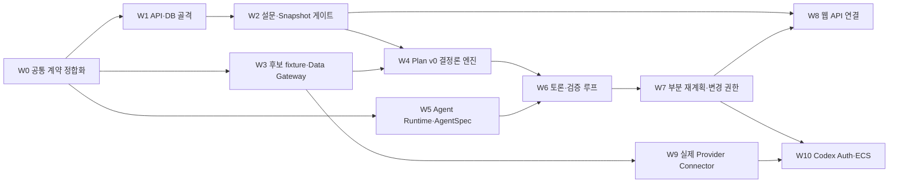

# MOA MVP 구현 가이드와 작업 패키지

> 대상: 프런트엔드·백엔드·Agent·데이터·인프라 담당자  
> 목표: 각 담당자가 이 문서와 연결된 Markdown만 읽고 독립적으로 개발한 뒤 공통 계약에서 결합할 수 있게 한다.  
> 범위: 현재 `README.md + docs/ + packages/contracts` 기준의 `Plan v0 우선` MVP

## 1. 첫 번째 제품 세로 기능

```text
방 설정
→ 참가자 초대·설문 제출
→ 설문 완료·필수조건 검사
→ 불변 SurveySnapshot 생성
→ fixture 후보 정규화·검증
→ 결정론 Plan v0 생성
→ 충돌 의제 생성
→ Proxy Agent 구조화 토론
→ 부분 수정
→ 영향 노드 재검증
→ 최종 결과 조회
```

첫 세로 기능에서는 식사 카테고리 하나를 실제로 연결한다. 식사는 `알레르기 fail-closed + 5·3·1 + 목적급 + 가격·영업시간·예약 가능성`을 한 번에 검증할 수 있기 때문이다. 다른 카테고리는 같은 계약을 재사용해 확장한다.

## 2. 구현 의존성



병렬 시작 가능한 작업은 `W1`, `W3`, `W5`다. 단, 모두 `W0`에서 만든 동일한 계약 버전을 사용해야 한다.

## 3. 목표 저장소 구조

```text
apps/
├─ web/                       기존 React 앱
├─ api/                       HTTP API·인증·방·설문·조회
├─ worker/                    Planning run·Agent 토론 Worker
└─ codex-runtime-gateway/     Codex Auth와 모델·thread 전용 경계

packages/
├─ contracts/                 Zod 스키마·공통 타입
├─ core/                      결정론 계산·검증·최적화
├─ agents/                    AgentSpec·prompt·projection
├─ data-gateway/              캐시·정규화·Connector 실행
└─ db/                        마이그레이션·Repository·transaction

packs/                        Destination Pack JSON
```

## 4. 공통 HTTP 계약

모든 응답은 성공 시 `{ data, meta }`, 실패 시 `{ error }` 형태를 사용한다.

```ts
type ApiSuccess<T> = {
  data: T;
  meta: { requestId: string; schemaVersion: number };
};

type ApiError = {
  error: {
    code: string;
    message: string;
    details?: unknown;
    requestId: string;
  };
};
```

### 4.1 방과 설정

```http
POST /api/trip-rooms
GET  /api/trip-rooms/:tripId
PUT  /api/trip-rooms/:tripId/settings
POST /api/trip-rooms/:tripId/participants
```

목표 `RoomSettings v2`:

```ts
type RoomSettingsV2 = {
  schemaVersion: 2;
  destinationId: string;
  transportMode: "AIR" | "SHIP" | "RAIL" | "BUS" | "CAR" | "OTHER";
  pace: "REST" | "BALANCED" | "ACTIVE";
  searchDateRange: { startDate: string; endDate: string };
  duration: { version: number; nights: number; days: number };
  roomBudgetCap: { currency: "KRW"; amount: number };
};
```

규칙:

- `days === nights + 1`
- 날짜는 ISO `YYYY-MM-DD`
- 금액은 정수 minor unit이 아니라 MVP에서는 KRW 정수 원 단위
- 기존 `RoomSubmissionPayload v1`은 초안 호환용으로 받을 수 있지만 계획 시작 조건을 충족하지 않는다.
- 설정 변경은 제자리 수정하지 않고 설정 버전과 감사 이벤트를 만든다.

### 4.2 기간 동의와 설문

```http
PUT  /api/trip-rooms/:tripId/duration-agreement
PUT  /api/trip-rooms/:tripId/survey-responses/me/draft
POST /api/trip-rooms/:tripId/survey-responses/me/submit
GET  /api/trip-rooms/:tripId/survey-status
```

목표 `SurveySubmissionPayload v4`는 현재 v3의 `preferredNights`, `nightFlexibility`를 계획 입력으로 사용하지 않는다.

```ts
type SurveySubmissionPayloadV4 = {
  schemaVersion: 4;
  tripId: string;
  destinationId: string;
  durationAgreementVersion: number;
  durationAccepted: true;
  availability: {
    availableDates: string[];
    unavailableDates: string[];
  };
  personalBudgetCap: {
    currency: "KRW";
    amount: number;
    includesLongDistanceTransport: boolean;
  };
  hardConstraints: {
    dietary: string[];
    allergies: string[];
    beliefs: string[];
    walkingDistanceKm: number | null;
    mobilityNeeds: string[];
    noGoItems: string[];
  };
  goalMode: "TOGETHERNESS" | "BALANCED" | "CONTENT_DRIVEN";
  purposeItems: Array<{
    rank: 1 | 2;
    category: "DINING" | "ACTIVITY" | "ACCOMMODATION";
    text: string;
  }>;
  categoryPriorities: {
    DINING: 1 | 3 | 5;
    ACTIVITY: 1 | 3 | 5;
    ACCOMMODATION: 1 | 3 | 5;
  };
  detailPreferences: Array<{
    preferenceId: string;
    category: "DINING" | "ACTIVITY" | "ACCOMMODATION";
    value: 1 | 3 | 5 | "NO_PREFERENCE" | "EXCLUDE";
    internalRank?: number;
    freeText?: string;
  }>;
  travelStyles: Record<string, number | "NOT_APPLICABLE">;
};
```

검증:

- `categoryPriorities`의 값 집합은 정확히 `{1,3,5}`다.
- 목적급은 최대 2개이고 rank가 중복될 수 없다.
- `CONTENT_DRIVEN`이면 목적급이 최소 1개다.
- 알레르기와 `EXCLUDE`는 만족도 입력이 아니라 후보 제거 조건이다.
- 모든 필수 분야는 답변 또는 명시적 `NO_PREFERENCE`여야 한다.

### 4.3 Planning run과 결과

```http
POST /api/trip-rooms/:tripId/planning-runs
GET  /api/planning-runs/:runId
GET  /api/planning-runs/:runId/events?after=:seq
GET  /api/trip-rooms/:tripId/plans/latest
POST /api/trip-rooms/:tripId/plans/:planVersion/reopen-requests
POST /api/change-requests/:changeId/responses
```

`POST planning-runs`는 다음 조건을 만족하지 않으면 `409 SURVEY_INCOMPLETE`를 반환한다.

```text
모든 활성 참가자 SUBMITTED
+ 모든 ConstraintValidation VALID
+ 현재 DurationAgreement AGREED
+ 공통 가능 날짜에 전체 여행 기간 포함
```

## 5. 공통 상태와 이벤트

### 5.1 Planning run 상태

```text
PENDING
→ VALIDATING
→ SEARCHING_CANDIDATES
→ GENERATING_PLAN
→ SCORING
→ DEBATE_POSITIONING
→ DEBATE_DISCUSSION
→ DEBATE_VOTING
→ REVISING
→ FINAL_VALIDATION
→ COMPLETED
```

예외 상태:

```text
WAITING_USER | RETRYING | FAILED | CANCELLED
```

### 5.2 최소 이벤트 목록

```text
ROOM_SETTINGS_VERSIONED
PARTICIPANT_JOINED
SURVEY_DRAFT_SAVED
SURVEY_SUBMITTED
DURATION_AGREED
SURVEY_SNAPSHOT_CREATED
PLANNING_RUN_STARTED
DATA_RESOLVED
PLAN_V0_CREATED
DEBATE_ISSUE_CREATED
AGENT_RUN_COMPLETED
PROXY_VOTE_RECORDED
PLAN_NODE_STALE
PLAN_REVISED
CHANGE_AUTHORITY_CLASSIFIED
USER_DECISION_RECORDED
FINAL_VALIDATION_COMPLETED
PLAN_COMPLETED
```

모든 이벤트는 최소한 다음 필드를 가진다.

```ts
type DomainEvent = {
  eventId: string;
  tripId: string;
  runId?: string;
  seq: number;
  type: string;
  schemaVersion: number;
  idempotencyKey: string;
  occurredAt: string;
  payload: unknown;
};
```

## 6. 작업 패키지

### W0 — 공통 계약 정합화

담당: 계약·백엔드 리드  
선행 조건: 없음

작업:

- `RoomSettings v2`, `SurveySubmissionPayload v4`, API 응답, DomainEvent Zod 스키마 추가
- 기존 v1·v3 입력의 마이그레이션 또는 명시적 거부 정책 작성
- 문서와 `packages/contracts`의 enum·정책값 일치 검사
- 테스트 fixture용 참가자 3명·식당 5개 데이터 계약 작성

완료 조건:

- 잘못된 5·3·1 중복, 목적급 3개, 기간 불일치, 음수 예산이 모두 거부된다.
- v3 초안을 v4로 자동 변환할 수 없는 필드는 사용자 재확인 대상으로 반환된다.
- 모든 후속 패키지가 같은 계약 버전을 import한다.

금지:

- 프런트 타입을 복사해 백엔드 전용 타입으로 다시 만드는 것
- 문서에 없는 기본값으로 누락된 하드 제약을 채우는 것

### W1 — API·DB 골격

담당: 백엔드  
선행 조건: W0

필수 문서:

- [개발·배포 계획](development-and-deployment.md)
- [백엔드 설계 13~16장](group-trip-survey-agent-backend.md#13-백엔드-실행-구조)

작업:

- `apps/api`, `packages/db` 생성
- PostgreSQL migration과 Repository 작성
- 방·설문 draft·제출·상태 조회 API 구현
- request ID, idempotency key, transaction 경계 구현

최소 테이블:

```text
trip_rooms
room_setting_versions
participants
duration_agreements
survey_responses
survey_snapshots
planning_runs
planning_nodes
plans
debate_issues
agent_runs
evidence_records
change_authority_decisions
domain_events
```

완료 조건:

- 같은 idempotency key의 중복 요청이 중복 row를 만들지 않는다.
- 참가자는 타인의 설문 원문을 조회할 수 없다.
- 스냅샷과 제출 응답은 update가 아니라 새 version으로 저장된다.
- API 통합 테스트가 실제 PostgreSQL에서 통과한다.

### W2 — 설문 완료·Snapshot·여행 가능성 게이트

담당: 백엔드·결정론 엔진  
선행 조건: W1

작업:

- `SurveyCompletionGate`
- `DurationAgreementValidator`
- `AvailabilityIntersection`
- `ConstraintValidator`
- 불변 `SurveySnapshot` 생성 transaction

완료 조건:

- 한 명이라도 미완료면 `409 SURVEY_INCOMPLETE`
- 날짜 교집합이 없으면 `TRIP_INFEASIBLE`
- `days !== nights + 1`이면 거부
- 스냅샷 생성과 설문 `LOCKED` 전환이 하나의 transaction
- 동시 시작 요청에도 스냅샷 버전이 하나만 생성

### W3 — fixture 후보·Data Gateway

담당: 데이터·백엔드  
선행 조건: W0

필수 문서:

- [Agent 아키텍처 6장](agent-architecture.md#6-data-gateway-계약--api-호출db-저장조회)
- [백엔드 설계 10.3장](group-trip-survey-agent-backend.md#103-data-gateway와-provider-connector)

작업:

- `packages/data-gateway` 생성
- 식당 fixture 5개와 Evidence fixture 작성
- canonical request hash, TTL, 정규화, 결과 상태 구현
- `SUCCESS / PARTIAL / FAILED` 처리

완료 조건:

- 같은 canonical 요청은 같은 캐시 키를 만든다.
- 알레르기 안전, 가격, 영업시간, 날짜, 위치 누락은 fail-closed다.
- Provider 원본과 API key가 Agent projection에 포함되지 않는다.
- `PARTIAL`을 Agent가 `SUCCESS`로 바꿀 수 없다.

### W4 — Plan v0 결정론 엔진

담당: 알고리즘·백엔드  
선행 조건: W2, W3

작업:

- `packages/core` 생성
- `ProtectedObjectiveGate`, `FulfillmentEvaluator`, `SatisfactionScorer`
- 5·3·1 실효 중요도 계층 비교
- C2 `SatisfactionGapEvaluator`
- 식사 슬롯 중심 `ScheduleOptimizer` 최소 구현
- `PlanValidator`, `ConflictDetector`

완료 조건:

- 같은 snapshot과 후보 집합은 byte-equivalent 결정 결과를 만든다.
- `NOT_APPLICABLE`을 0점으로 계산하지 않는다.
- 목적급을 일반 점수로 상쇄하지 않는다.
- 25%p 경계는 C2 통과, 초과는 재토론 의제 생성
- 개인 예산 상한 또는 안전 제약 위반 계획은 생성되지 않는다.

### W5 — Agent Runtime·역할별 AgentSpec

담당: Agent  
선행 조건: W0

필수 문서:

- [AgentSpec](agent-spec.md)
- [ECS Codex Auth 설계 4~8장](ecs-codex-auth-agent-architecture.md#4-런타임-컴포넌트)

작업:

- `packages/agents` 생성
- Python `AgentRuntime` 추상 클래스
- 테스트용 Python `FixtureAgentRuntime`
- 역할별 AgentSpec 6개
- prompt registry, Pydantic input/output model registry, projection registry
- 6개 역할의 Fixture 동작과 종단 토론 시뮬레이터
- `CodexGatewayClient` port와 strict output repair 경계

```ts
interface AgentRuntime {
  run(request: AgentRunRequest): Promise<AgentRunResult>;
}
```

완료 조건:

- 모든 Agent는 `READ_ONLY + PROPOSE_ONLY + approvalPolicy=NEVER`
- schema repair는 최대 1회
- 타 참가자의 원본 설문, DB credential, Provider key 접근 불가
- Fixture runtime만으로 토론 통합 테스트 실행 가능
- 모델 미지원 시 다른 모델로 조용히 변경하지 않고 fail-closed

구현 상태: **완료**. 파일 구조와 연결 방법은 [Agent 구현 가이드](agents-implementation.md)를 따른다. 실제 Codex Auth·모델 연결은 W10 범위다.

### W6 — 토론·논리 검증 루프

담당: Agent·Worker  
선행 조건: W4, W5

작업:

- `apps/worker` 생성
- `DebateSupervisorAgent`, `ParticipantProxyAgent`, `CategoryWatcherAgent`, `LogicAuditorAgent` 순서 연결
- `EvidenceGuard → LogicAuditor → SymbolicReasoner → CategoryWatcher → PlanValidator` 구현
- Proxy 구조화 투표와 최대 수정 횟수 집행

완료 조건:

- 최초 안 포함 최대 3회 투표, 수정 최대 2회
- 전원 `SUPPORT | ACCEPTABLE`만 Agent 합의
- 다수결 금지
- 근거가 없거나 논리 전제가 빠진 주장은 계획에 적용되지 않는다.
- Agent가 만든 숫자와 후보 ID는 등록 데이터와 다르면 거부된다.

### W7 — 부분 재계획·변경 권한

담당: 결정론 엔진·Worker  
선행 조건: W6

작업:

- `ImpactAnalyzer`
- Planning Graph의 `STALE` 전파
- `classifyChangeAuthority` 연결
- `AWAITING_USER` 저장·resume 이벤트
- 변경 전후 비용·이동시간·만족도·예약 영향 diff

완료 조건:

- 변경 사유가 여러 개면 가장 높은 권한 단계 적용
- `AUTO_REPLAN`은 모든 사전조건을 만족할 때만 실행
- 날짜·기간·여행지·참가자·예산 상한·하드 제약·목적급 변경은 새 SurveySnapshot
- `BOOKED` 변경은 사용자 확인 없이 실행 불가
- 사용자 응답을 기다리는 동안 Agent polling 금지

### W8 — 웹 API 연결·결과 화면

담당: 프런트엔드  
선행 조건: W2, W7 API 계약

작업:

- Room v2·Survey v4 UI
- 설문 완료 상태와 누락 섹션 표시
- planning run 상태 조회 또는 event cursor polling
- Plan v0, 최종안, 개인별 반영·양보, 근거, 변경 diff 화면
- `USER_CONFIRMATION_REQUIRED` 응답 UI

완료 조건:

- 다른 참가자의 민감 설문 원문을 렌더링하지 않는다.
- 미선택과 0점, 안전 제외를 서로 다른 상태로 표현한다.
- 결과에 이전 가격·최신 가격·조회 시각을 표시한다.
- 재논의 전 영향 범위를 먼저 표시한다.
- API가 없을 때의 local prototype 모드와 API 통합 모드를 명확히 구분한다.

### W9 — 실제 Provider Connector

담당: 데이터  
선행 조건: W3

작업:

- 식사 Provider 하나를 fixture 인터페이스 뒤에 구현
- timeout, retry, rate limit, TTL, provenance 저장
- queryClass별 authority tier와 fail-closed 정책 적용

완료 조건:

- 실제 API를 사용하지 않는 contract test fixture 제공
- live test는 명시적 환경에서만 실행
- 가격·재고·예약 가능성은 authority tier 2 이상
- 오류·쿼터 초과·degraded 결과가 사용자 결과와 관측 로그에 표시

### W10 — Codex Auth Runtime Gateway·ECS

담당: 인프라·Agent  
선행 조건: W7, W9

필수 문서:

- [ECS Codex Auth 설계](ecs-codex-auth-agent-architecture.md)

작업 순서:

```text
로컬 CODEX_HOME PoC
→ model/list와 thread 생성·resume
→ apps/codex-runtime-gateway
→ AgentRuntime 구현체 연결
→ 로그 redaction·동시성·비용 상한
→ EFS·KMS·ECS Task
→ single-writer rolling deployment
```

완료 조건:

- Worker는 Auth 파일을 읽지 않고 Gateway만 소유
- Agent별 thread key가 격리됨
- Auth 만료, 모델 미지원, rate limit이 서로 다른 오류 코드
- ECS Task Role과 Execution Role 분리
- 로그와 Agent 결과에 Auth·토큰·시크릿 없음
- 배포 전 Fixture runtime 기반 전체 회귀 테스트 통과

## 7. 테스트 계층

| 계층 | 대상 | 외부 API·LLM |
| --- | --- | --- |
| 단위 테스트 | 점수·게이트·분류·STALE 전파 | 금지 |
| 계약 테스트 | Zod, API payload, Agent output | 금지 |
| Repository 통합 테스트 | PostgreSQL transaction·멱등성 | 금지 |
| Workflow 통합 테스트 | fixture 후보 + Fixture Agent | 금지 |
| Provider sandbox 테스트 | Connector·TTL·정규화 | 명시 실행만 |
| Agent eval | prompt·projection·schema 준수 | 비용 상한 아래 명시 실행 |
| 배포 smoke test | health·queue·DB·Gateway | 최소 호출 |

필수 경계 테스트:

```text
5·3·1 중복 배정 거부
목적급 3개 거부
duration days/nights 불일치 거부
미완료 참가자 존재 시 시작 거부
공통 가능 날짜 없음
개인 예산 상한 초과
알레르기 안전 미확인
NOT_APPLICABLE만 있는 만족도 집계
C2 2500bp / 2501bp 경계
검증 상태 downgrade
BOOKED 노드 변경
동일 이벤트 중복 전달
Agent schema 위반과 존재하지 않는 후보 ID
```

## 8. 팀 협업 규칙

- 한 작업 패키지의 공개 계약을 바꾸면 의존 패키지 담당자에게 변경 내용을 전달한다.
- 공개 타입 변경은 `schemaVersion`을 올리고 호환·마이그레이션 정책을 적는다.
- DB migration은 append-only로 추가하며 이미 공유된 migration을 다시 쓰지 않는다.
- fixture는 테스트 입력이자 문서 예시다. 실제 규칙과 다르게 편의상 단순화하지 않는다.
- Agent prompt 변경에는 prompt version과 최소 회귀 eval을 남긴다.
- 미완료 기능은 mock 또는 fixture라고 화면·로그·문서에 표시한다.
- 작업 완료 보고에는 `변경 파일 / 계약 변화 / 실행한 테스트 / 남은 위험`을 포함한다.

## 9. 첫 번째 통합 데모 합격 기준

3명의 참가자와 식당 fixture 5개로 다음 시나리오가 동작해야 한다.

```text
A: 음식 5, 스시 5, 오마카세 목적급
B: 숙소 5, 음식 3, 라멘 5
C: 액티비티 5, 음식 1, 갑각류 알레르기
```

합격 조건:

1. C의 알레르기 안전이 확인되지 않은 식당은 토론 전에 제거된다.
2. A의 목적급은 일반 점수로 상쇄되지 않는다.
3. 결정론 엔진이 Plan v0와 참가자별 만족도를 만든다.
4. 충돌한 식사 슬롯만 Proxy 토론 대상으로 열린다.
5. Agent 주장은 Evidence·Logic·Plan 검증을 통과해야 적용된다.
6. 수정 뒤 영향받은 비용·일정·만족도만 다시 계산된다.
7. 최종 결과에 선택 이유, 제외 이유, 개인별 양보, 근거 시각이 표시된다.
8. 전체 흐름은 Fixture Agent와 fixture 데이터만으로 반복 재현된다.

이 데모가 통과하기 전에는 카테고리 확대, 실제 Provider 다중 연동, ECS 배포를 완료로 간주하지 않는다.
