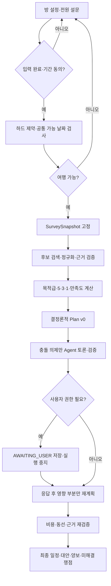
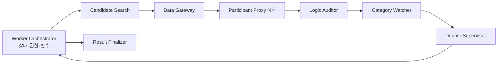

# MOA 핵심 논의·근거·의도·해결책

- 작성일: 2026-08-14
- 대상 브랜치: `dawnkim`
- 관련 요약: [알고리즘·Agent·Flowchart 감사 및 반영 기록](algorithm-flowchart-audit-2026-08-14.md)
- 목적: 제품·알고리즘·Agent 구조의 핵심 결정과 실제 구현 검증 결과를 리뷰 가능한 형태로 남긴다.

설치, Windows 권한, Git 인증, 개별 화면 리팩터링 같은 운영 문제는 이 문서의 범위에서 제외한다.

## 1. 공통 판단 원칙

1. **Fail-closed**: 안전·필수조건·근거가 불명확하면 성공으로 간주하지 않는다.
2. **결정 권한 분리**: Agent는 제안하고, 수치 계산·상태 전이·최종 확정은 결정론적 코드가 담당한다.
3. **단일 기준 정보**: 같은 proposal, participant, candidate, evidence ID는 모든 단계에서 같은 의미를 가져야 한다.
4. **구조화된 판정**: 자연어 문구보다 enum, ID, 상태 코드, 수치 계약을 우선한다.
5. **버전이 있는 의미**: 응답 척도나 정책 의미가 바뀌면 schema와 policy version을 함께 올린다.
6. **구현 상태를 과장하지 않음**: fixture와 preloaded 데이터만 지원하면 실시간 Provider 연동 완료로 표시하지 않는다.

정책 우선순위는 다음과 같다.

```text
하드 제약과 여행 가능성
> 목적급 콘텐츠
> 목적 유형별 최소 만족도
> 일반 취향의 실효 중요도
> 공정성 보정
> 여행 스타일
> 비용·이동시간
```

상위 규칙은 하위 점수로 상쇄할 수 없다. 저렴하고 평균 만족도가 높은 일정도 알레르기 안전이 확인되지 않으면 탈락한다.

## 2. 핵심 제품·알고리즘 결정

### 2.1 Plan v0를 먼저 만들고 실제 충돌만 토론한다

**쟁점**

- 참가자들이 추상적인 여행 목적부터 모두 합의할 것인가?
- Agent가 처음부터 자유 토론으로 일정을 만들 것인가?
- 검증된 초기 일정을 만든 뒤 실제 충돌만 토론할 것인가?

**근거와 의도**

일정 후보가 없으면 양보의 비용을 판단하기 어렵고 논의 범위가 불필요하게 커진다. 반대로 필수조건 확인 없이 일정을 만들면 날짜·예산·안전 때문에 실행 불가능한 안에 계산과 토론 비용을 쓴다. 따라서 실행 가능한 기준안을 먼저 만들고 사람과 Agent가 논의할 부분을 실제 충돌로 제한한다.

**채택한 해결책**



`Plan v0`는 최종 확정안이 아니라 토론을 구체화하는 검증된 기준안이다. 목적급 충돌이 남으면 `PROVISIONAL`로 보관하고 필요한 사용자 결정 전에는 확정하지 않는다.

### 2.2 완전한 입력과 하드 제약을 취향보다 먼저 검사한다

**쟁점**

미응답을 0점이나 무관심으로 처리할지, 일부 설문만으로 계획을 시작할지, 안전·예산 같은 필수조건을 선호 점수와 함께 계산할지 논의했다.

**근거와 의도**

`0`, `NO_PREFERENCE`, `NOT_APPLICABLE`, `NOT_STARTED`는 의미가 다르다. 하드 제약도 낮은 선호 점수가 아니라 후보의 자격 조건이다. 입력 누락과 실행 불가능한 후보를 점수로 덮지 않고, 계산 가능한 완전한 스냅샷만 계획에 사용해야 한다.

**채택한 해결책**

- 모든 활성 참가자가 설문을 제출하고 기간에 동의해야 Planning을 시작한다.
- 필수 분야는 `ANSWERED` 또는 명시적 `NO_PREFERENCE`여야 한다.
- `NOT_APPLICABLE`은 평균·최솟값·격차 계산에서 제외한다.
- 계산 가능한 참가자가 2명 미만인 공정성 검사는 `SKIPPED`로 기록한다.
- 날짜, 개인 예산 상한, 알레르기·식이·건강·접근성, 절대 불가 항목은 후보 자격 조건이다.
- 안전과 필수조건이 `UNKNOWN`이면 낮은 점수를 주지 않고 후보에서 제외한다.
- 완성된 입력은 불변 `SurveySnapshot`으로 고정한다.

### 2.3 일반 선호와 목적급 콘텐츠를 분리한다

**쟁점**

음식·숙소·액티비티와 세부 취향을 같은 척도로 표현할지, 분야 우선순위가 낮더라도 반드시 지켜야 하는 여행 목적을 일반 점수에 포함할지 논의했다.

**근거와 의도**

`5·3·1`은 상대적 중요도를 명확하게 만들지만, 항목 수를 그대로 합산하면 후보가 많은 분야가 유리해진다. 또한 목적급 콘텐츠는 분야 선호가 아니라 이번 여행의 이유이므로 높은 일반 점수로 미충족을 상쇄할 수 없다.

**채택한 해결책**

- 음식·숙소·액티비티에는 `5·3·1`을 하나씩 배정한다.
- 세부 취향은 `5·3·1·NO_PREFERENCE·EXCLUDE`를 사용한다.
- 일반 취향의 실효 중요도는 `분야 중요도 × 세부 중요도`로 계산한다.
- 항목 수 합산 대신 분야별 반영률을 먼저 계산한다.
- 여행 스타일은 무엇을 선택할지가 아니라 어떻게 배치할지를 표현하므로 `5·3·1`과 곱하지 않는다.
- 목적급 콘텐츠는 일반 점수와 분리된 `ProtectedObjective`로 저장한다.
- MVP 입력 상한은 참가자당 `0~2개`이며 미반영·대체·부분 반영은 사용자 확인 대상이다.

목적급 계약은 [objective-policy.ts](../packages/contracts/src/objective-policy.ts)에 정의되어 있다.

### 2.4 최소 만족도와 참가자 간 격차를 별도로 검사한다

**쟁점**

평균 만족도만 최적화할지, 참가자별 최소 만족도와 최고·최저 참가자 간 격차도 검사할지 논의했다.

**근거와 의도**

평균만 사용하면 한 사람의 큰 손실을 여러 사람의 작은 이득으로 숨길 수 있다. 반면 모든 참가자에게 동일한 콘텐츠 점수를 강제하면 동행 자체가 목적인 참가자에게 불필요한 요구가 생긴다. 최소 보호와 손실 편중은 서로 다른 규칙으로 검사해야 한다.

**채택한 해결책**

- 점수·평균·최솟값·격차는 Agent가 아니라 코드가 basis point 정수로 계산한다.
- `goalMode`에 따라 콘텐츠 중심과 동행 중심의 최소 만족도 정책을 구분한다.
- 목적급 게이트와 최소 만족도는 공정성 격차 규칙으로 완화할 수 없다.
- `max(satisfactionBp) - min(satisfactionBp) > 2500bp`일 때만 C2 재토론을 연다.
- 경계값 `2500bp`는 통과하며 최저 만족도 참가자의 미반영 분야만 최대 1회 재토론한다.
- 재토론 후에도 격차가 남으면 검증된 최선안과 양보 내역을 보고한다.

C2 경계 계산은 [rounds.ts](../packages/contracts/src/rounds.ts)와 계약 테스트에서 검증한다. `goalMode`별 전체 만족도 엔진은 아직 후속 구현 범위다.

### 2.5 중요도를 보존한 뒤 비용과 이동시간으로 동급 후보를 비교한다

**쟁점**

분야별 예산을 미리 고정 배분할지, 비용·이동시간을 선호보다 먼저 비교할지 논의했다.

**근거와 의도**

목적지마다 가격 구조가 다르므로 분야별 고정 예산 비율은 실제 최적안을 방해할 수 있다. 비용을 너무 일찍 비교하면 중요한 취향이 단순히 싼 후보에 밀린다. 따라서 개인 상한 안에서 중요한 요구를 먼저 지키고 완전히 비슷한 후보에만 비용과 동선을 적용한다.

**채택한 해결책**

1. 하드 제약과 목적급 게이트를 먼저 통과시킨다.
2. 일반 취향의 실효 중요도와 참가자별 최소 만족도를 비교한다.
3. 남은 후보를 leximin 방식으로 정렬해 최저 만족도를 우선 개선한다.
4. 동급 후보에서는 비용, 이동시간, canonical ID를 결정론적 tie-breaker로 사용한다.
5. 개인 예산 상한과 체력·접근성 기반 이동 상한 위반 후보는 비교 전에 탈락시킨다.
6. 같은 만족도를 제공하면 더 저렴한 후보를 선택하고 남은 예산을 모두 쓰는 것을 목표로 삼지 않는다.

현재 Worker는 검증 후보 필터와 leximin·비용·이동시간·ID 정렬을 구현했다. 세부 동급 허용값을 포함한 전체 예산 최적화 엔진은 후속 정책·구현 범위다.

### 2.6 Agent, Worker, Data Gateway의 책임을 분리한다

**쟁점**

Agent가 외부 API, 계산, 상태 전이, 최종 선택까지 담당할지 역할별 Agent와 결정론적 Orchestrator로 나눌지 논의했다.

**근거와 의도**

가격·날짜·예산·이동시간·상태는 같은 입력에 같은 결과가 필요하다. API 인증, rate limit, TTL, cache와 정규화도 데이터 계층 책임이다. LLM은 모호한 언어를 구조화하는 데 사용하고 숫자와 실행 권한은 재현 가능한 코드가 통제해야 한다.

**채택한 해결책**



- Candidate Search는 `QueryPlan`을 제안하고 Worker가 안전성과 canonical filter 보존을 검사한다.
- Data Gateway는 Provider 호출, cache, TTL, 정규화, evidence와 검증 상태를 담당한다.
- Proxy는 참가자의 제한된 위임 범위에서 구조화된 제안을 만든다.
- Worker는 legal move, 반복, 상태 전이, 후보 선택과 최종 확정을 담당한다.
- Finalizer는 검증된 결과를 설명할 뿐 새 후보나 결정을 만들지 않는다.
- 독립적인 Proxy 호출은 병렬화할 수 있지만 Auditor → Watcher → Supervisor 검증은 순차 실행한다.

현재는 Provider Data Gateway가 없으므로 `PRELOADED_NORMALIZED_OPTIONS`만 처리한다.

### 2.7 자연어 설명이 아니라 구조화 claim과 evidence를 검증한다

**쟁점**

Agent가 근거를 인용했다는 사실만으로 결론을 인정할지, 결론이 실제 참가자·제안·투표와 연결되는지 검증할지 논의했다.

**근거와 의도**

자연어 설명은 설득력 있어 보여도 실제 vote나 evidence와 다를 수 있다. 모델 내부 chain-of-thought는 업무 계약으로 사용할 수 없다. 외부에서 재현 가능한 claim과 근거 연결을 검증해야 한다.

**채택한 해결책**

```text
FactRecord + EvidenceRecord
          ↓
premiseFactIds + ruleId
          ↓
participantId + proposalId + claimedDecision
          ↓
Logic Auditor: VALID | INVALID | NEEDS_EVIDENCE
```

- Agent는 구조화 claim, 전제 fact ID, rule ID, evidence ID를 출력한다.
- Logic Auditor는 전제 존재, evidence 상태, 등록 rule, expected vote와 claim의 일치를 검사한다.
- 같은 evidence ID는 모든 Agent 입력에서 동일한 payload를 가져야 한다.
- Auditor는 새로운 사실·규칙·승자를 만들 수 없다.
- Auditor를 통과해도 Watcher와 PlanValidator의 기계 검증을 다시 통과해야 한다.

현재 구현은 구조화 claim과 연결 무결성을 검증한다. 범용 자연어 증명은 SymbolicReasoner가 추가되어야 한다.

### 2.8 변경 권한과 민감정보 공개 범위를 제한한다

**쟁점**

가격·시간·후보 변경을 어디까지 자동화할지, 알레르기·건강 같은 필수조건을 다른 참가자 Agent에 얼마나 공개할지 논의했다.

**근거와 의도**

모든 변경을 확인받으면 자동화의 장점이 사라지고, 모든 변경을 자동화하면 목적급·예산·예약 상태 같은 사용자 권한을 침범한다. 안전 검증에는 원본 제약이 필요할 수 있지만 다른 Proxy가 상세 진단명까지 볼 필요는 없다.

**채택한 해결책**

| 권한 | 대표 사유 | 처리 |
| --- | --- | --- |
| `AUTO_REPLAN` | 검증된 동급 후보 교체 | 영향 노드만 재계산하고 diff 기록 |
| `PROXY_DELEGATED` | 위임된 일반 선호 조정 | 위임 범위 안에서 처리 후 알림 |
| `USER_CONFIRMATION_REQUIRED` | 목적급 훼손, 최소 만족도 미달, 핵심 시간·비용 변경 | 응답까지 `AWAITING_USER` |
| `NEW_SURVEY_SNAPSHOT` | 날짜, 여행지, 참가자, 예산 상한, 하드 제약 변경 | 새 버전으로 재계획 |

- 사용자 확인도 Watcher `BLOCK`이나 안전 실패를 통과시키지 못한다.
- 민감한 원본 제약은 안전 검증 코드만 읽는다.
- Proxy에는 상세 원문과 당사자 대신 `GROUP_SAFETY_CONSTRAINT` 같은 최소 요약만 전달한다.
- 공동 결과에는 충족 여부만 표시하고 상세 내용은 본인 전용으로 제한한다.

변경 권한 계약은 [change-authority.ts](../packages/contracts/src/change-authority.ts)에 정의되어 있다.

### 2.9 새 정보가 있을 때만 토론을 재개하고 횟수를 제한한다

**쟁점**

보류 쟁점을 계속 실행할지, 토론 횟수를 고정할지, 방마다 조절할 수 있게 할지 논의했다.

**근거와 의도**

새 후보·근거·사용자 입력 없이 같은 대화를 반복해도 결과가 개선될 이유가 없다. 무제한 반복은 지연과 비용을 증가시키지만 방장이 지나치게 낮은 횟수를 단독으로 정하면 소수 의견이 검토되기 전에 종료될 수 있다.

**채택한 해결책**

- 현재 기본값은 수정 최대 2회, 투표 최대 3회다.
- `maxVoteAttempts`는 `maxProposalRevisions + 1` 관계를 유지한다.
- `AWAITING_USER`와 `DEFERRED`에서는 상태를 저장하고 Agent 실행을 완전히 중지한다.
- 사용자 응답, 새 검증 후보, evidence 갱신이 있을 때만 영향 부분을 재개한다.
- 반복 한도에 도달하면 하드 제약 위반안은 폐기하고, 권한이 필요한 쟁점은 사용자 확인으로 전환하며, 일반 이견은 검증된 차선책과 함께 보고한다.
- 토론 횟수와 무관하게 하드 제약·예산·목적급·최소 만족도·evidence 검증은 고정 게이트다.

현재 반복 상수는 [rounds.ts](../packages/contracts/src/rounds.ts)에 구현되어 있다. 방별 `DebatePolicySnapshot`과 참가자 사전 확인은 설계 결정이며 아직 구현되지 않았다.

### 2.10 결과에는 선택 이유, 개인별 양보와 미해결 쟁점을 표시한다

**쟁점**

최종 일정만 보여줄지, 대안·갈등·양보·근거까지 표시할지 논의했다.

**근거와 의도**

결과만 보여주면 사용자는 자신의 선호가 누락된 이유를 알 수 없다. 반대로 전체 회의록과 민감 설문을 노출하면 정보량과 개인정보 위험이 커진다. 원본 설문을 양보 결과로 덮어쓰면 다음 재계획에서 실제 취향도 잃는다.

**채택한 해결책**

- 원본 설문은 변경하지 않는다.
- 공동 결과에는 최종 일정, 선택·실격 이유, 검증 시각, 불확실성, 대안과 미해결 쟁점을 표시한다.
- 개인 결과에는 본인의 목적급·5점 반영, 양보, 대체와 재논의 가능한 항목을 표시한다.
- 양보 이력은 Plan 버전별 `PreferenceLossLedger`로 관리하는 것을 목표로 한다.
- `AWAITING_USER`와 `DEFERRED` 쟁점은 저장하고 선택된 부분만 다시 연다.
- Finalizer는 proposal, candidate, evidence, 만족도를 추가·누락·변경할 수 없다.

Finalizer 무결성 검증은 현재 구현되어 있다. `PreferenceLossLedger`의 영속 저장과 UI는 후속 구현 범위다.

## 3. 구현·검증 결정

### 3.1 설문 UI와 데이터 계약을 함께 변경했다

**문제**

1~7 여행 스타일과 1~10 활동 선호는 숫자 중간값의 실제 의미가 모호했다. UI 로컬 키와 공통 계약 ID도 달랐으며, 척도 의미가 바뀌어도 schema가 같으면 구버전 응답과 구분할 수 없었다.

**해결책**

- 여행 스타일은 의미 버튼 3개로 변경하고 내부 값은 `1 / 4 / 7`로 저장한다.
- 활동 선호는 `관심 적어요 / 괜찮아요 / 꼭 하고 싶어요`로 바꾸고 `1 / 5 / 10`으로 저장한다.
- UI 저장 키를 11개 canonical ID로 통일한다.
- payload는 `schemaVersion: 4`와 두 scale version을 함께 보낸다.
- 구버전 localStorage 초안은 문서화된 규칙으로 한 번 변환한다.
- 필수 질문 응답 전에는 다음 버튼을 비활성화한다.

구현 위치: [data.ts](../apps/web/src/data.ts), [App.tsx](../apps/web/src/App.tsx), [formState.ts](../apps/web/src/formState.ts)

### 3.2 런타임 계약과 교차 필드 무결성을 검증한다

**문제**

TypeScript 타입과 개별 enum 검증만으로는 네트워크·DB·LLM 입력을 보장할 수 없다. 일부 style 축 누락, 중복 participant, 모순된 vote·상태·사유, 같은 evidence ID의 다른 payload가 허용될 수 있었다.

**해결책**

- 11개 style 축을 모두 선언한 strict Zod object를 사용한다.
- 계산 함수 진입 전에 participant, ID 중복, 값 범위와 반복 횟수를 parse한다.
- Pydantic model validator로 Evidence, PlanOption, Vote, Watcher, Supervisor, Finalizer의 교차 필드 모순을 거부한다.
- accepting vote는 반대 사유를 가질 수 없고 반대·확인 vote는 명시적 사유가 있어야 한다.
- 같은 evidence ID는 모든 Proxy와 Finalizer에서 전체 payload가 같아야 한다.
- 선택 후보 evidence는 존재하고 `VERIFIED`, fresh여야 한다.

구현 위치: [style-policy.ts](../packages/contracts/src/style-policy.ts), [models.py](../packages/agents/moa_agents/models.py), [Worker models.py](../apps/worker/moa_worker/models.py)

### 3.3 검증 후보만 평가하고 실제로 다른 대안이 있을 때만 반복한다

**문제**

Search Agent 결과가 실행 후보와 분리되거나, 무효 고득점 후보가 점수만으로 선택되거나, 같은 후보를 반복 평가하면서 한도를 한 번 초과할 수 있었다.

**해결책**

- QueryPlan의 안전성과 canonical filter 보존을 검사한다.
- 현재 후보는 `VERIFIED + fresh + hard-safe` preloaded 옵션으로 제한한다.
- `INVALID`, `PARTIAL`, stale, hard constraint 실패 후보는 점수 계산 전에 제거한다.
- 각 iteration은 이전과 다른 검증 계획을 평가한다.
- 추가 라운드는 `iteration + 1 < maxIterations`일 때만 시작한다.
- 다음 검증 계획이 없으면 권한이 필요한 쟁점은 사용자 확인, 그 외 안전 실패는 차단한다.

구현 위치: [orchestrator.py](../apps/worker/moa_worker/orchestrator.py), [handlers.py](../packages/agents/moa_agents/handlers.py)

### 3.4 Watcher·Supervisor·Finalizer의 우회 경로를 차단했다

**문제**

Watcher `BLOCK`이 Supervisor `WAIT_FOR_USER`로 바뀌거나, Supervisor가 실제 vote와 모순된 행동을 제안하거나, Finalizer가 토론과 다른 후보·만족도를 만들 수 있었다.

**해결책**

- Watcher `BLOCK`을 모든 Supervisor 행동보다 먼저 처리한다.
- 사용자 승인 재개 시 대상 proposal과 evidence를 다시 확인하고 Watcher를 재실행한다.
- Supervisor participant와 proposal 집합은 실제 vote 입력과 일치해야 한다.
- `WAIT_FOR_USER`와 `BLOCK`은 각각 실제 권한·안전 사유가 있어야 한다.
- FinalizerInput은 매 라운드 실제 선택 계획에서 만든다.
- Finalizer의 proposal, candidate 전체 집합, 만족도와 evidence가 선택 계획과 정확히 일치해야 한다.
- 후보 추가뿐 아니라 누락과 수치 변경도 실패 처리한다.

회귀 테스트: [Worker tests](../apps/worker/tests/test_worker.py), [Agent tests](../packages/agents/tests/test_agents.py)

## 4. 검증 결과

| 계층 | 검증 | 결과 |
| --- | --- | --- |
| Python 전체 | Agent, Gateway, Worker | `32 passed` |
| Agent + Worker 집중 | 계약·공격·상태 머신 | `25 passed` |
| TypeScript 계약 | Zod·계산·상태 전이 | `5 passed` |
| TypeScript | 모든 workspace typecheck | 통과 |
| 빌드 | Web + contracts production build | 통과 |
| UI | 실제 버튼 선택·disabled 전이·다음 이동 | 통과 |
| UI 런타임 | browser console error | 없음 |

환경 설치와 실행 기록은 [Agent Runtime 구현·설치·검증 기록](agent-runtime-setup-and-verification.md)을 따른다.

## 5. 후속 구현·결정

1. **Provider Data Gateway**: QueryPlan 실행, Provider별 정규화, cache·TTL·evidence 계약
2. **SymbolicReasoner**: 등록 규칙 표현과 일반화된 proof format
3. **전체 만족도 엔진**: `goalMode`, 목적급, 분야별 반영률과 최소 만족도 통합
4. **Plan별 손실 원장**: `PreferenceLossLedger` 영속 저장과 결과 UI
5. **방별 토론 정책**: `DebatePolicyDefinition`, `DebatePolicySnapshot`, 참가자 사전 확인
6. **설문 사용자 테스트**: 3단계 척도 문구와 일정 밀도 해석 검증

위 항목은 현재 구현 완료로 간주하지 않는다. 구현 전 계약과 정책 권한을 먼저 확정하고, 완료 후 정상·경계·실패 테스트를 추가한다.
