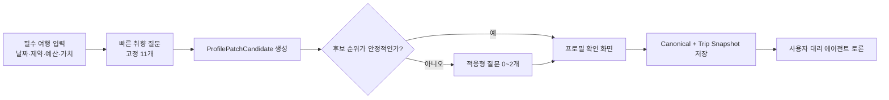

# PRD: MOA Survey v4 + Profile Schema v1

- 문서 상태: MVP 채택안
- 대상 MVP: 한국인 20대의 서울·부산·도쿄·오사카 그룹 여행
- 작성 기준일: 2026-08-14
- 구현 범위: 최초 설문, 목적지별 질문 활성화, 응답-축·태그 변환, 장기 프로필 확인·저장, 적응형 질문, 예측력 검증
- 관련 문서: [종합 기획서](travel-mediation-plan.md), [에이전트 아키텍처](agent-architecture.md), [외부 데이터·검증 정책](provider-evidence-policy.md)

## 문서의 상태 표기

| 표기 | 의미 |
| --- | --- |
| `[기존 결정]` | 앞선 서비스 설계에서 이미 채택된 제품 원칙 |
| `[권장]` | Survey v4/Profile v1에서 새로 채택하기를 권하는 구체안 |
| `[MVP 가설]` | 구현은 가능하지만 실제 사용자 선택 데이터로 검증해야 하는 값·매핑 |
| `[추후]` | MVP 이후로 미루는 기능 |

이 문서는 네 도시의 관광 특성을 객관적으로 완전 분류한 자료가 아니다. 도시별 활성 축과 질문 매핑은 초기 후보를 고르기 위한 휴리스틱이며, 실제 후보 데이터의 속성 분산과 사용자 선택 예측력으로 유지·교체해야 한다.

이 브랜치에서는 `[권장]` 항목을 MVP 구현 기본값으로 채택한다. `[MVP 가설]`로 표시한 축 조합·임곗값·매핑은 구현하되 실제 사용자 선택 데이터로 유지·조정한다.

---

## 1. Summary

MOA는 여행 참가자의 취향·가치 정책·예산·하드 제약을 사용자별 대리 에이전트가 읽을 수 있는 구조로 바꾸어야 한다. 현재의 47개 행동 축은 유용한 후보 라이브러리지만, 47개를 모두 묻는 설문은 사용자 피로가 크고 도시별로 필요하지 않은 질문도 많다.

Survey v4는 다음 구조를 사용한다.

1. 날짜 가용성, 하드 제약, 가치 정책, 개인 목표·상한 예산, 함께 이용·분리 권한을 필수 입력으로 받는다.
2. 공통 여행 성향과 목적지별 변별 축을 최초 11개의 빠른 응답으로 파악한다.
3. 응답은 단일 점수로 저장하지 않고 축 신호, 구체 태그, 구속력, 범위, 출처로 변환한다.
4. 상위 후보를 뒤집을 수 있는 불확실성이 있을 때만 최대 2개의 적응형 질문을 추가한다.
5. 에이전트 추론은 사용자가 확인하기 전까지 장기 프로필이 아니다.
6. 사용자가 확인한 항목만 Profile Schema v1의 `CanonicalProfile`에 저장한다.

Profile Schema v1은 `CanonicalProfile`, `AgentBelief`, `TripEffectiveProfile`, `ConstraintProfile`을 권한상 구분한다. 서로 다른 상황의 응답을 평균으로 지우지 않고 범위와 출처를 보존한다.

### 핵심 권장값

| 항목 | 권장값 |
| --- | --- |
| 대상 도시 | 서울, 부산, 도쿄, 오사카 |
| 전체 행동 축 | 기존 47개 후보 라이브러리 유지 |
| 공통 최초 핵심축 | 5개 |
| 도시별 최초 활성 축 | 도시당 6개 |
| 최초 취향 응답 | 정확히 11개 질문 블록 |
| 적응형 추가 질문 | 0~2개 |
| 취향 질문 하드 상한 | 고정 11개 + 적응형 최대 2개 = 13개 |
| 최종 프로필 확인 포함 상한 | 14개 질문 블록 |
| 예산 배분 UI | 비율 입력이 아닌 1·2순위 선택 |
| 자유서술 | 자동 저장 금지, 최대 5개 확인 카드로 후보화 |
| 장기 저장 | 사용자가 체크한 항목만 일괄 확인 후 저장 |

---

## 2. Contacts

| 역할 | 책임 |
| --- | --- |
| 제품·설문 담당 | 질문 문구, 질문량, 확인 UX, 실험 기준 관리 |
| FE 담당 | Survey v4 렌더러, 필수 입력, 선택 카드, 프로필 확인 화면 구현 |
| 백엔드·프로필 담당 | 응답 저장, 신호 변환, 프로필 버전·권한·범위 관리 |
| Destination Pack 담당 | 도시 후보, 후보 속성, 질문-축·태그 매핑, 태그 사전 관리 |
| 에이전트 담당 | 확정 프로필과 이번 여행 스냅샷만 대리인 입력으로 사용 |
| 데이터·평가 담당 | 축 중복성, 선택 예측력, 적응형 중단 임곗값 검증 |
| 개인정보 담당 | 민감 제약·가치 정책의 동의, 보존기간, 삭제·정정 정책 검토 |

담당자 이름과 최종 승인자는 아직 문서에 고정하지 않는다.

---

## 3. Background

### 3.1 기존 설계에서 이어받는 결정

- 행동 축은 공통 8, 장거리 이동 5, 숙소 6, 액티비티 12, 식사 11, 일정·현지 이동 5로 총 47개다.
- 예산은 별도 6개 배분 대상과 실제 금액으로 다룬다.
- 사용자에게 보이는 강도는 `5·3·1`, `피하고 싶음`, `모름/건너뛰기`를 구분한다.
- 알레르기·접근성·절대 예산 상한은 다른 취향 점수로 상쇄할 수 없다.
- 토론 중에는 사용자를 다시 호출하지 않는다. 필요한 확인은 토론 시작 전에 끝낸다.
- 재논의에서 얻은 정보는 먼저 이번 여행에만 적용하고, 사용자가 명시적으로 확인해야 장기 프로필로 승격한다.

### 3.2 해결해야 하는 현재 문제

1. 47개 축 중 어떤 것을 네 도시의 최초 질문에 쓸지 정해지지 않았다.
2. FE가 그대로 렌더링할 정확한 질문과 선택지가 없다.
3. 한 응답이 어떤 축·태그를 얼마나 갱신하는지 계약이 없다.
4. 비율 예산 배분과 상위 2개 선택 중 어느 UX를 쓸지 정해지지 않았다.
5. 자유서술이 추론만으로 장기 취향으로 저장될 위험이 있다.
6. 언제 질문을 멈출지, 47개 축이 실제로 유용한지 검증하는 기준이 없다.

### 3.3 47축의 지위

`[기존 결정]` 47축은 완성된 심리척도나 통계적으로 독립성이 입증된 벡터가 아니다. 네 도시의 후보 선택을 설명하기 위한 v0 특징 라이브러리다.

따라서 Survey v4의 목표는 모든 축을 한 번씩 채우는 것이 아니라, 현재 목적지의 후보 순위를 바꿀 수 있는 최소 신호를 얻는 것이다.

---

## 4. Objective

### 4.1 사용자 목표

- 최초 설문을 짧게 끝내면서도 “면은 좋아하지만 특정 면요리는 싫다” 같은 예외를 잃지 않는다.
- 자신이 말하지 않은 성향을 에이전트가 장기 사실처럼 저장하지 못하게 한다.
- 개인 예산 상한과 반드시 지켜야 하는 가치·제약을 명확히 표현한다.
- 다음 여행에서는 기존 프로필을 재사용하고 새 도시에서 필요한 부분만 추가로 답한다.

### 4.2 제품 목표

- 네 도시에서 최초 11개 질문으로 후보 순위에 필요한 핵심 신호를 만든다.
- 하드 제약 누락 또는 부드러운 취향의 하드 제약 오인율을 0에 가깝게 관리한다.
- 기존 12개 슬라이더보다 Survey v4가 검증용으로 따로 둔 실제 선택을 더 잘 예측하는지 검증한다.
- 질문 수가 아니라 선택 예측력과 재논의 감소로 축의 가치를 판단한다.

### 4.3 비목표

- 47축의 심리학적 독립성을 MVP에서 증명하지 않는다.
- 도시의 모든 맛집·관광지 유형을 설문에 나열하지 않는다.
- 사용자의 성격이나 협상 스타일을 설문 결과로 자동 생성하지 않는다.
- 에이전트의 최종 추천을 정답 레이블로 사용하지 않는다.
- 자유서술의 LLM 추론을 사용자 확인 없이 장기 프로필로 저장하지 않는다.

---

## 5. Market Segments

### 5.1 MVP 사용자

- 한국어를 사용하는 20대
- 친구·동아리·지인과 2명 이상 그룹 여행을 준비하는 사용자
- 서울·부산·도쿄·오사카 중 한 곳을 목적지로 선택한 방 참가자
- 같은 사람과 다른 목적지 여행을 다시 계획할 가능성이 있는 사용자

### 5.2 중요한 사용 상황

| 상황 | 제품이 해야 할 일 |
| --- | --- |
| 첫 사용 | 11개 빠른 응답과 필수 입력으로 이번 여행 프로필 생성 |
| 같은 목적지 재논의 | 불만 카테고리 중심 2개, 최대 4개 확인 후 이번 여행 프로필 보정 |
| 같은 국가의 새 도시 | 장기 프로필을 재사용하고 도시 특화 4~6개만 확인 |
| 한국↔일본 전환 | 국가 맥락이 달라지는 축·태그를 기본 6개, 최대 8개 확인 |
| 장기 취향과 이번 여행이 다름 | 장기 항목은 보존하고 `TripEffectiveProfile`에 예외 추가 |

`한국인 20대`는 질문과 후보 예시의 범위를 줄이는 제품 세그먼트이지, 특정 취향을 미리 가정하는 통계적 사전값이 아니다.

---

## 6. Value Propositions

### 사용자에게

- 47개 질문에 답하지 않고도 자신의 여행 대리인을 만들 수 있다.
- 예산·신념·안전 조건이 일반 취향 점수에 묻히지 않는다.
- 에이전트가 자신을 어떻게 이해했는지 저장 전에 확인·수정할 수 있다.
- 새 도시에서는 이미 아는 내용을 다시 묻지 않는다.

### 팀과 시스템에

- FE 질문, 백엔드 신호, 대리인 입력이 같은 버전 계약을 사용한다.
- 도시별 질문을 바꾸어도 47축과 프로필 구조는 재사용할 수 있다.
- 축별 예측력을 측정해 쓸모없는 축과 중복 질문을 제거할 수 있다.
- 추론·사용자 사실·이번 여행의 양보가 섞이지 않아 사후 설명이 가능하다.

---

## 7. Solution

### 7.1 전체 설문 흐름과 질문 수 정의



`[권장]` “최초 11개 응답”은 취향 식별을 위한 11개 질문 블록을 뜻한다. 다음 필수 입력은 질문 수를 줄이기 위해 생략하거나 취향 질문으로 대체하지 않는다.

- 참가 가능 날짜·불가 날짜·희망 박수
- 알레르기·접근성·절대 불가 조건
- 개인 목표 총예산과 절대 상한
- 장거리 이동비 포함 여부와 비상금
- 사전 입력한 가치·신념 항목의 구속력
- 객실·테이블·회차·교통에서 같은 자원을 써야 하는 범위, 같은 공급자의 복수 자원 허용 여부, 서브그룹 사전 위임 범위

Q03은 평소 함께 행동하고 싶은 정도를 묻는 취향 질문이다. 위 필수 입력은 실제 정원 부족 상황에서 객실·테이블·회차·차량을 나눌 권한을 정하는 실행 정책이므로 Q03 응답만으로 자동 승인하지 않는다.

FE 분석에서는 다음 수를 각각 따로 기록한다.

- `page_count`: 화면 수
- `question_block_count`: 고정·적응형 취향 질문 블록 수
- `input_field_count`: 날짜·금액 등 개별 필드 수
- `decision_count`: 사용자가 실제 판단한 횟수

이 문서의 11개는 `question_block_count`다.

### 7.2 “도시별 최초 활성 축”의 정확한 뜻

`[권장]` 도시별 최초 활성 축은 다음 세 조건을 만족하는 내부 축이다.

1. 그 도시의 실제 후보들 사이에서 속성값 차이가 날 가능성이 높다.
2. 사용자의 응답에 따라 후보 순위가 바뀔 가능성이 높다.
3. 장기 프로필이 없는 첫 사용자에게 먼저 물을 가치가 있다.

이는 “그 도시를 설명하는 대표 특징”이나 “그 도시에서 사용할 수 있는 모든 축”이 아니다. 최초 활성 축에 없더라도 실제 후보가 갈리거나 사용자의 자유서술·과거 선택이 관련되면 나중에 활성화할 수 있다.

#### 공통 최초 핵심축 5개

네 도시 모두에서 여행 운영 방식을 크게 바꾸므로 도시별 6개와 별도로 사용한다.

| 축 | 이유 | 주로 묻는 질문 |
| --- | --- | --- |
| `C01 일정 밀도` | 하루에 넣을 활동량과 버퍼를 바꿈 | Q01 |
| `C02 계획 확정도` | 예약 중심과 즉흥 일정의 비중을 바꿈 | Q02 |
| `C04 함께 행동하는 정도` | 전원 공동·부분 자유시간 정책을 바꿈 | Q03 |
| `C06 생활 시간대` | 출발·귀환 시간과 야간 슬롯을 바꿈 | Q04 |
| `C08 편의 우선도` | 비용과 이동시간·수고의 교환을 바꿈 | Q05 |

#### 도시별 최초 활성 축 6개

| 도시 | 최초 활성 축 | 최초 질문에서 갈라 보려는 선택 |
| --- | --- | --- |
| 오사카 | `F01 현지 음식 탐험성`, `F09 식사 방식`, `F10 웨이팅 허용도`, `A06 대형 엔터테인먼트`, `A10 대표 명소↔로컬 탐색`, `L01 지역 집중도` | 테마파크·대표 명소·동네 탐색·먹거리 순회·한 지역 집중의 우선순위 |
| 도쿄 | `A03 미술·전시·디자인`, `A04 트렌드·팝컬처·핫플`, `A05 쇼핑·시장`, `A10 대표 명소↔로컬 탐색`, `C05 혼잡 허용도`, `L01 지역 집중도` | 미술관·전통 명소·팝컬처·쇼핑·유명 상권·동네 탐색 간 선택 |
| 부산 | `A02 자연·경관`, `A05 쇼핑·시장`, `A09 야간 활동`, `A11 실내↔실외`, `F05 해산물`, `L01 지역 집중도` | 바다·야경·시장·해산물·실외 활동과 권역 이동 간 선택 |
| 서울 | `A01 역사·전통`, `A03 미술·전시·디자인`, `A04 트렌드·팝컬처·핫플`, `A05 쇼핑·시장`, `A09 야간 활동`, `L01 지역 집중도` | 궁궐·전시·유행 상권·쇼핑·야간 활동과 권역 집중 간 선택 |

`[MVP 가설]` 위 조합은 초기 휴리스틱이다. 오사카 공식 관광 정보가 도톤보리의 음식·엔터테인먼트·쇼핑을 함께 강조하고, 도쿄 공식 관광 정보가 지역별 문화·쇼핑·트렌드의 폭을 강조하며, 부산 공식 정보가 광안리의 바다·야경과 부평깡통시장의 먹거리·야간 경험을, 서울 공식 정보가 역사와 현대 쇼핑·문화·야간 경험의 공존을 보여준다는 점을 출발 근거로 삼았다. 이는 실제 후보 분산이나 예측력이 검증됐다는 뜻은 아니다.

근거 링크:

- [Osaka Convention & Tourism Bureau: Dotonbori](https://osaka-info.jp/en/spot/dotonbori/)
- [GO TOKYO: See & Do](https://www.gotokyo.org/en/see-and-do/index.html), [GO TOKYO: Shopping](https://www.gotokyo.org/en/see-and-do/shopping/index.html)
- [Visit Busan: Gwangalli](https://www.visitbusan.net/en/index.do?lang_cd=en&menuCd=DOM_000000301001001000&uc_seq=377), [Visit Busan: Bupyeong Kkangtong Market](https://www.visitbusan.net/en/index.do?lang_cd=en&menuCd=DOM_000000302003001000&uc_seq=1861)
- [Visit Seoul: About Seoul](https://english.visitseoul.net/AboutSeoul)

#### 실제 실행 시 활성 축 교체 규칙

도시 이름만 보고 위 6개를 영구 고정하지 않는다. Destination Pack에 들어온 실제 후보를 기준으로 다음을 실행한다.

1. 축별 후보 속성 분산이 거의 없으면 비활성화한다.
2. 기존 장기 프로필의 신뢰도 높은 값이 있으면 같은 질문을 생략한다.
3. 후보 순위를 가장 많이 뒤집는 미확인 축을 올린다.
4. 사용자의 하드 제약으로 관련 후보가 모두 제거되면 해당 취향축 질문을 생략한다.
5. 도시별 기본 6개 중 최대 2개를 다른 축으로 교체할 수 있다.

### 7.3 응답 신호의 공통 규칙

질문의 선택값은 최종 취향 점수가 아니다. 각 선택은 다음 중 하나 이상의 근거 신호를 만든다.

| 종류 | 내부 표현 | 의미 |
| --- | --- | --- |
| 교환축 `T` | `direction: -2..+2` | 축의 어느 쪽을 선호하는지 |
| 관심도 `I` | `ordinalIntensity: 0..4` | 해당 속성이 선택에 미치는 정도 |
| 예산 `W` | `rank: 1..2`, `willingnessAmount` | 돈을 우선 배정할 곳과 추가 지불 의향 |
| 구체 예외 `TAG` | `prefer/avoid/unknown` + 강도 | 음식·숙소·장소 유형의 구체 선호 |

- 한 질문은 여러 축·태그를 갱신할 수 있다.
- 묶음 선택지에서 정확히 어느 요소가 이유인지 불명확하면 각 신호의 `confidence`를 낮게 둔다.
- 선택하지 않은 묶음의 속성을 `avoid`로 추론하지 않는다.
- 서로 다른 응답이 충돌해도 평균내지 않고 출처·범위를 보존한다.
- `1`은 싫음이 아니며, `avoid`와 `hard`를 별도로 저장한다.
- 취향 질문을 건너뛰거나 `모름`을 고르면 중립값을 채우지 않고 결측 신호로 보존한다.
- FE에는 내부 점수와 매핑을 보내지 않는다. FE는 질문과 선택지 ID만 보내고 서버의 버전된 매핑이 신호를 만든다.

### 7.4 최초 11개 응답의 정확한 문항

#### Q01. 하루 일정 밀도

**문구:** `하루가 어떻게 흘러가면 가장 만족스러울까요?`

| 선택지 | 사용자 문구 | 갱신 신호 |
| --- | --- | --- |
| `Q01_A` | 핵심 한 곳을 보고, 카페나 숙소에서 충분히 쉬고 싶어요 | `C01 -2`, `L04 4` |
| `Q01_B` | 핵심 두 곳 정도와 식사·휴식을 균형 있게 넣고 싶어요 | `C01 0`, `L04 3` |
| `Q01_C` | 핵심 세 곳 이상을 보며 다양하게 경험하고 싶어요 | `C01 +2`, `L04 1` |

#### Q02. 계획 확정도

**문구:** `예약과 즉흥 사이에서 어느 방식이 더 편한가요?`

| 선택지 | 사용자 문구 | 갱신 신호 |
| --- | --- | --- |
| `Q02_A` | 꼭 필요한 예약만 하고 나머지는 현장에서 정하고 싶어요 | `C02 -1`, `flexible_plan prefer` |
| `Q02_B` | 큰 일정만 정하고 세부 내용은 바꿀 수 있으면 좋아요 | `C02 0` |
| `Q02_C` | 시간과 장소를 대부분 미리 확정해야 마음이 편해요 | `C02 +2`, `fixed_plan prefer` |

`T05 변경 가능성 중요도`는 예약을 많이 한다는 이유만으로 추론하지 않는다. 실제 교통·숙소 상품 선택인 Q06·Q07에서 별도 신호를 얻는다.

#### Q03. 함께 행동하는 정도

**문구:** `일행과 어느 정도 함께 움직이고 싶나요?`

| 선택지 | 사용자 문구 | 갱신 신호 |
| --- | --- | --- |
| `Q03_A` | 이동과 활동을 대부분 모두 함께하고 싶어요 | `C04 +2`, `split_preference=together` |
| `Q03_B` | 핵심 일정은 함께하고 일부 자유시간은 괜찮아요 | `C04 0`, `split_preference=limited` |
| `Q03_C` | 반나절 정도는 취향별로 나뉘어도 괜찮아요 | `C04 -2`, `split_preference=flexible` |

분리 행동의 인원·시간·비용·안전 상한은 별도 정책 확인이 필요하다. 이 선택만으로 모든 분리안을 사전 승인하지 않는다.

별도 필수 입력은 숙소·식사·활동 회차·장거리 교통·현지 차량별로 `SAME_RESOURCE_REQUIRED / MULTIPLE_UNITS_SAME_PROVIDER_ALLOWED / SUBGROUP_ALLOWED_WITH_CONSENT` 중 하나와 `FORBIDDEN / ALLOWED_WITH_CONSENT / PRE_APPROVED` 권한을 확인한다. 이는 취향 신호가 아니라 이번 여행의 `PartyRequirement`에만 저장한다.

#### Q04. 생활 시간대

**문구:** `여행 하루를 언제 시작하고 끝내고 싶나요?`

| 선택지 | 사용자 문구 | 갱신 신호 |
| --- | --- | --- |
| `Q04_A` | 오전 8시 전후에 시작하고 저녁에는 쉬고 싶어요 | `C06 -2` |
| `Q04_B` | 오전 9~10시에 시작해 저녁까지 균형 있게 움직이고 싶어요 | `C06 0` |
| `Q04_C` | 늦게 시작해도 좋고 밤 일정까지 즐기고 싶어요 | `C06 +2` |

늦은 생활 시간대를 골랐다고 `A09 야간 활동` 관심을 확정하지 않는다. 야간 관광·바·야경의 관심은 도시 활동 질문에서 따로 받는다.

#### Q05. 시간·수고와 비용의 교환

**문구:** `이동 시간과 비용이 맞바뀐다면 어느 쪽에 가까운가요?`

| 선택지 | 사용자 문구 | 갱신 신호 |
| --- | --- | --- |
| `Q05_A` | 조금 더 내더라도 걷기·환승·이동시간을 줄이고 싶어요 | `C08 4`, `convenience_over_saving prefer` |
| `Q05_B` | 비용과 편의가 적당히 균형을 이루면 좋아요 | `C08 2` |
| `Q05_C` | 시간이 조금 더 걸려도 비용을 아끼고 싶어요 | `C08 0`, `saving_over_convenience prefer` |

추가 지불 가능 금액은 이 질문에서 추정하지 않고 예산 화면의 실제 금액 필드로 받는다.

#### Q06. 오는 길·가는 길 시나리오

**문구:** `목적지까지 가는 선택지라면 무엇이 가장 끌리나요?`

| 선택지 | 사용자 문구 | 주요 갱신 신호 |
| --- | --- | --- |
| `Q06_A` | 이른 시간·환승·변경 불가를 감수하고 최저가에 가깝게 | `T03 4`, `T02 0`, `T05 0`, `fare_first prefer` |
| `Q06_B` | 무리 없는 시간대, 환승이 적고 기본 수하물이 포함된 균형안 | `T01 3`, `T02 3`, `T04 2` |
| `Q06_C` | 가격이 더 높아도 편한 시간·좌석·수하물·변경 가능성을 우선 | `T03 0`, `T04 4`, `T05 4`, `C08 3` |

이 질문은 여러 속성을 묶으므로 신호의 기본 `confidence`는 `0.6`이다. 실제 후보에서 한 속성이 순위를 뒤집으면 Q12로 그 속성만 다시 묻는다.

#### Q07. 숙소 시나리오

**문구:** `같은 총예산 안에서 어떤 숙소가 가장 끌리나요?`

| 선택지 | 사용자 문구 | 주요 갱신 신호 |
| --- | --- | --- |
| `Q07_A` | 방은 기본형이어도 역·주요 지역에 가까운 숙소 | `H01 4`, `H03 1`, `hotel/business_hotel prefer` |
| `Q07_B` | 중심가에서 조금 멀어도 조용하고 넓고 편안한 숙소 | `H01 1`, `H03 4`, `H04 -2` |
| `Q07_C` | 위치나 방 크기보다 숙박 자체가 특별한 숙소 | `H05 4`, `H06 3`, 도시별 경험 태그 |

도시별 `Q07_C` 예시 태그:

- 오사카·도쿄: `ryokan`, `onsen`, `public_bath`
- 부산: `ocean_view`, `pension`, `spa`
- 서울: `hanok`, `traditional_stay`, `rooftop/common_lounge`

#### Q08. 도시 활동 묶음

**공통 문구:** `[도시]에서 하루를 대표할 활동 묶음 하나를 고른다면?`

##### 오사카

| 선택지 | 사용자 문구 | 주요 갱신 신호 |
| --- | --- | --- |
| `Q08_OSA_A` | 테마파크·공연처럼 하루를 쓰는 대형 엔터테인먼트 | `A06 4`, `theme_park prefer` |
| `Q08_OSA_B` | 도톤보리·시장·상점가를 돌며 먹고 구경하기 | `F01 3`, `F09 +2`, `A05 3`, `A10 -1` |
| `Q08_OSA_C` | 성·신사·동네를 연결해 천천히 로컬 분위기 보기 | `A01 3`, `A10 +2`, `L01 -1` |

##### 도쿄

| 선택지 | 사용자 문구 | 주요 갱신 신호 |
| --- | --- | --- |
| `Q08_TYO_A` | 시부야·하라주쿠·아키하바라의 트렌드·팝컬처·쇼핑 | `A04 4`, `A05 3`, `C05 2` |
| `Q08_TYO_B` | 아사쿠사·우에노의 전통 명소와 미술관·박물관 | `A01 3`, `A03 4`, `A10 -1` |
| `Q08_TYO_C` | 한 동네의 골목·카페·작은 가게를 깊게 탐색 | `A10 +2`, `L01 -2`, `A08 2` |

##### 부산

| 선택지 | 사용자 문구 | 주요 갱신 신호 |
| --- | --- | --- |
| `Q08_PUS_A` | 바다 산책·해변 활동과 야경을 함께 즐기기 | `A02 4`, `A09 3`, `A11 +2` |
| `Q08_PUS_B` | 남포동·전통시장·먹거리 골목을 돌아보기 | `A05 4`, `F01 3`, `market_food prefer` |
| `Q08_PUS_C` | 해안 마을·전망·카페를 천천히 연결하기 | `A02 3`, `A08 3`, `L01 -1` |

##### 서울

| 선택지 | 사용자 문구 | 주요 갱신 신호 |
| --- | --- | --- |
| `Q08_SEL_A` | 궁궐·한옥·전통 거리를 중심으로 보기 | `A01 4`, `A10 -1`, `palace/hanok prefer` |
| `Q08_SEL_B` | 미술관·전시·디자인 공간을 중심으로 보기 | `A03 4`, `exhibition/design prefer` |
| `Q08_SEL_C` | 홍대·성수·강남 같은 유행 상권에서 쇼핑하고 밤까지 즐기기 | `A04 4`, `A05 3`, `A09 3` |

선택지에 적힌 구체 장소는 질문을 이해시키는 예시이며, 해당 장소를 일정에 자동 포함하는 `must_do`가 아니다.

Q07과 Q08도 속성을 묶은 시나리오다. 각 구성 축의 기본 `confidence`는 `0.6`으로 두고, 사용자가 Q09·Q11에서 구체 태그를 직접 평가하거나 Q12에서 단일 교환을 확인하면 해당 신호만 더 높은 확신도로 갱신한다. 선택하지 않은 활동 묶음은 회피 신호가 아니다.

#### Q09. 식사 방식

**문구:** `이번 도시에서 식사는 어떤 방식이 가장 좋나요?`

| 선택지 | 사용자 문구 | 주요 갱신 신호 |
| --- | --- | --- |
| `Q09_A` | 유명한 한 곳을 예약하거나 기다려서 제대로 먹기 | `F09 -2`, `F10 4`, `F11 4` |
| `Q09_B` | 시장·상점가에서 여러 음식과 간식을 조금씩 먹기 | `F01 4`, `F09 +2`, `street_food/market_food prefer` |
| `Q09_C` | 일정 근처에서 대기 적고 실패 확률 낮은 곳을 고르기 | `F10 0`, `F11 3`, `convenient_meal prefer` |

선택 뒤에는 도시별 음식 태그를 최대 6개 보여주고 각 태그에 `5·3·1·피하고 싶음·모름`을 선택할 수 있게 한다. 이 태그 묶음은 Q09 한 블록 안의 선택형 세부 입력이며 별도 질문 6개로 세지 않는다.

| 도시 | 최초 태그 후보 6개 |
| --- | --- |
| 오사카 | `ramen`, `udon`, `takoyaki`, `okonomiyaki`, `yakiniku`, `sushi` |
| 도쿄 | `sushi`, `ramen`, `yakitori`, `izakaya`, `cafe`, `sweets` |
| 부산 | `seafood`, `gukbap`, `milmyeon`, `market_food`, `cafe`, `bakery` |
| 서울 | `barbecue`, `gukbap`, `tteokbokki`, `market_food`, `cafe`, `bakery` |

`F05 해산물`처럼 도시 활성 축과 직접 연결된 태그는 축 신호도 함께 만든다. 예를 들어 부산에서 `seafood=5`는 `F05 4`와 `seafood prefer/strong`을 만들지만, `milmyeon=5`는 `noodle`, `milmyeon` 태그를 만들고 다른 면요리를 자동 선호로 확장하지 않는다.

#### Q10. 지역 집중과 동선

**문구:** `하루 동선을 어떻게 쓰는 편이 좋나요?`

| 선택지 | 사용자 문구 | 갱신 신호 |
| --- | --- | --- |
| `Q10_A` | 한 지역에 머물며 골목과 주변 장소를 깊게 보고 싶어요 | `L01 -2`, `L04 3`, `L05 1` |
| `Q10_B` | 가까운 두 지역 정도를 균형 있게 연결하고 싶어요 | `L01 0`, `L04 2`, `L05 2` |
| `Q10_C` | 이동이 늘어도 여러 대표 지역을 효율적으로 보고 싶어요 | `L01 +2`, `L04 1`, `L05 4`, `C01 +1` |

#### Q11. 구체 예외

**문구:** `이번 도시에서 꼭 넣고 싶은 것과 피하고 싶은 것을 알려주세요.`

- `꼭 넣고 싶어요`: 자동완성 태그 또는 후보를 최대 2개
- `피하고 싶어요`: 자동완성 태그 또는 후보를 최대 2개
- `직접 입력`: 한 문장
- `아직 없어요`: 결측이 아니라 명시적 없음

매핑:

- 선택 태그는 `TAG prefer/avoid`로 저장한다.
- 태그 사전에 축 연결이 있으면 낮은 신뢰도의 보조 축 신호를 추가한다.
- “꼭”이라는 UI 문구만으로 `binding=hard`가 되지 않는다. 기본은 `strong`이다.
- 하드 제외로 쓰려면 `이것은 대안이 있어도 절대 포함하면 안 되나요?`를 별도로 확인한다.

#### Q12. 적응형 추가 질문 템플릿

고정 질문이 아니라 후보 순위를 가장 크게 뒤집는 축에 맞춰 최대 2회 생성한다.

예시:

> 숙소 후보가 두 개로 좁혀졌어요. 중심가까지 10분인 기본형 숙소와, 30분이지만 온천·대욕장이 있는 숙소 중 어느 쪽이 더 중요한가요?

- 첫 번째 선택: `H01` 강화
- 두 번째 선택: `H05/H06` 강화
- `둘 다 비슷함`: 해당 축의 구분력이 낮다는 신호
- `둘 다 싫음`: 후보 집합 문제로 표시하고 새 후보 조달 조건 생성

### 7.5 질문-축·태그 매핑 계약

#### 공통 매핑 요약

| 질문 | 주 갱신 축 | 보조 축·정책 | 태그 예시 |
| --- | --- | --- | --- |
| Q01 | `C01`, `L04` | 없음 | `relaxed_day`, `dense_day` |
| Q02 | `C02` | 없음 | `flexible_plan`, `fixed_plan` |
| Q03 | `C04` | 없음 | `split_preference:together`, `split_preference:limited`, `split_preference:flexible` |
| Q04 | `C06` | 없음 | `early_bird`, `night_owl` |
| Q05 | `C08` | 실제 추가지불 금액은 별도 | `convenience_over_saving` |
| Q06 | `T02~T05`, 일부 `T01` | 묶음 신호 `confidence=0.6` | `fare_first`, `flexible_ticket` |
| Q07 | `H01`, `H03~H06` | 도시별 숙박 경험 | `ryokan`, `ocean_view`, `hanok` |
| Q08 | 도시별 `A`, `C05`, 일부 `L01` | 장소명은 설명용 | `theme_park`, `palace`, `night_view` |
| Q09 | `F01`, `F09~F11`, 태그에 따라 `F05` 등 | 태그별 5·3·1 | `ramen`, `seafood`, `market_food` |
| Q10 | `L01`, `L04`, `L05` | 일부 `C01` | `area_deep_dive`, `multi_area` |
| Q11 | 태그 사전에 연결된 축 | 하드 여부 재확인 | 자유 태그·후보 ID |
| Q12 | 가장 큰 순위 뒤집기 축 1개 | 후보 집합 문제 탐지 | 후보 비교 태그 |

#### 매핑 데이터 예시

```json
{
  "mappingVersion": "survey-v4-map-2026-08-14",
  "questionId": "Q09",
  "optionId": "Q09_B",
  "axisSignals": [
    { "axisId": "F01", "ordinalIntensity": 4, "confidence": 0.75 },
    { "axisId": "F09", "direction": 2, "confidence": 0.90 }
  ],
  "tagSignals": [
    { "tagId": "market_food", "stance": "prefer", "intensity": "strong", "confidence": 0.90 },
    { "tagId": "street_food", "stance": "prefer", "intensity": "strong", "confidence": 0.80 }
  ],
  "scopeTemplate": { "kind": "city", "valueFrom": "trip.destinationCity" }
}
```

매핑 버전은 응답과 함께 보존한다. 나중에 매핑을 바꾸더라도 과거 원본 응답을 소급 덮어쓰지 않고 새 파생 프로필 버전을 만든다.

### 7.6 예산 배분 UI

#### 권장 결론: 상위 2개 선택

`[권장]` MVP에서는 비율 배분보다 1·2순위 선택을 사용한다.

**사용자 문구**

> 이번 여행에서 예산을 우선 배정하고 싶은 분야를 최대 2개 골라주세요.

카드:

- 오는 길·가는 길 `B01`
- 숙소 `B02`
- 식사 `B03`
- 액티비티·티켓 `B04`
- 개인 쇼핑·카페 여유분 `B05`

선택한 두 카드에 `1순위`, `2순위`를 표시한다. `B06 비상금`은 취향 순위가 아니라 실제 보유 금액이므로 이 선택에서 제외하고 별도 금액 필드로 받는다.

#### 상위 2개를 권하는 이유

| 상위 2개 | 비율 배분 |
| --- | --- |
| 모바일에서 빠르고 의미가 분명함 | 합계 100을 맞추는 부담이 큼 |
| 가격을 아직 모르는 최초 설문에도 답할 수 있음 | 실제 후보 가격 전에는 거짓 정밀도가 생김 |
| “어디를 보호할지” 협상에 바로 사용 가능 | 35%와 40% 차이를 에이전트가 과해석할 위험 |
| 실제 추가 지불 의향과 함께 쓰기 쉬움 | 사용자가 총예산 포함 범위를 다르게 이해할 수 있음 |

내부에는 임의의 `40/25/15...` 비율로 변환하지 않고 다음처럼 순서형으로 저장한다.

```json
{
  "allocationPriorities": [
    { "budgetCategoryId": "B02", "rank": 1, "stance": "protect_high" },
    { "budgetCategoryId": "B04", "rank": 2, "stance": "protect_medium" }
  ]
}
```

함께 받을 실제 금액:

- 개인 목표 총예산
- 개인 절대 상한
- 비상금·여유분
- 중심가 숙소 1박당 추가 지불 가능 금액
- 이동 30분 단축에 추가 지불 가능 금액
- 독실·전용 욕실에 추가 지불 가능 금액
- 꼭 하고 싶은 활동에 추가 지불 가능 금액

추가 지불 가능 금액은 선택 입력이며 `잘 모르겠어요`를 허용한다. 미응답을 0원으로 해석하지 않는다.

`[추후]` 반복 사용자에게만 “세부 배분 조정”을 열어 비율 슬라이더를 제공할 수 있다. 최초 설문의 기본값으로는 사용하지 않는다.

### 7.7 가치·신념의 구속력 선택 문구

사전 설문에서 사용자가 입력하거나 선택한 가치·종교·윤리·생활 원칙마다 다음 네 선택지를 보여준다.

`approval_required`는 `hard`보다 더 강하거나 약한 취향 단계가 아니다. 에이전트가 자동으로 결론 내릴 권한이 없다는 **승인 경계**이며, 해당 선택이 남아 있으면 토론 중 임의로 확정하지 않고 최종 결과를 `NEEDS_USER_CHOICE`로 표시한다.

| 사용자에게 보이는 문구 | 내부 `binding` | 에이전트 처리 |
| --- | --- | --- |
| `반드시 지켜야 해요` | `hard` | 위반 후보 제거, 다른 만족도로 상쇄 금지 |
| `가능하면 지켜 주세요. 좋은 대안이면 양보할 수 있어요` | `strong` | 우선 보호하되 양보 근거 기록 가능 |
| `선택할 때 참고만 해 주세요` | `soft` | 만족도 비교 신호로만 사용 |
| `에이전트가 정하지 말고, 마지막에 제가 선택하게 해 주세요` | `approval_required` | 자동 완화·확정 금지, 최종 사용자 선택 필요 |

보조 선택:

- `이번 여행에는 적용하지 않아요`: 장기 항목을 삭제하지 않고 이번 여행에서 비활성화한다.
- `다음 여행에도 기억해 주세요`: 사용자 확인 후 `canonical` 범위로 저장한다.

알레르기, 심각한 건강·안전 조건, 접근성 상한에는 네 단계 선택을 그대로 보여주지 않는다.

> 안전을 위해 반드시 제외해야 하는 조건으로 저장할게요. 내용이 맞나요?

사용자가 확인하면 `binding=hard`, `safety=true`로 저장한다. 확인되지 않은 안전 항목은 `pending_confirmation` 상태이며 토론 후보를 안전하다고 간주하는 근거로 사용할 수 없다.

### 7.8 자유서술을 태그 후보로 만드는 규칙

#### 핵심 원칙

`[권장]` 자유서술은 `CanonicalProfile`에 직접 쓰지 않고 `ProfilePatchCandidate[]`를 만든다. 사용자 확인 전 권한은 `agent_belief`다.

#### 처리 순서

1. 원문을 수정하지 않은 `rawText`로 보존한다.
2. 문장을 나누고 부정어, 강도 표현, 조건, 국가·도시·이번 여행 범위를 추출한다.
3. 각 구절을 `preference`, `value_policy`, `budget`, `constraint` 후보로 분류한다.
4. 승인된 태그 사전과 정확·동의어 매칭한다.
5. 사전에 없는 구체 표현은 `proposed_tag`로 만들고 기존 상위 태그에 억지로 합치지 않는다.
6. 원문의 근거 구간 `evidenceSpan`을 모든 후보에 붙인다.
7. 기존 프로필과 충돌하면 평균내지 않고 `conflictWithItemIds`를 붙인다.
8. 최대 5개의 확인 카드로 합쳐 사용자에게 보여준다.
9. 사용자가 범위·구속력·저장 여부를 확인한 항목만 승격한다.

#### 자동 확장 금지 규칙

- `면요리 선호`에서 모든 면요리 선호를 만들지 않는다.
- `라멘 선호`에서 우동·소바·밀면 선호를 만들지 않는다.
- `쌀국수 회피`를 면요리 전체 회피로 올리지 않는다.
- `매운맛 선호`에서 마라·캡사이신·고추 기반 음식 모두를 선호한다고 추론하지 않는다.
- `절대`, `꼭`, `무조건` 같은 단어만으로 `binding=hard`를 확정하지 않는다.
- 안전 가능성이 있는 문장은 낮은 신뢰도의 취향으로 처리하지 않고 별도 안전 확인으로 보낸다.

#### 예시 1: 음식의 상위 선호와 구체 예외

원문:

> 면요리는 좋아하지만 쌀국수는 싫고, 일본에 가면 라멘은 꼭 먹고 싶어요.

후보:

| 후보 | 범위 제안 | 구속력 제안 | 확인 질문 |
| --- | --- | --- | --- |
| `noodle prefer` | `global` | `strong` | 평소 여행에서도 면요리를 우선할까요? |
| `pho avoid` | `global` | `strong` | 쌀국수는 단순 낮은 선호인가요, 피해야 하나요? |
| `ramen prefer` | `country:JP` | `strong` | 일본 여행에서 라멘을 우선할까요? |

`ramen`의 “꼭”은 기본 `strong`으로 제안하고, 정말 대안 불가인지 별도 확인할 때만 `hard`가 된다.

#### 예시 2: 조건부 숙소 선호

원문:

> 숙소가 조금 멀어도 온천이나 대욕장이 있으면 괜찮아요.

후보:

- `H05 현지형 숙박 경험=high`
- `H06 부대시설=high`
- `onsen/public_bath prefer`
- `H01 위치`를 싫어하는 것이 아니라 위 조건에서 일부 양보 가능하다는 `tradeoff` 후보

#### 예시 3: 안전 가능성이 있는 문장

원문:

> 갑각류를 먹으면 두드러기가 나요.

처리:

- `crustacean` 일반 회피 태그로 자동 저장하지 않는다.
- `constraint`, `safety=true`, `pending_confirmation` 후보를 만든다.
- 사용자에게 `갑각류가 포함되거나 교차오염 가능성이 있는 식당을 제외해야 하나요?`라고 확인한다.
- 확인 후에만 `hard` 제약으로 저장한다.

#### 자유서술 후보 계약

```json
{
  "candidateId": "ppc_01",
  "rawTextRef": "free_text_01",
  "evidenceSpan": "쌀국수는 싫고",
  "itemType": "preference",
  "subject": { "kind": "tag", "id": "pho" },
  "proposedValue": { "stance": "avoid", "intensity": "strong" },
  "proposedBinding": "strong",
  "proposedScope": { "kind": "global" },
  "authority": "agent_belief",
  "confidence": 0.86,
  "requiresUserConfirmation": true,
  "conflictWithItemIds": []
}
```

### 7.9 장기 프로필 저장 전 사용자 확인

#### 권장 화면

제목:

> 이렇게 이해했어요

설명:

> 이번 여행에 적용할 내용을 확인해 주세요. 체크한 항목만 다음 여행에도 기억합니다.

항목을 다섯 묶음으로 보여준다.

1. 반드시 지킬 조건
2. 강하게 반영할 취향·가치
3. 상황에 따라 조정 가능한 취향
4. 구체적으로 피하고 싶은 것
5. 아직 확실하지 않은 추론

각 카드에 표시할 것:

- 사람이 이해할 문장
- 적용 범위: 항상 / 한국 / 일본 / 특정 도시 / 이번 여행만
- 구속력
- 근거: 직접 선택 / 자유서술에서 추론 / 과거 선택
- `수정`, `삭제`, `이번 여행만`, `다음 여행에도 기억` 제어

#### 기본 저장값

| 항목 | 이번 여행 | 장기 프로필 기본값 |
| --- | --- | --- |
| 사용자가 직접 답한 공통 여행 성향 | 적용 | `다음에도 기억` 체크 제안 |
| 도시별 활동·음식 태그 | 적용 | 기본은 도시/이번 여행만 |
| 정확한 목표·상한 예산 금액 | 적용 | 기본은 이번 여행만 |
| 확인된 안전·접근성 조건 | 적용 | 명시적 재확인 후 전역 저장 |
| 에이전트가 추론한 항목 | 확인 전 적용 금지 | 자동 저장 금지 |
| 재논의에서 생긴 양보 | 적용 | `TripEffectiveProfile`만 |

최종 CTA:

> 이번 여행에 적용하고, 체크한 항목만 다음 여행에도 기억하기

저장 후 `ProfileConfirmationEvent`를 남긴다. 일괄 버튼을 누르기 전에도 각 카드의 최종 값·범위·구속력을 서버가 재검증한다.

### 7.10 적응형 질문의 중단 기준

#### MVP의 결정론적 중단 규칙

다음 필수 조건이 모두 충족되면 추가 질문을 멈춘다.

1. 미확인 안전·하드 제약, 가치 정책 구속력, 개인 절대 상한이 없다.
2. 현재 후보를 구분하는 활성 축마다 직접 응답, 확인된 장기 값, 또는 명시적 `모름/건너뛰기`가 있다.
3. 아직 불확실한 축을 하나씩 낮음·중간·높음으로 바꾸는 민감도 검사에서 상위 후보가 바뀌지 않는다.
4. 개인의 예측 선호 효용을 `0..1`로 정규화했을 때 1위와 2위 차이가 `0.10` 이상이다.

이 검사는 토론 전 개인 프로필을 위한 후보 선호 안정성 검사다. 그룹 카테고리의 최종 결론에 사용하는 제약 통과 후 `leximin` 선택 규칙을 단일 합계 점수로 바꾸지 않는다.

다음 상한 중 하나에 도달해도 질문은 멈춘다.

- 적응형 질문 2개
- 고정·적응형 취향 질문 합계 13개
- 최종 프로필 확인 1개를 포함한 프로필 질문 블록 14개
- 사용자가 `이 정도면 됐어요`를 선택

상한 때문에 멈췄지만 순위가 불안정하면 확신을 가장하지 않는다. `profileCoverage=limited`와 순위를 뒤집을 수 있는 미확인 축을 결과에 표시한다.

안전·하드 제약 확인은 이 피로 상한으로 생략하지 않는다. 필요한 확인이 끝나지 않으면 토론을 시작하지 않고, 별도 필수 입력 화면에서 미완료 상태를 보여준다.

#### 다음 질문 선택 규칙

1. 각 미확인 축을 가능한 범위로 흔든다.
2. 상위 후보를 바꾸거나 사용자별 최저 만족도를 가장 크게 낮추는 축을 고른다.
3. 그 축이 구분되는 실제 후보 2개 또는 시나리오 2개를 보여준다.
4. 같은 축을 이미 두 번 물었으면 다음 축으로 넘어간다.

`0.10`, 적응형 `2개`, 취향 `13개`, 프로필 확인 포함 `14개`는 `[MVP 가설]`이며 설정값으로 둔다. 실제 완료율과 예측력으로 조정한다.

### 7.11 Survey v4 데이터 계약

#### 설문 계획

```ts
type CityId = "KR-SEL" | "KR-PUS" | "JP-TYO" | "JP-OSA";

type SurveyUiType =
  | "single_choice"
  | "multi_choice_ranked"
  | "tag_rating_531"
  | "money"
  | "date_availability"
  | "free_text"
  | "profile_confirmation";

interface SurveyPlanV4 {
  schemaVersion: 4;
  planId: string;
  planVersion: string;
  userId: string;
  tripContext: {
    tripId: string;
    destinationCity: CityId;
    destinationCountry: "KR" | "JP";
    targetPace: 1 | 2 | 3;
  };
  requiredInputSections: SurveySectionV4[];
  preferenceQuestions: SurveyQuestionV4[];
  limits: {
    fixedPreferenceQuestionCount: 11;
    adaptiveQuestionMax: 2;
    preferenceQuestionMax: 13;
    profileQuestionBlockMax: 14;
  };
  mappingVersion: string;
  generatedAt: string;
}

interface SurveyQuestionV4 {
  questionId: string;
  sectionId: string;
  uiType: SurveyUiType;
  prompt: string;
  helpText?: string;
  options?: Array<{
    optionId: string;
    label: string;
    description?: string;
    imageAssetId?: string;
  }>;
  required: boolean;
  allowUnknown: boolean;
  maxSelections?: number;
  displayOrder: number;
}

interface SurveyAnswerV4 {
  questionId: string;
  answer:
    | { kind: "single"; optionId: string }
    | { kind: "ranked"; optionIds: string[] }
    | { kind: "tag_ratings"; values: Array<{ tagId: string; rating: 5 | 3 | 1 | null; stance: "prefer" | "acceptable" | "avoid" | "unknown" }> }
    | { kind: "money"; currency: "KRW"; amount: number }
    | { kind: "free_text"; text: string }
    | { kind: "skipped"; reason: "unknown" | "not_applicable" | "user_skip" };
  answeredAt: string;
}

interface SurveySubmissionV4 {
  schemaVersion: 4;
  planId: string;
  planVersion: string;
  mappingVersion: string;
  userId: string;
  tripId: string;
  answers: SurveyAnswerV4[];
  submittedAt: string;
}
```

`SurveySectionV4`의 세부 UI 구조는 FE 컴포넌트 계약에서 정의하되, 백엔드에는 섹션 ID와 원본 응답을 그대로 보존한다.

#### 서버 전용 매핑 계약

```ts
interface QuestionSignalMappingV1 {
  mappingVersion: string;
  questionId: string;
  optionId?: string;
  axisSignals: Array<{
    axisId: string;
    direction?: -2 | -1 | 0 | 1 | 2;
    ordinalIntensity?: 0 | 1 | 2 | 3 | 4;
    confidence: number;
  }>;
  tagSignals: Array<{
    tagId: string;
    stance: "prefer" | "acceptable" | "avoid" | "unknown";
    intensity: "low" | "flexible" | "strong";
    confidence: number;
  }>;
  scopeTemplate: {
    kind: "global" | "country" | "city" | "trip" | "candidate";
    valueFrom?: string;
  };
}
```

보안 목적이 아니라 제품 일관성을 위해 FE는 `axisSignals`를 작성하지 못한다. 서버가 신뢰하는 `questionId`, `optionId`, `mappingVersion` 조합으로만 변환한다.

### 7.12 Profile Schema v1

#### 핵심 항목

```ts
type ItemType = "preference" | "value_policy" | "budget" | "constraint";
type SubjectKind = "axis" | "tag" | "candidate" | "policy";
type Binding = "soft" | "strong" | "hard" | "approval_required";
type Authority = "canonical" | "agent_belief" | "trip_effective";
type ProfileSource =
  | "direct_survey"
  | "observed_choice"
  | "agent_inference"
  | "user_confirmed"
  | "rerun_feedback";

interface DecisionProfileItemV1 {
  itemId: string;
  userId: string;
  itemType: ItemType;
  subject: {
    kind: SubjectKind;
    id: string;
  };
  value: {
    direction?: -2 | -1 | 0 | 1 | 2;
    ordinalIntensity?: 0 | 1 | 2 | 3 | 4;
    visibleRating?: 5 | 3 | 1;
    stance?: "prefer" | "acceptable" | "avoid" | "unknown";
    choice?: string;
    amount?: { currency: "KRW"; value: number };
    rank?: 1 | 2;
  };
  binding: Binding;
  safety: boolean;
  scope: {
    kind: "global" | "country" | "city" | "trip" | "candidate";
    value?: string;
    conditions?: Record<string, string | number | boolean>;
  };
  authority: Authority;
  source: {
    kind: ProfileSource;
    refId: string;
    evidenceSpan?: string;
    mappingVersion?: string;
  };
  confidence: number;
  confirmationState: "not_required" | "pending" | "confirmed" | "rejected";
  createdAt: string;
  updatedAt: string;
  validUntil?: string;
}
```

#### 사용자 장기 프로필

```ts
interface UserDecisionProfileV1 {
  schemaVersion: 1;
  profileId: string;
  userId: string;
  version: number;
  canonicalItems: DecisionProfileItemV1[];
  constraintItems: DecisionProfileItemV1[];
  beliefItems: DecisionProfileItemV1[];
  derived: {
    axisSummary: Array<{
      axisId: string;
      value?: number;
      confidence: number;
      supportingItemIds: string[];
      conflictingItemIds: string[];
    }>;
    tagSummary: Array<{
      tagId: string;
      stance: "prefer" | "acceptable" | "avoid" | "unknown";
      scope: string;
      supportingItemIds: string[];
    }>;
  };
  lastConfirmedAt?: string;
  createdAt: string;
  updatedAt: string;
}
```

`derived`는 조회 최적화를 위한 투영값이며 단일 원본이 아니다. 원본 항목과 출처에서 언제든 다시 계산할 수 있어야 한다.

#### 이번 여행 스냅샷

```ts
interface TripProfileSnapshotV1 {
  schemaVersion: 1;
  snapshotId: string;
  tripId: string;
  userId: string;
  baseProfileId: string;
  baseProfileVersion: number;
  effectiveItems: DecisionProfileItemV1[];
  unresolvedCandidateIds: string[];
  coverage: {
    activeAxisIds: string[];
    answeredAxisIds: string[];
    unknownAxisIds: string[];
    status: "full" | "limited";
  };
  surveyPlanId: string;
  surveyPlanVersion: string;
  mappingVersion: string;
  confirmedAt: string;
}
```

#### 프로필 불변 규칙

1. `agent_belief`는 `canonical`을 덮어쓰지 않는다.
2. `trip_effective`는 여행 종료 후 자동으로 장기 항목이 되지 않는다.
3. `hard`와 `safety=true` 항목은 만족도 가중합에 넣지 않고 사전 필터로 사용한다.
4. 동일 태그의 반대 응답도 범위가 다르면 함께 존재할 수 있다.
5. 원본 설문 답변, 매핑 버전, 사용자 확인 사건 없이 파생 축만 저장하지 않는다.
6. exact 예산 금액은 기본 `scope=trip`이며 장기값으로 자동 복사하지 않는다.
7. 삭제·정정은 과거 사건을 물리적으로 덮어쓰기보다 새 프로필 버전으로 남긴다.

### 7.13 축의 실제 예측력 검증 방법

#### 무엇을 정답으로 볼 것인가

우선순위가 높은 레이블:

1. 사용자가 토론 전에 실제 후보 2~3개 중 고른 선택
2. 결과 공개 후 사용자가 명시적으로 선택한 대체 후보
3. 재논의에서 `취향 오해`를 이유로 수정한 항목
4. 여행 후 실제 방문·구매와 만족·후회 응답

낮은 신뢰도로만 사용할 것:

- 에이전트가 고른 최종안
- 인기 순위·리뷰 수
- 사용자가 보지 않은 후보에 대한 에이전트 추정 만족도

에이전트 출력은 모델의 결과이지 사용자 취향의 정답이 아니다.

#### 비교 모델

| 모델 | 목적 |
| --- | --- |
| A. 도시 인기순 | 개인화가 전혀 없는 기준선 |
| B. 구체 태그만 | 축 없이 태그만 쓸 때의 성능 |
| C. 기존 12개 슬라이더 | 현재 설문 대비 개선 여부 |
| D. Survey v4 축 신호 | 47축 라이브러리의 활성 부분 효과 |
| E. 축 + 구체 태그 + 맥락 | 권장 전체 모델 |

#### 데이터 분할

- 같은 사용자의 응답이 학습과 테스트에 동시에 들어가지 않도록 사용자 단위로 분할한다.
- 도시별 성능을 따로 보고 네 도시 전체 평균만 보고하지 않는다.
- 가능하면 한 도시를 통째로 빼는 `leave-one-city-out` 검증으로 축의 도시 간 재사용성을 본다.
- 동일 후보의 노출 순서와 화면 위치를 무작위화해 위치 편향을 줄인다.
- 가격·거리 같은 명백한 후보 속성은 별도 변수로 넣어 취향축의 추가 설명력을 본다.

#### 핵심 지표

| 지표 | 질문 |
| --- | --- |
| Pairwise accuracy | 두 후보 중 사용자의 실제 선택을 맞히는가 |
| Top-1 accuracy | 후보 묶음의 1순위를 맞히는가 |
| NDCG@3 | 사용자가 선호한 상위 후보를 앞쪽에 배치하는가 |
| Log loss / Brier score | 확률 예측이 과신하지 않고 보정돼 있는가 |
| Rerun override rate | 취향 오해 때문에 다시 진행한 비율이 줄었는가 |
| Test-retest stability | 비슷한 맥락에서 같은 질문에 일관되게 답하는가 |
| Completion time / drop-off | 설문이 너무 길어 이탈하지 않는가 |
| Hard-constraint error | 하드 제약을 취향으로 잘못 처리한 사례가 있는가 |

#### 축별 진단

각 축마다 다음을 본다.

1. **후보 분산:** 후보 속성값이 거의 같으면 그 도시에서 묻지 않는다.
2. **응답 분산:** 모두 같은 답을 고르면 최초 질문 우선순위를 낮춘다.
3. **중복성:** 축끼리 Spearman 상관과 상호정보량을 측정한다.
4. **증분 예측력:** 축 하나를 뺀 ablation에서 성능이 얼마나 떨어지는지 본다.
5. **안정성:** 1~2주 후 재응답과 맥락이 같은 실제 선택에서 방향이 유지되는지 본다.
6. **도시 이동성:** 한 도시에서 배운 축이 다른 도시 후보 선택에도 도움이 되는지 본다.
7. **공정성:** 평균은 좋아져도 특정 사용자군의 오류·후회가 커지지 않는지 본다.

#### 유지·병합·제거의 초기 기준

`[MVP 가설]`

- 두 축의 절대 Spearman 상관이 `0.80` 이상이고 둘 중 하나를 빼도 검증용 선택 정확도가 `1%p` 미만으로만 변하면 병합 후보로 둔다.
- 한 축이 사용자 단위 검증 데이터에서 pairwise accuracy를 `2%p` 이상 개선하거나 log loss를 `3%` 이상 낮추면 유지 근거로 본다.
- 평균 개선이 작아도 하드 제약 또는 소수 사용자군의 큰 후회를 막는 축은 제거하지 않는다.
- 후보 분산이 거의 없는 도시에서는 축 자체를 삭제하지 않고 그 도시의 최초 활성 목록에서만 내린다.

위 임곗값은 통계적 보장이 아니라 실험 시작값이다. 신뢰구간과 표본 수 계산 후 조정한다.

#### 단계별 데이터 규모 해석

| 단계 | 권장 데이터 | 말할 수 있는 것 | 말하면 안 되는 것 |
| --- | --- | --- | --- |
| 사용성 검증 | 20~30명, 사용자당 8~12개 선택 | 문구 이해, 완료시간, 파이프라인 오류 | 47축의 독립성 확정 |
| 예비 예측 검증 | 100명 이상, 총 1,000개 이상 선택 사건을 출발점으로 검토 | 기준선 대비 초기 예측력 | 네 도시 전체 일반화 확정 |
| 확증 검증 | 목표 효과크기·신뢰구간으로 사전 표본 계산 | 축 유지·병합의 근거 | 다른 연령·국가로 일반화 |

### 7.14 FE 구현 계약

#### FE가 표시할 것

- 서버가 내려준 질문 문구·선택지·도시 예시
- 질문 진행률: `취향 질문 3/11`
- 필수 입력과 취향 질문의 진행률 분리
- `모름/상관없음/이번 여행에는 해당 없음`의 의미 구분
- 자유서술 후보와 장기 저장 범위 확인
- 적응형 질문이 뜰 때 이유 한 줄: `숙소 두 후보의 순위를 가르는 정보가 부족해 한 가지만 더 물어볼게요.`

#### FE가 만들지 말아야 할 것

- 자체 축 가중치
- 사용자 확인 없는 페르소나 이름 또는 협상 스타일
- `1`을 싫음으로 변환하는 로직
- 빈 응답을 중립값으로 채우는 로직
- 도시 장소 예시를 `must_do`로 바꾸는 로직
- 화면의 5·3·1을 곱해 최종 선호 점수를 만드는 로직

#### 백엔드가 FE에 내려줄 최소 값

```json
{
  "schemaVersion": 4,
  "planId": "svp4_01",
  "planVersion": "4.0.0",
  "destinationCity": "JP-OSA",
  "currentQuestion": 3,
  "fixedPreferenceQuestionCount": 11,
  "questions": [
    {
      "questionId": "Q03",
      "uiType": "single_choice",
      "prompt": "일행과 어느 정도 함께 움직이고 싶나요?",
      "options": [
        { "optionId": "Q03_A", "label": "대부분 모두 함께" },
        { "optionId": "Q03_B", "label": "핵심 일정만 함께" },
        { "optionId": "Q03_C", "label": "반나절 분리도 괜찮음" }
      ],
      "required": false,
      "allowUnknown": true
    }
  ]
}
```

취향 질문은 건너뛰기를 허용하며 `skipped` 원본을 보존한다. 날짜·하드 제약·개인 절대 상한·함께 이용 및 분리 권한처럼 토론 안전성에 필요한 필수 입력만 제출 차단 조건으로 사용한다. FE는 미응답 취향을 기본 중립값으로 채우지 않는다.

이 규칙은 **제출된 설문 안의 개별 질문 미응답**에 적용된다. 방 참가자가 설문 전체를 제출하지 않은 경우의 `DefaultPersona` 소프트 자리표시자는 실행 제어 정책이며 Survey v4 응답이나 장기 프로필이 아니다. 그 사용자는 만족도·날짜 계산에서 제외되고 `취향 미대표`로 표시되며, 확인 전 그 사람까지 포함한 결과는 `BOOKABLE`이 될 수 없다.

### 7.15 개인정보·안전 경계

- 알레르기·건강·종교·신념은 민감도가 높을 수 있으므로 목적·보존기간·공유 범위를 별도로 고지한다.
- 다른 참가자에게는 필요한 실행 제약만 보여주고 원문이나 불필요한 상세 사유를 노출하지 않는다.
- 삭제·정정·장기 기억 해제 기능을 제공한다.
- 프로필을 광고 타기팅이나 목적 외 분석에 재사용하지 않는다.
- 안전 제약은 완전성을 보장한다고 표현하지 않고, 실제 식당·숙소·교통 검증 단계에서도 다시 확인한다.

### 7.16 결정 사항과 검증 전 가설

#### 이번 문서에서 채택을 권하는 사항

1. 네 도시 공통 5축 + 도시별 6축의 초기 활성 구조
2. 최초 취향 질문 정확히 11개
3. 예산 배분은 상위 2개 순위 + 실제 추가 지불 금액
4. 가치·신념의 네 가지 구속력 문구
5. 자유서술은 확인 전 `ProfilePatchCandidate`
6. 체크한 항목만 장기 저장하는 일괄 확인 화면
7. 적응형 질문 최대 2개와 순위 민감도 기반 선택
8. Survey v4와 Profile Schema v1의 원본·출처·버전 보존

#### 구현 후 반드시 검증할 가설

1. 각 도시의 기본 6축이 실제 후보에서 충분히 분산되는가
2. Q06·Q07·Q08 묶음 질문의 낮은 확신 신호가 유용한가
3. 11개 질문이 완료율과 예측력의 적절한 균형인가
4. 순위 안정 임곗값 `0.10`과 추가 질문 2개 상한이 적절한가
5. 태그 6개 노출이 한 질문 블록으로 체감되는가, 여섯 질문처럼 피로한가
6. 상위 2개 예산 우선순위가 실제 지출·양보를 충분히 설명하는가

---

## 8. Release

### R0. 계약 고정

산출물:

- Survey v4 JSON Schema
- Profile v1 JSON Schema
- 47축 사전과 네 도시 태그 사전
- 질문·선택지·매핑 버전 파일
- 원본 응답과 프로필 확인 사건 저장 규칙

완료 조건:

- 같은 fixture 응답이 FE와 백엔드에서 같은 `ProfilePatchCandidate`를 만든다.
- `unknown`, `avoid`, `hard`, `approval_required`가 서로 변환되지 않는다.

### R1. 네 도시 최초 설문

산출물:

- 서울·부산·도쿄·오사카 Survey v4 렌더링
- 필수 입력과 11개 취향 질문
- 상위 2개 예산 선택 UI
- 자유서술 입력과 후보 확인 화면

완료 조건:

- 네 도시 각각 처음부터 끝까지 제출 가능하다.
- 질문 진행률과 필수 입력 진행률이 분리된다.
- 모바일에서 비율 합계 계산 없이 예산 우선순위를 제출할 수 있다.

### R2. 프로필 저장과 에이전트 연결

산출물:

- `UserDecisionProfileV1`
- `TripProfileSnapshotV1`
- 사용자 확인·수정·장기 기억 해제
- 사용자 대리 에이전트의 버전 고정 프로필 입력

완료 조건:

- 사용자 확인 전 추론 항목이 `canonical`에 들어가지 않는다.
- 이번 여행 예외가 장기 프로필을 덮어쓰지 않는다.
- 대리인이 사용한 프로필 버전을 결과에서 추적할 수 있다.

### R3. 적응형 질문과 평가

산출물:

- 후보 속성 분산 계산
- 한 축씩 흔드는 순위 민감도 검사
- 0~2개 적응형 질문
- 기준선 A~E 오프라인 평가 리포트

완료 조건:

- 추가 질문이 선택된 이유와 대상 축이 로그에 남는다.
- 질문 상한에서 순위가 불안정하면 `limited`로 표시한다.
- 사용자 단위 분할로 기존 설문과 Survey v4를 비교한다.

### 출시 차단 조건

- 하드 제약을 일반 취향 점수로 상쇄하는 경로가 있음
- 미확인 자유서술 추론이 장기 프로필에 저장됨
- 원본 답변·매핑 버전 없이 파생 축만 남음
- 정확한 예산 상한을 장기 추정값으로 대체함
- 적응형 질문이 토론 시작 후 사용자를 호출함
- 도시별 후보 속성 데이터 없이 도시 이름만으로 최종 추천을 정당화함

---

## 부록 A. 사용자에게 보여줄 설문 섹션명

| 순서 | 화면 섹션명 | 내용 |
| --- | --- | --- |
| 1 | 여행 가능 날짜 | 가능·불가 날짜, 희망 박수 |
| 2 | 꼭 지켜야 할 조건 | 안전·접근성·절대 불가·가치 정책·같은 객실/테이블/회차·분리 허용 범위 |
| 3 | 내 예산 | 목표·상한·비상금·상위 2개·추가 지불 의향 |
| 4 | 내 여행 방식 | Q01~Q06 |
| 5 | 이 도시에서의 선택 | Q07~Q11 |
| 6 | 한두 가지만 더 | 필요할 때만 Q12 최대 2개 |
| 7 | 이렇게 이해했어요 | 프로필 확인·이번 여행/장기 저장 범위 선택 |

## 부록 B. 채택된 MVP 결정 목록

이 브랜치에서 다음을 Survey v4/Profile Schema v1의 구현 기본값으로 채택한다.

1. 최초 취향 질문을 11개 블록으로 센다.
2. 도시별 최초 활성 축은 도시당 6개로 시작하되 후보 분산에 따라 최대 2개 교체한다.
3. 예산은 상위 2개 선택을 기본으로 하고 비율 배분은 MVP에서 제외한다.
4. 가치·신념은 `hard/strong/soft/approval_required` 네 문구를 사용한다.
5. 도시별 음식 태그 6개는 Q09 안의 세부 입력으로 둔다.
6. 적응형 질문은 최대 2개, 취향 질문은 최대 13개, 최종 프로필 확인을 포함한 프로필 질문 블록은 최대 14개로 둔다. 안전·하드 제약 확인은 이 상한으로 생략하지 않는다.
7. 자유서술과 에이전트 추론은 사용자 확인 전 장기 저장하지 않는다.
