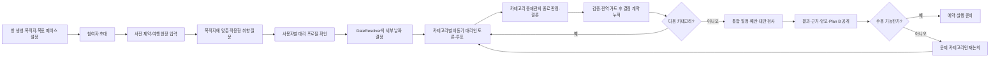
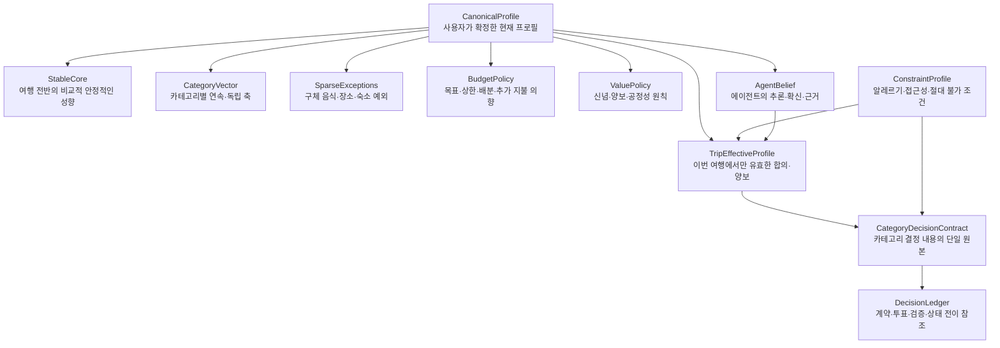
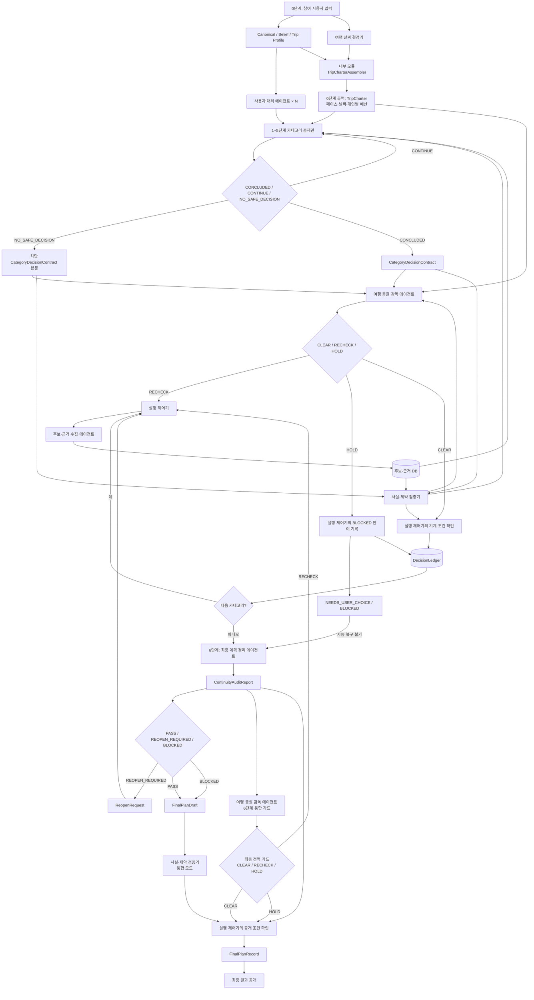
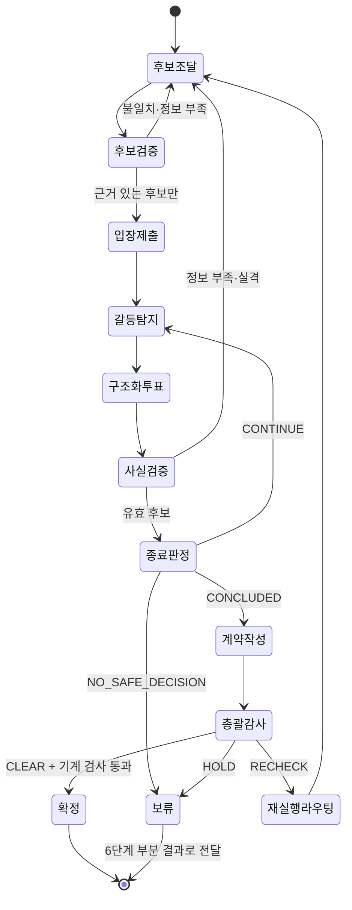
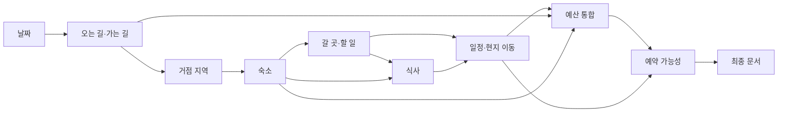

# MOA 그룹 여행 의사결정 서비스 종합 기획서

> 최초 기준 시점: 2026-08-13 KST
> 최종 수정: 2026-08-14 KST
> 문서 목적: 지금까지 논의한 서비스 구조를 제품 관점에서 통합하고, 확정된 방향과 아직 검증되지 않은 가설을 분리한다.
> 이 문서는 목표 제품 사양의 단일 종합 문서이며, 현재 코드가 모두 구현됐다는 뜻은 아니다.
> 에이전트 명칭·계층·권한은 [agent-architecture.md](agent-architecture.md), 설문·프로필은 [survey-v4-profile-v1.md](survey-v4-profile-v1.md), 외부 데이터의 허용 범위는 [provider-evidence-policy.md](provider-evidence-policy.md)를 우선한다.

## 0. 읽는 법과 근거 경계

이 문서는 다음 상태 표시를 사용한다.

- **[결정]**: 반복된 논의에서 유지하기로 한 제품 방향
- **[MVP 가설]**: 구현·사용자 실험을 시작하기 위한 수치나 세부 방식. 검증 후 변경 가능
- **[미결정]**: 아직 제품 선택이 필요한 항목
- **[구현 관찰]**: 현재 저장소 또는 배포 목업에서 확인된 상태. 목표 제품 사양과 동일하다는 뜻이 아님

근거의 우선순위는 다음과 같다.

1. 사용자가 명시한 서비스 의도와 범위
2. 지금까지 합의한 제품 원칙
3. GroupTravelBench에서 실제로 확인한 연구 결과
4. 팀 저장소와 MOA 배포 화면의 현재 구현 상태

따라서 저장소의 기존 에이전트 구성이 사용자 의도와 다르면 사용자 의도를 우선한다.

---

## 1. 서비스 정의

### 1.1 한 문장 정의

**[결정]** 목적지가 정해진 여행 방에서 각 참여자가 취향·신념·예산·제약을 입력하면 사용자 대리 에이전트들이 카테고리별로 토론·투표하고, 카테고리 중재관이 결론 계약을 만들며 여행 총괄 감독 에이전트가 날짜·예산·페이스·근거의 전역 이탈을 감시하여, 사용자는 나중에 납득 가능한 결과와 근거만 확인하는 비동기 그룹 여행 계획 서비스다.

### 1.2 해결하려는 문제

**[결정]** 정보 검색 자체보다 다음과 같은 그룹 의사결정 비용을 줄이는 것이 핵심이다.

- 구성원이 동시에 모여 계획하기 어렵다.
- 말이 많은 사람의 선호가 과대표현되고 조용한 사람의 선호가 누락된다.
- “아무거나 괜찮다”는 말과 실제 만족이 다를 수 있다.
- 링크와 후보만 쌓이고 누가 무엇을 양보했는지 남지 않는다.
- 장소·숙소·식사·동선·예산을 따로 고르면 전체 계획이 실행 불가능해진다.
- 사실처럼 보이는 가격·영업시간·예약 정보가 오래됐거나 잘못될 수 있다.

### 1.3 서비스가 약속할 결과

**[결정]** “모든 사람에게 완벽한 여행”이나 “자동 예약 완료”를 약속하지 않는다. 대신 다음을 제공한다.

- 응답·확인된 참여자의 확정 제약을 통과한 실행 가능한 초안
- 선택된 후보와 제외된 후보의 이유
- 사용자별 반영·반대·양보 기록
- 가격·시간·영업·이동 등에 대한 근거와 확인 시각
- 아직 확인하지 못한 사실과 재확인 조건
- 불만족한 카테고리만 다시 논의할 수 있는 경로

### 1.4 MVP 범위

- **[결정] 사용자층**: 한국인, 특히 20대 중심
- **[결정] 여행 범위**: 한국 국내여행과 한국인의 일본여행
- **[결정] 그룹 중심**: 개인 여행 추천보다 여러 지인의 공동 의사결정
- **[결정] 세그먼트 사용 경계**: “20대 한국인”은 후보·질문의 관련성을 좁히는 조건이지, 나이·성별만으로 취향값을 미리 채우는 근거가 아니다.
- **[미결정] 그룹 인원 하한·상한**: 현재 저장소는 3~8명을 가정하지만 제품 결정으로 확정되지 않음
- **[결정] 첫 수직 경로 인원**: 제품 전체 인원 상한과 별개로 첫 비교 fixture는 성인 3명으로 고정
- **[결정] MVP 목적지 수**: 한국 2개와 일본 2개, 총 4개 Destination Pack으로 제한
- **[결정] MVP 도시 목록**: 서울·부산·도쿄·오사카
- **[결정] 직접 예약 여부**: MVP의 핵심은 비교·검증·계획이며, 공급자와의 자동 협상이나 결제는 범위 밖이다. 예약 링크 연결 또는 예약 직전 재확인은 가능하다.

---

## 2. 전체 사용자 경험

### 2.1 목표 흐름



### 2.2 고정된 UX 원칙

- **[결정] 비동기 우선**: 사용자가 토론 중 계속 대기하지 않아도 된다.
- **[결정] 결과만이 아니라 이유를 보여준다.**
- **[결정] 초기 설문에 전체 분류축을 노출하지 않는다.**
- **[결정] 목적지 후보에서 실제 차이가 없는 축은 질문하지 않는다.**
- **[결정] 사용자가 직접 말한 제약과 에이전트가 추론한 취향을 구별한다.**
- **[결정] 재논의는 전체 여행을 초기화하지 않고 영향 범위만 다시 계산한다.**
- **[결정] 토론이 시작된 뒤에는 일반 추가 질문·투표·승인으로 사용자를 호출하지 않는다.** 정보나 권한이 부족하면 안전한 대안, 미해결 상태 또는 `BLOCKED`로 남긴다.
- **[결정] 목적지 후보를 이용한 적응형 질문은 토론 시작 전 프로필 확인 과정에서 끝낸다.**
- **[결정] 현재 자유서술 1칸, 슬라이더 수, 질문 문구, 페르소나 확인 UI는 모두 재설계 가능하다.**
- **[결정] 사용자가 강도를 평가하는 화면 척도는 5·3·1을 사용한다.** 자유서술·카드·비교의 조합은 재설계할 수 있다.

### 2.3 미응답 처리

**[결정]** 저장소의 미응답 처리 방향을 사용하되 미응답을 실제 무관심이나 만족으로 해석하지 않는다.

- 설문 전체 미응답자는 소프트 취향에만 `DefaultPersona` 중립값을 사용한다.
- 하드 제약·신념·개인 예산을 추정하지 않는다.
- 가용 날짜 교집합에서는 제외한다.
- 만족도는 실제 응답자의 만족도처럼 집계하지 않는다.
- 결과에 `미응답·날짜 미확인·취향 미대표`를 명시한다.
- 해당 사용자가 확인하기 전에는 그 사람까지 포함한 결과를 `BOOKABLE`로 표시하지 않는다.
- 특정 카테고리를 명시적으로 건너뛴 경우만 `관심 없음/결정 위임`으로 취급한다.

여기서 `DefaultPersona`는 **설문 전체를 제출하지 않은 사용자**의 소프트 필드에만 쓰는 운영상 자리표시자다. `CanonicalProfile`에 저장하거나 실제 응답자의 만족도·찬성표처럼 계산하지 않는다. 반대로 설문을 제출한 사용자가 개별 취향 질문을 건너뛴 경우에는 Survey v4 계약에 따라 중립값을 채우지 않고 `unknown/skipped`로 보존한다.

---

## 3. 사용자에게 보이는 7단계 결정 구조

| 단계 | 사용자에게 보이는 카테고리 | 핵심 결정 | 단계 안에서 즉시 검증할 것 | 다음 단계로 넘길 핵심 결과 |
| --- | --- | --- | --- | --- |
| 0 | **여행 헌장·리스크 설정** | 여행 목적·스타일, 가용 날짜·희망 박수, 하드 제약, 목표·최대 예산, 양보·공정성·분리 행동 원칙, 날씨·취소 위험 태도 | 날짜 교집합, 제약 간 모순, 예산 단위, 위임 범위, 필수 확인 누락 | 프로필 스냅샷, `DateDecision`, `TripCharter` |
| 1 | **오는 길·가는 길** | 출발지별 항공·기차·버스, 출도착 시각, 환승, 수하물·좌석, 변경·취소 가능성 | 실제 운행, 가격 시점, 출발지 일치, 환승 가능성, 취소 조건 | 도착·출발 고정점, 교통비, 사용할 수 있는 현지 시간 |
| 2 | **체류 거점·숙소** | 어느 지역을 거점으로 삼을지, 숙소 유형·객실·프라이버시·편의·가격 | 인원 수용, 객실 조합, 접근성, 예약 가능성, 체크인·취소 조건 | 거점 위치, 숙박일, 비용, 일정의 출발·복귀점 |
| 3 | **갈 곳·할 일** | 관광지, 공연, 쇼핑, 휴식, 체험, 필수·선호·선택·제외 후보 | 존재·영업시간·티켓·예약·날씨 민감도·체류시간·대략 이동 | 선택·제외 목록, 우천 대안, 소요시간·비용 |
| 4 | **식사** | 음식 취향·예외, 식당, 식사 방식, 예약 식사와 일정 배치 | 알레르기·신념·식이 조건, 영업·예약, 대기, 가격, 장소 접근 | 식사 슬롯, 선택·대안, 비용, 제약 충족 여부 |
| 5 | **날짜별 일정·현지 이동** | 방문 순서, 체류시간, 도보·대중교통·택시, 휴식·자유시간 | 모든 위치 간 이동 연결, 시간 중복, 막차, 영업시간, 체력·버퍼 | 실행 가능한 날짜별 타임라인과 이동 간선 |
| 6 | **통합 확정·실행 준비** | 앞 단계 결과의 결합, 예약 순서, Plan B, 최종 안내 | 계약 연속성, 예산·공정성·예약 가능성·증거 만료·날씨·취소·시간 초과 회귀검사 | `ContinuityAuditReport`와 `FinalPlanRecord` 또는 `ReopenRequest` |

### 3.1 단계 순서에 대한 해석

- **[결정]** 0→1→2→3→4→5→6을 기본 사용자 흐름으로 사용한다.
- **[결정]** 0단계는 입력·날짜 결정·여행 헌장 생성 단계이며 카테고리 중재관·구조화 투표·`CategoryDecisionContract`가 없다.
- **[결정]** 1~5단계만 사용자 대리인 토론과 카테고리 중재를 실행한다. 정상 종료는 `ACCEPTED`, 자동 복구 불가 종료는 `BLOCKED CategoryDecisionContract`를 남긴다.
- **[결정]** 6단계는 별도 토론이 아니라 최종 계획 정리 에이전트가 계약 연속성을 대조하고 통합 검증을 실행하는 단계다.
- **[결정]** 0단계 입력 이후 DateResolver가 세부 날짜를 확정해야 1단계를 시작한다.
- **[결정]** 예산·날씨·예약 가능성은 6단계에서 처음 보는 항목이 아니다. 각 단계에서 계속 검사하고, 6단계에서는 결합 후 다시 검사한다.
- **[결정]** 숙소 전에 고정 행사, 날짜 제한 장소, 고경쟁 예약, 반드시 갈 곳처럼 거점을 바꿀 수 있는 앵커를 내부적으로 먼저 추출한다.
- **[미결정]** 2·3·4단계를 사용자 우선순위에 따라 완전히 재정렬할지는 확정하지 않았다. MVP에서는 기본 순서와 영향 기반 재개방이 더 단순하다.

### 3.2 여행 기준서

**[결정]** 0단계가 끝나면 `TripCharter`를 잠그고, 여행 총괄 감독 에이전트가 모든 카테고리에서 이를 기준으로 사용한다.

잠금은 제자리 수정 금지다. `changeRules`와 권한 범위 안의 허용 변경도 새 `TripCharter.version`과 원장 사건을 만들며, 이전 `charterVersion`을 참조하는 영향 계약·계획 노드는 재개방 또는 `isStale=true` 처리한 뒤 새 버전으로 재검증한다.

`TripCharter`의 세 핵심 축은 다음과 같다.

1. **페이스:** 하루 핵심 앵커 1개(휴식형), 2개(균형형), 3개(활동형)
2. **날짜:** `DateResolver`가 확정한 시작일·종료일·박수·시간대·참여자 범위
3. **예산:** 개인별 목표·절대상한, 카테고리 배분, 비상금, 환율 근거

핵심 앵커 수만으로 페이스를 판정하지는 않는다. 하루 종일 걸리는 테마파크 하나와 짧은 명소 하나는 같지 않기 때문이다. 총 예정 시간, 이동시간, 최소 버퍼, 자유시간, 개인별 보행·체력 상한도 함께 검사한다. 식사·숙소 체크인·단순 환승은 핵심 앵커 수에 포함하지 않는다.

방장이 확정하는 것은 지원 범위 안의 **목적지와 목표 페이스**다. 정확한 날짜는 응답·확인된 참여자의 가용 날짜를 받아 `DateResolver`가 계산하고, 미응답자는 결과에 비포함·날짜 미확인 상태로 남긴다. 개인 예산은 각 참여자가 정한다. 장거리·현지 교통수단과 숙소·활동·식사는 이후 카테고리 토론에서 결정한다. 방장의 페이스 선택도 참여자의 안전·접근성·이동 하드 제약을 무효화하지 않는다.

---

## 4. 전 단계에 걸쳐 작동하는 검증·정책 계층

| 횡단 계층 | 시작 시점 | 각 카테고리에서 하는 일 | 마지막에 하는 일 |
| --- | --- | --- | --- |
| 예산 | 여행 헌장 | 카테고리 배정액·실제 비용·남은 금액 갱신 | 총액·수수료·여유분·비상금 재계산 |
| 날씨·외부 위험 | 여행 헌장 | 실내·실외 적합성, 계절 리스크, 일정 대안 점검 | 최신 예보·경보·운휴·휴무로 Plan B 전환 여부 판단 |
| 가격·재고·예약 | 후보 조달 | 후보가 실제 존재하며 현재 가능한지 확인 | 만료된 정보 재조회, 예약 순서와 마감 확인 |
| 인원·정원 | 방 참여 확정 | 객실·테이블·회차·좌석·차량이 전체 참여자와 허용된 배치를 수용하는지 확인 | 일부 인원 누락, 무단 분리, 정원 초과가 없는지 재검사 |
| 시간·동선 | 이동/거점 단계 | 후보 간 대략적인 연결 가능성 확인 | 모든 활동 사이의 이동 구간·버퍼·막차 검사 |
| 대리 충실도 | 설문 직후 | 대리인이 사용자의 제약·예외·강도를 왜곡하지 않는지 검사 | 최종안이 원본과 승인된 양보 범위를 지켰는지 감사 |
| 공정성·양보 | 여행 헌장 | 사용자별 만족도, 반대, 누적 양보 부담 추적 | 동일인의 반복 양보, 최저 만족도, 보상 반영 확인 |
| 근거·불확실성 | 후보 조달 | 주장마다 출처·조회시각·확신도 기록 | 오래되거나 확인 불가능한 주장을 명시하고 확정 표현 금지 |

### 4.1 날씨를 세 번 다룬다

1. **초기**: 계절·기후와 우천 시 활동 성향을 여행 헌장과 후보 구성에 반영
2. **일정 작성 시**: 실내·실외 순서와 대안 일정을 작성
3. **출발 임박·여행 중**: 실제 예보, 경보, 교통 운휴, 시설 휴무로 재검사

### 4.2 예약 가능성은 상태다

**[MVP 가설]** 후보 예약 상태는 단순한 예/아니오가 아니라 다음처럼 관리한다.

- `DISCOVERED`: 후보를 찾았지만 아직 예약 여부를 확인하지 않음
- `AVAILABLE_AT`: 특정 조회 시점에는 가능했음
- `HELD`: 일시 홀드 상태
- `BOOKED`: 예약 확정
- `SOLD_OUT`: 매진
- `EXPIRED`: 이전 확인 결과의 유효기간이 지남
- `AVAILABILITY_RECHECK_REQUIRED`: 최종 결정 전 재고·예약 가능성 재조회가 필요함

MVP의 에이전트는 이 상태를 조회·표시할 뿐 `HELD / BOOKED`를 직접 만들지 않는다. 두 상태는 사용자가 외부에서 완료했거나 향후 명시적 예약 권한이 있는 별도 실행 흐름의 영수증으로만 반영한다.

후보 재고 상태를 계약 생명주기나 사용자용 최종 상태와 섞지 않는다. 계획 그래프 노드는 별도의 다섯 번째 상태머신을 만들지 않고 `sourceVersion`, `isStale`, `staleReason`, 영향 간선 같은 의존성·신선도 메타데이터만 가진다. 실제 예약·결제 여부는 추후 `ReservationRecord`가 소유하며 `FinalPlanRecord`의 `BOOKABLE`과 구분한다.

### 4.3 인원 수 적합성은 하드 제약이다

**[결정]** 장소·객실·예약·교통의 인원 제한은 만족도에 가중하는 취향이 아니라 후보를 먼저 제거하는 실행 가능성 조건이다. 0단계에서 다음 `PartyRequirement`를 `TripCharter`에 고정한다.

```text
PartyRequirement
├─ totalParticipants / participatingUserIds[]
├─ partyComposition: adults / children / infants
├─ togethernessByUserAndCategory: userId / category ->
│  ├─ SAME_RESOURCE_REQUIRED
│  ├─ MULTIPLE_UNITS_SAME_PROVIDER_ALLOWED
│  └─ SUBGROUP_ALLOWED_WITH_CONSENT
├─ splitAuthorityByUserAndCategory: userId / category -> FORBIDDEN | ALLOWED_WITH_CONSENT | PRE_APPROVED
└─ effectiveTogethernessByCategory
```

`SAME_RESOURCE_REQUIRED`는 같은 객실·테이블·회차·편·차량을 요구한다. `MULTIPLE_UNITS_SAME_PROVIDER_ALLOWED`는 같은 숙소의 여러 객실처럼 공급자는 같지만 자원을 나눠 쓰는 것을 허용한다. 서로 다른 장소·시간·동선으로 갈라지는 것은 `SUBGROUP_ALLOWED_WITH_CONSENT`이며 기존 서브그룹 위임 범위를 추가로 통과해야 한다.

`TripCharterAssembler`는 사용자별 입력을 보존한 채 카테고리별 유효 정책을 계산한다. MVP에서는 `SAME_RESOURCE_REQUIRED`가 복수 자원 허용보다 우선하고, `FORBIDDEN`이 동의 필요·사전 승인보다 우선하는 보수적 합성을 사용한다. 더 느슨한 안을 쓰려면 영향을 받는 사용자의 새 확인 사건과 새 `TripCharter.version`이 필요하다. `splitAuthorityByUserAndCategory`는 정원 부족 상황의 자원·동선 분리 권한이고, `valueAndFairnessPolicy.subgroupDelegationByUser`는 허용 시간·비용·안전 상한이므로 둘 다 통과해야 한다.

| 카테고리 | 최소 인원·정원 검사 |
| --- | --- |
| 오는 길·가는 길 | 동일 편의 실제 잔여 좌석, 참여자 전원 배정, 필요하면 인접 좌석 조건 |
| 체류 거점·숙소 | 객실별 최대 인원, 객실 수, 침대·침구 수, 연령 정책, 같은 숙소·객실 요구 |
| 갈 곳·할 일 | 회차별 최소·최대 인원, 날짜별 잔여 정원, 단체 예약 제한 |
| 식사 | 요청 시각의 예약 가능 인원, 같은 테이블 요구, 분리 테이블 동의 |
| 날짜별 일정·현지 이동 | 택시·렌터카·셔틀 정원, 운전자 포함 여부, 수하물을 포함한 실사용 정원 |

장소의 총 좌석 수, 호텔의 전체 객실 수, 차량 모델의 명목 정원만으로 해당 날짜·시간에 그룹 전체가 이용 가능하다고 추정하지 않는다. `N`명 중 일부만 확인됐거나 정원 필드가 없으면 `PASS`가 아니라 `UNKNOWN`이다. 여러 객실·테이블·차량으로 나눠야 하면 원래 후보를 조용히 통과시키지 않고 `CapacityPlan` 또는 권한이 필요한 `SplitPlan`으로 명시한다.

---

## 5. 사용자 대리 프로필 모델

### 5.1 핵심 원칙

**[결정]** 하나의 고정 벡터에 모든 정보를 넣지 않는다. 사용자가 직접 확정한 정보, 에이전트 추론, 이번 여행의 양보를 구분한다.



### 5.2 네 개의 프로필 권위 상태와 별도 결정 이력

| 상태 | 의미 | 원본 변경 권한 |
| --- | --- | --- |
| `CanonicalProfile` | 사용자가 직접 응답·확인한 현재 프로필. 인간의 영구적인 참값이 아니라 현재 가장 권위 있는 표현 | 사용자 확인 필요 |
| `AgentBelief` | 응답과 선택으로부터 대리인이 추론한 값. 반드시 확신도와 출처가 붙음 | 에이전트가 갱신할 수 있으나 원본처럼 사용 금지 |
| `TripEffectiveProfile` | 이번 여행에서 사전 위임 또는 명시적 승인 범위 안에서 허용한 예외·양보 | 해당 여행에만 적용 |
| `ConstraintProfile` | 알레르기·접근성·절대 예산·절대 불가처럼 만족도로 상쇄할 수 없는 조건 | 사용자 확인 또는 안전 정책 필요 |

`DecisionLedger`는 프로필이 아니다. 여행 단위의 append-only 사건 색인으로서 계약·투표·검증·승인·재개방의 객체 ID와 버전만 기록한다. 선택·양보·만족도 등 결정 본문의 단일 원본은 `CategoryDecisionContract`다.

### 5.3 프로필 내부 요소

- `StableCore`: 일정 밀도, 계획 확정도, 함께 행동하는 정도처럼 여러 여행에서 비교적 유지되는 성향
- `CategoryVector`: 숙소·활동·식사·이동 등 카테고리별 수치
- `SparseExceptions`: “면요리는 좋아하지만 쌀국수는 싫다” 같은 상위 경향을 뒤집는 구체 예외
- `BudgetPolicy`: 목표 총예산, 절대 상한, 항목별 배분, 시간·편의에 대한 추가 지불 의향
- `ValuePolicy`: 종교·윤리·생활방식, 공정성·양보·분리 행동에 대한 원칙
- `ContextModifier`: 혼자/친구/연인, 여행 길이, 계절, 국가에 따라 달라지는 조건부 변화
- `ConstraintProfile`: 알레르기, 접근성, 체력 상한, 절대 불가, 시간·예산 상한

### 5.4 하나의 선호 항목이 가져야 할 정보

**[MVP 가설]** 각 항목에는 다음을 분리해 저장한다.

- 대상 축·태그·후보
- 방향: 선호 / 회피
- 값 또는 강도
- 구속력: 부드러운 선호 / 강한 선호 / 양보 불가
- 범위: 전역 / 한국 / 일본 / 특정 도시 / 이번 여행 / 특정 후보
- 조건: 계절, 동행, 일정 길이 등
- 확신도
- 출처: 직접 응답 / 실제 선택 / 에이전트 추론 / 사용자 재확인
- 갱신 시각과 유효기간

### 5.5 취향·신념·제약의 통합 항목 계약

**[결정]** 취향, 사용자의 가치·종교·윤리적 신념, 예산, 하드 제약을 서로 단절된 규칙으로 저장하지 않는다. 하나의 `DecisionProfileItem` 계약을 사용하고, 점수 크기가 아니라 `binding`과 `safety`로 권한을 구분한다.

| 필드 | 값 또는 의미 |
| --- | --- |
| `itemType` | `preference / value_policy / budget / constraint` |
| `subject` | `axis / tag / candidate / policy` |
| 값 | `value / direction / intensity` |
| `binding` | `soft / strong / hard / approval_required` |
| `safety` | 확인 실패 시 fail-closed가 필요한지 |
| `scope` | `global / country / city / trip / candidate` |
| `authority` | `canonical / agent_belief / trip_effective` |
| `source` | `direct_survey / observed_choice / agent_inference / user_confirmed` |
| 근거·시간 | `confidence / evidenceRef / updatedAt / validUntil` |

- `hard`는 다른 만족도로 상쇄하지 않는다.
- `approval_required`는 토론 중 자동 완화하지 않는다.
- 같은 신념도 사용자 선택에 따라 부드러운 선호 또는 절대 조건이 될 수 있다.
- `AgentBelief`는 `CanonicalProfile`을 자동 덮어쓰지 않는다.

### 5.6 제약과 취향은 분리한다

- **[결정]** 알레르기, 접근성·체력 상한, 절대 예산, 절대 불가 조건은 취향 점수로 상쇄할 수 없다.
- **[결정]** 비건·종교·신념·식이 원칙은 최초 설문에서 별도로 받으며 일반 취향 벡터에서 제외한다.
- **[결정]** 다만 같은 항목도 사람에 따라 절대 조건 또는 유연한 선호일 수 있으므로 사용자가 구속력을 지정해야 한다.
- **[결정]** 안전 관련 정보가 확인되지 않은 후보는 최종 후보가 될 수 없다.

---

## 6. 분류축 설계 원칙

### 6.1 선형독립을 그대로 목표로 삼지 않는다

**[결정]** “서로 완전히 선형독립인 음식·숙소 목록”을 만드는 것이 목적이 아니다. 실제 후보는 여러 속성을 동시에 가진다. 목표는 다음이다.

- 실제 후보의 선택을 서로 다르게 예측하는 축
- 비슷한 의미를 중복해서 묻지 않는 축
- 사용자가 설명을 들었을 때 의미를 이해할 수 있는 축
- 목적지 후보에 실제 분산이 있는 축
- 구체 예외가 상위 축을 뒤집을 수 있는 구조

축의 독립성은 사전 직관이 아니라 실제 응답 데이터의 상관, 선택 예측력, 추가 설명력으로 검증한다.

### 6.2 축의 종류

| 종류 | 의미 | 권장 표현 |
| --- | --- | --- |
| `T` | 서로 반대되는 두 방향 사이의 교환축 | `-2 ~ +2` 또는 의미 있는 양극 선택 |
| `I` | 다른 축과 독립적으로 높거나 낮을 수 있는 관심도 | `0 ~ 4` |
| `W` | 한정 예산을 어디에 더 쓰고 싶은지 나타내는 배분 비중 | 합계 100% + 추가 지불 가능 금액 |
| `TAG` | 구체 음식·장소·숙소 형태와 예외 | 희소 태그와 점수 |

거짓 양극축은 만들지 않는다. 예를 들어 자연과 도시는 모두 좋아할 수 있으므로, 실제로 교환관계가 입증되지 않으면 별도 `I` 축으로 둔다.

### 6.3 취향 유형·분류축·태그와 5·3·1의 관계

**[결정]** 사용자가 보는 취향 유형이나 후보 카드는 `5·3·1`로 평가한다.

- `5`: 강하게 선호하며 가능하면 보호
- `3`: 선호하지만 교환 가능
- `1`: 포함돼도 괜찮지만 우선순위가 낮음

`1`은 싫음이 아니며 `미선택/모름`은 결측이다. `피하고 싶음`은 별도 음의 선호이고, 하드 제외는 사전 제약 설문의 `binding=hard`다.

카테고리 중요도에도 5·3·1을 쓸 수 있지만, 음식·숙소·액티비티에 서로 다른 점수를 하나씩 강제 배정하지 않는다. 관련 카테고리마다 독립 응답과 중복 점수를 허용하고, 예산 배분 `W`는 별도로 받는다.

**취향 유형**은 사용자가 이해하는 카드·예시, **분류축**은 후보 비교에 재사용하는 내부 차원, **태그**는 구체 선호·예외다. 세 요소는 1:1이 아니라 다대다 관계다. 5·3·1 응답은 다음 내부 신호로 변환하며 숫자를 그대로 장기 벡터로 저장하거나 분야 점수와 곱하지 않는다.

```text
PreferenceSignal
├─ visibleRating: 5 | 3 | 1 | null
├─ axisSignals[]: axisId / direction / ordinalIntensity
├─ tagSignals[]: tagId / polarity / ordinalIntensity
├─ stance: prefer | acceptable | avoid | unknown
├─ context: country / city / trip / candidate
├─ provenance / sourceItemId / sourceCandidateIds[]
└─ confidence
```

상충하는 신호는 평균으로 지우지 않고 맥락과 출처를 보존한다. 예를 들어 `noodle +`, `ramen +`, `pho -`는 동시에 참일 수 있다.

---

## 7. 한국인 20대의 한·일 여행용 분류축 v0

> **상태: [MVP 가설]**
> 아래 47개는 백엔드 후보 라이브러리다. 통계적으로 독립성이 입증된 최종 축도 아니고, 사용자에게 전부 묻는 설문도 아니다. 목적지·후보·불확실성에 따라 일부만 활성화한다.

### A. 공통 여행 성향: 8축

| ID | 분류축 | 종류 | 의미 |
| --- | --- | --- | --- |
| C01 | 일정 밀도 | T | 여유롭게 ↔ 많이 보고 경험하기 |
| C02 | 계획 확정도 | T | 현장에서 유동적으로 ↔ 예약·일정 사전 확정 |
| C03 | 새로운 경험 선호 | I | 익숙하지 않은 지역·음식·활동을 시도하는 정도 |
| C04 | 함께 행동하는 정도 | T | 자유시간·분리 행동 ↔ 대부분 함께 행동 |
| C05 | 혼잡 허용도 | I | 대기·인파·핫플 혼잡을 감수하는 정도 |
| C06 | 생활 시간대 | T | 일찍 시작·일찍 종료 ↔ 늦게 시작·야간 활동 |
| C07 | 사진·기록 중요도 | I | 인생샷·영상·SNS 기록이 선택에 미치는 정도 |
| C08 | 편의 우선도 | I | 시간과 수고를 줄이는 편의에 가치를 두는 정도 |

### B. 오는 길·가는 길: 5축

| ID | 분류축 | 종류 | 의미 |
| --- | --- | --- | --- |
| T01 | 총 이동시간 중요도 | I | 가격보다 전체 소요시간을 줄이려는 정도 |
| T02 | 환승 회피 | I | 환승·복잡한 연결을 피하려는 정도 |
| T03 | 불편 시간대 허용 | I | 이른 아침·늦은 밤 출도착을 감수하는 정도 |
| T04 | 수하물·좌석 편의 | I | 수하물 조건, 좌석, 이동 중 편안함의 중요도 |
| T05 | 변경 가능성 중요도 | I | 저렴한 고정 상품보다 변경·취소 가능한 상품을 선호하는 정도 |

추가로 점수가 아닌 금액을 받는다.

- 직항 또는 이동시간 단축에 추가 지불 가능한 금액
- 수하물 포함에 추가 지불 가능한 금액
- 변경·취소 가능한 상품에 추가 지불 가능한 금액

### C. 체류 거점·숙소: 6축

| ID | 분류축 | 종류 | 의미 |
| --- | --- | --- | --- |
| H01 | 위치·접근성 | I | 역·중심가·주요 장소까지의 접근성 |
| H02 | 프라이버시 | I | 독실·전용 욕실·일행 간 개인 공간 |
| H03 | 객실 편안함 | I | 방 크기, 침대, 방음, 객실 컨디션 |
| H04 | 동네 분위기 | T | 조용한 주거지 ↔ 활기찬 번화가 |
| H05 | 현지형 숙박 경험 | I | 한옥·료칸·온천 숙소처럼 숙박 자체를 경험으로 보는 정도 |
| H06 | 부대시설·공용공간 | I | 대욕장, 조식, 주방, 라운지, 세탁, 일행 공용공간 |

숙소 태그 후보는 `hotel`, `business_hotel`, `ryokan`, `hanok`, `guesthouse`, `pension`, `private_bath`, `onsen`, `breakfast`, `kitchen`, `common_lounge` 등이다. 이 목록은 목적지 데이터에 맞춰 변경한다.

### D. 갈 곳·할 일: 12축

관심 분야는 서로 반대가 아니므로 독립 관심도로 둔다.

| ID | 분류축 | 종류 | 한국·일본 예시 |
| --- | --- | --- | --- |
| A01 | 역사·전통 | I | 궁궐, 성, 사찰, 신사, 전통 거리 |
| A02 | 자연·경관 | I | 바다, 산, 공원, 정원, 전망대 |
| A03 | 미술·전시·디자인 | I | 미술관, 전시, 건축, 디자인 공간 |
| A04 | 트렌드·팝컬처·핫플 | I | 팝업, 캐릭터, 애니메이션, K-pop, 유행 공간 |
| A05 | 쇼핑·시장 | I | 전통시장, 상점가, 패션, 잡화, 전자·뷰티 |
| A06 | 대형 엔터테인먼트 | I | 테마파크, 공연, 콘서트, 스포츠 관람 |
| A07 | 참여형 로컬 체험 | I | 공방, 쿠킹, 복식, 원데이 클래스 |
| A08 | 휴식·웰니스·카페 | I | 온천, 찜질방, 산책, 카페, 휴식 |
| A09 | 야간 활동 | I | 야경, 바, 클럽, 심야 상권 |
| A10 | 대표 명소·로컬 탐색 | T | 꼭 봐야 할 명소 ↔ 덜 알려진 동네 |
| A11 | 실내·실외 | T | 날씨 영향을 적게 받는 실내 ↔ 야외 중심 |
| A12 | 신체 활동 강도 | I | 산책부터 등산·서핑·스포츠까지 |

사진 중요도는 C07, 혼잡 허용도는 C05를 재사용한다.

### E. 식사: 11축

| ID | 분류축 | 종류 | 의미 |
| --- | --- | --- | --- |
| F01 | 현지 음식 탐험성 | I | 지역 대표 음식과 처음 보는 메뉴를 시도하는 정도 |
| F02 | 매운맛 | I | 후보 사이에 실제 매운맛 차이가 있을 때만 활성화 |
| F03 | 맛의 진함 | T | 담백한 맛 ↔ 진하고 기름지거나 짠 맛 |
| F04 | 날음식 | I | 회, 초밥, 육회 등 |
| F05 | 해산물 | I | 생선, 조개, 갑각류 등 |
| F06 | 발효·강한 향 | I | 김치, 젓갈, 낫토, 발효식품 등 |
| F07 | 낯선 식감·내장 | I | 곱창, 호르몬, 내장류, 미끈하거나 독특한 식감 |
| F08 | 디저트·카페 | I | 빵지순례, 디저트, 카페를 주요 일정으로 보는 정도 |
| F09 | 식사 방식 | T | 한 곳에서 제대로 식사 ↔ 여러 곳에서 간식·길거리 음식 |
| F10 | 웨이팅 허용도 | I | 유명 맛집 대기를 감수하는 정도 |
| F11 | 검증 의존도 | I | 리뷰가 많고 검증된 곳을 선호하는 정도 |

음식은 연속축만으로 표현하지 않고 희소 태그와 예외를 함께 쓴다.

- 주식: `noodle`, `rice`, `bread`
- 조리: `soup`, `grilled`, `fried`, `steamed`, `raw`
- 재료: `beef`, `pork`, `chicken`, `seafood`, `vegetable`, `offal`
- 형태: `street_food`, `course`, `izakaya`, `cafe`
- 일본 예시: `ramen`, `udon`, `soba`, `sushi`, `yakiniku`, `okonomiyaki`, `takoyaki`, `motsunabe`, `curry`, `tempura`, `natto`
- 한국 예시: `gukbap`, `kalguksu`, `naengmyeon`, `barbecue`, `sashimi`, `tteokbokki`, `stew`, `market_food`, `bakery`

예: `noodle +2`, `ramen +2`, `udon +1`, `naengmyeon -1`, `pho -2`, `heat +2`. 한국·일본 후보에 쌀국수가 없다면 `pho` 예외는 보존하되 현재 질문과 추천에서는 비활성화한다. “마라”도 한국·일본 MVP의 고정축으로 두지 않는다.

### F. 날짜별 일정·현지 이동: 5축

| ID | 분류축 | 종류 | 의미 |
| --- | --- | --- | --- |
| L01 | 지역 집중도 | T | 한 지역을 깊게 ↔ 여러 지역을 넓게 |
| L02 | 걷기 선호 | I | 가능한 거리 안에서 걷는 동선을 즐기는 정도 |
| L03 | 환승 복잡도 허용 | I | 여러 노선·버스·환승을 감수하는 정도 |
| L04 | 여유시간 필요도 | I | 일정 사이 버퍼와 자유시간의 중요도 |
| L05 | 동선 효율 우선도 | I | 분위기 좋은 우회보다 최단·최소 이동을 우선하는 정도 |

도보 가능 상한은 취향과 별도로 제약 설문에 둔다. 택시는 하나의 점수 대신 정책으로 표현한다.

- 30분 이상 절약하면 택시 허용
- 하루 택시비 상한
- 늦은 밤에는 택시 우선

### G. 예산: 6개 배분 대상 + 절대 금액

예산은 단일 “절약형↔플렉스형” 점수로 표현하지 않는다.

| ID | 예산 배분 대상 |
| --- | --- |
| B01 | 오는 길·가는 길 |
| B02 | 숙소 |
| B03 | 식사 |
| B04 | 액티비티·티켓 |
| B05 | 개인 쇼핑·카페 여유분 |
| B06 | 비상금 |

함께 받는 값:

- **개인별 목표 총예산**
- **개인별 절대 상한**
- 장거리 이동비 포함 여부
- 개인별 비상금·여유분
- 중심가 숙소 1박당 추가 지불 가능 금액
- 30분 이동 단축에 추가 지불 가능 금액
- 꼭 하고 싶은 활동에 추가 지불 가능 금액
- 독실·전용 욕실 등에 추가 지불 가능 금액

방장은 그룹 예산을 대신 결정하지 않는다. 시스템은 개인별 입력을 합산해 참고용 그룹 목표 범위를 계산할 수 있다. 개인 목표와 카테고리 배분은 조정 가능한 목표지만 절대 상한은 하드 제약이다. 공통비를 실제로 나눈 뒤 각 참여자의 부담액이 개인 절대 상한을 넘는지 검사한다. 불균등 분담은 0단계의 비용 분담 정책과 사용자별 사전 위임 범위 안에서만 자동 사용하며, 이를 넘는 부담 이전은 `NEEDS_USER_CHOICE`다.

---

## 8. 목적지에 따라 축과 질문을 활성화하는 방법

### 8.1 활성 조건

**[결정]** 축은 다음 조건을 모두 만족할 때만 사용자에게 묻는다.

1. 해당 목적지의 실제 후보에 속성 차이가 있다.
2. 서로 다른 응답이 후보 순위를 바꿀 가능성이 있다.
3. 다른 질문과 가격·거리 하나만으로 완전히 설명되지 않는다.
4. 그룹 구성원 사이의 갈등이나 만족 차이를 만들 가능성이 있다.
5. 사용자가 이해할 수 있는 질문 또는 비교 카드로 표현할 수 있다.

### 8.2 목적지별 우선 활성화 예시

> **[MVP 가설]** 실제 후보 분산을 확인하기 전의 휴리스틱이다.

네 도시 모두 공통으로 `C01 일정 밀도`, `C02 계획 확정도`, `C04 함께 행동하는 정도`, `C06 생활 시간대`, `C08 편의 우선도`를 먼저 활성화한다.

| 도시 | 초기 활성축 6개 |
| --- | --- |
| 서울 | 역사·전통, 미술·전시·디자인, 트렌드·팝컬처, 쇼핑·시장, 야간 활동, 지역 집중도 |
| 부산 | 자연·경관, 쇼핑·시장, 야간 활동, 실내↔실외, 해산물, 지역 집중도 |
| 도쿄 | 미술·전시·디자인, 트렌드·팝컬처, 쇼핑·시장, 대표 명소↔로컬 탐색, 혼잡 허용도, 지역 집중도 |
| 오사카 | 현지 음식 탐험성, 식사 방식, 웨이팅 허용도, 대형 엔터테인먼트, 대표 명소↔로컬 탐색, 지역 집중도 |

이 조합은 `[MVP 가설]`이며 실제 후보 분산에 따라 도시별 기본 6개 중 최대 2개를 교체한다.

### 8.3 질문·후보 수를 서로 구분한다

내부 축 수, 후보 풀 수, 화면에 보이는 카드 수, 사용자의 응답 횟수는 서로 다른 수치다.

| 대상 | MVP 출발 가설 |
| --- | --- |
| 전체 행동 축 라이브러리 | 47개 + 예산 배분 6항목 |
| 공통 최초 핵심축 | 5개 |
| 도시별 최초 활성축 | 6개, 후보 분산에 따라 최대 2개 교체 |
| 고정 취향 질문 | 정확히 11개 질문 블록 |
| 적응형 취향 질문 | 전체 설문에서 0~2개 |
| 취향 질문 하드 상한 | 13개 |
| 프로필 확인 포함 상한 | 14개 질문 블록 |

이 수치는 이론적 보장이 아니라 MVP 출발 휴리스틱이다.

모델 개발을 위한 내부 사례 수와 한 사람이 답하는 질문 수 또한 분리한다.

| 내부 데이터 대상 | 이전 논의의 MVP 출발 휴리스틱 | 주의 |
| --- | --- | --- |
| 한 축의 내부 수준 | 낮음·중간·높음 3수준부터 실험 | UI의 5·3·1 응답과 후보 맥락을 내부 신호로 변환 |
| 축·수준별 대표 사례 | 각 2~3개 | 의미 설명·태깅 검수용 |
| 한 축을 주로 식별하는 태깅 사례 | 약 6~9개 | 한 후보가 여러 축을 함께 가질 수 있음 |
| p차원 카테고리 후보 풀 | 약 `3p~5p` | 사용자 노출 수가 아니라 내부 후보·fixture 규모 |
| 비교 응답으로만 추정할 경우 | 약 `2p~4p`부터 실험 | 이론적 보장 아님, 적응형 중단 필요 |
| 직접 설문과 후보 비교 혼합 | 약 `0.5p~p`개의 적응형 비교부터 실험 | 실제 후보에서 지속 보정 |

날짜·하드 제약·개인 예산·가치 정책은 위 11개 취향 질문과 별도 필수 입력이다. 11개는 화면 수나 입력 필드 수가 아니라 `question_block_count`다. 한 질문 블록이 여러 축과 태그를 갱신할 수 있으며, 질문별 정확한 문구와 매핑은 [Survey v4 + Profile Schema v1](survey-v4-profile-v1.md)을 따른다.

### 8.4 적응형 질문 UX

**[결정된 원칙]**

1. **적응형 중단**: 추가 질문이 상위 후보 순위를 거의 바꾸지 않으면 멈춘다.
2. **후보 기반 사전 질문**: 실제 숙소·식당·활동 후보를 이용하되, 질문은 토론 시작 전 프로필 확인 단계에서 끝낸다.
3. **예외·놀람 탐지**: 모델 예측과 다른 선택이 나오면 “이번 여행만의 예외인지, 장기 취향 수정인지” 짧게 확인한다.
4. 한 질문이 여러 축을 함께 업데이트하도록 후보 비교를 사용한다.
5. 강도 평가가 필요한 카드에는 5·3·1을 사용한다. 최선/최악·양자 비교·묶음 선택은 별도 상호작용으로 쓸 수 있지만 같은 내부 신호 계약으로 변환한다.
6. **토론 중 질문 금지**: 토론이 시작된 뒤에는 정보 부족을 이유로 사용자를 호출하지 않는다.

**[결정] 총 질문량**

- 최초 프로필 형성: 고정 11개 취향 질문 + 적응형 최대 2개 + 프로필 확인 1개
- 같은 여행·같은 목적지 재논의: 결과 공개 뒤 불만 카테고리 중심 기본 2개, 최대 4개
- 같은 국가의 새 목적지: 목적지 특화 4~6개
- 한국↔일본처럼 국가 전환: 기본 6개, 불확실하면 최대 8개

질문량은 MVP 시작값이며 완료율·예측력으로 조정한다. 안전·하드 제약 확인은 피로 상한 때문에 생략하지 않는다.

### 8.5 중단 조건

- 미확인 하드 제약이 없음
- 각 활성 변별축에 신호 또는 명시적 `unknown`이 있음
- 미확인 축을 낮음·중간·높음으로 흔들어도 상위 후보가 안정적임
- 개인 예측 효용의 top1-top2 정규화 차이가 `0.10` 이상임
- 상위 후보를 뒤집을 가능성이 큰 예외가 발견되지 않음
- 적응형 질문 최대 2개에 도달하면 불안정하더라도 멈추고 `profileCoverage=limited`로 표시
- 사용자 피로 예산을 넘지 않음

---

## 9. 에이전트와 제어 구조

### 9.1 공식 명칭과 전체 구조

**에이전트 다섯 역할:** 사용자 대리 에이전트, 후보·근거 수집 에이전트, 카테고리 중재관, 여행 총괄 감독 에이전트, 최종 계획 정리 에이전트.

**세 개의 최상위 결정론적 제어 구성요소:** 여행 날짜 결정기, 사실·제약 검증기, 실행 제어기.

`ProviderAdapter`, `Normalizer`, `TripCharterAssembler`, `SatisfactionNormalizer`, `LeximinSelector`, `ObligationLinkChecker`는 별도 제품 역할이 아니라 후보·근거, 여행 헌장 생성, 카테고리 선택, 최종 통합 검사 내부의 결정론적 모듈이다.



### 9.2 사용자 대리 에이전트

**[결정]** 모든 사용자 대리인은 같은 기본 구조를 사용하되 다음 상태만 개인별로 격리한다.

- 사용자 확정 프로필
- 에이전트 추론과 확신도
- 이번 여행의 위임 범위
- 현재 카테고리의 후보별 지지·반대·조건부 입장
- 현재 검증 `CategoryProposal` 집합에 대한 구조화 투표
- 누적 양보 부담과 아직 충족되지 않은 강한 선호
- 발언에 사용한 프로필 근거

대리인은 다음을 할 수 없다.

- 사용자가 말하지 않은 취향을 사실처럼 추가
- 하드 제약을 다른 만족도와 상쇄
- 위임 범위 밖의 양보를 확정
- API를 조회한 척 가격·시간·재고를 발명
- 다른 사용자의 취향을 대신 수정

대리인에게 사용자에게서 얻지 않은 `주장형·조정형` 성격을 강제로 부여하지 않는다. 모든 대리인은 같은 충실도 우선 템플릿을 쓴다. 조정자는 첫 발언자·반례 검토자·대안 제시자 같은 **절차 역할**만 순환 배정할 수 있으며, 이 역할은 취향 값·만족도·양보 범위·발언 강도를 바꾸지 않는다.

### 9.3 후보·근거 수집 에이전트

**[결정]** 현재 카테고리에 필요한 숙소·항공·기차·활동·식당 후보를 허용된 API와 공식 근거에서 조달한다.

- 쿼리와 제공자 폴백을 결정한다.
- API 원본 응답은 변경하지 않고 원본 참조와 해시를 보존한다.
- Provider Adapter와 Normalizer가 통화·단위·날짜·주소를 결정론적으로 변환한다.
- 정규화한 `CandidateRecord`와 `EvidenceSnapshot`을 DB에 저장한다.
- 에이전트가 추론한 태그는 제공자 사실과 구분한다.

검색 결과만으로 예약 가능이나 `VERIFIED`를 선언할 수 없으며 후보를 최종 선택하지 않는다.

### 9.4 카테고리 중재관

**[결정]** 1~5단계의 현재 카테고리 안에서 사용자 대리 에이전트들의 충돌을 중재하고, 제약을 통과한 실행 계획안 중 가장 타당한 결론과 토론 종료 여부를 판정해 `CategoryDecisionContract`를 만든다. 0단계와 6단계에는 카테고리 중재관이 없다.

- 대리인별 지지·반대·조건부 입장 수집
- 갈등·공통점·미해결 사실 정리
- 검증기에 사실 쟁점 확인 요청
- 타협안·대체안·제한적 분리안 제시
- 검증된 원자 후보로 소수의 `CategoryProposal` 구성 후 시간·동선·비용·제약 검증 요청
- 토론 마지막 구조화 투표 수집
- 투표 기반 만족도와 leximin 규칙에 따른 카테고리 결론 선택
- `CONCLUDED / CONTINUE / NO_SAFE_DECISION` 종료 판정
- `CONCLUDED`이면 정상 계약, `NO_SAFE_DECISION`이면 선택안 없이 `blockReason`을 가진 차단 계약 작성
- 선택·제외·양보·다음 카테고리 의무 정리. `CONTINUE`는 체크포인트만 저장

에이전트 투표는 해당 카테고리 결론의 직접 근거지만 단순 다수결로 처리하지 않는다. 하드 제약·개인 예산·실행 가능성을 먼저 통과시키고, 사용자별 만족도 벡터에 leximin을 적용한다. 카테고리 중재관은 `TripCharter`를 바꾸거나 검증되지 않은 사실을 확정하거나 상태를 직접 `ACCEPTED`로 만들 수 없다.

### 9.5 여행 총괄 감독 에이전트

**[결정]** 사용자가 말한 오케스트레이션 역할의 공식 명칭이다. 여행 전체에서 페이스·확정 날짜·개인별 예산이 유지되는지와 카테고리 계약이 검증된 근거를 사용하는지를 감시한다.

- 카테고리 시작 전 `TripCharter`와 이전 승인 원장 확인
- 카테고리 범위·페이스·날짜·예산 이탈 감지
- 대리인의 근거 없는 주장 감지
- 후보·근거 수집 에이전트에 재조회 요청
- 사실·제약 검증기에 가격·주소·예약 날짜·재고·동선 검사 요청
- 계약에 전역 위반이 없는지 `CLEAR / RECHECK / HOLD`로 감사
- 상위 변경 시 영향받는 하위 노드 재개방 요청
- 6단계에서 `ContinuityAuditReport`가 현재 원장·계약 버전을 참조하고 `PASS`인지 확인
- 마지막 통합 결과의 `TripCharter`, 근거, 날짜·예산·페이스·하드 제약 이탈 감사

카테고리 토론의 종료와 결론은 카테고리 중재관의 권한이고, 계약 사이의 결정 누락·의미 변화·의무 승계 판정은 최종 계획 정리 에이전트의 권한이다. 총괄 감독 에이전트의 `CLEAR`는 별도 찬성표가 아니다. 1~5단계에서는 날짜·예산·페이스·근거·하드 제약 위반이 없다는 전역 가드 결과이고, 6단계에서는 이에 더해 현재 원장 버전의 `ContinuityAuditReport`가 `PASS`라는 뜻이다. 총괄 감독 에이전트는 이 의미 판정을 다시 수행하거나 덮어쓸 수 없다. 또한 숫자·주소·예약 가능성을 LLM 눈대중으로 통과시키지 않으며, `VerificationReceipt`가 `FAIL / UNKNOWN / STALE / CONTRADICTED`이면 이를 덮어쓸 수 없다. 새 후보를 발명하거나 카테고리 중재관 대신 결론을 다시 쓰거나 DB 상태를 직접 변경할 수도 없다.

### 9.6 여행 날짜 결정기

**[결정]** 방장은 여행 날짜나 대략 기간창을 대신 확정하지 않는다. 응답·확인된 참여자의 가능 날짜·불가 날짜·희망 박수·유연성을 받아 별도 `DateResolver` 논리 역할이 세부 날짜를 정한다. 미응답자는 계산에서 제외되고 비포함·날짜 미확인 상태로 표시한다.

- 핵심 계산은 결정론적 코드가 담당한다.
- 날짜 교집합, 박수, 출발지, 개인 예산, 계절·날씨·휴관·가격 범위를 함께 본다.
- 선택 날짜와 최대 2개의 대안, 참석 가능 인원, 점수 분해, 근거를 남긴다.
- 응답·확인된 참여자 전원이 가능한 날짜가 없으면 허용된 박수 유연성 안에서 다시 계산한다.
- 그래도 실패하면 카테고리 토론을 시작하지 않고 계산된 대안을 사전 제시한다. 이는 토론 중 개입이 아니다.

0단계에서는 가용성·박수·시간대·하드 제약으로 가능한 날짜 집합을 먼저 만든다. Destination Pack의 계절·휴관 정보와 확보된 사전 가격 범위는 순위 보조이며, 아직 조회하지 않은 실시간 교통 재고를 있는 것으로 가정하지 않는다. 1단계에서 정확한 운행·좌석·가격을 검증해 모두 실격되면 사전 승인된 날짜 유연성 안에서 저장된 대안을 다시 계산한다.

### 9.6.1 교통수단 결정

**[결정]** 방장은 항공·기차·버스·배·택시 같은 교통수단을 미리 확정하지 않는다.

- 장거리 이동은 1단계 `오는 길·가는 길`에서 후보·근거 수집, 사실 검증, 대리인 토론·투표, 중재관 결론을 거친다.
- 도보·대중교통·택시·렌터카 조합은 5단계 `날짜별 일정·현지 이동`에서 일정과 함께 정한다.
- 개인이 절대 이용할 수 없는 수단은 선호가 아니라 하드 제약으로 제거한다.
- 선택 날짜의 운행·좌석·가격이 확인되지 않은 후보는 결론 후보가 될 수 없다.
- 모든 교통 계획안이 실격되면 사전 입력된 날짜 유연성 안에서 `DateResolver` 대안을 자동 재검토한다. 유연성 밖의 날짜나 목적지·페이스·개인 절대예산 변경은 사용자 권한 없이는 적용하지 않는다.

### 9.7 사실·제약 검증기

**[결정]** Python 중심의 결정론적 코드로 가격, 통화·세금, 주소·place ID·좌표, 정확한 예약 날짜·인원·객실, 그룹 정원·참여자 배정, 영업시간, 이동 연결, 페이스, 개인별 예산, 근거 만료를 검사한다.

결과는 `PASS / FAIL / UNKNOWN / STALE / CONTRADICTED` 중 하나의 `VerificationReceipt`로 반환한다. 예약 가능성은 영구 boolean이 아니라 정확한 날짜·인원·객실 또는 시간 슬롯에서 특정 시각에 가능했다는 `AVAILABLE_AT` 증거다.

### 9.8 실행 제어기

**[결정]** 에이전트가 아니라 상태머신·Worker다. 호출 순서, 큐, 체크포인트, 재시도, 턴·시간·비용 상한, 계약 버전·잠금, 승인된 DB 상태 전이를 담당한다. 6단계에서는 입력 원장·계약 버전의 스냅샷을 잠그고, `ReopenRequest`의 기준 버전과 영향 카테고리를 검사해 재개방을 적용한다. 정상 경로는 연속성 `PASS` + 통합 검사 `PASS` + 최종 가드 `CLEAR`일 때만 `VERIFIED_DRAFT / BOOKABLE` 결과를 저장·공개한다. 자동 복구 불가 경로는 연속성 `BLOCKED` 또는 최종 가드 `HOLD`, 구조화된 `blockReason`, 기존 사실의 검증·불확실성 표시가 완전할 때만 `NEEDS_USER_CHOICE / BLOCKED` 부분 결과를 공개한다. 예전 저장소의 결정론적 `Orchestrator`는 이 이름으로 바꾼다.

### 9.8.1 내부 결정론적 모듈

- 후보·근거 파이프라인: `ProviderAdapter`, `Normalizer`
- 여행 헌장 생성: `TripCharterAssembler`
- 카테고리 선택 정책: `SatisfactionNormalizer`, `LeximinSelector`
- 최종 통합 검사: `ObligationLinkChecker`

이 모듈은 같은 입력에 같은 결과를 반환하며 별도 에이전트·최상위 실행 주체·공식 제품 역할 수에 포함하지 않는다.

### 9.9 최종 계획 정리 에이전트

**[결정]** 정상 경로의 모든 승인 결정 원장을 통합해 최종 여행안을 만들고, 자동 복구 불가 경로에서는 승인된 범위와 종결 차단을 구분한 부분 결과를 만드는 별도 에이전트를 둔다.

- `TripCharter`와 `DecisionLedger.latestAcceptedContractByCategory`가 참조하는 모든 승인 계약을 시간순으로 대조
- 자동 복구가 불가능한 현재 `BLOCKED` 계약과 `blockReason` 확인
- 앞서 확정한 결정의 누락·의미 변경·딴길 이탈 탐지
- 카테고리별 최신 승인 계약이 앞선 계약의 의무 ID를 `obligationFulfillments`로 이어받았는지 확인
- 구조적 참조 검사와 의미 연속성 판단을 `ContinuityAuditReport`로 생성
- `REOPEN_REQUIRED`이면 영향 카테고리를 지정한 `ReopenRequest` 생성
- `PASS`이면 일정·개인별 예산·예약 준비·Plan B를 포함한 `FinalPlanDraft` 생성
- `BLOCKED`이면 승인된 범위·차단 사유·미작성 하위 범위를 구분한 부분 `FinalPlanDraft` 생성
- 선택 이유, 미반영 취향, 양보, 불확실성 설명
- 최종 상태 계산에 필요한 근거 구조화

최종 계획 정리 에이전트는 카테고리 결정을 임의로 덮어쓰거나 새 후보·사실·취향을 만들 수 없고, `ReopenRequest`를 직접 DB 상태 전이로 적용할 수도 없다. `ObligationLinkChecker`가 의무 ID·계약 참조의 구조적 누락을 검사하고 최종 계획 정리 에이전트가 의미 연속성을 판정한다. 기계적 최종 통과 여부는 사실·제약 검증기의 통합 모드가 판정하고, 총괄 감독 에이전트가 전체 기준 이탈과 보고서 버전을 최종 감사한다.

### 9.10 에이전트 수는 아직 배포 결정이 아니다

**[미결정]** 논리 역할마다 별도 프로세스·모델을 둘지, 하나의 모델을 역할별 프롬프트로 재사용할지는 결정되지 않았다. “멀티 에이전트”라는 표현만으로 에이전트 수를 늘리지 않는다.

---

## 10. 1~5단계 한 카테고리의 토론 프로토콜



`보류`가 자동 복구 가능한 사실·근거 문제라면 재조달한다. 사용자 권한이나 외부 상태 없이는 해결할 수 없는 종결 차단이면 토론 중 사용자를 부르지 않고 6단계로 넘겨 부분 결과와 `blockReason`을 공개한다.

### 10.1 권장 단계

1. 실행 제어기가 `TripCharter`와 이전 `ACCEPTED` 계약을 고정한다.
2. 후보·근거 수집 에이전트가 근거 있는 원자 후보를 조달하고 DB에 정규화 저장한다.
3. 카테고리 중재관이 원자 후보로 소수의 `CategoryProposal`을 만들고 사실·제약 검증기가 가격·주소·예약 날짜·재고·시간·동선·제약을 검사한다.
4. 각 사용자 대리 에이전트가 `지지 / 반대 / 조건부` 입장과 근거 프로필 항목을 제출하고 토론한다.
5. 각 대리인이 같은 버전의 검증 계획안 집합에 구조화 투표를 제출한다.
6. 카테고리 중재관이 충돌을 조정하고 `CONCLUDED / CONTINUE / NO_SAFE_DECISION`을 판정한다.
7. `CONCLUDED`이면 정상 계약 본문을, `NO_SAFE_DECISION`이면 선택안 없는 차단 계약 본문과 `blockReason`을 만든다. `CONTINUE`는 체크포인트만 저장한다.
8. 사실·제약 검증기가 정상 계약의 숫자·날짜·예산·동선 또는 차단 사유의 근거 완전성을 검사한다.
9. 여행 총괄 감독 에이전트가 기준 이탈·대리 충실도·근거 완전성을 `CLEAR / RECHECK / HOLD`로 감사한다.
10. 실행 제어기가 `CONCLUDED + 검증 통과 + CLEAR`를 확인한 뒤 `ACCEPTED` 계약을 저장한다.
11. 다음 카테고리에는 대화 전문이 아니라 승인된 계약만 전달한다.

사용자 정보가 부족하더라도 토론 중 추가 질문으로 중단하지 않는다. 확인된 프로필 범위에서 안전한 안을 만들 수 없으면 `NEEDS_USER_CHOICE` 또는 `BLOCKED` 사유를 원장에 남기고 마무리 단계에서 공개한다.

### 10.2 수렴 체크포인트

**[결정]** 긴 자유 대화를 그대로 누적하지 않는다. 제한된 턴 또는 주요 제안마다 다음을 갱신한다.

- 확인된 선호와 출처
- 미확인 선호
- 충돌 항목
- 사용자별 양보 상태
- 검증된 후보와 실격 후보
- 해결되지 않은 사실
- 다음 행동

턴 수와 체크포인트 간격은 그룹 크기·갈등 수·목적지 수에 따라 달라져야 하며 아직 확정 수치가 아니다.

---

## 11. 1~5단계 카테고리 결정 계약

**[결정]** 1~5단계에서 다음 카테고리에는 대화 전문이 아니라 아래 구조를 전달한다. 0단계와 6단계는 이 계약을 만들지 않는다.

`CandidateRecord`는 호텔 한 곳·식당 한 곳·교통편 한 개 같은 원자 후보다. 구조화 투표의 단위는 복수 장소, 식사 슬롯, 참여자 배정, 순서·이동, 사용자별 비용을 묶은 `CategoryProposal`이다. 계획안 버전은 불변이고 모든 대리인은 동일한 `proposalSetVersion`을 투표하며, 검증을 통과하지 못한 계획안은 선택 대상에서 제외한다.

- 카테고리·불변 계약 버전·`TripCharter` 버전과 별도 `CategoryContractView.lifecycleStatus`
- 선택된 `CategoryProposal`과 선택 이유
- 제외된 계획안, 포함·제외 원자 후보와 이유
- 사용자별 지지·반대·조건부 입장
- 사용자별 구조화 투표와 근거 프로필 항목
- 사용자별 예상 만족도와 미충족 강한 선호
- 선택 규칙의 계산·타이브레이크 추적
- 이번 카테고리에서 발생한 양보와 적용 범위
- 서브그룹이 있다면 참여자·분리 시간·각 동선·재합류·추가 비용·안전·사전 위임 범위와 동의 근거
- `CapacityPlan`: 요청 인원, 확인 정원, 객실·테이블·좌석·차량 단위 배정, 미배정 인원, 함께 이용 조건, 근거
- 하드 제약과 통과 여부
- 사용자별 예산 영향, 카테고리 사용액, 남은 예산
- 페이스·확정 날짜·일정·거점·이동에 미치는 영향
- 근거 ID, 공급자, 조회 시각, 만료 시각
- `CategoryContractView`의 `VerificationReceipt`·가드 결과 참조와 투영 상태
- 확인하지 못한 사실
- 차단 시 `blockReason`: 사유 유형, 재시도 가능 여부, 영향 객체, 필요한 행동
- 사용한 가정
- 다음 카테고리가 지켜야 할 조건
- 각 조건의 안정적인 `obligationId`, 처음 소비할 `targetCategory`, 관련 결정·객체 참조
- 받은 조건별 `obligationFulfillments`: 충족·계속 승계·충돌·미해결 상태와 이행 참조
- 재논의 조건
- 카테고리 중재관의 `CONCLUDED / CONTINUE / NO_SAFE_DECISION` 결과
- 여행 총괄 감독 에이전트의 `CLEAR / RECHECK / HOLD` 전역 가드 참조

다음 카테고리의 사용자 대리 에이전트는 최신 `CategoryContractView.lifecycleStatus=ACCEPTED`인 계약만 권위 있는 이전 결론으로 읽는다.

`CategoryDecisionContract`는 한 카테고리·한 버전의 불변 스냅샷이다. 변경할 때는 기존 계약을 덮어쓰지 않고 새 버전을 만든다. 계약 작성 뒤 생기는 검증 영수증, 가드 결과, 생명주기 상태는 원본 계약에 추가하지 않고 최신 원장 사건에서 `CategoryContractView`로 투영한다. `DecisionLedger`는 계약 본문을 복제하지 않고 다음만 append한다.

- 계약·투표·검증 객체 ID와 버전
- 생성·검증·승인·재개방·교체 사건
- 이전 상태와 다음 상태
- 사건 사유·근거 참조
- `latestAcceptedContractByCategory`

따라서 “승인된 카테고리 원장”은 별도 데이터가 아니라 `DecisionLedger`에 기록된 `ACCEPTED CategoryDecisionContract`를 뜻한다.

`latestAcceptedContractByCategory`는 원장 사건에서 만든 파생 색인이다. 재개방 사건이 생기면 해당 카테고리의 활성 색인을 비우고, 대체 계약 버전이 `ACCEPTED`된 뒤에만 새 참조를 넣는다. 과거 승인 계약은 이력으로 남지만 다음 카테고리와 6단계의 권위 입력으로 사용하지 않는다.

### 11.1 상태 계층과 변환

| 층 | 상태 |
| --- | --- |
| 중재 결과 | `CONCLUDED / CONTINUE / NO_SAFE_DECISION` |
| 감독 결과 | `CLEAR / RECHECK / HOLD` |
| 계약 생명주기 | `CategoryContractView.lifecycleStatus`: `DRAFT / VALIDATING / ACCEPTED / REOPEN_REQUIRED / BLOCKED` |
| 사용자용 최종 상태 | `VERIFIED_DRAFT / BOOKABLE / NEEDS_USER_CHOICE / BLOCKED` |

| 조건 | 계약 상태·다음 행동 | 사용자 표시 |
| --- | --- | --- |
| `CONTINUE` | 계약 없음, 라운드 체크포인트 저장 후 토론 계속 | 없음 |
| `CONCLUDED`, 검사 대기 | `VALIDATING` | 없음 |
| `CONCLUDED` + 필수 검증 `PASS` + `CLEAR` | `ACCEPTED` | 최종 통합 전에는 없음 |
| 검증 실패·만료·상충 또는 `RECHECK`, 자동 복구 가능 | `REOPEN_REQUIRED`, 재조달·재토론 | 없음 |
| `NO_SAFE_DECISION` 또는 `HOLD`, 자동 복구 불가 | 계약 `BLOCKED`, 6단계 부분 결과 구성 | 사용자 권한 필요 시 `NEEDS_USER_CHOICE`, 외부 장애·실행 불가면 `BLOCKED` |
| 1~5단계 다섯 계약 승인 + 연속성·통합 검증 완료 | `FinalPlanRecord` | 예약 기준 통과 시 `BOOKABLE`, 아니면 `VERIFIED_DRAFT` |

검증 `UNKNOWN`은 통과가 아니다. 자동 재조회 가능하면 `REOPEN_REQUIRED`, 사용자 결정이나 외부 상태 변화가 필요하면 `BLOCKED`로 변환한다. 완료 신호는 계약 상태와 충돌하지 않도록 `SOURCING_* / CATEGORY_* / GUARD_* / FINAL_*` 접두어를 사용한다.

### 11.2 6단계 연속성 보고서

```text
ContinuityAuditReport
├─ reportId / tripId / sourceLedgerId
├─ acceptedContractRefs[] / latestAcceptedContractByCategory
├─ terminalBlockedContractRefs[]
├─ structuralChecks[]: obligationRef / sourceContractRef / targetContractRef / status
├─ semanticChecks[]: sourceContractRef / targetContractRef / findingRefs[] / status
├─ affectedCategoryRefs[]
├─ status: PASS | REOPEN_REQUIRED | BLOCKED
├─ blockReason?
├─ modelAndPromptVersion / generatedAt
└─ explanation
```

구조 검사의 상태는 `PRESERVED / MISSING / UNRESOLVED`, 의미 검사의 상태는 `PRESERVED / SEMANTIC_DRIFT / UNRESOLVED`다. `ObligationLinkChecker`가 구조 검사를 담당하고 최종 계획 정리 에이전트가 의미 검사를 담당한다. 다섯 활성 승인 계약과 두 검사 통과가 있어야 `PASS`다. 자동 복구 가능한 누락·변화는 `REOPEN_REQUIRED`, 사용자 권한이나 외부 상태 없이는 풀 수 없는 종결 차단은 `BLOCKED`다.

### 11.3 계약 전달 예시

예:

> A와 B는 확정, C는 우천 시 제외한다. A→B 이동은 현재 조회 기준 약 35분이며 일정 단계에서 순서를 바꿀 수 있다. 사용자 2는 B 방문을 조건부로 양보했으므로 이번 여행의 활동 단계에만 반영하고, 이후 식사 결정에서 누적 양보 부담을 고려한다. C의 휴무일과 티켓 재고는 최종 확정 전에 다시 조회한다.

---

## 12. 공정성·양보·서브그룹 정책

### 12.1 결정 우선순위

**[결정] 제약 통과 후 leximin**

1. 하드 제약과 실행 가능성을 통과한 `CategoryProposal`만 비교한다.
2. 개인 예산 상한까지 통과시킨 뒤 사용자 대리인들의 구조화 투표를 받는다.
3. 투표와 프로필 근거에서 사용자별 만족도를 활성 항목 기준으로 같은 범위에 정규화한다.
4. 만족도 벡터를 낮은 순서로 정렬하고, 가장 낮은 사람부터 차례로 개선되는 계획안을 선택한다(`leximin`).
5. 사실상 동률이면 그룹 평균 만족도를 높인다.
6. 다시 동률이면 누적 양보 부담의 최댓값과 사용자 간 격차를 줄인다.
7. 마지막으로 비용·동선·취소 가능성·근거 품질을 비교한다.

저장소의 Maximin 방향은 유지하되, 최저점이 같은 후보에서는 두 번째로 낮은 사용자부터 계속 보호하기 위해 leximin으로 구체화했다. 수치형 만족도 하한, 정규화식, 사실상 동률의 허용 오차는 사용자 테스트 전까지 **[MVP 가설]**이다.

정규화 만족도는 내부 후보 비교값이다. 사용자에게는 보정되지 않은 소수점 백분율 대신 `강한 선호 반영 / 조정 가능한 선호 반영 / 미반영 / 양보`와 근거를 보여준다.

### 12.2 양보 기록

논문의 “사용자당 최대 2회” 규칙은 그대로 채택하지 않는다. 양보는 횟수보다 다음 부담을 기록한다.

- 원래 선호 강도
- 여행에서 영향을 받는 시간
- 대체안의 존재 여부
- 비용 증가 또는 경험 손실
- 같은 사용자의 이전 양보 누적

양보 내용은 `CanonicalProfile`을 덮어쓰지 않고 `TripEffectiveProfile`과 해당 `CategoryDecisionContract`에 남긴다. `DecisionLedger`에는 그 계약·상태 전이의 참조만 기록한다.

양보 크레딧은 원장과 최종 동점 해소에만 사용한다. 대리인의 취향 점수, 반대 강도, 말투를 인위적으로 키우는 데 사용하지 않는다.

### 12.3 제한적 서브그룹

**[MVP 가설]** 갈등이 해결되지 않을 때 활동·식사·일부 현지 이동에서만 일시 분리를 허용한다. 오는 길·가는 길과 거점 숙소는 기본적으로 공동 자원으로 취급한다. 같은 숙소 안의 복수 객실처럼 `PartyRequirement`가 미리 허용한 자원 단위 배치는 `CapacityPlan`이며, 서로 다른 장소·시간·동선으로 갈라지는 `SplitPlan`과 구분한다. 원치 않는 사용자를 점수 때문에 혼자 분리하지 않으며, 영향받는 당사자의 동의를 필요로 한다. 자동 채택은 0단계에서 사용자가 미리 위임한 인원·시간·비용·안전 범위 안에서만 가능하다. 이를 넘는 구체 분리안은 대리인이 동의를 추정하지 않고 `NO_SAFE_DECISION / HOLD`로 6단계 부분 결과에 넘긴다. `SplitPlan`에는 다음을 기록한다.

- 추가 비용
- 재합류 시간과 장소
- 안전과 연락 가능성
- 개별 이동 난이도
- 그룹이 함께 보내는 시간의 감소
- 분리 참여자와 각자의 명시적 동의 상태

---

## 13. 재논의와 새 목적지 적응

### 13.1 같은 여행의 재논의

**[결정]** 결과가 마음에 들지 않으면 전체 여행이 아니라 해당 카테고리와 영향을 받은 하위 카테고리만 다시 연다.

- 재논의는 **최종 결과가 공개된 뒤에만** 시작한다.
- 사용자는 `이 부분 다시 진행하기` 버튼으로 카테고리, 결정 카드, 후보 또는 근거 문장을 지목한다.
- 이유 유형은 `취향 오해 / 사실 오류 / 새 제약 / 예산 변경 / 다른 후보 / 기타`로 구분한다.
- 한 문장 이유를 받은 뒤 기본 2개, 최대 4개의 짧은 확인만 추가한다.
- 자유서술·카드 비교·직접 수치 수정의 최종 UI 조합은 아직 확정하지 않는다.
- 사용자가 지적한 발언·계약 결론·후보를 재검증할 수 있어야 한다.
- 실행 전 다시 계산될 노드, 예상 시간·비용, 예약 위험을 보여준다.
- 실행 후 후보·만족도·예산·이동시간·양보·근거의 전후 차이를 보여준다.
- 이번 여행의 불만은 우선 `TripEffectiveProfile`을 수정한다.
- 한 번의 불만을 장기 취향으로 자동 승격하지 않는다.

**[MVP 상한]**

- 참여자 1명당 기본 1회의 자동 재논의
- 방 전체 기본 3회의 자동 재논의
- 같은 결정은 같은 계획 버전에서 기본 1회
- 알레르기·접근성·새 하드 제약·명백한 사실 오류 수정은 상한에서 제외
- 한 번의 재논의 안에서 내부 토론 재개는 최대 2회

### 13.2 새로운 목적지

- 기존 `CanonicalProfile`과 확정된 예외를 재사용한다.
- 이전 여행에서만 유효했던 양보는 가져오지 않는다.
- 같은 국가의 새 목적지는 목적지 특화 4~6개를 시작 가설로 둔다.
- 한국↔일본 전환은 기본 6개, 불확실하면 최대 8개를 시작 가설로 둔다.
- 실제 후보 차이가 없는 축은 묻지 않는다.

### 13.3 프로필 학습 경계

- 같은 유형의 선택이 반복돼도 `AgentBelief`만 우선 갱신한다.
- 장기 프로필 변경은 사용자 확인 또는 명시적인 승격 규칙이 필요하다.
- “이번 식당만 싫음”과 “이 음식 유형을 앞으로 피함”을 구분한다.

### 13.4 영향 기반 재실행

상위 결정이 바뀌면 하위 결정을 삭제하거나 별도 상태값으로 덮어쓰지 않고 `isStale=true`, `staleReason`, 원본 버전을 기록한 뒤 다시 검증한다.



실제 의존성은 후보·목적지에 따라 양방향일 수 있다. 예를 들어 고정 공연이나 예약 식당이 거점 선택을 바꿀 수 있으므로 앵커 추출과 재검증이 필요하다.

`ReopenRequest`는 `trigger`, 요청자·권한 참조, `sourceLedgerId / sourceLedgerVersion`, 원인이 된 연속성 보고서 또는 최종 계획 참조, 영향 단계·카테고리·헌장 필드·계약·계획 노드, 이유·근거, 필요한 행동과 `authorityRequired`를 포함한다. 에이전트와 사용자 흐름은 요청만 만들며, 실행 제어기가 원장 버전, 의존성 범위, `TripCharter.changeRules`, 위임 권한을 검사한 뒤 활성 색인과 `isStale` 메타데이터를 변경한다. 날짜 대안처럼 사전 승인된 유연성은 자동 재실행할 수 있지만 목적지·페이스·개인 절대예산은 권한자 확인 없이 바꾸지 않는다.

---

## 14. 사실 근거와 환각 방지

### 14.1 기본 규칙

- 에이전트는 조달·검증된 후보 ID 안에서 논쟁한다.
- 가격, 영업시간, 이동시간, 재고, 취소 조건을 모델 기억으로 확정하지 않는다.
- 확인되지 않은 값은 `unknown` 또는 `estimated`로 남긴다.
- 안전·하드 제약 관련 확인이 실패하면 fail-closed한다.
- 검색 결과는 예약 가능 또는 현재 가격과 동일하지 않다.
- 동일 후보라도 조회 시점과 공급자가 다르면 별도 증거로 취급한다.

### 14.2 EvidenceSnapshot 초안

**[MVP 가설]**

- `evidence_id`
- `candidate_id`, 제공자 `place_id`
- `provider`
- `tool_or_endpoint`
- 정규화한 요청 인자: 여행 날짜·시간대, 전체 인원·연령 구성, 객실·테이블·좌석·차량 조합 또는 예약 슬롯, 통화
- 원본 응답 참조와 해시
- 반환된 사실과 단위
- 정규화 주소, 위도·경도, 행정구역
- `observed_at`
- `valid_until` 또는 재조회 조건
- `confidence`: `unknown / estimated / live`
- 원문 또는 원 응답 참조
- 데이터 사용 권리·표시 조건

후보·근거 수집 에이전트는 API 원본을 임의로 고치지 않는다. 원본을 보존한 뒤 결정론적 Provider Adapter와 Normalizer가 DB 스키마로 변환한다. 에이전트가 만든 의미 태그는 `derived_by_agent`로 표시해 공급자가 직접 제공한 사실과 구분한다.

총괄 감독 에이전트가 환각 검사 책임을 가지되, 사실·제약 검증기가 만든 `VerificationReceipt`를 사용한다. 검증 상태는 `PASS / FAIL / UNKNOWN / STALE / CONTRADICTED`이며 `UNKNOWN`은 통과가 아니다. 예약 가능성은 정확한 날짜·인원·객실 또는 시간 슬롯에서 특정 조회 시각에 가능했다는 상태로만 표현한다.

### 14.3 결정론적 일정 검사

최소한 다음을 자동 검사한다.

- 출발·도착 도시와 교통편의 일치
- 모든 도시 간 이동 구간 존재
- 모든 활동 사이의 현지 이동 구간 존재
- 숙박일 전체 커버, 중복 예약 없음
- 시간 역전·중복 없음
- 영업시간·예약 슬롯 충족
- 모든 참여자의 객실·테이블·좌석·회차·차량 배정과 정원 충족
- 허용되지 않은 분리 또는 미배정 참여자 없음
- 하루 순서 단조성
- 모든 항목의 비용 존재와 총액 일치
- 참여자·서브그룹 배정 유효
- 체크인·체크아웃, 환승·대기 버퍼
- 막차·운휴·우천 대안
- 근거 만료 여부

---

## 15. 결과 화면이 보여줘야 할 것

**[결정]** 최종 화면은 단순 일정표가 아니다.

1. 여행 개요: 날짜, 총예산, 거점, 예약 필요 건수, 현재 검증 수준
2. 날짜별 일정과 모든 이동 구간
3. 교통·숙소·식사·활동의 예약 준비 상태
4. 핵심 결정과 선택 이유
5. 사용자별 반영된 취향과 미반영된 취향
6. 양보·조건부 합의 기록
7. 제외 후보와 이유
8. 근거 출처·조회 시각·불확실성
9. 우천·매진·취소·시간 초과 Plan B
10. 카테고리별 재논의 진입점

회의록 전문은 투명성을 위해 열람할 수 있지만, 기본 화면에서는 결정 계약과 핵심 근거를 우선한다.

최종 계획 정리 에이전트는 아래 사용자용 내용의 `FinalPlanDraft`를 만든다. 실행 제어기가 같은 입력 스냅샷의 연속성·통합 검증·전역 가드를 확인한 뒤 불변 `FinalPlanRecord`로 봉인한다.

- `FinalPlanDraft`: `sourceLedgerId`, `sourceLedgerVersion`, `acceptedContractRefs[]`와 아래 계획 내용
- `FinalPlanRecord`가 추가: `sourceDraftRef`, `status`, `statusValidUntil`, `recheckAt`, 최종 검증·가드 참조
- `status`: `VERIFIED_DRAFT / BOOKABLE / NEEDS_USER_CHOICE / BLOCKED`
- `terminalBlockedContractRefs[]`
- `continuityAuditReportRef`
- `blockReason?`: 차단 상태일 때 사용자 권한 필요·외부 장애·실행 불가를 구분
- 여행 개요와 `selectedDates`
- `categorySummaryViews[]`: `sourceContractRef`가 있는 사용자용 파생 요약
- `dailyItinerary[]`
- `budgetByUser`와 `sharedBudget`
- `bookingReadiness[]`
- `preferenceCoverage[]`
- `concessions[]`
- `evidenceFreshness[]`
- `unresolvedIssues[]`
- `planB[]`
- `reopenOptions[]`
- `validationReceiptRefs[]`, `guardFindingRefs[]`: 최종 레코드에 추가

`BOOKABLE`은 예약 전 필수 검증을 통과했다는 뜻이지 사용자가 여행을 정서적으로 승인했거나 결제가 완료됐다는 뜻이 아니다. 필수 근거 중 가장 이른 만료 시각까지만 유효하며 만료 뒤 재검증 전에는 계속 표시하지 않는다. 실제 예약·결제는 사용자의 행동으로 남는다.

최종 상태는 최종 계획 정리 에이전트가 임의로 선택하지 않는다. 정상 경로에서는 실행 제어기가 동일한 원장 스냅샷의 연속성 `PASS`, 사실·제약 검증기의 통합 `PASS`, 총괄 감독의 최종 `CLEAR`를 확인한 뒤 `VERIFIED_DRAFT / BOOKABLE`을 계산한다. 차단 경로에서는 연속성 `BLOCKED` 또는 최종 가드 `HOLD`와 완전한 `blockReason`을 확인한 뒤에만 `NEEDS_USER_CHOICE / BLOCKED` 부분 레코드를 저장한다. `REOPEN_REQUIRED`와 최종 `RECHECK`는 사용자 결과가 아니라 자동 재실행으로 보낸다.

---

## 16. 평가 체계

### 16.1 대리 충실도

- 사용자 확정 선호 recall
- 존재하지 않는 선호를 추가하지 않는 precision
- 예외 보존율
- 강도·구속력 분류 정확도
- 승인 없는 양보율
- 프로필 근거 없는 발언 비율

### 16.2 토론·조정

- 갈등 발견 recall·precision
- 미해결 갈등 공개율
- 동일 사용자 반복 양보 부담
- 조건부 합의의 기록 정확도
- 서브그룹 비용과 재합류 가능성

### 16.3 결과 품질

- 사용자별 정규화 만족도
- 최저 만족도, 평균 만족도, 만족도 격차
- 최대 후회 또는 대안 대비 손실
- 하드 제약 위반 수
- 예산 초과율
- 선택 이유의 추적 가능성

### 16.4 일정 타당성

- 전체 통과 여부와 검사 항목별 통과율을 함께 보고
- 이동 연속성
- 시간 중복·영업시간·숙박일·비용·참여자 유효성
- 예약·가격·근거의 최신성

### 16.5 재논의·전이

- 불만 사용자의 만족도 개선량
- 다른 사용자에게 발생한 손실
- 변경 범위 준수
- 같은 오류의 재발률
- 새 목적지 추가 질문 전후 선택 예측 정확도
- 질문 절감량과 피로도

### 16.6 LLM 판사는 보조 신호다

대화 자연스러움, 갈등 중재, 인간적인 일정은 LLM 평가를 사용할 수 있다. 다만 가격·시간 계산, 하드 제약, 정확한 선호 일치와 중복 평가하지 않으며 인간 표본으로 주기적으로 보정한다.

### 16.7 중앙 플래너와 Multi-Proxy를 같은 조건에서 비교한다

**[결정]** 중앙 플래너와 사용자별 Proxy 구조를 모두 구현하되, 첫 비교의 독립변수는 **사용자 의견을 생성하는 구조** 하나로 제한한다. 후보 탐색 능력이나 더 많은 도구 호출이 결과를 뒤집지 않도록 두 방식은 같은 불변 `EvaluationCaseSnapshot`을 사용한다.

```text
EvaluationCaseSnapshot
├─ evaluationCaseId / category / fixtureVersion
├─ charterVersion / participantSetVersion
├─ evaluationProfileViewRefs[] / participantConsentRefs[]
├─ proposalSetVersion / candidateRefs[]
├─ evidenceSnapshotRefs[] / verificationReceiptRefs[]
├─ modelId / modelVersion / samplingConfig
├─ postSnapshotToolBudget: 0
└─ createdAt
```

| 고정 항목 | `CENTRAL_BASELINE` | `MULTI_PROXY` |
| --- | --- | --- |
| 프로필 의미 정보 | 세 사용자의 평가용 프로필 보기를 한 중앙 플래너가 읽음 | 각 Proxy가 자기 사용자 보기만 읽음 |
| 후보·근거 | 같은 `proposalSetVersion`과 검증 영수증 | 동일 |
| 후보 고정 후 도구 호출 | 0회 | 0회 |
| 사용자별 투표 | 중앙 플래너가 사용자별 `CentralPlannerBallot` 생성 | Proxy별 `ProxyBallot` 생성 |
| 선택 계산 | 공통 `SatisfactionNormalizer`·`LeximinSelector` | 동일 |
| 상태 변경 | 평가 결과만 저장, 원장 변경 금지 | 제품 실행에서는 승인 조건 통과 시 계약·원장 경로 사용 |

중앙 플래너는 제품의 공식 여섯 번째 에이전트가 아니라 평가 대조군인 `CentralPlannerBaselineAgent`다. 원문 건강·종교 정보나 실명 대신 평가에 필요한 제약·취향의 최소 구조화 보기만 읽는다. 두 방식의 투표는 공통 평가 보기로 정규화하고, 선택 결과·근거·토큰·비용·지연시간을 `DecisionEvaluationRun`에 기록한다.

처음에는 자연 토큰·비용을 측정한다. 그다음 동일 총토큰 상한을 적용한 `cost-matched` 비교를 별도 실행한다. 한쪽이 실패했을 때 다른 쪽의 결과로 조용히 대체하지 않는다.

### 16.8 첫 비교의 성공·채택 기준

안전과 사실성은 상대 비교가 아니라 절대 게이트다.

| 절대 게이트 | MVP 통과 기준 |
| --- | ---: |
| 하드 제약·인원 정원 위반 후보 선택 | 0건 |
| 일부 인원만 확인된 재고를 전체 가능으로 판정 | 0건 |
| `UNKNOWN / STALE / CONTRADICTED`를 `PASS` 근거로 사용 | 0건 |
| 실행 가능안이 없는 fixture의 `NO_SAFE_DECISION` 탐지 | 100% |
| 날짜·인원·객실·가격 요청과 근거 일치 | 100% |
| 허용되지 않은 객실·테이블·행동 분리 | 0건 |
| 결정 핵심 사실의 근거 연결 | 100% |

사용자 대변은 에이전트의 최종 선택을 정답으로 삼지 않는다. 결과를 보기 전에 사용자가 같은 계획안 집합을 직접 `5 / 3 / 1 / avoid`로 평가한 숨은 `GoldBallot`과 비교한다. 평균 계획안 쌍별 순위 일치도 80% 이상, 최저 사용자 70% 이상, 강한 취향의 프로필 근거 연결률 90% 이상을 첫 목표로 둔다.

계획안 쌍별 순위 일치도는 사용자가 서로 다른 점수를 준 모든 계획안 쌍 중 에이전트가 같은 선후 관계를 만든 쌍의 비율로 계산한다. 동점은 사용자의 점수도 동점인 경우에만 일치로 센다.

**[MVP 가설]** 개인별 최초 재논의 요청률 20% 이하, 그룹 단위 재논의 발생률 35% 이하, 한 번 재논의 뒤 미해결 10% 이하, 같은 불만 반복 5% 이하를 목표로 한다. Multi-Proxy는 중앙 기준선보다 평균 사용자 순위 일치도가 10%p 이상 높고, 5점 척도 최저 사용자 만족도가 0.3점 이상 높으며, 재논의율이 악화되지 않고, 하드 제약 위반 0건을 유지할 때 채택한다. 동시에 한 카테고리 P95 45초 이내, 중앙 기준선의 3배 이하이면서 첫 비용 목표는 실행당 미화 0.20달러 이하로 둔다. 모델별 단가는 바뀌므로 절대 비용은 출시 계약이 아니라 조정 가능한 관측 기준이며 상대 비용과 함께 판정한다.

---

## 17. GroupTravelBench에서 반영한 것과 반영하지 않은 것

### 17.1 직접 확인된 연구 결과

GroupTravelBench는 650개 중국 국내여행 과제에서 다중 사용자 선호 수집, 갈등 조정, 그룹 효용·공정성, 일정 타당성을 평가했다. 원본 선호, 에이전트 추론, 타협 후 유효 선호를 분리하고, 결과 규칙 평가와 과정 LLM 평가를 나눴다. 보고된 모델들의 전체 일정 타당성은 12% 이하였으며, 주요 오류는 현지 이동 구간 누락과 교통 출발지 불일치였다. [논문](https://arxiv.org/pdf/2605.25200)

### 17.2 MOA에 반영한 원칙

- 사용자 확정 원본, 에이전트 추론, 여행별 합의를 분리
- 대화 품질과 실제 결과 타당성을 분리
- 주기적인 수렴 체크포인트
- 갈등 해결 수단으로 제한적 타협과 서브그룹 고려
- 캐시·fixture를 이용한 재현 가능한 오프라인 평가
- 일정의 이동 연속성을 결정론적으로 검사

### 17.3 그대로 가져오지 않은 것

- 논문은 한 중앙 플래너와 사용자 시뮬레이터 구조이며 사용자별 대리인 토론을 검증하지 않았다.
- 네 단계 `must/prefer/avoid/reject`는 평가용 강도 체계이지 MOA의 취향 분류축이 아니다.
- 사용자당 평균 선호 수와 15~25턴은 설문 UX의 적정 수를 뜻하지 않는다.
- 그룹 효용은 정규화되지 않았고, 공정성의 `min/max` 비율은 절대 만족이 낮아도 높게 보일 수 있다.
- 데이터와 상호작용은 실제 프로필·POI를 바탕으로 했지만 그룹과 세부 대화는 합성됐다.
- 중국 국내여행 결과는 한국·일본, 환율·국경·일본 교통에 직접 전이되지 않는다.
- 한 번만 최종안을 내는 논문 설정은 MOA의 재논의를 평가하지 못한다.

arXiv는 현재 v2를 `work in process`로 표시한다. [arXiv 기록](https://arxiv.org/abs/2605.25200)

---

## 18. 현재 저장소·프로토타입 상태

> **[구현 관찰] 기준 커밋:** `cf05ce00827e97a2e937fb3527ef7a1ed4418bf0`, 2026-08-14 확인

현재 저장소에는 프론트엔드, API·Worker 골격, PostgreSQL 리포지토리, 공용 계약, Planning Graph, 카테고리 라운드, 이의 제기·재실행 파이프라인이 존재한다. 다만 해당 코드는 이전 `R0~R6`, Persona·Referee·Supervisor 계약을 기준으로 작성됐으며 이 문서의 목표 계약으로 마이그레이션되지 않았다. [기준 커밋](https://github.com/nxtcloud-edu/2026_KNUxKU_summer_camp_team05/commit/cf05ce00827e97a2e937fb3527ef7a1ed4418bf0)

현재 코드에서 관찰되는 사항:

- 설문 v2 상태는 가용 날짜, 하드 제약, 여행 스타일 점수, 활동 점수, `mustDo`, `avoid`를 가진다. v3의 5·3·1 중요도 초안도 병존한다. 목표 제품 결정은 **사용자 표시 5·3·1 + 축 기반 장기 프로필·구체 태그**이며, 저장소 코드에는 아직 Survey v4/Profile Schema v1 변환 계약이 구현되지 않았다.
- Planning Graph는 날짜, 항공, 이동 정책, 거점, 숙소, 활동, 식사, 일정, 예산, 예약 준비, 검증, 문서 노드를 둔다. 저장소의 `STALE` 방향은 목표와 맞지만, 제품 계약에서는 별도 상태 계층으로 세지 않고 `isStale/staleReason/sourceVersion` 메타데이터로 정규화한다. [현재 계획 계약](https://github.com/nxtcloud-edu/2026_KNUxKU_summer_camp_team05/blob/cf05ce00827e97a2e937fb3527ef7a1ed4418bf0/packages/contracts/src/planning.ts)
- 현재 라운드는 프레이밍·항공·교통·숙소·활동·식사·일정·예산으로 정의되어 있다. 수치 임계값과 턴 상한은 저장소 가설이며 사용자 연구로 확정된 정책이 아니다. [현재 라운드 계약](https://github.com/nxtcloud-edu/2026_KNUxKU_summer_camp_team05/blob/cf05ce00827e97a2e937fb3527ef7a1ed4418bf0/packages/contracts/src/rounds.ts)
- 제품 MVP 목적지는 **서울·부산·도쿄·오사카** 네 곳이다. 현재 저장소에는 `jp-osaka` 초안만 있으므로 네 Pack이 구현됐다고 주장하지 않는다.
- 재논의 Worker는 큐·DB·라운드 기록을 연결했지만 실제 심판 대신 자리 표시자를 실행한다. 현재 `applied`는 실제 후보 재조달·재합의가 완료됐다는 뜻으로 해석하면 안 된다.
- `PartyRequirement`, `CapacityPlan`, `EvaluationCaseSnapshot`, `CENTRAL_BASELINE / MULTI_PROXY` 비교 runner는 이 문서에서 새로 채택한 목표 계약이며 현재 코드에 구현됐다는 뜻이 아니다.
- 배포된 [MOA 목업](https://moa-henna.vercel.app)은 전체 흐름을 이해하기 위한 참고물이다. 현재 화면·문구·자유서술 중심 재논의·질문 수는 확정 사양이 아니다.

따라서 “문서에 존재함”, “화면이 보임”, “스키마가 있음”은 실제 에이전트 실행, 여행 API 가용성, 데이터 권리, 예약 가능성, 사용자 만족 검증을 뜻하지 않는다.

---

## 19. 아직 결정하지 않은 것

### 제품·UX

- 그룹 인원 범위
- 11개 질문 블록을 몇 화면으로 묶을지와 화면별 이탈률
- 재논의 기본 2개·최대 4개 확인 질문의 실측 적정성

### 취향 모델

- 47개 v0 축의 실제 독립성·예측력
- 보이는 5·3·1을 내부 신호로 보정하는 최종 계수
- 공통 5축·도시별 6축 초기 조합의 실제 예측력
- 반복 행동을 장기 프로필 승격 후보로 만드는 최소 근거량

### 공정성·토론

- 만족도 정규화식, 수치형 하한, leximin 동률 허용 오차
- 양보 부담의 정규화·비교 방식
- 서브그룹 허용 범위와 비용
- 일반 카테고리 토론 턴·재시도·자동 중단 상한

### 데이터·구현

- 한국 숙소와 한·일 식당의 날짜별 실시간 재고 공급자
- 일본 대중교통 기계 판정용 공식 공급자 또는 제휴 범위
- 공급자별 운영 승인, 비용, 호출 제한, 캐시 유효기간
- Python 중심 에이전트 런타임과 현재 TypeScript 저장소의 결합 방식
- 각 논리 역할을 별도 모델·프로세스로 둘지 여부
- 예약·결제·알림의 실제 연동 범위
- 원장 이벤트의 멱등 키, 낙관적 잠금, 중복 Worker·동시 재논의 충돌 처리
- 외부 웹·API 텍스트의 프롬프트 인젝션 격리, 도구 allowlist, 원본 데이터와 명령의 분리
- 사용자별 프로필·투표·예산의 필드 수준 접근 통제, 보존·삭제·동의 정책
- `CategoryProposal` 후보 풀·계획안 수의 상한과 조합 폭발 방지 규칙
- 의미 연속성 판정의 테스트셋·오탐/미탐 허용 기준과 모델·프롬프트 회귀 평가

---

## 20. 다음 검증 순서

1. 첫 수직 경로를 **오사카·성인 3명·3박·체류 거점·숙소**로 고정한다. 제품 전체 그룹 인원 상한을 3명으로 결정했다는 뜻은 아니다.
2. 같은 날짜·인원·객실 조건에서 숙소 계획안 6개를 만든다: 정상 3개, 하드 제약·정원 위반 2개, 근거 만료·불충분 1개.
3. 저가·난바 접근 선호 사용자, 조용함·프라이버시 선호 사용자, 역 접근·조식·대욕장 선호 사용자를 구성한다. 공용욕실 금지, 금연 객실, 개인 절대예산, 전체 참여자 침대·객실 배정을 하드 fixture로 둔다.
4. `EvaluationCaseSnapshot`을 고정한 뒤 `CENTRAL_BASELINE`과 `MULTI_PROXY`를 같은 모델·후보·근거·검증기·출력 계약으로 각각 실행한다.
5. 일반 선호 충돌 4개, 예산·하드 제약 3개, 근거 만료·모순·누락 3개, 실행 가능안 없음 2개의 자동 fixture를 각각 3회 반복한다.
6. 자동 게이트를 통과한 뒤 실제 3인 그룹 10개, 총 30명에게 결과 출처를 숨긴 A/B 평가를 진행한다.
7. 한국 2개·일본 2개 Pack 후보를 조사하되, 다음 종단 검증은 한국 1개 도시의 실제 후보 데이터로 진행한다.
8. 47개 축 중 후보 분산이 있는 축만 표시하고 축 중복·질문 이해도·정보량을 검사한다.
9. 고정 11개와 적응형 최대 2개가 holdout 후보 순위를 얼마나 안정적으로 예측하는지 측정한다.
10. 재논의 1회가 불만족을 개선하면서 다른 사용자의 제약을 지키는지 테스트한 뒤에만 축·질문·도시·에이전트 수를 확대한다.

1~6번은 해커톤용 세로 절단·비교 검증이지 제품 완결 기준이 아니다. 제품 완결은 0단계 입력, 1~5단계 다섯 실제 계약, 6단계 연속성·통합 검증을 모두 요구하며 fixture 계약으로 이를 대체했다고 주장하지 않는다.

20~30명의 사용성 테스트는 질문 흐름이 작동하는지 볼 수 있지만, 47개 축의 통계적 독립성을 확정하기에는 충분하다고 주장할 수 없다. 표본 수는 활성 축 수, 후보 수, 반복 선택 수와 목표 신뢰구간을 정한 뒤 별도로 계산해야 한다.

---

## 21. 현재 결론과 신뢰도

| 결론 | 신뢰도 | 이유 |
| --- | --- | --- |
| 사용자 선택 카테고리와 검증 계층을 분리해야 한다 | 높음 | 제품 논리와 연구 결과가 일치 |
| 원본·추론·여행별 합의를 분리해야 한다 | 높음 | 논문 구조와 재논의 요구가 직접 지지 |
| 일정은 LLM 단독 작성이 아니라 결정론적 검증이 필요하다 | 높음 | 논문의 낮은 일정 타당성과 오류 분석 |
| 47개 v0 축은 좋은 후보 라이브러리다 | 중간 | 한·일 MVP 맥락에는 맞지만 실제 응답 검증 전 |
| 토론 중 일반 사용자 개입을 없앤다 | 높음 | 이번 제품 결정으로 고정, 정보 부족은 결과 상태로 공개 |
| DateResolver는 결정론적으로 세부 날짜를 정한다 | 높음 | 참석 가능성을 취향 토론과 분리하기 위한 제품 결정 |
| leximin이 실제 수용도를 높인다 | 중간 | Maximin보다 반복 희생 방지에 유리하지만 사용자 실험 전 |
| 고정 11개와 적응형 최대 2개가 적정하다 | 낮음~중간 | UX 출발값은 결정했지만 예측력·완료율 실험 전 |
| 사용자별 대리인 토론이 중앙 플래너보다 우수하다 | 낮음 | 아직 직접 비교 실험이 없음 |
| 현재 저장소가 이 서비스를 구현했다 | 낮음/부정 | README가 설계·골격 단계라고 명시 |

## Sources

1. [GroupTravelBench PDF](https://arxiv.org/pdf/2605.25200) — 다중 사용자 여행 계획 벤치마크의 모델·평가·결과·한계
2. [GroupTravelBench arXiv record](https://arxiv.org/abs/2605.25200) — 버전, 날짜, work-in-process 상태
3. [팀 저장소 README, 기준 커밋](https://github.com/nxtcloud-edu/2026_KNUxKU_summer_camp_team05/blob/cf05ce00827e97a2e937fb3527ef7a1ed4418bf0/README.md) — 문서 갱신 전 구현·검증 상태
4. [현재 설문 상태 계약](https://github.com/nxtcloud-edu/2026_KNUxKU_summer_camp_team05/blob/cf05ce00827e97a2e937fb3527ef7a1ed4418bf0/apps/web/src/formState.ts) — 목업 입력 구조
5. [현재 Planning Graph 계약](https://github.com/nxtcloud-edu/2026_KNUxKU_summer_camp_team05/blob/cf05ce00827e97a2e937fb3527ef7a1ed4418bf0/packages/contracts/src/planning.ts) — 노드·상태·의존성 구현 스냅샷
6. [에이전트 아키텍처](agent-architecture.md) — 공식 명칭·권한·호출 관계
7. [Survey v4 + Profile Schema v1](survey-v4-profile-v1.md) — 질문·축·프로필 계약
8. [외부 데이터·검증 정책](provider-evidence-policy.md) — 공급자·예약 상태·권리 경계
9. [현재 Round 계약](https://github.com/nxtcloud-edu/2026_KNUxKU_summer_camp_team05/blob/cf05ce00827e97a2e937fb3527ef7a1ed4418bf0/packages/contracts/src/rounds.ts) — 레거시 라운드·임계값 구현 스냅샷
10. [MOA 배포 목업](https://moa-henna.vercel.app) — 현재 화면 흐름 참고용
