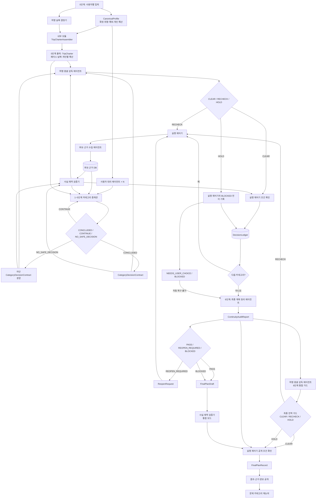

# MOA 서비스 핵심 정리본

> 최초 기준 시점: 2026-08-13 KST  
> 최종 수정: 2026-08-14 KST  
> 전체 근거·세부 축·미결정 사항은 `MOA_SERVICE_DESIGN_FULL.md`를 따른다.  
> 제품 수준 충돌에 대한 최신 결정은 `PRD-MOA-PRODUCT-DECISIONS.md`를 우선한다.
> 에이전트 명칭·계층·권한은 `ADR-MOA-AGENT-NAMING-HIERARCHY.md`를 우선한다.

## 1. 한 문장 정의

목적지가 정해진 여행 방에서 참여자들이 취향·신념·예산·제약을 입력하면 사용자 대리 에이전트들이 카테고리별로 토론·투표하고, 카테고리 중재관이 결론 계약을 만들며 여행 총괄 감독 에이전트가 날짜·예산·페이스·근거의 전역 이탈을 감시해, 나중에 실행 가능한 결과·근거·양보 기록만 확인하는 비동기 여행 계획 서비스다.

## 2. 반드시 유지할 12가지

1. 사용자마다 같은 모판의 대리인 하나를 두되 개인 상태는 격리한다.
2. 사용자 확정 프로필, 에이전트 추론, 이번 여행의 양보를 분리한다.
3. 알레르기·접근성·절대 예산·절대 불가는 취향 점수와 상쇄하지 않는다.
4. 전체 47개 축을 묻지 않고 목적지 후보에 차이가 있는 4~6개 축만 활성화한다.
5. 구체 예외를 보존한다. 예: 면요리 선호와 쌀국수 비선호는 동시에 참일 수 있다.
6. 카테고리 중재관이 토론 종료·결론을 맡고 여행 총괄 감독은 전역 기준 가드만 맡으며, LLM 판단과 사실·수치 검증도 분리한다.
7. 예산·날씨·예약·동선 검사는 각 단계에서 하고 마지막에 통합 재검사한다.
8. 1~5단계의 다음 카테고리에는 대화 전문이 아니라 구조화된 결정 계약을 넘긴다.
9. 양보는 장기 프로필을 덮어쓰지 않고 이번 여행 기록에만 남긴다.
10. 결과가 마음에 들지 않으면 전체가 아니라 해당 카테고리와 영향받은 하위 결정만 다시 연다.
11. 토론이 시작된 뒤에는 일반 추가 질문·투표·승인으로 사용자를 호출하지 않는다.
12. 정상 경로에서는 1~5단계의 다섯 카테고리 원장을 최종 계획 정리 에이전트가 대조해 통합한다. 자동 복구 불가면 승인된 범위와 종결 차단만 부분 결과로 만들며, 기계적 통과 여부는 사실·제약 검증기가 판정한다.

“한국인 20대”는 후보와 질문의 관련성을 좁히는 조건이다. 나이·성별만으로 사용자의 취향값을 미리 채우지 않는다.

MVP 목적지는 한국 2개와 일본 2개, 총 4개로 제한한다. 실제 도시 이름은 데이터·API 검증 뒤 결정한다.

## 3. 사용자 카테고리

| 단계 | 카테고리 | 성격 | 핵심 결정·출력 |
| --- | --- | --- | --- |
| 0 | 여행 헌장·리스크 설정 | 입력·준비 | 목적·스타일, 가용 날짜, 제약, 개인 예산을 받아 프로필 스냅샷·`DateDecision`·`TripCharter` 생성 |
| 1 | 오는 길·가는 길 | 대리인 토론 | 출발지별 교통, 출도착, 환승, 수하물·좌석, 변경·취소, 가격 |
| 2 | 체류 거점·숙소 | 대리인 토론 | 거점 지역, 숙소·객실·프라이버시·편의, 예약·취소 |
| 3 | 갈 곳·할 일 | 대리인 토론 | 필수·선호·선택·제외 장소와 활동, 예약·날씨·소요시간 |
| 4 | 식사 | 대리인 토론 | 음식 축·구체 예외, 식당·식사 방식, 제약·예약·대기 |
| 5 | 날짜별 일정·현지 이동 | 대리인 토론 | 순서·체류시간·도보·대중교통·택시·휴식·막차 |
| 6 | 통합 확정·실행 준비 | 최종 정리·검증 | `ContinuityAuditReport`와 `FinalPlanRecord` 또는 `ReopenRequest` 생성 |

사용자 흐름과 설문 범위는 음식·숙소·액티비티에 한정하지 않고 일곱 단계를 고려한다. 다만 카테고리 중재관·구조화 투표·`CategoryDecisionContract`가 존재하는 토론 단계는 1~5뿐이다. 0단계는 준비, 6단계는 새 취향이나 새 결론을 토론하지 않는 최종 정리·통합 검증 단계다.

방장이 확정하는 것은 지원 목적지와 목표 페이스다. 0단계가 끝나면 `TripCharter`를 잠근다. 핵심은 하루 핵심 앵커 1·2·3개로 설명하는 방장 선택 페이스, 응답·확인된 참여자의 가용성을 받아 DateResolver가 정한 날짜, 개인별 목표·절대상한을 포함한 예산이다. 미응답자는 날짜 계산에서 제외되고 비포함·날짜 미확인 상태로 표시한다. 페이스는 앵커 수뿐 아니라 활동·이동·대기시간, 버퍼, 자유시간, 보행·체력 상한도 함께 본다. 교통수단은 방장이 고정하지 않고 1·5단계 토론에서 결정한다.

헌장 잠금은 제자리 수정 금지다. 허용된 변경도 새 `TripCharter.version`과 원장 사건을 만들고, 이전 버전을 참조하는 영향 계약·계획 노드를 재개방 또는 `isStale=true` 처리한 뒤 다시 검증한다.

## 4. 핵심 구조도

공식 에이전트 명칭은 다섯 개다.

| 명칭 | 한 줄 책임 |
| --- | --- |
| 사용자 대리 에이전트 | 한 사용자의 확정 프로필과 이번 여행 권한을 대변 |
| 후보·근거 수집 에이전트 | 허용 API에서 후보를 찾고 원본을 보존한 채 정규화 저장 요청 |
| 카테고리 중재관 | 현재 카테고리의 갈등을 조정하고 종료·결론·결정 계약 작성 |
| 여행 총괄 감독 에이전트 | 결론을 다시 고르지 않고 페이스·날짜·개인 예산·근거·하드 제약과 연속성 보고서 버전을 전역 감사 |
| 최종 계획 정리 에이전트 | 정상 경로의 다섯 승인 계약 또는 차단 경로의 승인 범위·종결 차단을 대조해 보고서와 사용자용 결과 작성 |

여행 날짜 결정기, 사실·제약 검증기, 실행 제어기는 에이전트가 아니라 최상위 결정론적 제어 구성요소다. `ProviderAdapter`, `Normalizer`, `TripCharterAssembler`, `SatisfactionNormalizer`, `LeximinSelector`, `ObligationLinkChecker`는 각 하위 시스템의 내부 모듈이다. 카테고리 중재관은 `CONCLUDED / CONTINUE / NO_SAFE_DECISION`, 총괄 감독은 `CLEAR / RECHECK / HOLD`를 반환한다. 1~5단계의 `CLEAR`는 날짜·예산·페이스·근거·하드 제약 통과이고, 6단계의 최종 `CLEAR`에서만 현재 `ContinuityAuditReport`의 버전과 `PASS`를 추가 확인한다. 총괄 감독 에이전트가 할루시네이션 검사 책임을 가지지만 가격·주소·예약 날짜·재고·동선은 Python 중심 검증기의 영수증으로 판정한다. 계약의 구조적 의무 참조는 `ObligationLinkChecker`, 의미 연속성은 최종 계획 정리 에이전트가 판정하며 총괄 감독은 이를 다시 판정하지 않는다.

## 5. 프로필 권위 상태와 별도 결정 이력

| 상태 | 역할 |
| --- | --- |
| `CanonicalProfile` | 사용자가 직접 확정한 현재 취향·예외·예산·가치 정책 |
| `AgentBelief` | 대리인이 추론한 값. 확신도와 출처 필수 |
| `TripEffectiveProfile` | 이번 여행에만 적용되는 예외·양보 |
| `ConstraintProfile` | 알레르기·접근성·절대 예산·절대 불가 |
| `DecisionLedger` | 프로필이 아닌 append-only 사건 색인. 계약·투표·검증·승인·재개방의 ID·버전과 카테고리별 최신 승인 계약 참조 |

결정 내용의 단일 원본은 한 카테고리·한 버전의 불변 `CategoryDecisionContract`다. 검증·가드·생명주기 상태는 최신 원장 사건에서 `CategoryContractView`로 투영하며 원본 계약을 덮어쓰지 않는다. `DecisionLedger`는 본문을 복제하지 않고 새 계약 버전과 상태 전이 사건만 append한다. `latestAcceptedContractByCategory`는 파생 색인이므로 재개방 시 해당 활성 참조를 비우고 새 버전이 승인된 뒤에만 다시 채운다.

취향·사용자 신념·예산·제약은 하나의 `DecisionProfileItem` 계약을 사용한다. `itemType`, `binding`, `safety`, `scope`, `authority`, `source`, `confidence`를 분리하고, `hard`는 다른 만족도로 상쇄하지 않는다.

사용자에게 보이는 취향 평가는 `5·3·1`이다. `5=강한 선호`, `3=조정 가능한 선호`, `1=낮은 우선순위지만 수용 가능`이며, `미선택/모름`, `피하고 싶음`, 하드 제외는 각각 별도다. 카테고리별 5·3·1은 중복을 허용하고 음식·숙소·액티비티에 한 점수씩 강제 배정하지 않으며 예산 배분은 따로 받는다. 이 값은 그대로 장기 벡터가 되지 않고 맥락·출처·확신도를 가진 축 신호와 구체 태그 신호로 변환된다. 취향 유형은 사용자용 카드, 분류축은 재사용 내부 차원, 태그는 라멘 선호·쌀국수 비선호 같은 구체 예외이며 서로 다대다로 연결된다.

미응답자는 소프트 취향에만 중립 기본값을 쓰고, 하드 제약·신념·개인 예산은 추정하지 않는다. 가용 날짜와 실제 만족도 집계에서 제외하며 결과에 미대표 상태를 표시한다.

## 6. 분류축 v0

- 공통 여행 성향 8축
- 오는 길·가는 길 5축
- 체류 거점·숙소 6축
- 갈 곳·할 일 12축
- 식사 11축
- 날짜별 일정·현지 이동 5축
- 합계 47개 행동 축 + 예산 배분 6항목

이것은 백엔드 라이브러리다. 사용자에게 전부 묻지 않는다.

축 표현:

- `T`: 두 방향의 교환축
- `I`: 독립 관심도
- `W`: 예산 배분
- `TAG`: 구체 후보·음식·장소와 예외

## 7. 질문 UX 출발 가설

- 목적지·카테고리당 활성 축: 4~6개
- 최초 후보 카드: 4~8개
- 토론 시작 전 적응형 추가 질문: 0~2개
- 최초 프로필: 보통 10~12개 상호작용, 최대 약 14개
- 같은 여행 재논의: 결과 공개 뒤 기본 2개, 최대 4개
- 같은 국가의 새 목적지: 4~6개
- 한국↔일본 전환: 기본 6개, 최대 8개

숫자는 모두 검증 전 가설이다. 고정된 것은 다음 원칙이다.

- 후보 차이가 없으면 묻지 않는다.
- 순위가 안정되면 질문을 멈춘다.
- 실제 후보를 이용하되 토론 시작 전 프로필 확인 단계에서 필요한 질문을 끝낸다.
- 토론 전 프로필 확인이나 결과 후 재논의에서 예측과 다른 선택이 나오면 이번 여행의 예외인지 장기 취향인지 확인한다.

재논의 상한의 MVP 기본값은 참여자 1명당 1회, 방 전체 3회다. 안전·접근성·새 하드 제약·명백한 사실 오류 수정은 상한에서 제외한다.

## 8. 카테고리 결정 계약

1~5단계의 각 카테고리 종료 시 반드시 남긴다. 0단계와 6단계는 이 계약을 만들지 않는다.

`CONTINUE`는 계약이 아니라 라운드 체크포인트만 남긴다. `CONCLUDED`는 선택 계획안을 가진 정상 계약, `NO_SAFE_DECISION`은 선택 계획안 없이 완전한 `blockReason`을 가진 차단 계약을 만든다.

`CandidateRecord`는 호텔·식당·교통편 하나 같은 원자 후보고, 실제 투표 단위는 복수 장소·식사 슬롯·참여자 배정·순서·이동·사용자별 비용을 묶은 검증된 `CategoryProposal`이다. 모든 대리인은 같은 `proposalSetVersion`을 투표한다.

- 카테고리·불변 계약·`TripCharter` 버전과 별도 `CategoryContractView.lifecycleStatus`
- 선택·제외 `CategoryProposal`, 포함·제외 원자 후보와 이유
- 사용자별 지지·반대·조건부 입장과 구조화 투표
- 사용자별 예상 만족과 미충족 강한 선호
- leximin 계산·타이브레이크 추적
- 양보 내용·적용 범위·누적 부담
- 서브그룹 참여자·분리 시간·각 동선·재합류·추가 비용·안전·사전 위임 범위 내 동의. 범위 밖이면 `NEEDS_USER_CHOICE`
- 하드 제약과 통과 여부
- 사용자별 예산 영향과 사용·잔여 예산
- 페이스·날짜·다음 단계에 미치는 영향
- 다음 단계 의무의 `obligationId`, `targetCategory`, 결정·객체 참조
- 받은 의무별 `obligationFulfillments`: 충족·계속 승계·충돌·미해결과 이행 참조
- 근거 ID·조회 시각·만료 시각, `CategoryContractView`의 검증·가드 참조
- 차단 시 `blockReason`: 사유 유형·재시도 가능 여부·필요 행동
- 미확인 사실·가정·재논의 조건
- 중재관의 `CONCLUDED / CONTINUE / NO_SAFE_DECISION` 결과
- 총괄 감독 에이전트의 `CLEAR / RECHECK / HOLD` 전역 가드

다음 카테고리에는 최신 `CategoryContractView.lifecycleStatus=ACCEPTED`인 계약만 전달한다. 검증·가드·생명주기 상태는 불변 계약 본문을 수정하지 않고 원장 사건에서 뷰로 투영한다.

실행 제어기는 6단계 입력 원장·계약 버전을 잠근다. 정상 경로는 연속성 `PASS` + 통합 검사 `PASS` + 최종 가드 `CLEAR`일 때만 `VERIFIED_DRAFT / BOOKABLE` 결과를 저장·공개한다. 자동 복구 불가 경로는 연속성 `BLOCKED` 또는 최종 가드 `HOLD`, 완전한 `blockReason`, 기존 사실의 검증·불확실성 표시를 확인한 뒤 `NEEDS_USER_CHOICE / BLOCKED` 부분 결과만 공개한다. `ReopenRequest`는 기준 버전, 영향 단계·카테고리·헌장 필드, `TripCharter.changeRules`, 위임 권한을 확인해 자동 재실행하며, 목적지·페이스·개인 절대예산은 권한자 확인 없이 바꾸지 않는다.

상태는 네 층으로 분리한다.

| 층 | 상태 |
| --- | --- |
| 중재 결과 | `CONCLUDED / CONTINUE / NO_SAFE_DECISION` |
| 감독 결과 | `CLEAR / RECHECK / HOLD` |
| 계약 생명주기 | `CategoryContractView.lifecycleStatus`: `DRAFT / VALIDATING / ACCEPTED / REOPEN_REQUIRED / BLOCKED` |
| 사용자 최종 표시 | `VERIFIED_DRAFT / BOOKABLE / NEEDS_USER_CHOICE / BLOCKED` |

`CONCLUDED + 검증 PASS + CLEAR`만 `ACCEPTED`가 된다. 자동 복구 가능한 실패·만료·상충·`RECHECK`는 `REOPEN_REQUIRED`로 재실행한다. 자동 복구 불가인 `NO_SAFE_DECISION / HOLD`는 6단계에서 부분 결과로 포장하고, 사용자 권한이 필요하면 `NEEDS_USER_CHOICE`, 외부 장애·실행 불가면 `BLOCKED`로 표시하며 구조화된 `blockReason`을 남긴다. 검증 `UNKNOWN`은 `PASS`가 아니다.

## 9. 최종 결과

- `ContinuityAuditReport`: 현재 원장, 활성 승인 계약과 종결 차단 계약 참조, 구조적 의무 검사, 의미 연속성 판정, 영향 카테고리, `PASS / REOPEN_REQUIRED / BLOCKED`
- 상태: `VERIFIED_DRAFT / BOOKABLE / NEEDS_USER_CHOICE / BLOCKED`
- `BOOKABLE` 유효기간과 재검증 시각. 필수 근거 만료 뒤에는 재검증 전까지 표시 중단
- 날짜별 일정과 모든 이동 구간
- 개인별 목표예산·절대상한 대비 비용
- 교통·숙소·식사·활동의 예약 준비 상태
- 핵심 선택 이유와 제외 이유
- 사용자별 반영·미반영·양보 기록
- 근거와 확인 시각
- 우천·매진·취소·시간 초과 Plan B
- 카테고리·결정 카드별 `이 부분 다시 진행하기` 진입점

최종 계획 정리 에이전트는 위 내용의 `FinalPlanDraft`를 만들고 의미 연속성을 판정한다. 실행 제어기가 같은 스냅샷의 검사·가드를 확인해 불변 `FinalPlanRecord`와 `VERIFIED_DRAFT / BOOKABLE / NEEDS_USER_CHOICE / BLOCKED` 상태를 만든다.

에이전트 투표는 그 카테고리 결론의 직접 근거지만 단순 다수결은 아니다. 하드 제약·개인 예산·실행 가능성을 통과한 `CategoryProposal`에만 투표 기반 정규화 만족도와 `leximin`을 적용한다. 동률이면 평균 만족도, 누적 양보 불균형, 비용·동선·근거 품질 순으로 비교한다. 양보 크레딧은 원장과 최종 동점 해소에만 쓴다.

정규화 만족도는 내부 비교값이며, 사용자에게는 보정 전 백분율 대신 강한 선호·조정 가능 선호의 반영 여부, 미반영 이유, 양보를 보여준다.

## 10. 아직 확정하지 않은 것

- 47개 축의 통계적 독립성과 최종 문구
- 정확한 질문·화면 수와 5·3·1을 담을 자유서술/카드/비교 조합
- 만족도 정규화식·수치형 하한·leximin 동률 허용 오차
- 그룹 인원과 한국 2개·일본 2개의 실제 도시 목록
- 실제 한국·일본 API, 데이터 권리·비용·캐시 유효기간
- 논리 역할마다 별도 에이전트 프로세스를 둘지 여부
- Python 에이전트 런타임과 현재 TypeScript 저장소의 결합 방식
- 원장 멱등성·동시 재논의 충돌·Worker 재시도 규칙
- 외부 근거 프롬프트 인젝션 격리와 사용자별 데이터 접근 통제
- `CategoryProposal` 수 상한과 의미 연속성 판정 회귀 평가 기준

## 11. 현재 구현 상태

2026-08-13의 저장소 고정 커밋 `70215bf0379531ac936b2635b3970afd300ae8ed` 기준으로 설계 문서, 프론트/API·Worker·DB 골격, 계약 스키마, 이의 재실행 기록 경로가 존재한다. 그러나 저장소의 옛 명칭 기준 실제 심판·Supervisor·Data Agent·여행 API는 미구현이고 재실행 Worker도 자리 표시자이므로 여전히 **설계·골격 단계**다. 현재 웹 화면과 설문 v2/v3는 확정 제품 사양이 아니다.

한 카테고리만 실제로 구현한 해커톤 세로 절단은 유효한 기술 검증이지만 제품 완결 상태는 아니다. 제품 완결은 0단계 입력, 1~5단계 다섯 실제 계약, 6단계 연속성·통합 검증까지 모두 통과해야 한다.

## Sources

- [전체 설계 정리본](MOA_SERVICE_DESIGN_FULL.md)
- [제품 수준 결정 PRD](PRD-MOA-PRODUCT-DECISIONS.md)
- [에이전트 명칭·계층 ADR](ADR-MOA-AGENT-NAMING-HIERARCHY.md)
- [GroupTravelBench](https://arxiv.org/pdf/2605.25200)
- [팀 저장소 README, 고정 커밋](https://github.com/nxtcloud-edu/2026_KNUxKU_summer_camp_team05/blob/70215bf0379531ac936b2635b3970afd300ae8ed/README.md)
- [MOA 배포 목업](https://moa-henna.vercel.app)
