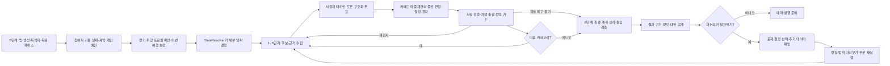

# MOA 제품 수준 결정 PRD

- 문서 버전: v0.6
- 최초 결정 기준일: 2026-08-13
- 최종 수정일: 2026-08-14
- 범위: GitHub `main`과 서비스 설계 정리본 사이의 **제품 수준 충돌 해소**
- 제외 범위: 역할별 실제 프로세스·모델 배치, GitHub 코드 변경
- 에이전트 구조의 권위 문서: [ADR-MOA-AGENT-NAMING-HIERARCHY.md](./ADR-MOA-AGENT-NAMING-HIERARCHY.md)

## 1. Summary

MOA는 참여자가 미리 입력한 장기 취향·신념·제약·개인 예산을 바탕으로 사용자 대리 에이전트들이 중간 사용자 개입 없이 여행을 협상하는 서비스다. 카테고리 중재관이 각 토론의 종료와 결론을 판정해 원장으로 남기고, 여행 총괄 감독 에이전트가 날짜·예산·페이스·근거의 전역 이탈을 감사하며, 최종 계획 정리 에이전트가 이를 하나의 검증 가능한 여행안으로 통합한다. 사용자는 결과를 받은 뒤에만 문제 결정을 골라 부분 재논의를 요청할 수 있다.

이번 문서는 기존 논의에서 충돌하던 취향 모델, 미응답 처리, 예산, 공정성, 날짜 결정, 재논의, 최종 마무리, MVP 목적지 수를 다시 고정한다.

## 2. Contacts

| 역할 | 담당 | 이번 문서에서 필요한 책임 |
| --- | --- | --- |
| 제품 결정권자 | 프로젝트 팀 | 본 문서의 결정 승인과 변경 관리 |
| 설문·프로필 담당 | 미정 | 장기 프로필과 최초 설문 UX 구현 |
| 에이전트·백엔드 담당 | 미정 | 토론, DateResolver, 재실행, 마무리 흐름 구현 |
| 데이터 담당 | 미정 | 4개 Destination Pack과 근거 데이터 검증 |
| UX 담당 | 미정 | 결과 확인과 사후 재논의 화면 설계 |

사람 이름과 실제 담당자는 팀 배정 후 채운다. 임의로 지정하지 않는다.

## 3. Background

기존 GitHub 설계는 `v2 슬라이더·카드`, `v3 5·3·1 중요도`, 방 단위 설문, 완전 비동기 토론, Maximin, DateResolver, 사후 이의 제기를 함께 담고 있다. 서비스 설계 정리본은 장기 취향축, 프로필 권위 상태, 카테고리별 결정 원장, 횡단 검증, 영향 기반 재실행을 더 강하게 정의한다.

두 설계를 그대로 병존시키면 다음 문제가 생긴다.

- 같은 사용자를 방마다 새로 해석하거나 장기 프로필로 해석하는 두 방식이 충돌한다.
- 토론 중 추가 질문을 할 수 있는지 불명확하다.
- 5·3·1 점수를 최종 취향 모델로 오해할 수 있다.
- 미응답자를 실제로 만족한 사용자처럼 계산할 위험이 있다.
- 최종 결과를 누가, 어떤 자료로 마무리하는지 불명확하다.
- 11개 목적지를 해커톤 MVP에서 검증하기 어렵다.

## 4. Objective

### 4.1 목적

한 사람의 취향을 왜곡하지 않으면서도 사용자가 토론 중 기다리지 않아도 되는 그룹 여행 의사결정 흐름을 만든다. 최종 결과는 선택 이유, 양보, 불확실성, 예약 준비 상태, 재논의 경로까지 포함해야 한다.

### 4.2 제품 성공 조건

- 대리인의 모든 실질 주장이 사용자 확정 정보 또는 표시된 추론으로 추적된다.
- 하드 제약과 개인별 예산 상한을 위반한 후보는 최종안이 되지 않는다.
- 토론 중 일반적인 사용자 추가 질문이 발생하지 않는다.
- 1~5단계의 각 카테고리는 다음 단계가 읽을 수 있는 결정 원장을 남긴다.
- 결과 이후의 재논의는 문제 카테고리와 영향받은 하위 노드만 다시 연다.
- 최종안은 네 개 MVP 목적지 안에서 실제 근거를 가진 후보만 사용한다.

### 4.3 초기 검증 지표

| 지표 | 초기 목표 |
| --- | --- |
| 사용자 확정 취향·제약 보존율 | 중요 항목 누락 0건을 목표로 측정 |
| 근거 없는 대리인 주장 | 0건 |
| 하드 제약·예산 상한 위반 | 0건 |
| 토론 중 일반 사용자 호출 | 0회 |
| 재논의 변경 범위 오류 | 선택한 노드와 영향 노드 밖 변경 0건 |
| 결과 추적 가능성 | 모든 핵심 결론에 원장·근거 연결 |

수치형 만족도 하한과 질문 수는 사용자 실험 전에는 확정값으로 취급하지 않는다.

## 5. Market Segment(s)

### 5.1 첫 사용자

- 한국인 20대 중심의 지인 여행 그룹
- 한국 국내여행 또는 일본여행을 계획하는 사람
- 동시에 모여 계획하기 어렵고, 한 명의 총무에게 의사결정이 몰리는 그룹
- 여행 목적지는 방을 만들 때 지원 Destination Pack 중에서 선택

### 5.2 MVP 목적지 범위

- 한국 Destination Pack: **2개**
- 일본 Destination Pack: **2개**
- 총 4개

도시 이름은 아직 확정하지 않는다. 실제 API·데이터 권리·예약 검증 가능성을 비교한 후 한국 2개와 일본 2개를 고정한다.

## 6. Value Proposition(s)

- 사용자는 한 번 자신의 취향과 권한 경계를 확인하면 다음 여행에서 이를 재사용할 수 있다.
- 토론을 지켜보거나 중간에 반복해서 답하지 않아도 된다.
- 말이 많은 사람보다 모든 참여자의 최소 만족과 누적 양보 부담을 먼저 본다.
- 가격·운영시간·이동·예약 정보는 조회 시각과 불확실성을 함께 보여준다.
- 마음에 들지 않는 결과가 나오면 전체 여행을 지우지 않고 해당 결정만 다시 논의한다.
- 최종 결과는 일정표뿐 아니라 선택 이유, 미반영 취향, 양보, Plan B를 함께 제공한다.

## 7. Solution

### 7.1 UX와 사용자 흐름



#### 방장과 참여자의 결정 권한

**결정:** 방장이 확정하는 것은 지원 Destination Pack 안의 **여행 목적지와 목표 페이스**다.

- 목표 페이스는 화면에서 하루 핵심 앵커 `1·2·3개`로 설명한다.
- 실제 일정 검사는 활동시간, 이동시간, 대기, 최소 버퍼, 자유시간, 보행·체력 상한을 함께 사용한다.
- 정확한 날짜는 참여자별 가용 날짜를 받은 `DateResolver`가 계산한다.
- 개인 목표예산·절대상한은 각 참여자가 입력한다.
- 장거리·현지 교통수단, 숙소, 활동, 식사는 에이전트 토론과 카테고리 결론으로 정한다.
- 방장의 페이스 선택도 참여자의 안전·접근성·이동 하드 제약을 무효화하지 않는다.

#### 카테고리 순서와 인계

**결정:** 사용자 흐름은 0~6단계지만, 대리인 토론과 카테고리 중재는 1~5단계에서만 실행한다.

| 구간 | 성격 | 권위 출력 |
| --- | --- | --- |
| 0단계 | 입력·날짜 결정·여행 헌장 생성 | 프로필 스냅샷, `DateDecision`, `TripCharter` |
| 1~5단계 | 대리인 토론·카테고리 결정 | 단계별 `CategoryDecisionContract`; 정상 `ACCEPTED`, 종결 차단 `BLOCKED` |
| 6단계 | 최종 정리·계약 연속성·통합 검증 | `ContinuityAuditReport`와 `FinalPlanRecord` 또는 `ReopenRequest` |

0단계와 6단계에는 카테고리 중재관·구조화 투표·`CategoryDecisionContract`가 없다. 1~5단계에서는 대화 전문 대신 구조화된 계약을 남기며, 최신 `CategoryContractView.lifecycleStatus=ACCEPTED`인 계약만 다음 카테고리의 사용자 대리 에이전트에게 권위 있는 이전 결론으로 전달한다.

`TripCharter` 잠금은 제자리 수정 금지다. 사전 승인된 날짜 유연성처럼 허용된 변경도 새 헌장 버전과 원장 사건을 만들고, 이전 `charterVersion`을 참조하는 영향 계약·계획 노드를 재개방 또는 `isStale=true` 처리한 뒤 다시 검증한다.

#### 토론 중 사용자 개입

**결정:** 카테고리 토론이 시작된 뒤에는 일반적인 추가 질문, 투표, 승인 요청으로 사용자를 호출하지 않는다.

- 필요한 취향 질문은 토론 시작 전 프로필 확인 단계에서 끝낸다.
- 권한 밖 양보가 필요하면 임의로 확정하지 않고 안전한 대안 또는 `BLOCKED` 상태로 남긴다.
- 합의 실패는 토론 중 질문으로 해결하지 않고 최종 결과에 A/B안과 미해결 이유로 제시한다.
- 알레르기·접근성처럼 안전 확인이 안 된 후보는 제외한다.

#### 미응답자

**결정:** 저장소의 미응답 처리 방향을 사용하되, 미응답을 실제 무관심으로 과장하지 않는다.

- 설문 전체 미응답자는 소프트 취향에만 `DefaultPersona` 중립값을 사용한다.
- 그 사용자의 하드 제약·신념·예산은 추정하지 않는다.
- 가용 날짜 교집합에서는 제외한다.
- 해당 사용자의 만족도는 실제 응답자의 만족도처럼 보고하지 않는다.
- 결과 화면에 `미응답·날짜 미확인·취향 미대표` 상태를 명시한다.
- 해당 사용자가 확인하지 않은 상태에서는 그 사용자까지 포함한 계획을 `BOOKABLE`로 표시하지 않는다.
- 사용자가 특정 카테고리를 명시적으로 건너뛴 경우만 `관심 없음/위임`으로 처리한다.

### 7.2 Key Features

#### 7.2.1 장기 취향 프로필

**결정:** 서비스 설계 정리본의 축 기반 장기 프로필을 사용한다.

- 공통 여행 성향 8축
- 오는 길·가는 길 5축
- 숙소 6축
- 갈 곳·할 일 12축
- 식사 11축
- 일정·현지 이동 5축
- 예산 배분 6항목과 절대 금액

사용자 흐름과 설문이 고려하는 범위는 음식·숙소·액티비티 세 분야로 제한하지 않고 일곱 단계를 모두 반영한다. 다만 토론 카테고리는 오는 길·가는 길, 체류 거점·숙소, 갈 곳·할 일, 식사, 날짜별 일정·현지 이동의 1~5단계다. 0단계는 여행 헌장을 만드는 준비 단계이고, 6단계는 새 취향을 묻거나 새 결론을 토론하지 않는 통합 검증 단계다.

47개 축은 백엔드 후보 라이브러리다. 사용자에게 모두 묻지 않는다. 목적지에서 후보 선택을 바꿀 수 있는 축만 토론 시작 전 활성화한다.

프로필은 다음 상태를 분리한다.

- `CanonicalProfile`: 사용자가 직접 확인한 장기 기준
- `AgentBelief`: 에이전트가 추론한 값과 확신도
- `TripEffectiveProfile`: 이번 여행에만 적용되는 보정·양보
- `ConstraintProfile`: 점수로 상쇄할 수 없는 조건

`DecisionLedger`는 프로필 상태가 아니다. 카테고리 계약·투표·검증·승인·재개방 사건을 append-only로 기록하고, 카테고리별 최신 활성 `ACCEPTED CategoryDecisionContract`를 가리키는 여행 단위 파생 색인을 제공한다. 재개방하면 해당 활성 색인은 비워지고 새 버전이 승인된 뒤에만 다시 채운다. 결정 내용의 단일 원본은 `CategoryDecisionContract`이며 검증·가드·생명주기 상태는 최신 원장 사건에서 `CategoryContractView`로 투영한다.

#### 7.2.2 사용자에게 보이는 5·3·1과 내부 신호

**결정:** 사용자가 취향 유형이나 후보 카드를 평가할 때는 `5·3·1`을 사용한다.

| 사용자 표시 | 의미 | 내부 기본 신호 |
| --- | --- | --- |
| 5 | 강하게 선호, 가능하면 보호 | `prefer / strong` |
| 3 | 선호하지만 교환 가능 | `prefer / flexible` |
| 1 | 포함돼도 괜찮지만 낮은 우선순위 | `acceptable / low` |

`1`은 비선호가 아니며 `미선택/모름`은 결측으로 따로 둔다. `피하고 싶음`은 음의 선호 신호이고, 알레르기·접근성·절대 불가 같은 하드 제약은 사전 제약 설문과 `binding=hard`로 분리한다.

카테고리 중요도를 묻더라도 음식·숙소·액티비티에 5·3·1을 하나씩 강제 배정하지 않는다. 관련 카테고리마다 독립적으로 5·3·1을 고를 수 있고 같은 점수를 반복할 수 있다. 돈을 어디에 더 쓸지는 이 점수와 분리해 예산 배분 `W`와 추가 지불 의향으로 받는다.

화면의 숫자를 그대로 장기 취향 벡터로 저장하거나 `분야 점수 × 세부 점수`로 곱하지 않는다. 응답은 출처·맥락·확신도를 가진 `PreferenceSignal`로 바꾸어 축과 태그에 연결한다.

- **취향 유형:** 사용자가 이해하는 카드·예시. 예: 온천 숙소, 로컬 맛집, 테마파크.
- **분류축:** 여러 후보를 비교할 때 재사용하는 내부 차원. 예: 프라이버시, 혼잡 허용, 일정 밀도.
- **태그:** 축만으로 잃기 쉬운 구체 선호·예외. 예: `noodle +`, `ramen +`, `pho -`.

관계는 다대다다. 하나의 취향 유형이 여러 축·태그 신호를 만들 수 있고, 한 축도 여러 질문·후보에서 갱신된다. 서로 충돌하는 응답은 평균으로 지우지 않고 국가·도시·이번 여행·구체 후보 맥락과 함께 보존한다.

#### 7.2.3 통합 선호·신념·제약 계약

**결정:** 취향, 사용자 신념, 하드 제약을 서로 다른 테이블 규칙으로 흩뜨리지 않고 하나의 항목 계약으로 표현한다. 안전·하드 여부는 점수 크기가 아니라 `binding`으로 결정한다.

```text
DecisionProfileItem
├─ itemType: preference | value_policy | budget | constraint
├─ subject: axis | tag | candidate | policy
├─ value / direction / intensity
├─ binding: soft | strong | hard | approval_required
├─ safety: true | false
├─ scope: global | country | city | trip | candidate
├─ authority: canonical | agent_belief | trip_effective
├─ source: direct_survey | observed_choice | agent_inference | user_confirmed
├─ confidence
├─ evidenceRef
└─ updatedAt / validUntil
```

처리 규칙:

- `hard`는 다른 만족도로 상쇄할 수 없다.
- `approval_required`를 토론 중 자동 완화하지 않는다.
- 사용자의 종교·윤리·생활 신념은 사람마다 `soft`, `strong`, `hard`가 될 수 있다.
- `AgentBelief`는 원본처럼 사용하거나 장기 프로필을 자동 덮어쓸 수 없다.
- 안전 항목은 확인 실패 시 fail-closed한다.

#### 7.2.4 개인별 예산 정책

**결정:** 방 공통 예산만 두지 않고 모든 참여자에게 다음을 받는다.

- 개인 목표 총예산
- 개인 절대 상한
- 장거리 이동 포함 여부
- 비상금·여유분
- 카테고리별 배분 선호
- 이동시간 단축, 위치, 객실, 필수 활동에 대한 추가 지불 의향

방장은 그룹 예산을 대신 결정하지 않는다. 시스템은 개인별 입력을 합산해 참고용 그룹 목표 범위를 계산할 수 있다. 개인 목표와 카테고리 배분은 조정 가능한 목표지만 절대 상한은 하드 제약이다. 공통 비용은 각 사람에게 실제 배분된 금액이 각자의 절대 상한을 넘지 않아야 한다. 불균등 분담은 0단계의 비용 분담 정책과 사용자별 사전 위임 범위 안에서만 자동 사용하며, 이를 넘는 부담 이전은 `NEEDS_USER_CHOICE`다.

#### 7.2.5 공정성 선택 규칙

**결정:** 저장소의 Maximin 방향을 유지하되, 단순 `최저점 → 총합`보다 반복 양보를 더 잘 막는 **제약 통과 후 leximin**을 사용한다.

1. 하드 제약, 개인 예산 상한, 시간·예약 실행 가능성을 먼저 통과시킨다.
2. 원자 후보를 카테고리별 실행 가능한 `CategoryProposal` 묶음으로 만들고 사실·제약 검증을 통과시킨다.
3. 토론 마지막에 각 사용자 대리인이 같은 버전의 검증 계획안 집합에 구조화 투표를 제출한다.
4. 투표와 근거 프로필로 사용자별 만족도를 활성 항목 기준의 같은 범위에 정규화한다.
5. 만족도를 낮은 순서로 정렬하고, 가장 낮은 사람부터 차례로 더 높은 계획안을 선택한다(`leximin`).
6. 사실상 동률이면 그룹 평균 만족도를 높인다.
7. 다시 동률이면 누적 양보 부담의 최댓값과 격차를 줄인다.
8. 마지막으로 비용·동선·취소 가능성·근거 품질을 비교한다.

에이전트 투표는 그 카테고리 결론의 직접 근거지만 단순 다수결은 아니다. 카테고리 중재관은 위 규칙으로 결론과 종료 여부를 판정하고 `selectionRuleTrace`를 남긴다. 양보 크레딧은 원장과 최종 동점 해소에만 사용한다. 대리인의 취향 점수, 반대 강도, 말투를 인위적으로 키우는 데 사용하지 않는다. 수치형 만족도 하한은 사용자 테스트 후 정한다.

정규화 만족도는 후보 선택을 위한 내부 비교값이다. 보정 전 소수점 백분율을 사용자에게 객관적 행복 점수처럼 보여주지 않는다. 결과 화면에는 `강한 선호 반영 / 조정 가능한 선호 반영 / 미반영 / 양보`와 그 근거를 우선 표시한다.

활동·식사·일부 현지 이동처럼 실제로 나눌 수 있는 결정은 제한적 서브그룹안을 허용한다. `SplitPlan`에는 참여자, 분리 시간, 각 동선, 재합류 장소·시각, 추가 비용, 안전·연락 조건, 영향받는 당사자의 동의를 기록한다. 자동 채택은 0단계에서 사용자가 미리 허용한 인원·시간·비용·안전 범위 안에서만 가능하다. 이를 넘는 구체 분리안은 토론 중 동의를 추정하지 않고 6단계 부분 결과의 `NEEDS_USER_CHOICE`로 남긴다. 점수를 올리기 위해 원치 않는 사용자를 혼자 분리하지 않는다. 오는 길·가는 길과 거점 숙소는 MVP에서 기본 공동 자원으로 본다.

#### 7.2.6 대리인의 협상 방식

**결정:** 사용자에게서 얻지 않은 `주장형·조정형` 성격을 대리인에게 강제로 부여하지 않는다.

- 모든 대리인은 같은 충실도 우선 템플릿을 사용한다.
- 조정자는 첫 발언자, 반례 검토자, 대안 제시자 같은 절차 역할만 순환 배정할 수 있다.
- 절차 역할은 취향 값, 만족도, 양보 범위, 발언 강도를 바꾸지 않는다.
- 조용한 사용자의 의견 누락은 성격 조작이 아니라 감독관의 누락 검사로 막는다.

#### 7.2.7 DateResolver

**결정:** 방장은 여행 날짜나 대략 기간창을 대신 확정하지 않는다. 응답·확인된 참여자의 가능 날짜·불가 날짜·희망 박수·유연성을 받아 `DateResolver`가 세부 날짜를 결정한다. 미응답자는 계산에서 제외되고 결과에 비포함·날짜 미확인 상태로 남는다.

DateResolver의 핵심 계산은 LLM이 아니라 결정론적 코드가 수행한다.

입력:

- 참여자별 가능·불가 날짜
- 희망 박수와 축소·확장 허용 범위
- 방장이 선택한 목적지와 목적지 시간대
- 출발 지역과 이동 가능 시간
- 개인 목표예산·절대상한
- 계절·휴관·날씨 위험과 가격 범위

출력:

- 선택된 날짜와 박수
- 최대 2개의 대안
- 참석 가능 인원
- 비용·휴가·날씨·재고 점수의 분해
- 사용한 근거와 재조회 조건

0단계에서는 가용성·박수·시간대·하드 제약으로 가능한 날짜 집합을 먼저 만든다. Destination Pack의 계절·휴관 정보와 확보된 사전 가격 범위는 순위 보조이며, 아직 조회하지 않은 실시간 교통 재고를 있는 것으로 가정하지 않는다. 1단계의 정확한 운행·좌석·가격 검사에서 전부 실격되면 사전 승인된 날짜 유연성 안에서 저장된 대안을 다시 계산한다.

응답·확인된 참여자 전원이 가능한 날짜가 없으면 토론을 시작하지 않는다. 허용된 박수 유연성 안에서 먼저 다시 계산하고, 그래도 실패하면 계산된 대안을 **토론 시작 전** 사용자에게 제시한다.

#### 7.2.8 교통수단 결정

**결정:** 방장은 항공·기차·버스·배·택시 같은 교통수단을 미리 확정하지 않는다.

- 1단계 `오는 길·가는 길`에서 장거리 이동 후보를 API로 조달·검증한 뒤 대리인들이 토론하고 투표한다.
- 5단계 `날짜별 일정·현지 이동`에서 도보·대중교통·택시·렌터카 조합을 일정과 함께 결정한다.
- 개인이 절대 이용할 수 없는 교통수단은 선호 점수가 아니라 하드 제약으로 먼저 제외한다.
- 선택 날짜의 실제 운행·좌석·가격이 확인되지 않은 교통 후보는 결론 후보가 될 수 없다.
- 모든 교통 계획안이 실격되면 사전 입력한 날짜 유연성 안에서 `DateResolver` 대안을 자동 재검토한다. 그 범위를 넘는 날짜, 목적지·페이스, 개인 절대예산 변경은 토론 중 임의로 적용하지 않고 최종 부분 결과의 `NEEDS_USER_CHOICE`로 남긴다.

#### 7.2.9 사후 재논의 UX

**결정:** 재논의는 최종 결과가 나온 뒤에만 시작한다.

1. 사용자가 `이 부분 다시 진행하기` 버튼을 눌러 결과의 카테고리, 결정 카드, 후보 또는 근거 문장을 선택한다.
2. 이유 유형을 고른다: `취향 오해`, `사실 오류`, `새 제약`, `예산 변경`, `다른 후보`, `기타`.
3. 한 문장 이유와 필요한 값만 입력한다.
4. 시스템은 기본 2개, 최대 4개의 짧은 확인만 추가한다.
5. 추론된 변경 사항을 보여주고 사용자가 확인한다.
6. 다시 계산될 노드, 예상 시간·비용, 예약 위험을 미리 보여준다.
7. 확인 후 해당 노드와 영향받은 하위 노드에 `isStale=true`, `staleReason`, 원본 버전을 기록하고 재실행한다.
8. 전후 후보, 만족도, 예산, 이동시간, 양보, 근거 차이를 보여준다.

상한:

- 참여자 1명당 기본 1회의 자동 재논의
- 방 전체 기본 3회의 자동 재논의
- 같은 결정은 같은 계획 버전에서 기본 1회
- 알레르기·접근성·새로운 하드 제약·명백한 사실 오류 수정은 상한에서 제외
- 한 번의 재논의 안에서 내부 토론 재개는 최대 2회

재논의에서 얻은 데이터는 먼저 `TripEffectiveProfile`과 `AgentBelief`에 반영한다. 사용자가 `다음 여행에도 적용`을 명시적으로 확인한 경우에만 `CanonicalProfile` 변경 후보가 된다.

#### 7.2.10 최종 계획 정리 에이전트

**공식 명칭:** 최종 계획 정리 에이전트 (`PlanFinalizerAgent`)

**결정:** 정상 경로의 모든 승인 원장을 최종 계획으로 통합하고, 자동 복구 불가 경로에서는 승인된 범위와 종결 차단을 구분한 부분 결과를 만드는 별도 에이전트를 둔다.

입력:

- `DecisionLedger.latestAcceptedContractByCategory`
- 위 색인이 참조하는 카테고리별 `ACCEPTED CategoryDecisionContract`
- 자동 복구가 불가능한 현재 `BLOCKED CategoryDecisionContract`와 `blockReason`
- 계획 노드의 의존성·원본 버전·신선도 메타데이터
- 사용자별 반영·미반영 취향
- 예산·동선·예약·날씨 검증 결과
- 근거와 만료 시각
- 양보와 미해결 쟁점
- 재개방 조건과 Plan B

책임:

1. `TripCharter`와 `DecisionLedger`가 참조하는 모든 승인 계약을 시간순으로 비교한다.
2. 앞서 확정한 결정이 뒤에서 사라지거나 의미가 달라졌는지 확인한다.
3. 카테고리별 최신 승인 계약이 앞선 계약의 의무 ID를 `obligationFulfillments`로 이어받았는지 확인한다.
4. 구조적 의무 참조 검사와 의미 연속성 판정을 `ContinuityAuditReport`로 만든다.
5. 보고서가 `REOPEN_REQUIRED`이면 영향 카테고리를 지정한 `ReopenRequest`를 만들고 새 후보를 직접 만들지 않는다.
6. 보고서가 `PASS`이면 통합 검증 대상인 `FinalPlanDraft`를 만든다.
7. 보고서가 `BLOCKED`이면 승인된 앞 단계, 차단 사유, 미작성 하위 범위를 구분한 부분 `FinalPlanDraft`를 만들고 존재하지 않는 결론을 추정하지 않는다.
8. 통합 검증이 통과한 내용만 최종 일정·예산·예약 체크리스트로 구성한다.
9. 선택 이유, 미반영 취향, 양보의 대가, 불확실성과 최종 상태 계산에 필요한 근거를 구조화한다.

최종 계획 정리 에이전트는 카테고리 결정을 임의로 덮어쓰거나 새 사실·취향·후보를 만들 수 없고 `ReopenRequest`를 직접 DB 상태 전이로 적용할 수도 없다. 구조적 의무 참조는 결정론적 `ObligationLinkChecker`가 검사하고, 계약 본문의 의미 보존은 최종 계획 정리 에이전트가 판정한다. 가격·시간·예산·예약 가능성의 최종 통과 여부는 결정론적 `FactConstraintValidator`의 통합 검사 모드가 판정한다.

최종 계획 정리 에이전트의 출력은 `FinalPlanDraft`다. 실행 제어기가 같은 입력 스냅샷의 연속성 보고서·통합 검증·전역 가드를 확인한 뒤 아래 불변 최종 결과 계약을 만든다.

최종 결과 계약:

```text
FinalPlanRecord
├─ sourceDraftRef
├─ status: VERIFIED_DRAFT | BOOKABLE | NEEDS_USER_CHOICE | BLOCKED
├─ statusValidUntil? / recheckAt?
├─ sourceLedgerId / sourceLedgerVersion / acceptedContractRefs[]
├─ terminalBlockedContractRefs[]
├─ continuityAuditReportRef
├─ blockReason?
├─ tripSummary / selectedDates
├─ categorySummaryViews[]: sourceContractRef / displaySummary
├─ dailyItinerary[]
├─ budgetByUser / sharedBudget
├─ bookingReadiness[]
├─ preferenceCoverage[]
├─ concessions[]
├─ evidenceFreshness[]
├─ unresolvedIssues[]
├─ planB[]
├─ reopenOptions[]
└─ validationReceiptRefs[] / guardFindingRefs[]
```

`BOOKABLE`은 사용자가 여행 자체를 정서적으로 승인했다는 뜻이 아니라, 예약 전 필수 검증을 통과했다는 뜻이다. 필수 근거 중 가장 이른 만료 시각까지만 유효하며, 만료 후 재검증 전에는 `BOOKABLE`을 계속 표시하지 않는다. 실제 예약·결제는 사용자 행동으로 남는다.

정상 경로에서는 `RunController`가 현재 원장 스냅샷, 연속성 `PASS`, 통합 검사 `PASS`, 최종 가드 `CLEAR`를 기계적으로 확인한 뒤 `VERIFIED_DRAFT / BOOKABLE`을 계산해 `FinalPlanDraft`에서 최종 `FinalPlanRecord`를 저장·공개한다. 자동 복구 불가 경로에서는 연속성 `BLOCKED` 또는 최종 가드 `HOLD`, 구조화된 `blockReason`, 기존 사실의 검증·불확실성 표시가 완전할 때만 `NEEDS_USER_CHOICE / BLOCKED` 부분 결과를 공개한다.

#### 7.2.11 공식 명칭과 계층

**에이전트:**

1. 사용자 대리 에이전트 (`UserProxyAgent`)
2. 후보·근거 수집 에이전트 (`CandidateEvidenceAgent`)
3. 카테고리 중재관 (`CategoryArbiterAgent`)
4. 여행 총괄 감독 에이전트 (`TripOrchestratorAgent`)
5. 최종 계획 정리 에이전트 (`PlanFinalizerAgent`)

**최상위 결정론적 제어 구성요소:**

1. 여행 날짜 결정기 (`DateResolver`)
2. 사실·제약 검증기 (`FactConstraintValidator`)
3. 실행 제어기 (`RunController`)

여행 총괄 감독 에이전트는 `TripCharter`의 페이스·날짜·개인별 예산을 지속적으로 감시하고, 근거 없는 주장과 카테고리 범위·전역 제약 이탈을 판정한다. 1~5단계의 `CLEAR`에는 아직 존재하지 않는 최종 연속성 보고서를 요구하지 않는다. 6단계의 최종 `CLEAR`에서만 `ContinuityAuditReport`가 현재 원장·계약 버전을 참조하고 `PASS`인지 추가 확인하며, 계약 의미 연속성을 다시 판정하지 않는다. 가격·주소·예약 날짜·재고·동선의 사실 판정은 Python 중심의 사실·제약 검증기에 요청한다. 에이전트가 판정 책임을 소유하더라도 기계 검증의 실패를 덮어쓸 수 없다.

카테고리 중재관은 검증된 원자 `CandidateRecord`로 소수의 실행 가능한 `CategoryProposal`을 구성하고, 대리인들의 동일 계획안 집합에 대한 구조화 투표를 직접 근거로 충돌을 중재한다. `CONCLUDED`이면 선택 계획안과 포함·제외 원자 후보를 추적하는 정상 불변 `CategoryDecisionContract`, `NO_SAFE_DECISION`이면 선택 계획안 없이 완전한 `blockReason`을 가진 차단 계약 본문을 만든다. `CONTINUE`는 계약을 만들지 않고 라운드 체크포인트만 저장한다. 이후 검증 영수증·가드 결과·생명주기 상태는 계약을 수정하지 않고 `DecisionLedger` 사건에서 `CategoryContractView`로 투영한다. 여행 총괄 감독 에이전트는 결론을 다시 고르지 않고 `CLEAR / RECHECK / HOLD` 전역 가드만 반환한다. 실행 제어기는 정상 경로에 `ACCEPTED`, 자동 복구 불가 차단 경로에 `BLOCKED` 전이 사건을 기록한다.

6단계에서 실행 제어기는 원장·계약 버전 스냅샷을 잠근다. `ReopenRequest`가 나오면 요청의 원장 버전, 영향 단계·카테고리·헌장 필드, `TripCharter.changeRules`, 위임 권한을 검사한 뒤 재개방을 적용하고, 최종 공개 시에는 같은 스냅샷을 참조하는 연속성 보고서·통합 검증·전역 가드를 모두 확인한다. `REOPEN_REQUIRED`는 승인된 변경 범위 안에서 자동 재실행하며 결과로 공개하지 않고, 새 사용자 권한이 필요한 변경이나 자동 복구가 불가능한 `BLOCKED`만 부분 결과로 공개한다.

`ProviderAdapter`, `Normalizer`, `TripCharterAssembler`, `SatisfactionNormalizer`, `LeximinSelector`, `ObligationLinkChecker`는 별도 에이전트나 최상위 실행 주체가 아니라 각각 후보·근거, 여행 헌장 생성, 카테고리 선택, 최종 통합 검사 내부의 결정론적 모듈이다.

#### 7.2.12 상태 변환

상태 이름은 역할별 결과와 저장 상태를 구분한다.

| 입력 결과 | 계약 상태·다음 행동 | 사용자 표시 |
| --- | --- | --- |
| 중재 `CONTINUE` | 계약 없음, 라운드 체크포인트 저장 후 토론 계속 | 없음 |
| 중재 `CONCLUDED`, 검사 대기 | `VALIDATING` | 없음 |
| `CONCLUDED` + 검증 `PASS` + 가드 `CLEAR` | 원장에 `ACCEPTED` 전이 기록 | 최종 통합 전에는 없음 |
| 검증 실패·만료·상충 또는 가드 `RECHECK` | `REOPEN_REQUIRED`, 재조달·재토론 | 없음 |
| `NO_SAFE_DECISION` 또는 `HOLD`, 자동 복구 불가 | 계약 `BLOCKED`, 6단계 부분 결과 구성 | 사용자 권한 필요 시 `NEEDS_USER_CHOICE`, 그 외 `BLOCKED` |
| 1~5단계 다섯 계약 승인 + 연속성·통합 검증 완료 | `FinalPlanRecord` | `VERIFIED_DRAFT` 또는 예약 기준 통과 시 `BOOKABLE` |

구조화 완료 신호는 `SOURCING_*`, `CATEGORY_*`, `GUARD_*`, `FINAL_*` 접두어를 사용해 계약 상태와 충돌하지 않게 한다. 세부 변환 규칙은 에이전트 명칭·계층 ADR을 따른다.

### 7.3 Technology

- 토론과 설명은 LLM이 담당할 수 있다.
- 날짜 교집합, 점수, 예산, 시간, 동선, 하드 제약, 상태 전이는 코드가 담당한다.
- 모든 에이전트는 구조화된 결과를 반환하며 상태를 직접 수정하지 않는다.
- `CandidateRecord`는 원자 후보, `CategoryProposal`은 복수 장소·식사 슬롯·교통·동선을 묶은 실제 투표 단위다.
- `CategoryDecisionContract`의 결정 본문과 버전은 불변으로 관리하고, 검증·가드·표시 상태는 `DecisionLedger` 사건에서 `CategoryContractView`로 투영한다.
- 의무에는 안정적인 `obligationId`와 `targetCategory`를, 하위 계약에는 `obligationFulfillments`를 기록한다.
- `ContinuityAuditReport`는 현재 원장, 활성 승인 계약과 종결 차단 계약 참조, 구조적 의무 검사, 의미 연속성 판정, 영향 카테고리와 `PASS / REOPEN_REQUIRED / BLOCKED`를 기록한다.
- 후보 API 원본은 그대로 참조·해시 보존하고, 결정론적 Provider Adapter·Normalizer를 거쳐 후보·근거 DB에 저장한다.
- Python 에이전트 런타임과 TypeScript 저장소의 연결 방식은 후속 구현 결정으로 남긴다.

### 7.4 Assumptions

다음은 아직 검증되지 않았다.

- 47개 취향축의 실제 독립성과 선택 예측력
- 만족도 정규화 방식과 leximin 임계값
- 재논의에서 기본 2개·최대 4개 확인이 충분한지
- 1인 1회·방 3회의 재논의 상한이 공정한지
- MVP 네 도시의 최종 목록과 데이터 가용성
- 미응답자를 포함한 방을 시작하는 것이 실제로 수용 가능한지

## 8. Release

### 첫 제품 완결 버전

- Destination Pack 한국 2개·일본 2개
- 장기 프로필의 최소 스키마와 이번 여행 보정
- 사용자 표시 5·3·1과 내부 축·태그 신호 변환
- 개인별 목표예산·절대상한
- DateResolver
- 1~5단계의 다섯 카테고리 대리인 토론과 결정 계약
- leximin 기반 후보 선택의 최소 구현
- 최종 계획 정리 에이전트와 사실·제약 검증기의 통합 검사
- 결과 이후 부분 재논의 1회 경로

해커톤 구현은 시간상 한 카테고리의 실제 후보 조달→계획안 구성→대리인 투표→계약 승인까지를 먼저 세로 절단해 검증할 수 있다. 이 경우 명칭은 **검증용 vertical slice**이며, 나머지 계약을 fixture로 채워도 제품 완결·`BOOKABLE`·전체 에이전트 구현 완료로 주장하지 않는다.

### 후속 버전

- 실제 행동을 이용한 `AgentBelief` 보정
- 사용자 확인 기반 장기 프로필 승격
- 목적지 추가와 프로필 전이 질문 최적화
- 재논의 상한·만족도 하한의 실측 조정
- 예약 공급자 연동과 출발 임박 재검증

## 이번 결정으로 닫힌 항목

| 항목 | 상태 |
| --- | --- |
| 취향 모델 | 축 기반 장기 프로필 사용 |
| 취향 입력 | 사용자 표시 5·3·1, 내부는 맥락 있는 축·태그 신호 |
| 방장 권한 | 지원 목적지와 목표 페이스만 확정 |
| 토론 중 사용자 개입 | 없음 |
| 미응답 | 저장소 방향을 사용하되 미응답을 만족·무관심으로 과장하지 않음 |
| 대리인 협상 성격 강제 | 사용하지 않음; 절차 역할만 허용 |
| 취향·신념·제약 | 하나의 항목 계약 + `binding`으로 구분 |
| 예산 | 개인 목표·절대상한·배분 선호 사용 |
| 공정성 | 실행 가능성 게이트 후 leximin, 평균·양보·비용 순으로 타이브레이크 |
| 날짜 | 참가자 가용성 + 결정론적 DateResolver |
| 교통수단 | 방장 고정 없음; 장거리·현지 이동 카테고리에서 토론·검증 후 결정 |
| 재논의 | 결과 이후, 부분 재실행, 1인 1회·방 3회 기본 |
| 최종 마무리 | 최종 계획 정리 에이전트 + 사실·제약 검증기의 통합 검사 |
| 목적지 수 | 한국 2개 + 일본 2개 |
| 카테고리 종료 | 카테고리 중재관이 판정; 총괄 감독은 전역 가드만 수행 |
| 결정 이력 | 계약 본문은 `CategoryDecisionContract`, 이력·최신 참조는 `DecisionLedger` |
| 상태 체계 | 중재·감독 결과, 계약 생명주기, 사용자 표시 상태를 분리해 변환 |
| 명칭·계층 | 다섯 에이전트 + 세 최상위 결정론적 제어 구성요소 + 내부 모듈 |
| 단계별 실행 | 0단계 준비, 1~5단계 토론·계약, 6단계 최종 정리·통합 검증 |
| 최종 감사 분리 | 계약 의미 연속성은 최종 계획 정리 에이전트, 전역 제약과 보고서 버전 확인은 여행 총괄 감독 |

## 다음 논의로 넘긴 항목

- 네 개 도시의 실제 선택
- 5·3·1 내부 보정값, 만족도 정규화식과 수치형 하한
- Python·TypeScript 런타임 경계
- 카테고리 중재관을 역할 설정으로 재사용할지 별도 프로세스로 배포할지
- UI 컴포넌트의 정확한 형태와 문구
- 원장 멱등성·동시 재논의 충돌·Worker 재시도 규칙
- 외부 근거의 프롬프트 인젝션 격리와 사용자별 데이터 접근 통제
- `CategoryProposal` 수 상한과 의미 연속성 판정 회귀 평가 기준
